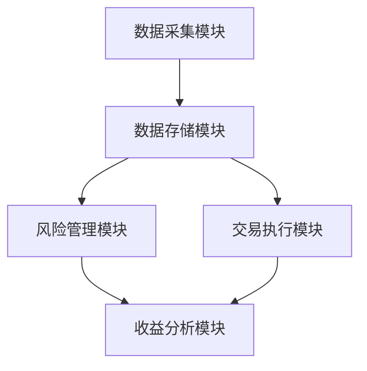
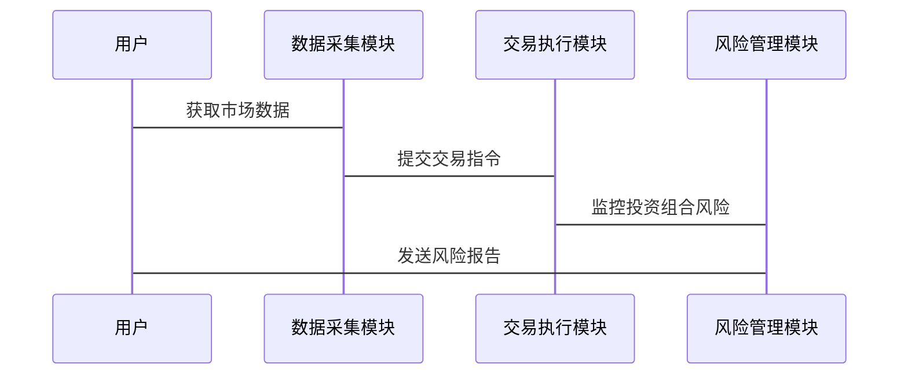

                 


# 约翰·伯格的指数基金投资理念

> 关键词：指数基金，投资理念，约翰·伯格，被动投资，风险管理，数学模型

> 摘要：本文深入探讨了约翰·伯格的指数基金投资理念，分析了指数基金的核心原理、构建方法、风险管理策略以及数学模型。通过详细的技术分析和实际案例，揭示了指数基金的长期优势和投资价值。

---

## 第一章：指数基金投资的背景与基础

### 1.1 指数基金的定义与特点

指数基金是一种跟踪特定市场指数的基金，其投资目标是复制指数的表现，而不是跑赢市场。指数基金的核心特点是：

- **分散性**：通过投资多个成分股，降低非系统性风险。
- **低成本**：指数基金的管理费用通常低于主动管理型基金。
- **被动性**：指数基金不主动选股，而是被动跟踪指数。

### 1.2 约翰·伯格的贡献与影响

约翰·伯格是指数基金的先驱，他于1975年创立了 Vanguard 集团，并推出第一只完全被动管理的指数基金——Vanguard 指数基金。伯格的贡献包括：

- **低成本策略**：通过去除不必要的中间环节，降低基金的管理费用。
- **分散化投资**：通过投资市场指数，降低个股风险。
- **长期投资理念**：强调长期持有，避免频繁交易。

### 1.3 指数基金的投资理念概述

指数基金的投资理念基于以下原则：

- **长期投资**：指数基金适合长期持有，避免短期波动的影响。
- **分散投资**：通过投资市场指数，分散个股风险。
- **低成本**：低管理费用是指数基金的核心优势。

---

## 第二章：指数基金的核心原理与数学模型

### 2.1 指数基金的构建与管理

#### 2.1.1 指数基金的成分股选择

指数基金的成分股选择基于所跟踪的指数。例如，标普500指数包含500家美国上市公司。选择成分股时，需考虑公司的市值、流动性、行业代表性等因素。

#### 2.1.2 指数基金的权重分配

指数基金的权重分配基于成分股的市值比例。例如，在标普500指数中，权重较大的成分股通常具有较高的市值和流动性。

#### 2.1.3 市场指数的选择与跟踪

指数基金需要选择合适的市场指数，并通过定期再平衡来跟踪指数表现。再平衡的频率取决于指数的变动和市场的波动性。

### 2.2 指数基金的成本控制

#### 2.2.1 管理费用的影响

管理费用是指数基金的主要成本之一。低成本是指数基金的核心优势，因为长期来看，低管理费用可以显著提高净收益。

#### 2.2.2 交易成本的优化

指数基金的交易成本包括买卖股票的佣金和滑点成本。通过批量交易和优化交易策略，可以降低交易成本。

#### 2.2.3 追踪误差的分析

追踪误差是指数基金的实际收益与指数收益之间的差异。通过优化投资组合和减少交易成本，可以降低追踪误差。

### 2.3 指数基金的风险管理

#### 2.3.1 系统性风险的控制

系统性风险是市场整体波动带来的风险。指数基金通过分散投资，无法完全规避系统性风险，但可以通过长期持有降低影响。

#### 2.3.2 非系统性风险的分散

非系统性风险是特定资产或行业带来的风险。指数基金通过投资多个成分股，分散非系统性风险。

#### 2.3.3 风险调整后的收益评估

夏普比率是衡量风险调整后收益的指标。指数基金的夏普比率可以通过以下公式计算：

$$ \text{夏普比率} = \frac{R_p - R_f}{\sigma_p} $$

其中，$R_p$ 是基金的平均收益，$R_f$ 是无风险利率，$\sigma_p$ 是基金收益的标准差。

---

## 第三章：指数基金的数学模型与分析

### 3.1 指数基金的收益模型

#### 3.1.1 指数基金的预期收益公式

指数基金的预期收益可以通过以下公式计算：

$$ E[R_p] = \sum_{i=1}^{n} w_i E[R_i] $$

其中，$w_i$ 是成分股$i$的权重，$E[R_i]$ 是成分股$i$的预期收益。

#### 3.1.2 指数基金的收益波动分析

指数基金的收益波动可以通过标准差衡量。标准差的计算公式为：

$$ \sigma_p = \sqrt{\sum_{i=1}^{n} \sum_{j=1}^{n} w_i w_j \sigma_{ij}} $$

其中，$\sigma_{ij}$ 是成分股$i$和$j$之间的协方差。

#### 3.1.3 指数基金的风险调整收益（夏普比率）

夏普比率是衡量风险调整后收益的指标，公式如下：

$$ \text{夏普比率} = \frac{R_p - R_f}{\sigma_p} $$

其中，$R_p$ 是基金的平均收益，$R_f$ 是无风险利率，$\sigma_p$ 是基金收益的标准差。

---

## 第四章：指数基金的系统架构与投资平台设计

### 4.1 问题场景介绍

指数基金的投资需要一个高效的投资平台，包括数据采集、交易执行、风险管理和收益分析等功能。

### 4.2 系统功能设计

#### 4.2.1 数据采集模块

- 采集市场指数数据，包括成分股、权重和市场数据。
- 数据来源：交易所API、数据供应商。

#### 4.2.2 交易执行模块

- 根据投资策略生成交易指令。
- 执行交易，确保最小的滑点成本。

#### 4.2.3 风险管理模块

- 实时监控投资组合的风险。
- 根据风险指标调整投资组合。

#### 4.2.4 收益分析模块

- 计算投资组合的收益和风险指标。
- 生成投资报告。

### 4.3 系统架构设计

以下是一个指数基金投资平台的系统架构图：



### 4.4 系统接口设计

#### 4.4.1 数据接口

- 数据接口：REST API。
- 接口功能：获取市场数据、提交交易指令。

#### 4.4.2 风险管理接口

- 接口功能：实时监控投资组合风险。
- 风险指标：夏普比率、VaR（在险价值）。

### 4.5 系统交互设计

以下是一个指数基金投资平台的交互流程图：



---

## 第五章：指数基金的项目实战与案例分析

### 5.1 实战环境安装

#### 5.1.1 环境配置

- 操作系统：Linux/Windows/MacOS。
- 开发工具：Python、Jupyter Notebook。
- 数据源：Yahoo Finance API。

#### 5.1.2 代码实现

以下是一个简单的指数基金投资策略的Python代码：

```python
import pandas as pd
import numpy as np
import yfinance as yf

# 下载指数数据
index_ticker = 'SPY'
data = yf.download(index_ticker, start='2010-01-01', end='2023-12-31')

# 计算指数收益
returns = data['Close'].pct_change().dropna()

# 计算夏普比率
R_f = 0.02  # 假设无风险利率为2%
mean_return = returns.mean()
std_deviation = returns.std()
sharpe_ratio = (mean_return - R_f) / std_deviation

print(f"夏普比率: {sharpe_ratio}")
```

### 5.2 案例分析

#### 5.2.1 案例背景

假设我们选择标普500指数作为跟踪指数，分析其历史表现。

#### 5.2.2 数据分析

通过历史数据分析，标普500指数的年化收益约为10%，标准差为15%。

#### 5.2.3 案例结论

长期来看，指数基金的表现优于大多数主动管理型基金。

---

## 第六章：指数基金的风险管理与优化

### 6.1 风险管理策略

#### 6.1.1 风险识别

- 系统性风险：市场波动、经济周期。
- 非系统性风险：公司特定风险。

#### 6.1.2 风险评估

- 使用VaR模型评估潜在损失。
- 通过历史模拟和蒙特卡洛模拟进行风险评估。

#### 6.1.3 风险控制

- 定期再平衡投资组合。
- 调整投资权重，降低集中风险。

### 6.2 投资组合优化

#### 6.2.1 最优化模型

通过均值-方差优化模型，优化投资组合的风险和收益。

$$ \text{目标函数：} \min \sigma_p^2 $$
$$ \text{约束条件：} \sum_{i=1}^{n} w_i = 1 $$

#### 6.2.2 优化结果

通过优化模型，找到最优投资组合，使风险最小化，收益最大化。

---

## 第七章：总结与展望

### 7.1 总结

指数基金是一种适合长期投资的工具，其低成本和分散化优势使其成为投资者的首选。约翰·伯格的指数基金理念强调长期持有和分散投资，为投资者提供了稳定的投资回报。

### 7.2 展望

随着技术的进步和市场的成熟，指数基金将继续发展，提供更多创新的投资策略和产品。未来，指数基金将在投资领域发挥更大的作用。

---

## 作者

作者：AI天才研究院/AI Genius Institute & 禅与计算机程序设计艺术 /Zen And The Art of Computer Programming

---

本文通过详细的技术分析和实际案例，深入探讨了约翰·伯格的指数基金投资理念，揭示了指数基金的核心原理、构建方法和风险管理策略。希望本文能为投资者提供有价值的参考和启发。

