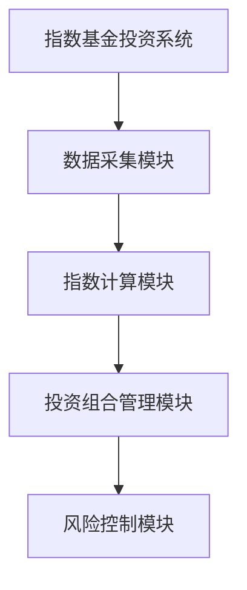
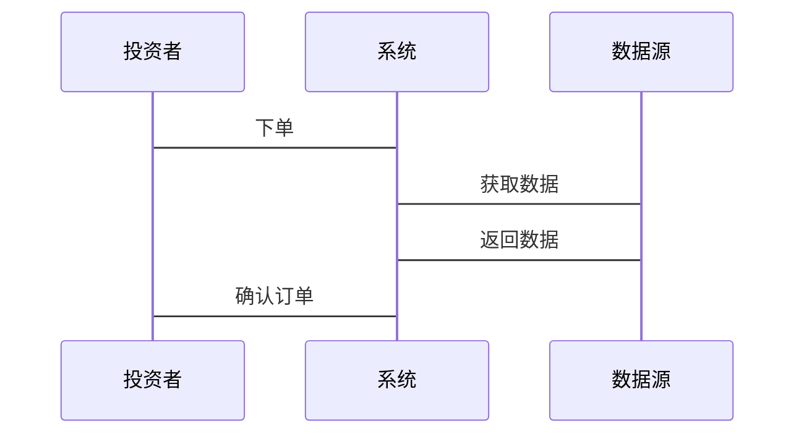

                 


# 《约翰·伯格的指数基金投资理念》

> 关键词：指数基金，投资理念，约翰·伯格，长期投资，分散投资，低成本运作

> 摘要：本文深入探讨了约翰·伯格的指数基金投资理念，从指数基金的起源与发展、核心概念、构建原理、投资策略、系统架构设计、项目实战到最佳实践，全面解析了这一投资理念的精髓。通过详细的分析和实际案例，本文帮助读者理解如何利用指数基金实现稳健投资，并提供了一系列实用的建议。

---

## 第一章: 指数基金的发展历程

### 1.1 指数基金的起源与演变

指数基金的投资理念起源于20世纪，随着金融市场的不断发展，指数基金逐渐成为一种重要的投资工具。本文将从指数基金的起源、发展以及现状三个方面展开讨论。

#### 1.1.1 从传统投资到现代投资的演变

传统的投资方式主要包括股票投资和债券投资，投资者需要依靠个人的市场分析能力和运气来获得收益。然而，这种方式的风险较高，且需要大量的时间和精力去研究市场动态。

随着金融理论的发展，现代投资组合理论（Modern Portfolio Theory，MPT）逐渐兴起，强调通过分散投资来降低风险。这种理论为指数基金的发展奠定了基础。

#### 1.1.2 约翰·伯格的贡献与影响

约翰·伯格是指数基金领域的先驱，他于1975年创立了Vanguard集团，并推出了第一只低成本指数基金——Vanguard 500 Index Fund。这一创新不仅降低了投资者的成本，还提高了投资的透明度和效率。

约翰·伯格的理念强调长期投资和分散投资，认为通过投资于整个市场指数，可以最大限度地降低风险并获得稳定的收益。他的贡献使得指数基金逐渐被广泛接受，并成为许多投资者的首选。

#### 1.1.3 指数基金的核心理念与发展

指数基金的核心理念是通过跟踪特定的市场指数来实现投资收益，避免主动管理带来的高成本和高风险。随着技术的进步和市场的成熟，指数基金的种类和规模都得到了极大的发展。

---

### 1.2 指数基金的定义与特点

#### 1.2.1 指数基金的定义

指数基金是一种以特定市场指数为标的，通过复制指数成分股的投资组合来实现收益的基金。指数基金的目标是尽可能贴近指数的收益表现，而不是通过主动管理超越市场。

#### 1.2.2 指数基金的特点

指数基金具有以下特点：
- **分散投资**：通过投资于指数中的多只股票，降低特定股票或行业风险。
- **低成本运作**：指数基金的管理费用较低，因为其运作方式简单，不需要频繁的交易和研究。
- **透明性高**：指数基金的投资组合是公开的，投资者可以随时了解其持仓情况。
- **长期稳健**：指数基金通过长期持有投资组合，避免短期波动带来的风险。

#### 1.2.3 指数基金与主动管理的区别

指数基金与主动管理型基金的主要区别在于投资策略和管理费用。指数基金追求与市场指数一致的收益，而主动管理型基金则试图通过选股和市场预测来获得超额收益。

以下是指数基金与主动管理型基金的对比表格：

| 对比项                | 指数基金                  | 主动管理型基金             |
|-----------------------|--------------------------|---------------------------|
| 投资策略              | 跟踪市场指数              | 主动选股和市场预测          |
| 管理费用              | 低                       | 高                       |
| 风险                  | 较低                     | 较高                     |
| 收益潜力              | 稳定，接近市场平均收益     | 可能更高，但不确定         |

---

### 1.3 指数基金的优势与劣势

#### 1.3.1 指数基金的优势

指数基金的主要优势包括：
- **低成本**：指数基金的管理费用较低，适合长期投资。
- **分散风险**：通过投资于多个股票或债券，降低特定资产的风险。
- **透明性高**：投资者可以随时了解基金的投资组合。

#### 1.3.2 指数基金的劣势

尽管指数基金具有许多优势，但也有一些不足之处：
- **无法超越市场**：指数基金的投资收益取决于市场的整体表现，无法超越市场。
- **流动性风险**：在某些情况下，指数基金可能面临流动性不足的问题。

#### 1.3.3 指数基金的适用场景

指数基金适合那些希望进行长期投资、追求稳定收益的投资者。特别适合那些不具备专业投资知识或没有足够时间和精力进行市场研究的投资者。

---

## 第二章: 指数基金的核心原理与数学模型

### 2.1 指数基金的构建原理

指数基金的核心原理是通过复制特定的市场指数来实现收益。以下是指数基金的构建原理：

#### 2.1.1 市值加权法

市值加权法是一种常见的指数构建方法，其基本思想是将指数成分股按照其市值加权。具体的计算公式如下：

$$ w_i = \frac{P_i}{\sum_{j=1}^{n} P_j} $$

其中，\( w_i \) 表示第 \( i \) 只股票的权重，\( P_i \) 表示第 \( i \) 只股票的市值，\( n \) 表示指数中的成分股数量。

#### 2.1.2 等权重法

等权重法是一种将每只股票赋予相同权重的方法。其计算公式如下：

$$ w_i = \frac{1}{n} $$

这种方法的优点是避免了市值加权法中可能出现的权重过于集中于少数股票的问题。

#### 2.1.3 其他构建方法

除了市值加权法和等权重法，还有一些其他方法，如因子加权法和风险加权法。这些方法可以根据不同的投资目标和风险偏好进行调整。

---

### 2.2 指数基金的跟踪误差

#### 2.2.1 跟踪误差的定义

跟踪误差是指数基金的实际收益与目标指数收益之间的差异。其计算公式为：

$$ \text{跟踪误差} = \sqrt{\sum_{i=1}^{n} (w_i - w_i^{\text{指数}})^2} $$

其中，\( w_i \) 表示基金的实际权重，\( w_i^{\text{指数}} \) 表示指数的目标权重。

#### 2.2.2 跟踪误差的影响因素

跟踪误差的主要影响因素包括：
- **成分股数量**：成分股越多，跟踪误差通常越小。
- **交易成本**：交易成本的增加会导致跟踪误差的增加。
- **流动性**：流动性不足可能导致跟踪误差增大。

#### 2.2.3 如何最小化跟踪误差

为了最小化跟踪误差，可以采取以下措施：
- **选择流动性好的成分股**：流动性好的股票通常具有较低的买卖价差。
- **减少交易频率**：频繁的交易可能导致较高的交易成本和跟踪误差。
- **优化投资组合**：通过优化算法调整投资组合，使其尽可能接近目标指数。

---

## 第三章: 指数基金的投资策略与实践

### 3.1 指数基金的投资理念

#### 3.1.1 长期投资与价值投资

指数基金强调长期投资，认为市场短期波动难以预测，而长期趋势则更加稳定。价值投资理念认为市场会在长期内回归其内在价值。

#### 3.1.2 分散投资与风险控制

通过分散投资于不同的资产类别、行业和地域，可以有效降低特定风险。指数基金通过跟踪市场指数，天然具有分散投资的特点。

#### 3.1.3 定期定额投资

定期定额投资是一种常见的投资方式，即投资者在固定的时间间隔内投入固定金额的资金。这种方式可以帮助投资者避免在市场高点一次性投入过多，降低投资风险。

---

### 3.2 指数基金的资产配置

#### 3.2.1 全市场指数基金

全市场指数基金的投资范围覆盖整个市场，如标普500指数基金。这种基金的优势是分散风险能力强，但同时也会受到市场整体表现的影响。

#### 3.2.2 行业指数基金

行业指数基金专注于特定行业，如科技行业指数基金。这种基金的优势是可以集中投资于某一行业，但风险也相对较高。

#### 3.2.3 地区指数基金

地区指数基金专注于特定地区的市场，如美国指数基金或新兴市场指数基金。这种基金的优势是可以投资于不同经济发展阶段的市场，但需要考虑地缘政治和经济政策的风险。

---

### 3.3 指数基金的绩效评估

#### 3.3.1 指数基金的长期收益

指数基金的长期收益通常接近于市场平均收益。例如，标普500指数在过去几十年的平均年化收益率约为10%。

#### 3.3.2 指数基金的费用比率

指数基金的费用比率通常较低，因为其运作方式简单。相比之下，主动管理型基金的费用比率较高。

#### 3.3.3 指数基金的流动性

指数基金的流动性通常较好，投资者可以随时赎回资金。但在某些情况下，如市场流动性不足或基金规模较小，流动性可能会受到影响。

---

## 第四章: 指数基金的系统分析与架构设计

### 4.1 指数基金投资系统的架构设计

#### 4.1.1 系统功能设计

指数基金投资系统的功能设计包括：
- **数据采集**：收集市场数据，如股票价格、指数成分等。
- **指数计算**：根据指数构建方法计算指数值。
- **投资组合管理**：根据指数成分股构建投资组合。
- **风险控制**：监控和管理投资组合的风险。

#### 4.1.2 系统架构图

以下是一个简单的系统架构图：



#### 4.1.3 系统接口设计

系统接口设计包括：
- **数据接口**：与数据源（如股票交易所）对接，获取实时数据。
- **用户接口**：供投资者查询和管理投资组合。

#### 4.1.4 系统交互流程

以下是一个系统的交互流程图：



---

## 第五章: 指数基金的项目实战

### 5.1 构建指数基金投资组合

#### 5.1.1 环境安装

在开始构建指数基金投资组合之前，需要安装必要的工具和环境。以下是常用的工具：
- **Python**：用于数据分析和编程。
- **Pandas**：用于数据处理和分析。
- **Matplotlib**：用于数据可视化。

安装命令如下：
```bash
pip install pandas matplotlib
```

#### 5.1.2 代码实现

以下是构建指数基金投资组合的Python代码示例：

```python
import pandas as pd
import matplotlib.pyplot as plt

# 数据加载
data = pd.read_csv('stock_data.csv')

# 计算指数
index = data['Close'].mean()

# 可视化
plt.plot(data['Date'], data['Close'], label='Index Value')
plt.xlabel('Date')
plt.ylabel('Value')
plt.legend()
plt.show()
```

#### 5.1.3 案例分析

假设我们有一个包含10只股票的数据集，我们可以计算其指数值并进行投资组合优化。通过分析指数基金的投资收益和风险，我们可以得出最优的投资组合。

---

## 第六章: 最佳实践与总结

### 6.1 小结

指数基金的投资理念强调长期投资、分散投资和低成本运作。通过跟踪市场指数，投资者可以实现稳健的收益。

### 6.2 注意事项

在实际投资过程中，投资者需要注意以下几点：
- **市场风险**：指数基金的收益取决于市场整体表现，市场下跌时也会受到影响。
- **流动性风险**：在某些情况下，投资者可能难以迅速变现。
- **费用控制**：选择低成本的指数基金可以提高长期收益。

### 6.3 扩展阅读

对于有兴趣进一步学习的读者，可以参考以下书籍和资源：
- 《The Intelligent Investor》 by Benjamin Graham
- 《The Global Financial Crisis and Its Aftermath》 by Nouriel Roubini

---

## 作者信息

作者：AI天才研究院/AI Genius Institute & 禅与计算机程序设计艺术/Zen And The Art of Computer Programming

