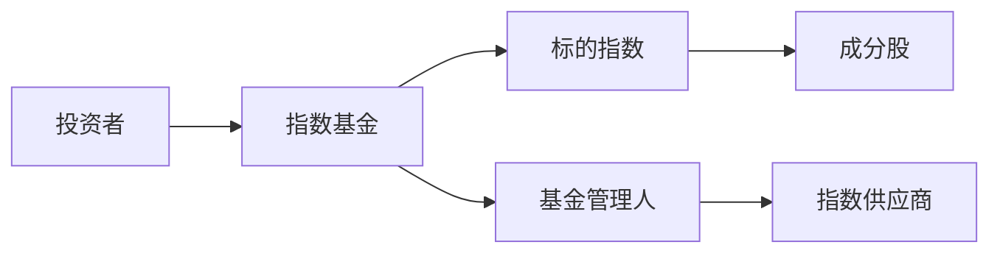
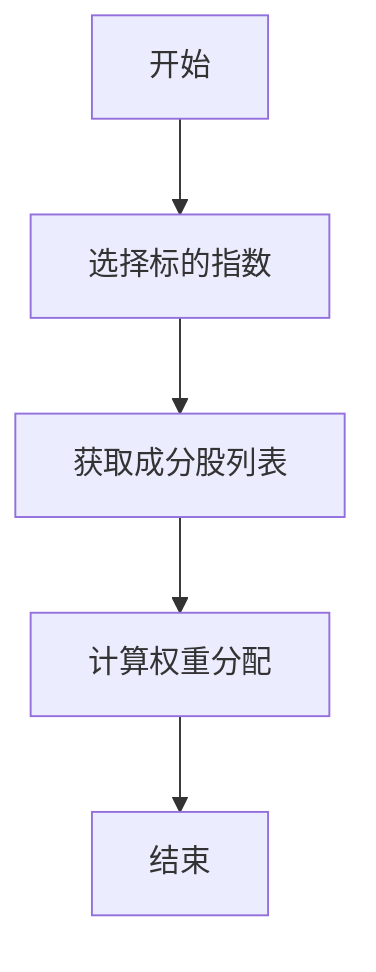
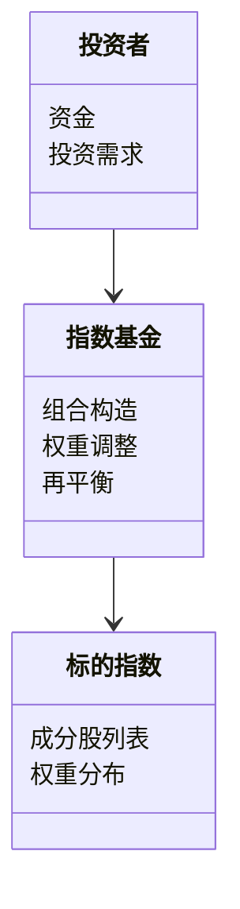
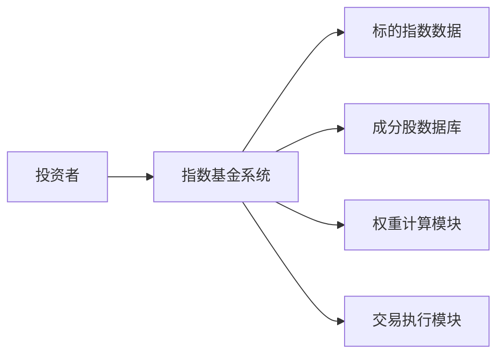

                 


# 约翰·伯格的指数基金构建原则

**关键词：指数基金、被动投资、指数构建、风险管理、投资策略**

**摘要：**  
指数基金作为一种被动投资工具，近年来在全球范围内得到了广泛应用。本文深入探讨了约翰·伯格在指数基金构建领域的核心原则，从指数基金的基本概念到其构建算法、数学模型，再到系统架构，逐步分析了其构建过程和实际应用。本文旨在帮助读者理解指数基金的内在逻辑，掌握其构建方法，并为实际投资提供参考。

---

## 第1章: 指数基金的背景与核心概念

### 1.1 指数基金的基本概念

#### 1.1.1 什么是指数基金？
指数基金是一种跟踪特定市场指数的基金，其投资组合由该指数的成分股构成，权重根据指数的成分股权重分配。例如，标普500指数基金包含500家在美国上市的公司，权重基于市值。

#### 1.1.2 指数基金的特点与优势
- **被动管理：** 指数基金通过跟踪指数，避免了主动管理的高成本和高风险。
- **分散风险：** 持有多个成分股，降低个股波动带来的风险。
- **低交易成本：** 由于跟踪指数，交易频率较低，降低了交易费用和税务负担。
- **长期收益稳定：** 通过分散投资，指数基金通常能够获得市场的平均收益。

#### 1.1.3 指数基金与主动管理型基金的区别
| 项目                | 指数基金                          | 主动管理型基金                  |
|---------------------|-----------------------------------|--------------------------------|
| 投资策略            | 跟踪指数，被动投资                | 独立选股，主动调整              |
| 管理费用            | 通常较低                         | 通常较高                       |
| 风险                | 风险较低，与市场同步波动           | 风险较高，可能大幅偏离市场      |
| 收益                | 追求市场平均收益                  | 追求超额收益（Alpha）          |

### 1.2 指数基金的起源与发展

#### 1.2.1 指数基金的历史背景
指数基金的概念可以追溯到20世纪30年代，但真正的发展始于20世纪70年代。1975年， Vanguard集团推出了第一只指数基金——Vanguard 500指数基金，标志着指数基金时代的开始。

#### 1.2.2 约翰·伯格的贡献与指数基金的崛起
约翰·伯格是指数基金的倡导者，他在1973年提出了指数基金的概念，并在Vanguard集团实现了这一理念。伯格认为，大多数主动管理型基金难以长期跑赢市场，而指数基金则能够以更低的成本提供市场平均收益。

#### 1.2.3 当前指数基金的全球发展趋势
随着技术的进步和投资者对低成本投资工具的需求增加，指数基金在全球范围内迅速发展。特别是在近年来，ETF（交易所交易基金）的兴起进一步推动了指数基金的增长。

### 1.3 指数基金的核心原理

#### 1.3.1 指数基金的构建逻辑
指数基金的构建基于以下步骤：
1. **选择指数：** 根据投资目标选择合适的指数，如标普500、沪深300等。
2. **获取成分股：** 获取选定指数的成分股列表。
3. **计算权重：** 根据指数的权重分配，确定每只股票的投资比例。
4. **构建组合：** 按照权重购买相应的股票，组成投资组合。

#### 1.3.2 指数基金的风险与收益平衡
指数基金通过分散投资降低了非系统性风险，但仍然面临系统性风险（如市场整体下跌）。其收益主要来自于市场的整体表现，通常与市场指数挂钩。

#### 1.3.3 指数基金的长期投资价值
研究表明，长期来看，指数基金的平均年化收益通常接近或超过主动管理型基金的收益，同时费用更低。

### 1.4 指数基金的分类与应用场景

#### 1.4.1 按指数类型分类
- **股票指数基金：** 跟踪股票指数，如标普500。
- **债券指数基金：** 跟踪债券指数，如巴克莱债券指数。
- **混合指数基金：** 同时包含股票和债券的指数基金。

#### 1.4.2 按投资区域分类
- **国内指数基金：** 投资于本国市场。
- **国际指数基金：** 投资于国际市场，如富时全球指数。

#### 1.4.3 指数基金在个人与机构投资中的应用
- **个人投资者：** 适合风险承受能力较低的投资者，提供稳定收益。
- **机构投资者：** 用于资产配置，降低组合风险。

---

## 第2章: 指数基金的核心概念与联系

### 2.1 指数基金的核心概念

#### 2.1.1 指数基金的组成部分
- **标的指数：** 选定的市场指数，如标普500。
- **成分股：** 指数中的各个股票。
- **权重分配：** 各成分股在基金中的比例。
- **基金管理人：** 负责管理指数基金的机构，如Vanguard。

#### 2.1.2 指数基金的跟踪误差
跟踪误差是指指数基金的实际收益与标的指数收益之间的差异。跟踪误差越小，基金的表现越接近指数。

#### 2.1.3 指数基金的流动性与交易成本
指数基金的流动性较高，但由于成分股分散，交易成本相对较低。

### 2.2 指数基金与相关概念的对比

#### 2.2.1 指数基金与ETF的区别
- **指数基金：** 通常为开放式基金，按日复核净值。
- **ETF：** 交易所交易基金，按市价交易，有买卖价差。

#### 2.2.2 指数基金与被动投资策略的关系
被动投资策略的核心是模仿指数的表现，而指数基金是实现这一策略的主要工具。

#### 2.2.3 指数基金与市场中性策略的联系
市场中性策略通过做多和做空来降低市场风险，而指数基金则通过分散投资来降低风险。

### 2.3 指数基金的ER实体关系图



---

## 第3章: 指数基金的算法原理与数学模型

### 3.1 指数基金的构建算法

#### 3.1.1 指数基金的成分股选择算法



#### 3.1.2 指数基金的权重分配算法
权重分配通常基于成分股的市值比例。例如，对于标普500指数，每只股票的权重等于其市值占指数总市值的比例。

#### 3.1.3 指数基金的再平衡算法
为了保持与指数一致，指数基金需要定期进行再平衡，调整成分股的权重，以应对市场变化。

### 3.2 指数基金的数学模型

#### 3.2.1 夏普比率
夏普比率衡量的是投资组合的风险调整后收益。公式为：
$$ \text{夏普比率} = \frac{E[r_p] - r_f}{\sigma_p} $$
其中，$E[r_p]$是组合的期望收益，$r_f$是无风险利率，$\sigma_p$是组合的风险（标准差）。

#### 3.2.2 � 凸优化模型
指数基金的构建可以通过凸优化模型来实现，目标是最小化跟踪误差，同时满足成分股的权重约束。

---

## 第4章: 指数基金的系统分析与架构设计

### 4.1 系统功能设计

#### 4.1.1 领域模型


#### 4.1.2 系统架构


---

## 第5章: 项目实战

### 5.1 环境安装
需要安装Python和相关库，如pandas、numpy。

### 5.2 核心实现代码

```python
import pandas as pd

# 获取成分股列表
index_components = pd.read_csv('index_components.csv')

# 计算权重
weights = index_components['Market Cap'] / index_components['Market Cap'].sum()

# 构建投资组合
portfolio = pd.DataFrame({
    'Ticker': index_components['Ticker'],
    'Weight': weights
})
```

### 5.3 案例分析
以标普500指数为例，计算其成分股的权重分布，并构建一个简单的指数基金组合。

---

## 第6章: 最佳实践与总结

### 6.1 最佳实践
- 定期再平衡，保持与指数一致。
- 选择费用低的指数基金。
- 结合定投策略，分散投资风险。

### 6.2 小结
指数基金通过被动投资，为投资者提供了低成本、低风险的投资工具。约翰·伯格的构建原则为指数基金的发展奠定了基础，未来随着技术进步，指数基金将更加多样化和智能化。

### 6.3 注意事项
- 注意市场风险，避免过度依赖单一指数。
- 定期评估投资组合，确保符合投资目标。

### 6.4 拓展阅读
- 《The Intelligent Investor》
- 学习量化投资策略，提升指数基金的构建能力。

---

**作者：AI天才研究院/AI Genius Institute & 禅与计算机程序设计艺术/Zen And The Art of Computer Programming**

