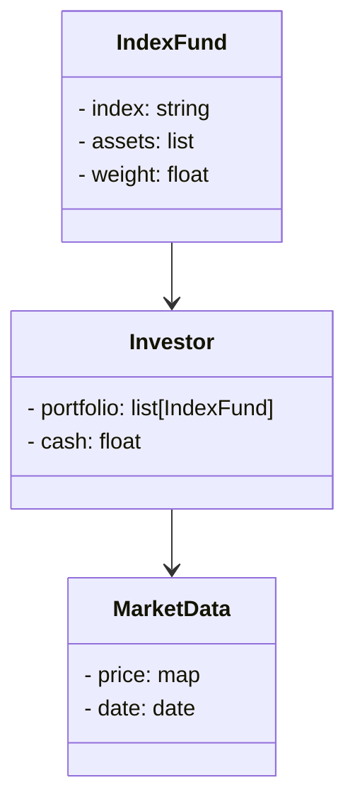
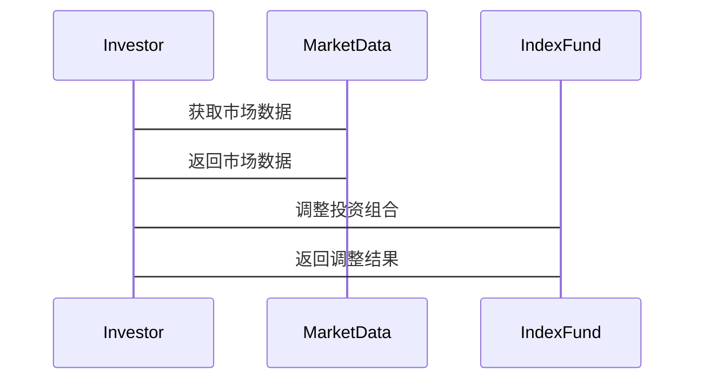

                 


# 约翰·伯格的指数投资哲学：为什么市场难以战胜

> 关键词：指数投资，市场效率，长期投资，风险管理，投资策略

> 摘要：本文深入探讨约翰·伯格的指数投资哲学，分析市场难以战胜的原因，介绍指数投资的优势与劣势，策略与实践，系统架构设计，并通过实际案例展示指数投资的实现过程。文章结合理论与实践，帮助读者全面理解指数投资的哲学和应用。

---

## 第一部分: 约翰·伯格的指数投资哲学基础

### 第1章: 指数投资的哲学基础

#### 1.1 约翰·伯格的投资理念

**1.1.1 约翰·伯格的生平简介**

约翰·伯格（John C. Bogle）是指数投资的倡导者，被誉为“指数基金之父”。他创立了 Vanguard 集团，是全球最大的指数基金提供商之一。伯格在投资领域有着深厚的理论基础和实践经验，他的投资理念影响了全球数百万投资者。

**1.1.2 指数投资的核心理念**

伯格提出，指数投资的核心理念是通过投资市场指数（如股票指数或债券指数）来实现长期稳定的收益。他强调，市场是无法被战胜的，尤其是通过主动管理的方式。

**1.1.3 长期投资的重要性**

伯格认为，长期投资是实现财富增长的关键。市场波动是不可避免的，但长期来看，市场趋势是向上的，指数投资能够捕捉这种长期趋势。

#### 1.2 指数基金的定义与特点

**1.2.1 指数基金的定义**

指数基金是一种跟踪特定市场指数的基金，其投资组合按照指数的构成比例进行配置，旨在复制指数的收益。

**1.2.2 指数基金的核心特点**

- **分散风险**：通过投资多个资产来降低风险。
- **低交易成本**：指数基金通常费用较低，交易成本较少。
- **简单易懂**：投资者无需复杂的分析，只需选择合适的指数基金即可。

**1.2.3 指数基金与主动管理基金的区别**

指数基金追求与市场同步增长，而主动管理基金则试图通过精选个股或择时来获得超额收益。

---

### 第2章: 有效市场假说与指数投资

#### 2.1 有效市场假说的背景与理论基础

**2.1.1 有效市场假说的定义**

有效市场假说（EMH）认为，在一个有效的市场中，所有信息都已反映在资产价格中，因此无法通过分析来预测价格走势。

**2.1.2 有效市场假说的分类**

- **强有效市场**：所有信息，包括未公开的内部信息，都反映在价格中。
- **半强有效市场**：所有公开信息反映在价格中。
- **弱有效市场**：价格只反映了历史信息。

**2.1.3 有效市场假说与指数投资的关系**

指数投资与有效市场假说密切相关，特别是在半强有效市场中，指数投资被认为是最佳选择。

#### 2.2 为什么市场难以战胜

**2.2.1 市场的有效性与可预测性**

在有效市场中，信息已被充分反映，预测价格走势变得极为困难。

**2.2.2 交易成本与信息不对称**

主动管理基金需要支付高昂的交易成本和管理费用，而指数基金的费用较低。

**2.2.3 投资者心理与行为偏差**

投资者的心理偏差（如恐惧和贪婪）导致市场波动，但这些波动无法被长期预测。

---

### 第3章: 指数投资的优势与劣势

#### 3.1 指数投资的优势

**3.1.1 分散风险**

通过投资多个资产，降低特定资产的风险。

**3.1.2 低交易成本**

指数基金的费用较低，适合长期投资。

**3.1.3 简单易懂**

投资者无需复杂的分析，易于理解和操作。

#### 3.2 指数投资的劣势

**3.2.1 无法捕捉市场上涨机会**

指数投资无法超越市场，仅能跟随市场走势。

**3.2.2 缺乏灵活性**

指数基金的投资组合固定，无法根据市场变化进行调整。

**3.2.3 市场波动的影响**

市场波动可能会影响短期收益，但长期来看，波动会被平滑。

---

## 第二部分: 指数投资的策略与实践

### 第4章: 指数投资的策略分析

#### 4.1 指数基金的构建策略

**4.1.1 股票指数的选择**

选择广泛代表市场的指数，如标普500指数。

**4.1.2 债券指数的选择**

选择债券指数，如巴克莱债券指数。

**4.1.3 全球指数的投资策略**

通过全球指数分散风险，降低区域波动的影响。

#### 4.2 定期定额投资策略

**4.2.1 定期定额投资的定义**

定期投入固定金额，分散投资成本，降低波动影响。

**4.2.2 定期定额投资的优势**

- 平均成本，降低波动风险。
- 利用市场波动，低位买入，高位卖出。

**4.2.3 定期定额投资的实现方法**

通过设定投资计划，定期投入固定金额到指数基金中。

---

### 第5章: 指数投资的风险管理

#### 5.1 风险管理的重要性

**5.1.1 风险的定义与分类**

风险是指未来收益的不确定性，分为市场风险、流动性风险等。

**5.1.2 风险管理的目标**

通过策略和工具降低风险，确保投资目标的实现。

**5.1.3 风险管理的工具与方法**

- 分散投资：降低特定资产的风险。
- 定期再平衡：定期调整投资组合，保持目标比例。

#### 5.2 指数投资中的风险管理

**5.2.1 市场波动的风险**

通过长期投资和分散投资降低波动影响。

**5.2.2 利率风险**

长期债券价格波动较大，需谨慎选择债券指数。

**5.2.3 汇率风险**

通过投资全球指数分散汇率风险。

---

## 第三部分: 系统分析与架构设计方案

### 第6章: 系统分析与架构设计

#### 6.1 问题场景介绍

指数投资系统需要实现投资组合管理、风险评估和收益分析等功能。

#### 6.2 系统功能设计

**领域模型类图**



**系统架构设计**

```mermaid
container 投资者交互层 {
    Investor
}
container 投资组合管理 {
    IndexFund
}
container 市场数据层 {
    MarketData
}
```

#### 6.3 系统接口设计

- 获取指数基金价格接口。
- 计算投资组合收益接口。

#### 6.4 系统交互序列图



---

## 第四部分: 项目实战

### 第7章: 项目实战

#### 7.1 环境安装

安装Python和相关库（如pandas、numpy）。

#### 7.2 系统核心实现源代码

```python
import pandas as pd
import numpy as np

def create_index_fund(weights):
    return pd.Series(weights)

def calculate_return(portfolio):
    return portfolio.mean()

# 示例
weights = {'股票': 0.6, '债券': 0.4}
index_fund = create_index_fund(weights)
print("指数基金收益:", calculate_return(index_fund))
```

#### 7.3 代码应用解读与分析

通过代码实现指数基金的构建和收益计算，展示指数投资的实际操作。

---

## 第五部分: 最佳实践与总结

### 第8章: 最佳实践

#### 8.1 投资建议

根据市场情况调整投资组合，定期再平衡。

#### 8.2 未来展望

随着市场的发展，指数投资将更加多样化和智能化。

---

## 作者信息

作者：AI天才研究院/AI Genius Institute & 禅与计算机程序设计艺术 /Zen And The Art of Computer Programming

---

这篇文章系统地介绍了约翰·伯格的指数投资哲学，分析了市场难以战胜的原因，并通过理论与实践相结合的方式，帮助读者全面理解指数投资。

