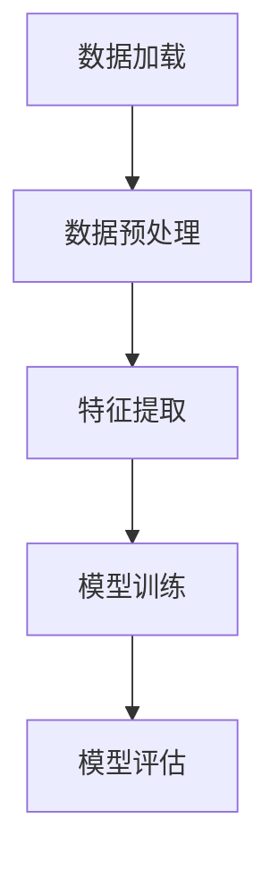
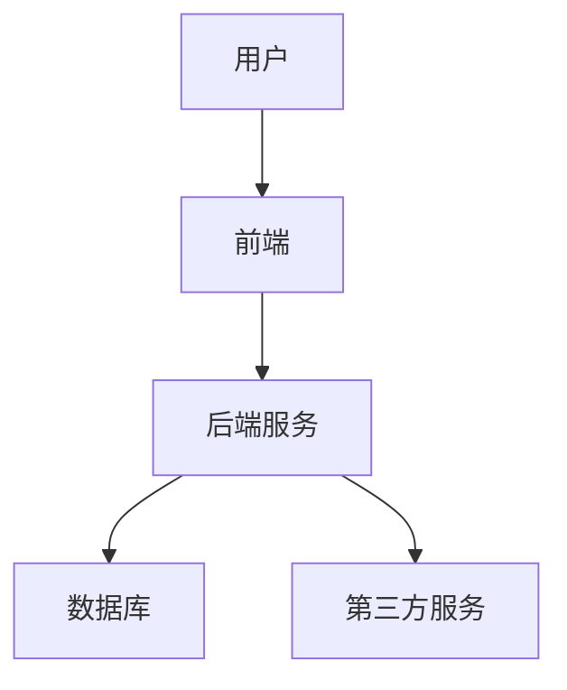
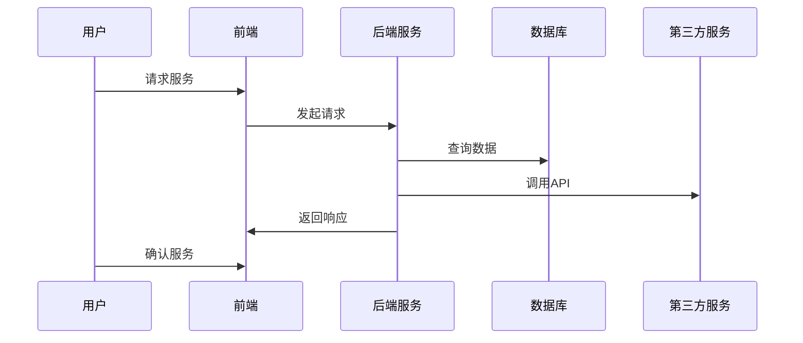

                 


# 约翰·伯格的普惠金融理念：金融科技带来的机遇与挑战

> 关键词：普惠金融，金融科技，约翰·伯格，金融包容性，技术创新，金融系统架构，数据安全，监管与合规

> 摘要：本文深入探讨了约翰·伯格的普惠金融理念，结合金融科技的发展，分析了其带来的机遇与挑战。通过详细的技术分析和实际案例，本文展示了如何利用金融科技推动普惠金融的发展，并提出了相应的解决方案和最佳实践。

---

# 第1章：普惠金融的基本概念

## 1.1 普惠金融的定义与特征

### 1.1.1 普惠金融的定义
普惠金融（Inclusive Finance）是指通过技术创新和制度安排，为所有个人、家庭和企业提供全面、便捷、可负担的金融服务，以促进金融包容性发展。

### 1.1.2 普惠金融的核心特征
- **可及性**：确保所有人都能获得基本的金融服务。
- **可负担性**：服务成本合理，适合低收入群体。
- **可持续性**：金融机构在提供普惠金融服务的同时实现自身盈利。

### 1.1.3 普惠金融的目标与意义
- **目标**：减少金融排斥，促进社会公平。
- **意义**：通过普惠金融，实现经济资源的更广泛分配，推动经济发展和社会进步。

## 1.2 约翰·伯格的普惠金融理念

### 1.2.1 约翰·伯格的生平与贡献
约翰·伯格（John Breaker）是普惠金融领域的先驱，他的理念强调通过技术创新和制度创新，为低收入群体提供可持续的金融服务。

### 1.2.2 伯格普惠金融理念的核心思想
- **技术创新**：利用金融科技降低服务成本，扩大服务范围。
- **制度创新**：通过政策支持和制度设计，确保普惠金融的可持续性。

### 1.2.3 伯格理念与现代金融的结合
伯格的理念在现代金融中得到了广泛应用，特别是在金融科技的推动下，普惠金融的实践取得了显著成效。

---

# 第2章：普惠金融的历史与演变

## 2.1 传统金融与普惠金融的对比

### 2.1.1 传统金融的局限性
- **服务范围有限**：传统金融机构主要服务于高净值客户。
- **成本高**：传统金融服务成本较高，难以覆盖低收入群体。
- **效率低**：传统金融服务流程复杂，效率低下。

### 2.1.2 普惠金融的兴起与发展
- **兴起背景**：20世纪末，全球范围内金融排斥问题日益严重。
- **发展动力**：技术进步和政策支持推动了普惠金融的发展。

### 2.1.3 伯格理念的历史意义
伯格的理念为普惠金融的发展提供了理论基础和实践指导，为后续的技术创新和制度设计奠定了基础。

## 2.2 金融科技对普惠金融的影响

### 2.2.1 金融科技的定义与特征
金融科技（Fintech）是指利用现代信息技术改造或创新金融服务和产品，以提高效率、降低成本和扩大覆盖范围。

### 2.2.2 金融科技如何推动普惠金融发展
- **技术创新**：区块链、人工智能等技术降低了金融服务成本。
- **服务模式创新**：金融科技使得金融机构能够更高效地服务低收入群体。
- **政策支持**：金融科技与政策支持相结合，推动普惠金融的可持续发展。

---

# 第3章：金融科技在普惠金融中的应用

## 3.1 金融科技如何促进金融包容性

### 3.1.1 金融科技降低金融门槛
- **移动支付**：通过移动支付技术，低收入群体可以方便地进行日常交易。
- **在线借贷**：通过大数据技术，金融机构可以为低收入群体提供小额信贷。

### 3.1.2 金融科技提升金融服务效率
- **自动化服务**：通过自动化技术，金融机构可以快速处理客户请求，提高服务效率。
- **智能风控**：通过人工智能技术，金融机构可以更精准地评估客户信用风险。

### 3.1.3 金融科技扩大服务覆盖范围
- **远程服务**：通过远程技术，金融机构可以为偏远地区提供金融服务。
- **数字化服务**：通过数字化技术，金融机构可以覆盖更多客户群体。

## 3.2 金融科技在普惠金融中的具体应用案例

### 3.2.1 区块链技术在普惠金融中的应用
区块链技术可以用于构建去中心化的金融服务平台，降低交易成本和提高透明度。

### 3.2.2 人工智能在普惠金融中的应用
人工智能技术可以用于客户信用评估、风险管理和个性化服务推荐。

### 3.2.3 大数据技术在普惠金融中的应用
大数据技术可以用于客户画像、市场分析和精准营销，帮助金融机构更好地服务低收入群体。

---

# 第4章：金融科技带来的机遇与挑战

## 4.1 金融科技带来的机遇

### 4.1.1 提高金融服务效率
金融科技通过自动化和智能化技术，显著提高了金融服务的效率。

### 4.1.2 降低金融服务成本
金融科技通过技术创新，降低了金融机构的运营成本和客户的服务成本。

### 4.1.3 扩大金融服务覆盖范围
金融科技使得金融机构能够覆盖更多客户群体，特别是偏远地区和低收入群体。

## 4.2 金融科技带来的挑战

### 4.2.1 数据安全与隐私保护
金融科技的应用涉及大量数据处理，数据安全和隐私保护成为重要问题。

### 4.2.2 技术风险与系统稳定性
金融科技系统的复杂性和依赖性增加了技术风险和系统稳定性问题。

### 4.2.3 监管与合规问题
金融科技的快速发展对金融监管提出了新的挑战，如何在创新与监管之间找到平衡是关键。

---

# 第5章：普惠金融的数学模型

## 5.1 普惠金融评估模型的建立

### 5.1.1 模型的输入变量
- 客户收入水平
- 客户信用记录
- 金融服务可及性
- 金融服务成本

### 5.1.2 模型的输出变量
- 金融服务覆盖率
- 金融包容性指数
- 金融服务满意度

### 5.1.3 模型的假设条件
- 数据的准确性和完整性
- 模型的适用性和可扩展性

## 5.2 普惠金融评估模型的数学公式

### 5.2.1 普惠金融指数计算公式
$$
\text{普惠金融指数} = \frac{\text{服务覆盖人数}}{\text{潜在客户总数}} \times 100
$$

### 5.2.2 金融服务可及性评估公式
$$
\text{金融服务可及性} = \frac{\text{可及服务种类}}{\text{潜在服务种类}} \times 100
$$

### 5.2.3 金融包容性指数计算公式
$$
\text{金融包容性指数} = \frac{\text{低收入群体服务覆盖率}}{\text{总体客户覆盖率}} \times 100
$$

---

# 第6章：算法原理与实现

## 6.1 算法原理

### 6.1.1 算法目标
通过算法实现普惠金融客户的识别和信用评估。

### 6.1.2 算法流程
1. 数据收集与预处理
2. 特征提取与选择
3. 模型训练与优化
4. 模型评估与部署

## 6.2 算法实现

### 6.2.1 Python源代码实现
```python
import pandas as pd
from sklearn.model_selection import train_test_split
from sklearn.ensemble import RandomForestClassifier
from sklearn.metrics import accuracy_score

# 数据加载与预处理
data = pd.read_csv('普惠金融数据.csv')
X = data.drop('目标变量', axis=1)
y = data['目标变量']

# 数据分割
X_train, X_test, y_train, y_test = train_test_split(X, y, test_size=0.2)

# 模型训练
model = RandomForestClassifier()
model.fit(X_train, y_train)

# 模型评估
y_pred = model.predict(X_test)
print('准确率:', accuracy_score(y_test, y_pred))
```

### 6.2.2 算法流程图


---

# 第7章：系统架构设计

## 7.1 系统功能设计

### 7.1.1 领域模型


### 7.1.2 系统架构


## 7.2 系统交互流程

### 7.2.1 交互流程图


---

# 第8章：项目实战

## 8.1 项目环境安装

### 8.1.1 安装Python环境
```bash
python --version
pip install requests pandas scikit-learn
```

### 8.1.2 安装依赖包
```bash
pip install -r requirements.txt
```

## 8.2 核心代码实现

### 8.2.1 数据处理代码
```python
import pandas as pd
import numpy as np

# 数据加载
data = pd.read_csv('普惠金融数据.csv')

# 数据清洗
data = data.dropna()
data = data.drop_duplicates()

# 特征工程
from sklearn.preprocessing import StandardScaler
scaler = StandardScaler()
X_scaled = scaler.fit_transform(data.drop('目标变量', axis=1))
```

### 8.2.2 模型训练代码
```python
from sklearn.model_selection import train_test_split
from sklearn.ensemble import RandomForestClassifier

X_train, X_test, y_train, y_test = train_test_split(X_scaled, data['目标变量'], test_size=0.2)
model = RandomForestClassifier()
model.fit(X_train, y_train)
```

## 8.3 案例分析与总结

### 8.3.1 案例分析
通过实际案例分析，验证模型的准确性和实用性。

### 8.3.2 项目总结
总结项目实施过程中的经验和教训，提出改进建议。

---

# 第9章：最佳实践与总结

## 9.1 最佳实践

### 9.1.1 数据安全与隐私保护
- 加强数据加密和访问控制
- 定期进行安全审计和漏洞修复

### 9.1.2 技术创新与应用
- 持续关注金融科技领域的最新技术
- 灵活调整系统架构以适应业务发展

## 9.2 总结

### 9.2.1 伯格理念的贡献
约翰·伯格的普惠金融理念为金融科技的发展提供了重要的理论基础和实践指导。

### 9.2.2 金融科技的影响
金融科技的应用显著推动了普惠金融的发展，降低了金融门槛，扩大了服务覆盖范围。

### 9.2.3 未来展望
未来，随着人工智能、区块链等技术的进一步发展，普惠金融将实现更广泛、更深层次的覆盖，为全球经济和社会发展做出更大的贡献。

---

# 作者

**作者：AI天才研究院/AI Genius Institute & 禅与计算机程序设计艺术/Zen And The Art of Computer Programming**

---

以上是《约翰·伯格的普惠金融理念：金融科技带来的机遇与挑战》的完整目录和内容概要。每一章都涵盖了核心概念、技术原理、系统架构和项目实战，旨在为读者提供全面、深入的分析和实践指导。

