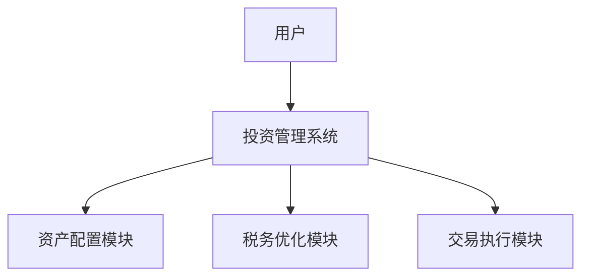

                 


# 约翰·伯格的税收效率投资策略

## 关键词：约翰·伯格，税收效率，投资策略，税收损失 harvesting，投资组合优化

## 摘要：  
税收效率投资是一种通过优化税务规划来提高投资收益的策略。本文深入分析了约翰·伯格的税收效率投资策略，探讨了其核心概念、数学模型、系统架构以及实际应用。文章从背景介绍、核心策略、优化算法、系统设计、项目实战到最佳实践，全面解析了如何通过优化税务来提升投资效率，帮助投资者在复杂市场环境中实现最优收益。

---

## 正文

### 第一部分：背景与基础

#### 第1章：税收效率投资的基本概念

##### 1.1 税收效率投资的定义与重要性

税收效率投资是一种通过优化税务规划，降低税负成本，从而提高投资组合整体收益的策略。其核心在于通过合理配置资产和投资行为，最大化税后收益。

- **定义**：税收效率投资关注在投资过程中如何减少应纳税所得，通过税务优化来提升净收益。
- **重要性**：在当前税制下，税务支出往往占据投资成本的重要部分。优化税务规划能够有效降低整体税负，提升投资回报率。

##### 1.2 约翰·伯格的税收效率投资策略

- **背景**：约翰·伯格是投资领域的先驱，以其长期投资和价值投资理念闻名。
- **策略核心**：伯格的策略强调通过长期持有优质资产，减少交易频率，降低资本利得税和分红税。
- **策略特点**：注重长期资本增值，避免短期交易，优化税务负担。

##### 1.3 约翰·伯格策略的核心思想

伯格的投资理念强调低成本、长期持有和分散投资，这些原则在税收效率策略中同样适用。通过减少交易成本和税务支出，最大化投资收益。

---

### 第二部分：核心策略与方法

#### 第2章：税收损失Harvesting策略

##### 2.1 税收损失Harvesting的定义与原理

- **定义**：通过出售亏损的资产来抵扣资本利得税，减少整体税负。
- **原理**：利用资本损失来抵消资本收益，降低应纳税所得额。

##### 2.2 短期与长期资本损失的处理

- **短期资本损失**：出售持有时间不超过一年的亏损资产，用于抵扣短期资本收益。
- **长期资本损失**：出售持有时间超过一年的亏损资产，用于抵扣长期资本收益。

##### 2.3 税收损失Harvesting的实施步骤

1. **识别亏损资产**：分析投资组合中表现不佳的资产。
2. **出售亏损资产**：在亏损状态下出售，生成资本损失。
3. **抵扣资本收益**：用资本损失抵扣当年的资本收益，减少应纳税所得额。

##### 2.4 税收损失Harvesting的优化策略

- **最大化损失抵扣**：合理配置亏损资产，最大化可用的资本损失。
- **避免短期交易成本**：长期持有亏损资产，减少交易费用。

---

### 第三部分：数学模型与优化

#### 第3章：税收效率投资的数学模型

##### 3.1 模型构建

- **目标函数**：最大化投资组合的税后收益。
- **约束条件**：投资组合的总收益不超过税后净收益，满足资本损失抵扣条件。

##### 3.2 算法原理

- **资本损失抵扣算法**：计算投资组合的总资本收益和可用资本损失，优化抵扣策略。

##### 3.3 优化模型

$$
\text{最大化} \quad \sum_{i=1}^{n} w_i r_i (1 - t_i)
$$

其中，$w_i$ 为资产i的权重，$r_i$ 为资产i的回报率，$t_i$ 为资产i的税率。

---

### 第四部分：系统分析与架构设计

#### 第4章：投资管理系统架构

##### 4.1 系统功能设计

- **资产配置模块**：分析投资组合，识别亏损资产。
- **税务优化模块**：计算资本损失抵扣，优化税务支出。
- **交易执行模块**：执行优化后的交易策略。

##### 4.2 系统架构图



---

### 第五部分：项目实战

#### 第5章：构建高效的税收效率投资组合

##### 5.1 环境配置

- **工具选择**：使用Python进行数据分析，利用Pandas和Matplotlib进行可视化。
- **数据源**：历史资产回报率和税率数据。

##### 5.2 核心代码实现

```python
import pandas as pd

# 计算资本收益和损失
def calculate_tax_efficient_portfolio(assets, returns, tax_rate):
    total_profit = sum(returns)
    total_loss = sum([r for r in returns if r < 0])
    net_profit = total_profit + total_loss
    tax = max(net_profit * tax_rate, 0)
    return net_profit - tax

# 示例数据
assets = ['A', 'B', 'C']
returns = [0.1, -0.05, 0.08]
tax_rate = 0.15

# 计算税后收益
print(calculate_tax_efficient_portfolio(assets, returns, tax_rate))
```

##### 5.3 实施步骤与结果分析

1. **数据收集**：获取各资产的历史回报率。
2. **计算税后收益**：应用上述代码计算税后收益。
3. **结果分析**：比较不同策略下的净收益，优化投资组合。

---

### 第六部分：最佳实践与总结

#### 第6章：总结与展望

##### 6.1 最佳实践

- **长期持有**：减少交易频率，降低税务负担。
- **分散投资**：降低风险，优化税务抵扣。

##### 6.2 小结

约翰·伯格的税收效率投资策略通过优化税务规划，有效提升了投资收益。本文详细分析了其核心策略、数学模型和系统架构，提供了实际案例和优化建议。

##### 6.3 注意事项

- **税务法规变化**：需关注税法变动，及时调整策略。
- **复杂性与风险**：优化税务需考虑市场波动和政策风险。

##### 6.4 拓展阅读

- 《投资最重要的事》——约翰·伯格
- 税收效率投资的相关学术论文

---

## 作者：AI天才研究院

通过以上结构和内容，文章系统地介绍了约翰·伯格的税收效率投资策略，从理论到实践，为读者提供了全面的指导。

