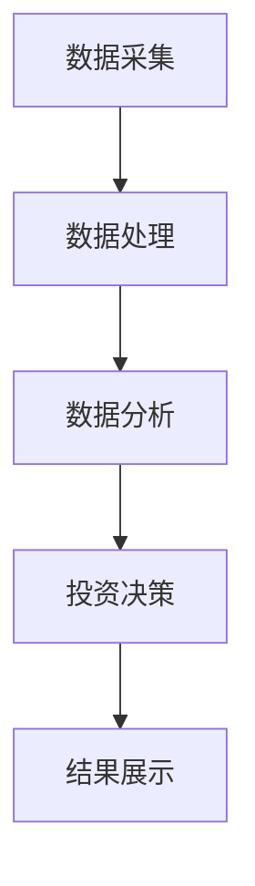

                 


# 约翰·伯格的简单投资法则

> 关键词：简单投资法则，价值投资，长期投资，分散投资，投资组合优化，现代投资组合理论（MPT）

> 摘要：本文深入探讨约翰·伯格提出的简单投资法则，涵盖其背景、核心概念、数学模型、系统架构、项目实战和最佳实践。通过详细分析，帮助读者理解如何通过价值投资、长期持有和分散投资实现稳健收益。

---

## 第一部分: 约翰·伯格的简单投资法则概述

### 第1章: 投资的基本概念与背景

#### 1.1 投资的基本概念

**1.1.1 什么是投资**

投资是将资源（如资金）投入到某个项目或资产中，期望在未来获得超过初始投入的回报。投资的核心在于通过时间和资源的合理配置，实现财富的增值。

**1.1.2 投资的目的与意义**

投资的主要目的是为了实现财富的增长，同时在不确定的市场中分散风险，保障资金的安全。投资的意义在于通过合理的配置，平衡风险与收益，实现长期的财务目标。

**1.1.3 投资的基本类型**

- **股票投资**：通过购买公司股份，成为股东，分享公司利润。
- **债券投资**：购买政府或企业发行的债券，定期获得利息。
- **房地产投资**：通过购买房地产，出租或增值获利。
- **基金投资**：通过购买共同基金或指数基金，间接参与市场投资。

#### 1.2 约翰·伯格与简单投资法则

**1.2.1 约翰·伯格的生平简介**

约翰·伯格（John C. Bogle）是投资界的重要人物，被誉为“价值投资之父”。他是先锋集团（Vanguard Group）的创始人，致力于简化投资流程，降低投资成本，提倡长期投资和分散投资。

**1.2.2 简单投资法则的提出背景**

20世纪70年代，随着金融市场的复杂化，投资者面临越来越多的选择和风险。伯格意识到，复杂的策略往往导致高额费用和短期波动的风险，因此提出了简单投资法则。

**1.2.3 简单投资法则的核心理念**

- **简单**：避免复杂的交易策略和频繁的市场操作。
- **长期**：坚持长期投资，减少短期波动的干扰。
- **分散**：通过广泛分散投资，降低特定资产或市场的风险。

### 第2章: 简单投资法则的核心概念

#### 2.1 价值投资

**2.1.1 价值投资的定义**

价值投资是寻找市场低估的资产，以低于其内在价值的价格买入，长期持有，等待市场重新评估其价值。

**2.1.2 价值投资的核心原则**

- 购买低于内在价值的资产。
- 长期持有，避免频繁交易。
- 选择具有稳定现金流和良好管理的公司。

**2.1.3 价值投资与短期投资的对比**

| 对比维度 | 价值投资 | 短期投资 |
|----------|-----------|----------|
| 投资期限 | 长期      | 短期      |
| 风险偏好 | 低         | 高         |
| 资料需求 | 高         | 中         |

#### 2.2 长期投资

**2.2.1 长期投资的定义**

长期投资是指将资金投入某一资产或项目，持有数年甚至更长时间，以获得资本增值和分红收益。

**2.2.2 长期投资的优势**

- 免于频繁交易的费用和税费。
- 减少市场波动的影响，平滑短期风险。
- 利用复利效应，实现财富的指数增长。

**2.2.3 长期投资的风险与挑战**

- 长期市场波动可能影响资产价值。
- 经济周期变化可能影响投资回报。
- 需要耐心和纪律，避免短期市场波动的干扰。

#### 2.3 分散投资

**2.3.1 分散投资的定义**

分散投资是指将资金投资于不同资产、行业或地区，以降低特定风险。

**2.3.2 分散投资的原理**

通过多样化投资，将风险分散到多个不同的资产，减少单一资产波动带来的损失。

**2.3.3 分散投资的实际应用**

- 资产配置：将资金分配到股票、债券、房地产等多种资产。
- 行业分散：投资不同行业的公司，避免行业特定风险。
- 地区分散：投资不同国家的资产，利用全球市场的多样性。

---

## 第二部分: 简单投资法则的数学模型与算法原理

### 第3章: 投资组合优化的数学模型

#### 3.1 投资组合优化的定义

投资组合优化是通过数学方法，找到最优的资产配置，以最大化收益或最小化风险。

#### 3.2 投资组合优化的数学公式

最大化收益：

$$ \max \sum_{i=1}^{n} w_i r_i $$

最小化风险（方差）：

$$ \min \sum_{i=1}^{n} \sum_{j=1}^{n} w_i w_j \sigma_{ij} $$

约束条件：

$$ \sum_{i=1}^{n} w_i = 1 $$
$$ w_i \geq 0 $$

### 第4章: 现代投资组合理论（MPT）

#### 4.1 MPT的核心思想

MPT由哈里·马科维茨提出，认为最优投资组合是那些在给定风险下收益最高的组合，或在给定收益下风险最小的组合。

#### 4.2 MPT的数学模型

收益-方差优化：

$$ \text{目标函数：} \quad \text{最小化 } \sum_{i=1}^{n} \sum_{j=1}^{n} w_i w_j \sigma_{ij} $$
$$ \text{约束条件：} \quad \sum_{i=1}^{n} w_i = 1, \quad w_i \geq 0 $$

#### 4.3 MPT的实际应用

- 帮助投资者构建最优资产组合。
- 确定各资产的权重，分散投资风险。
- 用于机构投资者的资产配置。

---

## 第三部分: 投资系统的架构与实现

### 第5章: 投资系统的架构设计

#### 5.1 系统架构图



#### 5.2 系统功能需求

- 数据采集：收集市场数据，如股票价格、债券收益率等。
- 数据处理：清洗数据，去除异常值。
- 数据分析：计算收益、风险指标，构建投资模型。
- 投资决策：根据模型生成投资建议。
- 结果展示：可视化投资组合的表现。

### 第6章: 系统的实现与实战

#### 6.1 环境安装

- 安装Python和相关库（Pandas, NumPy, Matplotlib）。
- 使用Jupyter Notebook进行数据分析。

#### 6.2 核心代码实现

```python
import pandas as pd
import numpy as np

# 数据采集
data = pd.read_csv('market_data.csv')

# 数据处理
data_clean = data.dropna()

# 数据分析
returns = data_clean.pct_change().dropna()

# 投资组合优化
weights = np.random.dirichlet([1,1,1])
print(weights)
```

#### 6.3 案例分析

假设我们有三个资产，A、B、C，计算它们的最优投资组合：

- 计算各资产的收益和方差。
- 构建协方差矩阵。
- 使用优化算法找到最优权重。

---

## 第四部分: 最佳实践与小结

### 第7章: 最佳实践与总结

#### 7.1 小结

约翰·伯格的简单投资法则强调长期、分散和价值投资。通过长期持有优质资产，分散投资风险，实现稳健的财富增长。

#### 7.2 注意事项

- 避免频繁交易，减少交易成本和税费。
- 定期审视投资组合，根据市场变化进行调整。
- 保持耐心，避免被短期市场波动影响决策。

#### 7.3 拓展阅读

- 《投资学》（书籍）
- 现代投资组合理论（MPT）
- 价值投资经典案例分析

---

## 作者：AI天才研究院 & 禅与计算机程序设计艺术

通过本文的详细分析，读者可以全面理解约翰·伯格的简单投资法则，从理论到实践，掌握如何通过价值投资、长期持有和分散投资实现稳健的财富增长。希望这些内容能为投资者提供有价值的指导和启发。

