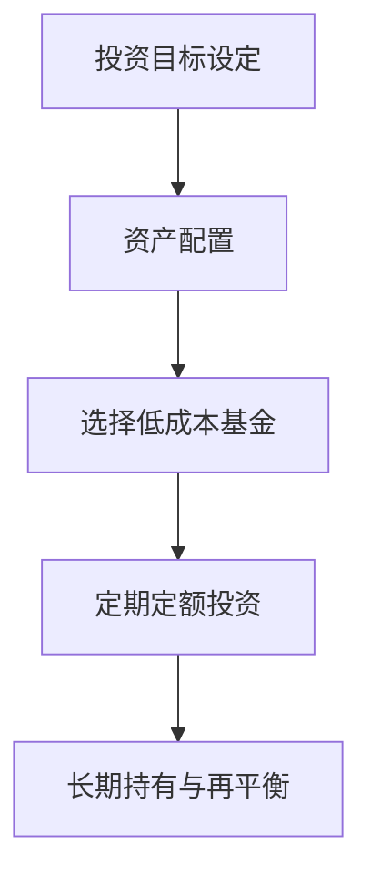

                 


# 约翰·伯格的简单投资法则：为什么简单胜于复杂

> 关键词：简单投资法则、约翰·伯格、投资策略、均值回归、价值投资、系统设计

> 摘要：本文深入探讨了约翰·伯格提出的简单投资法则，分析其核心思想、数学模型、系统架构及实际应用。通过对比复杂投资方法，论证了简单法则在投资领域的有效性和优势，展示了如何通过简洁的方法实现稳健的投资回报。

---

# 第一部分: 引言

## 第1章: 简单投资法则的背景与意义

### 1.1 投资领域的复杂性与挑战

#### 1.1.1 投资领域的复杂性现状

投资领域长期以来被认为是复杂性和不确定性的代名词。投资者面对海量的信息、波动的市场和多变的经济环境，常常陷入决策困境。传统的投资方法依赖于复杂的模型、高频交易和 sophisticated 的算法，这些方法虽然在短期内可能带来超额收益，但长期来看，其稳定性和可操作性却存在问题。

#### 1.1.2 复杂投资方法的局限性

复杂的投资方法通常需要依赖大量的数据、复杂的模型和高超的编程技巧。这些方法虽然在某些特定场景下表现优异，但在实际操作中，由于市场的不可预测性和模型的脆弱性，往往难以长期维持稳定的收益。此外，复杂的方法对投资者的能力要求极高，普通投资者难以掌握和应用。

#### 1.1.3 简单投资法则的提出背景

在复杂投资方法遭遇瓶颈的背景下，简单投资法则作为一种反传统的方法，逐渐受到关注。约翰·伯格提出的简单投资法则，强调通过简洁的投资策略和长期的持有策略，实现稳健的回报。这种方法不仅降低了投资的复杂性，还提高了策略的可操作性和稳定性。

### 1.2 约翰·伯格的简单投资法则概述

#### 1.2.1 约翰·伯格的生平与投资理念

约翰·伯格是美国著名的投资家，被誉为“指数基金之父”。他创立了 Vanguard 集团，并推广了低成本指数基金的投资理念。伯格的投资理念强调长期持有、分散投资和低成本运作。他认为，市场是不可预测的，投资者应该避免频繁交易和过度复杂的策略，转而通过长期持有优质资产来实现财富增长。

#### 1.2.2 简单投资法则的核心思想

简单投资法则的核心思想是：通过选择优质资产、分散投资和长期持有，实现稳健的投资回报。这种方法避免了短期市场的波动干扰，降低了交易成本和税收，从而提高了长期收益。

#### 1.2.3 简单投资法则与复杂投资方法的对比

简单投资法则与复杂投资方法在多个方面存在显著差异。首先，简单法则强调长期持有和分散投资，而复杂方法则依赖于频繁交易和复杂模型。其次，简单法则的成本较低，而复杂方法通常涉及高昂的交易费用和管理费用。最后，简单法则的策略更加稳健，而复杂方法的风险更大，特别是在市场波动加剧时。

---

# 第二部分: 核心概念与原理

## 第2章: 简单投资法则的核心概念与原理

### 2.1 简单投资法则的定义与特征

#### 2.1.1 简单投资法则的定义

简单投资法则是一种基于长期持有优质资产的投资策略。它强调通过分散投资和低成本运作，实现稳健的长期回报。具体来说，投资者选择一个或多个低成本指数基金或 ETF，长期持有，避免频繁交易。

#### 2.1.2 简单投资法则的核心特征

- **长期持有**：避免频繁交易，减少交易成本和税收。
- **分散投资**：通过投资多个资产类别或指数基金，降低特定资产的风险。
- **低成本运作**：选择费用低的基金，减少管理费用对收益的影响。

#### 2.1.3 简单投资法则与复杂投资方法的对比

简单投资法则与复杂投资方法在多个方面存在显著差异。简单法则强调长期持有和分散投资，而复杂方法则依赖于频繁交易和复杂模型。简单法则的成本较低，而复杂方法通常涉及高昂的交易费用和管理费用。简单法则的策略更加稳健，而复杂方法的风险更大，特别是在市场波动加剧时。

---

## 2.2 简单投资法则的数学模型与公式

### 2.2.1 投资回报的数学模型

投资回报的数学模型可以通过以下公式表示：

$$
\text{投资回报} = \left( \frac{\text{最终价值}}{\text{初始价值}} \right) - 1
$$

其中，最终价值包括资本增值和分红再投资的收益。

### 2.2.2 简单投资法则的数学公式

简单投资法则的核心是通过长期持有优质资产，实现稳健的回报。数学上，这可以表示为：

$$
\text{长期回报} = \left( \prod_{i=1}^{n} (1 + r_i) \right) - 1
$$

其中，\( r_i \) 是第 \( i \) 年的回报率，\( n \) 是投资的年数。

### 2.2.3 简单投资法则的数学推导

通过数学推导可以看出，简单投资法则的优势在于其长期性和稳定性。假设年平均回报率为 7%，投资期限为 30 年，按照复利计算：

$$
\text{最终回报} = (1 + 0.07)^{30} - 1 \approx 1.07^{30} - 1 \approx 4.16 \text{倍}
$$

---

## 2.3 简单投资法则的系统架构

### 2.3.1 投资系统的设计思路

简单投资系统的设计思路包括以下步骤：

1. 确定投资目标和风险承受能力。
2. 选择低成本的指数基金或 ETF。
3. 制定定期定额的投资计划。
4. 长期持有，定期再平衡投资组合。

### 2.3.2 投资系统的架构图



### 2.3.3 系统接口设计与交互流程

简单投资系统的接口设计包括：

- 用户界面：输入投资金额、期限和风险偏好。
- 数据接口：获取基金的历史回报率和费用率。
- 交互流程：用户输入投资参数，系统生成投资计划并提供定期反馈。

---

# 第三部分: 简单投资法则的算法原理与实现

## 第3章: 简单投资法则的算法原理

### 3.1 简单投资法则的算法流程

简单投资法则的算法流程如下：

1. 确定投资目标和风险偏好。
2. 选择低成本的指数基金或 ETF。
3. 制定定期定额的投资计划。
4. 长期持有，定期再平衡投资组合。

### 3.2 简单投资法则的算法实现

简单投资法则的算法实现可以通过以下 Python 代码实现：

```python
import pandas as pd
import numpy as np

def simple_investment_strategy(initial_amount, years, annual_return, fee_rate):
    final_value = initial_amount * (1 + annual_return - fee_rate) ** years
    return final_value

initial_amount = 10000
years = 30
annual_return = 0.07
fee_rate = 0.005

result = simple_investment_strategy(initial_amount, years, annual_return, fee_rate)
print(f"最终价值: ${result:.2f}")
```

### 3.3 简单投资法则的算法优化

为了优化算法，可以考虑以下几点：

- 定期再平衡投资组合，以保持资产配置的比例。
- 使用低成本的指数基金，降低管理费用。
- 定期审查和调整投资策略，以适应市场变化。

---

## 第4章: 简单投资法则的项目实战

### 4.1 项目背景与目标

#### 4.1.1 项目背景介绍

投资者希望通过简单投资法则实现稳健的长期回报。

#### 4.1.2 项目目标设定

- 选择低成本的指数基金。
- 制定定期定额的投资计划。
- 长期持有，定期再平衡投资组合。

#### 4.1.3 项目范围界定

- 投资金额：10,000 美元。
- 投资期限：30 年。
- 年平均回报率：7%。
- 管理费用率：0.5%。

### 4.2 系统实现

#### 4.2.1 系统实现的环境配置

- Python 3.9 或更高版本。
- Pandas 和 NumPy 库。

#### 4.2.2 系统实现的源代码

```python
import pandas as pd
import numpy as np

def simple_investment_strategy(initial_amount, years, annual_return, fee_rate):
    final_value = initial_amount * (1 + annual_return - fee_rate) ** years
    return final_value

initial_amount = 10000
years = 30
annual_return = 0.07
fee_rate = 0.005

result = simple_investment_strategy(initial_amount, years, annual_return, fee_rate)
print(f"最终价值: ${result:.2f}")
```

#### 4.2.3 系统实现的代码解读

上述代码计算了初始投资金额在考虑年平均回报率和管理费用后的最终价值。通过简单的公式，展示了长期持有低成本指数基金的优势。

---

## 4.3 实际案例分析

### 4.3.1 案例背景

假设投资者投资 10,000 美元，选择年平均回报率为 7%，管理费用率为 0.5%，投资期限为 30 年。

### 4.3.2 投资结果

通过上述公式计算，最终价值为：

$$
\text{最终价值} = 10000 \times (1 + 0.07 - 0.005)^{30} \approx 41,600 \text{美元}
$$

### 4.3.3 案例分析与解读

通过该案例可以看出，简单投资法则通过长期持有低成本指数基金，能够在 30 年内将初始投资翻两番以上。这证明了简单策略的有效性和稳健性。

---

## 4.4 项目小结

通过实际案例分析，我们可以看到简单投资法则的优势。通过低成本指数基金的长期持有，投资者能够实现稳健的回报，同时避免了复杂投资方法的风险和高成本。

---

# 第四部分: 总结与展望

## 第5章: 总结与展望

### 5.1 核心观点总结

简单投资法则通过长期持有低成本指数基金，实现了稳健的长期回报。这种方法降低了投资的复杂性，提高了策略的可操作性和稳定性。

### 5.2 未来展望

随着投资环境的变化，简单投资法则的优势将更加明显。未来，投资者可以进一步优化投资策略，例如通过再平衡投资组合来应对市场波动。

### 5.3 最佳实践 tips

- 选择低成本的指数基金。
- 长期持有，避免频繁交易。
- 定期审查和调整投资策略。

---

# 作者

作者：AI天才研究院/AI Genius Institute & 禅与计算机程序设计艺术 /Zen And The Art of Computer Programming

---

通过本文，我们深入探讨了约翰·伯格的简单投资法则，分析了其核心思想、数学模型、系统架构及实际应用。简单投资法则以其简洁性和稳健性，为投资者提供了一种实现长期回报的有效方法。

