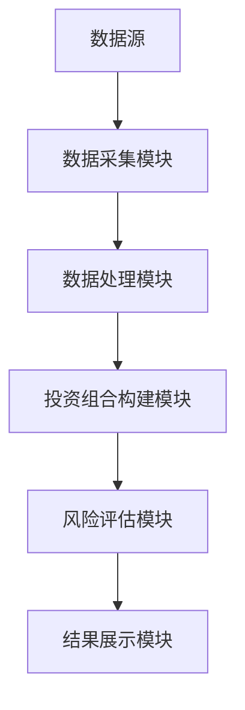
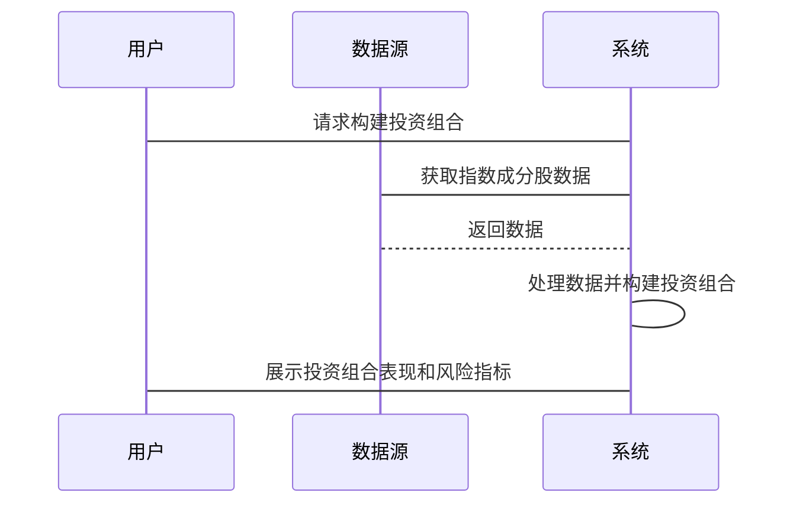

                 


# 约翰·伯格的被动投资与公司治理影响

> 关键词：被动投资、公司治理、约翰·伯格、指数基金、风险管理

> 摘要：本文深入探讨了约翰·伯格的被动投资策略及其对公司治理的影响。通过分析被动投资的核心原理、算法实现、系统架构以及项目实战，结合公司治理的理论与实践，揭示了被动投资在公司治理中的关键作用。本文适合对投资管理和公司治理感兴趣的读者阅读。

---

## 第一部分: 被动投资与公司治理的背景介绍

### 第1章: 被动投资与公司治理概述

#### 1.1 被动投资的定义与特点
- **1.1.1 被动投资的基本概念**  
  被动投资是一种投资策略，旨在通过跟踪市场指数或特定投资组合的表现，而不是主动选择个股或预测市场趋势。其核心在于减少主动管理的成本和风险，追求与市场指数相等或相近的收益。

- **1.1.2 被动投资的核心特点**  
  - **低成本**：通过减少交易频率和管理费用，降低整体投资成本。  
  - **低风险**：被动投资减少人为决策错误和市场波动带来的风险。  
  - **长期稳定**：适合长期投资者，追求长期稳定的收益。

- **1.1.3 被动投资与主动投资的对比**  
  | 对比维度 | 被动投资 | 主动投资 |  
  |----------|----------|----------|  
  | 管理方式 | 跟踪指数 | 主动选股 |  
  | 成本     | 低       | 高       |  
  | 风险     | 低       | 高       |  

#### 1.2 公司治理的定义与影响
- **1.2.1 公司治理的基本概念**  
  公司治理是指公司内部和外部利益相关者之间的权利和责任分配，确保公司高效运作、合规经营，并为股东创造最大价值。

- **1.2.2 公司治理的核心要素**  
  - **股权结构**：股东的持股比例和权力分配。  
  - **董事会结构**：董事会的组成、职责和运作方式。  
  - **管理层职责**：高管的职责、权限和激励机制。  
  - **透明度与披露**：公司财务和经营信息的公开透明。  

- **1.2.3 被动投资如何影响公司治理**  
  被动投资者通常不积极参与公司治理，但通过持有公司股份，间接影响公司决策。例如，通过投票权或与公司管理层沟通，被动投资者可以推动公司治理的改进。

#### 1.3 被动投资与公司治理的关系
- **1.3.1 被动投资在公司治理中的作用**  
  被动投资者通过持有公司股份，成为公司治理的重要组成部分，尽管他们通常不直接参与公司运营，但可以通过投票等方式影响公司治理决策。

- **1.3.2 被动投资如何影响公司治理决策**  
  被动投资者的持股行为可能导致公司治理结构的变化，例如推动董事会多元化、提高透明度等。此外，被动投资者可能通过指数基金的形式，间接影响公司治理的行业趋势。

---

## 第二部分: 被动投资的核心原理

### 第2章: 被动投资的核心原理

#### 2.1 被动投资的理论基础
- **2.1.1 现代投资组合理论（MPT）**  
  现代投资组合理论由哈里·马科维茨提出，强调通过分散投资降低风险，而被动投资正是这一理论的实践应用。

- **2.1.2 资本资产定价模型（CAPM）**  
  CAPM模型用于评估资产的预期收益，被动投资通过跟踪市场指数，追求与市场一致的收益。

- **2.1.3 有效市场假说（EMH）**  
  EMH认为市场是有效的，被动投资在这种环境下能够获得市场平均收益，避免主动投资的超额收益难以实现的问题。

#### 2.2 被动投资的指数构建
- **2.2.1 指数的选择与权重计算**  
  指数的选择决定了被动投资的表现，常见的指数包括标普500、道琼斯指数等。权重计算通常采用市值加权、等权重或其他方法。

- **2.2.2 指数基金的构建步骤**  
  1. 数据采集：获取指数成分股的历史数据。  
  2. 计算权重：根据权重方法计算每只股票的权重。  
  3. 模拟投资：按照权重分配资金，模拟投资组合的表现。

#### 2.3 被动投资的风险管理
- **2.3.1 风险来源**  
  - 市场风险：整体市场波动对投资组合的影响。  
  - 流动性风险：指数成分股的流动性不足导致交易困难。  
  - 基准风险：投资组合表现与指数之间的差异。  

- **2.3.2 风险调整后的收益计算**  
  使用夏普比率、特雷纳比率等指标衡量风险调整后的收益。  
  $$ 夏普比率 = \frac{R_p - R_f}{\sigma_p} $$  
  其中，$R_p$ 是投资组合的收益，$R_f$ 是无风险利率，$\sigma_p$ 是投资组合的波动率。

- **2.3.3 风险控制策略**  
  通过定期再平衡投资组合，确保与指数的偏离最小化。同时，选择流动性高的指数成分股，降低流动性风险。

---

## 第三部分: 被动投资的算法实现

### 第3章: 被动投资的算法实现

#### 3.1 指数基金的构建算法
- **数据采集与处理**  
  从数据源获取指数成分股的历史价格数据，清洗数据并计算每日收益率。

- **权重计算**  
  使用市值加权法计算每只股票的权重：  
  $$ w_i = \frac{P_i \times Q_i}{\sum_{j=1}^{n} P_j \times Q_j} $$  
  其中，$P_i$ 是第 $i$ 只股票的价格，$Q_i$ 是其数量。

- **指数模拟运行**  
  根据权重分配投资金额，模拟投资组合的表现，并计算与实际指数的跟踪误差。

#### 3.2 被动投资的风险评估算法
- **风险指标计算**  
  使用波动率、VaR（在险价值）等指标衡量投资组合的风险。  
  $$ VaR = \mu + z \times \sigma $$  
  其中，$\mu$ 是平均收益，$z$ 是标准正态分布的分位数，$\sigma$ 是波动率。

- **风险调整后的收益模型**  
  使用CAPM模型计算风险调整后的预期收益。  
  $$ E(R_i) = R_f + \beta_i (R_m - R_f) $$  
  其中，$\beta_i$ 是股票的贝塔系数，$R_m$ 是市场预期收益。

#### 3.3 被动投资的优化算法
- **简单平均法**  
  每只股票的权重相等，计算简单平均收益。

- **加权平均法**  
  根据股票的市场资本化或流动性加权，计算加权平均收益。

- **最优化指数构建方法**  
  使用数学优化算法（如最小二乘法）构建最优指数组合，最小化跟踪误差或最大化夏普比率。

---

## 第四部分: 被动投资的系统架构设计

### 第4章: 被动投资系统的架构设计

#### 4.1 系统功能模块划分
- **数据采集模块**  
  负责从数据源获取指数成分股的价格数据。

- **数据处理模块**  
  清洗、转换和存储数据，计算必要的指标（如收益率、波动率）。

- **投资组合构建模块**  
  根据指数构建算法生成投资组合，并计算跟踪误差和风险指标。

- **风险评估模块**  
  使用数学模型评估投资组合的风险，并提供风险调整后的收益分析。

- **结果展示模块**  
  将投资组合的表现和风险指标以可视化方式展示给用户。

#### 4.2 系统架构图


#### 4.3 系统交互流程


---

## 第五部分: 被动投资的项目实战

### 第5章: 被动投资的项目实战

#### 5.1 环境安装
- **Python环境**：安装Python 3.8及以上版本。  
- **数据处理库**：安装Pandas、NumPy、Matplotlib等库。  
- **数据源**：使用Yahoo Finance或其它API获取数据。

#### 5.2 核心实现代码
```python
import pandas as pd
import numpy as np
import matplotlib.pyplot as plt

# 数据获取
def get_data(tickers, start_date, end_date):
    data = pd.DataFrame()
    for ticker in tickers:
        df = pd.read_csv(f'data/{ticker}.csv')
        df['Date'] = pd.to_datetime(df['Date'])
        df.set_index('Date', inplace=True)
        data[ticker] = df['Adj Close']
    return data

# 权重计算
def calculate_weights(prices):
    total = prices.sum().sum()
    weights = prices.div(total)
    return weights

# 指数构建与模拟
def build_index(tickers, start_date, end_date):
    data = get_data(tickers, start_date, end_date)
    weights = calculate_weights(data.iloc[-1])
    return weights

# 风险评估
def calculate_sharpe_ratio(return_series, risk_free_rate):
    excess_return = return_series - risk_free_rate
    sharpe_ratio = excess_return.mean() / excess_return.std()
    return sharpe_ratio

# 示例运行
tickers = ['AAPL', 'MSFT', 'GOOGL']
start_date = '2020-01-01'
end_date = '2023-12-31'

weights = build_index(tickers, start_date, end_date)
returns = get_data(tickers, start_date, end_date).pct_change().dropna()
sharpe_ratio = calculate_sharpe_ratio(returns.mean(), 0.01)
print(f"夏普比率: {sharpe_ratio}")
```

#### 5.3 项目小结
通过本项目，读者可以掌握被动投资的基本原理和实现方法，理解如何通过Python代码构建指数基金，并评估其风险和收益。实际案例分析展示了被动投资在公司治理中的应用潜力。

---

## 第六部分: 最佳实践与小结

### 第6章: 最佳实践与小结

#### 6.1 最佳实践
- **长期投资**：被动投资适合长期投资者，避免频繁交易和短期波动的影响。  
- **定期再平衡**：定期调整投资组合，确保与指数的偏离最小化。  
- **风险管理**：通过夏普比率等指标评估风险调整后的收益，制定合理的风险管理策略。  

#### 6.2 小结
本文从被动投资的基本原理出发，结合公司治理的影响，详细讲解了被动投资的算法实现和系统架构。通过实际项目案例，展示了被动投资在理论与实践中的应用。被动投资不仅降低了投资成本，还通过间接方式推动了公司治理的优化。

#### 6.3 注意事项
- 被动投资并非无风险，需注意市场波动和流动性风险。  
- 在选择指数时，需考虑其代表性和市场覆盖度。  
- 定期跟踪投资组合的表现，及时调整策略。  

#### 6.4 拓展阅读
- 《The Intelligent Investor》——本杰明·格雷厄姆  
- 《The Global Asset Allocation Survey》——约翰·伯格  

---

## 作者：AI天才研究院/AI Genius Institute & 禅与计算机程序设计艺术 /Zen And The Art of Computer Programming

---

以上是关于《约翰·伯格的被动投资与公司治理影响》的技术博客文章的完整内容，涵盖从理论到实践的各个方面，适合对投资管理和公司治理感兴趣的读者阅读。

