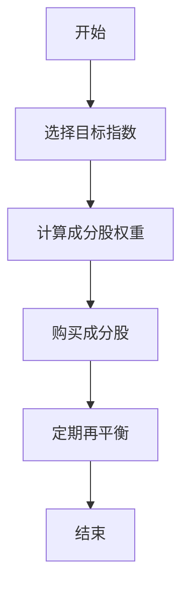
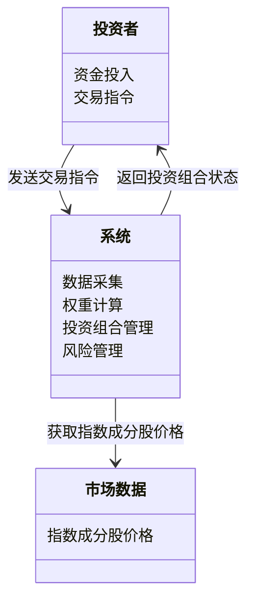

                 

# 《约翰·伯格的被动投资哲学》

---

## 关键词：  
被动投资、约翰·伯格、指数基金、投资哲学、长期持有、风险管理、投资策略

---

## 摘要：  
被动投资是一种以长期持有低成本指数基金为核心策略的投资方法，其哲学基础来源于市场有效性和投资者行为心理学的结合。本文将深入解析约翰·伯格的被动投资理念，探讨其背后的数学模型、系统架构以及实际应用。通过理论与实践的结合，本文旨在为读者提供一种简洁、高效的投资方式，帮助投资者在复杂的金融市场中实现稳健的财富增长。

---

## 正文：

---

### 第一部分：被动投资的哲学基础

#### 第1章：被动投资的起源与发展

##### 1.1 被动投资的起源  
被动投资的概念可以追溯到20世纪中期，当时学术界开始对市场有效性进行深入研究。约翰·伯格（John Bogle）作为被动投资的倡导者，提出了指数基金的投资理念。他强调，市场的长期回报可以通过持有低成本的指数基金来实现，而不是通过频繁的交易和选股。

##### 1.2 被动投资的核心理念  
被动投资的核心在于“买入并持有”，即通过长期持有指数基金，避免频繁交易带来的高额成本。这种策略假设市场是有效的，即市场的价格反映了所有可获得的信息，因此试图通过选股或择时来获得超额收益是不现实的。

##### 1.3 约翰·伯格的贡献  
约翰·伯格创立了先锋集团（Vanguard），并推出了第一只低成本指数基金——Vanguard 500 Index Fund。他的贡献不仅在于创新了指数基金的投资方式，更在于他通过实践证明了被动投资的长期有效性。

---

#### 第2章：被动投资与主动投资的对比

##### 2.1 成本对比  
被动投资的管理费用（expense ratio）通常远低于主动管理型基金。例如，指数基金的管理费用通常在0.1%到0.5%之间，而主动管理型基金的管理费用可能高达1%到2%。

##### 2.2 风险对比  
被动投资的风险主要来自于市场的波动性，而主动投资的风险则来自于管理者的决策错误和市场的不可预测性。被动投资通过分散投资降低了非系统性风险。

##### 2.3 收益对比  
长期来看，被动投资的收益通常能够跑赢大部分主动管理型基金。根据晨星（Morningstar）的数据，超过60%的主动管理型基金在长期表现上落后于其对应的指数基金。

---

### 第二部分：被动投资的核心概念与联系

#### 第3章：被动投资的原理

##### 3.1 指数基金的构建原理  
指数基金通过跟踪特定的市场指数（如标普500指数）来构建投资组合。投资者购买指数基金相当于间接持有指数中的所有股票，从而获得市场的平均收益。

##### 3.2 成本控制的重要性  
被动投资的核心优势在于低成本。高昂的管理费用会显著侵蚀投资收益，尤其是在长期复利的情况下，低成本的优势更加明显。

##### 3.3 长期投资的数学模型  
被动投资的收益可以通过以下公式计算：  
$$ \text{收益} = \text{指数回报率} - \text{管理费用} $$  
长期持有指数基金的回报率可以通过复利公式计算：  
$$ \text{最终收益} = \text{初始投资} \times (1 + \text{年化回报率})^n $$  
其中，\( n \) 为投资年数。

---

#### 第4章：被动投资的哲学与实践

##### 4.1 市场有效性的哲学思考  
被动投资的哲学基础在于市场有效性假设。如果市场是有效的，那么投资者无法通过基本面分析或技术分析获得超额收益。被动投资通过持有指数基金，间接承认了市场的有效性。

##### 4.2 投资者行为的哲学分析  
投资者的行为往往受到情绪的驱动，导致频繁交易和决策失误。被动投资通过纪律性的“买入并持有”策略，帮助投资者克服情绪化决策的负面影响。

##### 4.3 长期投资的哲学意义  
被动投资强调长期持有，这与复利的原理相契合。长期持有不仅能够最大化复利效应，还能减少交易成本和税务负担。

---

### 第三部分：被动投资的算法与系统架构

#### 第5章：被动投资的算法原理

##### 5.1 指数基金的构建算法  
指数基金的构建算法包括以下几个步骤：  
1. 选择目标指数。  
2. 计算指数成分股的权重。  
3. 购买并持有成分股，定期再平衡投资组合。  

##### 5.2 再平衡策略  
再平衡是被动投资的重要环节。定期对投资组合进行再平衡，以维持与目标指数的一致性。再平衡的频率通常为每年一次或每季度一次。

##### 5.3 算法流程图  

---

#### 第6章：被动投资的系统架构设计

##### 6.1 系统功能设计  
被动投资系统的功能模块包括：  
- 数据采集：获取指数成分股的价格数据。  
- 权重计算：计算成分股的权重。  
- 投资组合管理：根据权重调整投资组合。  
- 风险管理：监控市场波动和投资组合的偏离度。  

##### 6.2 系统架构图  

---

### 第四部分：被动投资的项目实战

#### 第7章：被动投资的实际应用

##### 7.1 选择指数基金  
投资者需要根据自身的风险承受能力和投资目标选择合适的指数基金。例如，投资美国市场的投资者可以选择标普500指数基金，而投资全球市场的投资者可以选择全球指数基金。

##### 7.2 构建投资组合  
通过将资金分配到不同的指数基金中，投资者可以构建一个多元化的投资组合。例如，投资者可以将80%的资金投资于股票指数基金，20%的资金投资于债券指数基金。

##### 7.3 监控与调整  
定期监控投资组合的偏离度，并根据市场变化进行再平衡。例如，每年检查一次投资组合的权重，并根据目标指数进行调整。

---

### 第五部分：被动投资的最佳实践

#### 第8章：最佳实践与注意事项

##### 8.1 最佳实践  
- 定期定额投资：通过定期定额投资，投资者可以避免市场波动的影响。  
- 长期持有：被动投资的核心在于长期持有，频繁交易会增加成本并影响收益。  
- 分散投资：通过投资多个指数基金，投资者可以降低非系统性风险。  

##### 8.2 小结  
被动投资是一种简单、高效的投资方式，其哲学基础和实践方法都值得投资者深入研究。

##### 8.3 注意事项  
- 被动投资并非万能，市场波动和经济周期仍然会影响投资回报。  
- 投资者需要根据自身的财务状况和风险承受能力选择合适的投资策略。  

---

## 作者：  
**AI天才研究院/AI Genius Institute & 禅与计算机程序设计艺术 /Zen And The Art of Computer Programming**  

--- 

**本文为技术博客文章，未经授权不得转载。**

