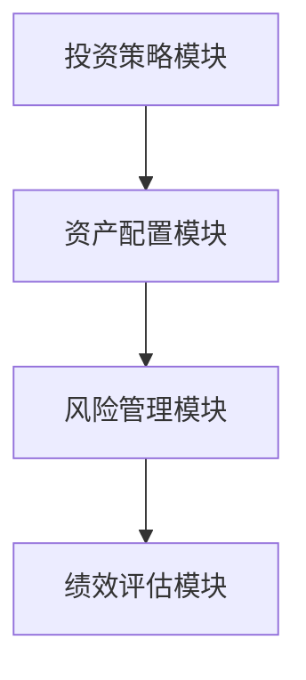

                 


# 约翰·伯格的被动投资哲学

> 关键词：被动投资，约翰·伯格，指数基金，长期投资，风险管理，投资哲学，数学模型

> 摘要：本文深入探讨约翰·伯格的被动投资哲学，从指数基金的核心原理到长期投资策略，再到风险管理模型，结合数学公式和系统架构，详细分析其在现代金融中的应用与实践。通过实际案例和代码实现，为读者提供全面的被动投资知识体系。

---

## 第1章：被动投资的背景与基础

### 1.1 被动投资的定义与特点

被动投资是一种以长期持有低成本指数基金为主要策略的投资方式。与主动投资不同，被动投资不依赖于市场预测或个股选择，而是通过跟踪市场指数来实现收益。其核心特点包括：

- **低成本**：被动投资通过指数基金避免了高昂的管理费用。
- **分散风险**：通过投资市场上的所有股票，降低单一股票的风险。
- **长期持有**：避免频繁交易，减少交易成本和税务负担。

### 1.2 约翰·伯格的生平与贡献

约翰·伯格（John Bogle）是被动投资领域的先驱，被誉为“指数基金之父”。他于1975年创立了第一只现代意义上的指数基金——先锋500指数基金（Vanguard 500 Index Fund）。伯格的投资哲学强调长期持有和低成本，他倡导投资者避免频繁交易和市场预测，以降低投资成本和风险。

---

## 第2章：指数基金的投资策略

### 2.1 指数基金的基本原理

指数基金通过复制市场指数的表现来实现投资收益。其核心原理包括：

- **市场指数**：指数基金跟踪特定市场指数，如标普500指数。
- **分散化**：通过投资指数中的所有成分股，降低个股风险。
- **低成本**：指数基金的管理费用较低，通常远低于主动管理型基金。

#### 2.1.1 指数基金的运作机制

指数基金通过被动管理来跟踪市场指数，具体步骤如下：

1. **选择指数**：选择一个市场指数作为跟踪目标。
2. **复制指数**：通过购买指数中的所有成分股，按比例分配资金。
3. **定期再平衡**：定期调整投资组合以保持与指数一致的比例。

### 2.2 约翰·伯格与指数基金

#### 2.2.1 伯格对指数基金的贡献

伯格的贡献包括：

- 创立了第一只低成本指数基金。
- 提倡长期持有和分散投资的理念。
- 指出主动投资的高成本和低收益。

#### 2.2.2 伯格的指数基金投资理念

伯格的核心理念是：

- **低成本**：降低管理费用和交易成本。
- **分散化**：通过投资整个市场来降低风险。
- **长期持有**：避免短期波动的影响。

---

## 第3章：被动投资的数学模型与算法

### 3.1 被动投资的收益模型

#### 3.1.1 被动投资的收益计算公式

指数基金的收益可以通过以下公式计算：

$$
R_{\text{fund}} = R_{\text{index}} - c
$$

其中，\( R_{\text{fund}} \) 是指数基金的收益，\( R_{\text{index}} \) 是市场指数的收益，\( c \) 是管理费用。

#### 3.1.2 指数基金的收益与市场指数的关系

指数基金的收益与市场指数密切相关，公式为：

$$
R_{\text{fund}} = R_{\text{index}} - c
$$

其中，\( c \) 是基金的管理费用。

### 3.2 被动投资的风险模型

#### 3.2.1 风险的定义与衡量指标

风险可以通过波动率（标准差）来衡量。波动率越高，投资的风险越大。

#### 3.2.2 被动投资的风险来源

被动投资的风险主要来源于市场波动和指数成分股的变化。

---

## 第4章：被动投资的系统架构与设计

### 4.1 系统功能模块划分

被动投资系统的功能模块包括：

- **投资策略模块**：负责指数选择和投资组合构建。
- **资产配置模块**：负责资金分配和再平衡。
- **风险管理模块**：负责风险评估和控制。
- **绩效评估模块**：负责投资收益的评估和分析。

### 4.2 系统架构设计

#### 4.2.1 系统架构图



---

## 第5章：被动投资的算法实现

### 5.1 指数基金的算法实现

#### 5.1.1 指数基金的投资组合优化算法

投资组合优化算法可以通过以下步骤实现：

1. **选择指数**：确定跟踪的市场指数。
2. **计算权重**：根据指数成分股的市值比例计算权重。
3. **构建组合**：根据权重购买相应比例的股票。

#### 5.1.2 基于指数基金的资产配置算法

资产配置算法如下：

1. **确定投资目标**：设定投资期限和风险承受能力。
2. **选择指数基金**：根据目标选择合适的指数基金。
3. **定期再平衡**：根据市场变化调整投资组合。

### 5.2 长期投资的算法实现

#### 5.2.1 长期投资的资产分配算法

资产分配算法如下：

1. **确定投资目标**：设定长期投资目标。
2. **选择指数基金**：根据目标选择合适的指数基金。
3. **长期持有**：避免频繁交易，降低成本。

---

## 第6章：被动投资的项目实战

### 6.1 环境安装

安装必要的工具和库，如Python、Pandas、NumPy等。

### 6.2 系统核心实现源代码

#### 6.2.1 指数基金的投资组合构建代码

```python
import pandas as pd
import numpy as np

# 假设我们有一个指数成分股列表和它们的市值比例
index_weights = {
    '股票1': 0.2,
    '股票2': 0.3,
    '股票3': 0.5
}

# 根据权重构建投资组合
def build_portfolio(weights):
    portfolio = {}
    for stock, weight in weights.items():
        portfolio[stock] = weight
    return portfolio

portfolio = build_portfolio(index_weights)
print("投资组合构建完成：", portfolio)
```

---

## 第7章：被动投资的案例分析与总结

### 7.1 案例分析

#### 7.1.1 案例一：伯格的指数基金

伯格的先锋500指数基金通过长期持有和低成本策略，实现了稳定的收益。

---

## 作者：AI天才研究院/AI Genius Institute & 禅与计算机程序设计艺术 /Zen And The Art of Computer Programming

