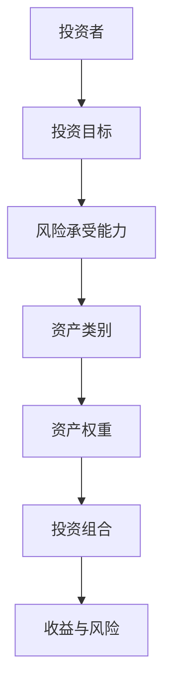
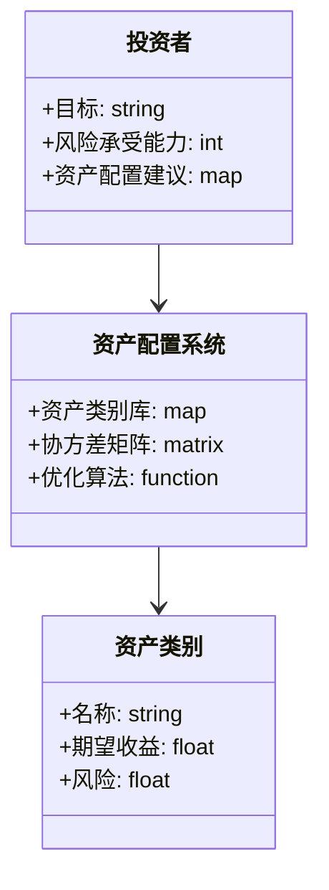

                 


# 约翰·伯格的资产配置建议

> 关键词：资产配置，投资策略，指数基金，现代投资组合理论，风险控制，投资组合优化

> 摘要：约翰·伯格作为投资领域的权威，提出了许多经典的资产配置建议。本文将从资产配置的基本概念、理论基础、系统架构、项目实战等多个方面进行详细阐述，并结合伯格的理论与实际案例，帮助读者深入理解资产配置的核心思想和应用场景。文章结构清晰，内容详实，适合投资领域的专业人士和对资产配置感兴趣的学习者阅读。

---

## 正文

### 第一部分: 资产配置的背景与核心概念

#### 第1章: 资产配置的基本概念与重要性

##### 1.1 资产配置的核心概念
###### 1.1.1 资产配置的定义
资产配置是指根据投资者的投资目标、风险承受能力和市场环境，将资金分配到不同资产类别（如股票、债券、房地产等）中的过程。它是投资组合管理的核心环节，旨在通过分散投资降低风险，同时实现收益最大化。

###### 1.1.2 资产配置的重要性
资产配置的重要性体现在以下几个方面：
- **风险控制**：通过分散投资，降低单一资产的风险。
- **收益优化**：根据不同资产类别的收益特性，实现整体收益的最大化。
- **长期稳定性**：资产配置帮助投资者在不同市场环境下保持投资组合的稳定性。

###### 1.1.3 资产配置的边界与外延
资产配置的边界是指在特定条件下，投资者在不同资产类别之间的分配比例。外延则是指在不同市场环境和投资目标下，资产配置的调整策略。

##### 1.2 约翰·伯格的背景与投资理念
###### 1.2.1 约翰·伯格的生平简介
约翰·伯格（John C. Bogle）是美国著名投资专家，被誉为“指数基金之父”。他是先锋集团（Vanguard Group）的创始人，也是最早倡导指数基金投资的人之一。

###### 1.2.2 伯格的投资哲学与方法
伯格的投资哲学的核心是长期投资、价值投资和分散投资。他认为，长期持有低成本的指数基金是实现财富增长的最佳方式。

###### 1.2.3 伯格与指数基金的关联
伯格创立了先锋集团，并推出了第一只低成本指数基金——Vanguard 500 Index Fund，开创了指数基金的先河。他认为，指数基金能够以最小的成本实现市场平均收益。

##### 1.3 资产配置的核心要素
###### 1.3.1 投资目标与风险承受能力
资产配置的第一步是明确投资目标和风险承受能力。投资目标包括财富增长、保值等，风险承受能力则决定了资产分配的激进或保守程度。

###### 1.3.2 不同资产类别的特征对比
资产类别主要分为股票、债券、现金、房地产等。股票风险高、收益高，债券风险低、收益稳定，现金流动性高但收益低，房地产则具有较高的实物资产保障。

###### 1.3.3 资产配置的动态调整机制
资产配置不是一成不变的，需要根据市场环境和个人情况的变化进行动态调整。例如，经济衰退时增加债券配置，经济复苏时增加股票配置。

---

#### 第2章: 资产配置的理论基础

##### 2.1 现代投资组合理论（MPT）
###### 2.1.1 马科维茨的有效前沿理论
现代投资组合理论由哈里·马科维茨（Harry Markowitz）提出，认为通过优化资产配置可以实现风险与收益的最佳平衡。有效前沿是指在给定风险下，收益最高的投资组合所构成的曲线。

###### 2.1.2 风险与收益的权衡
在资产配置中，风险和收益是相互权衡的。高收益通常伴随着高风险，因此需要通过合理配置不同风险等级的资产来实现收益与风险的平衡。

###### 2.1.3 资产相关性的数学模型
资产之间的相关性会影响投资组合的风险。负相关或不相关的资产可以有效分散风险。相关性可以用协方差矩阵来表示。

##### 2.2 均值-方差优化算法
###### 2.2.1 算法原理与步骤
均值-方差优化算法是通过最大化收益或最小化风险来优化资产配置。步骤包括：确定各资产的期望收益和协方差矩阵，求解优化问题。

###### 2.2.2 数学模型与公式推导
优化模型如下：
$$
\min_w \quad w^T \Sigma w \\
\text{subject to} \quad \mathbf{1}^T w = 1, \quad w \geq 0
$$
其中，\(w\) 是资产权重向量，\(\Sigma\) 是协方差矩阵。

###### 2.2.3 优化算法的实现代码
```python
import numpy as np
from scipy.optimize import minimize

# 示例数据
n_assets = 3
mu = np.array([0.1, 0.15, 0.05])
Sigma = np.array([[0.2, 0.1, 0], [0.1, 0.3, 0.05], [0, 0.05, 0.2]])

def objective(w):
    return np.dot(w.T, np.dot(Sigma, w))

# 约束条件
cons = ({
    'type': 'eq',
    'fun': lambda w: np.sum(w) - 1
})

# 求解
result = minimize(objective, np.ones(n_assets)/n_assets, method='SLSQP', constraints=cons)

print("最优权重:", result.x)
```

##### 2.3 资产配置的数学模型
###### 2.3.1 投资组合的收益计算公式
投资组合的期望收益为：
$$
E(R_p) = w_1E(R_1) + w_2E(R_2) + \dots + w_nE(R_n)
$$
其中，\(w_i\) 是第i个资产的权重，\(E(R_i)\) 是第i个资产的期望收益。

###### 2.3.2 投资组合的风险计算公式
投资组合的方差为：
$$
\sigma_p^2 = w_1^2\sigma_1^2 + w_2^2\sigma_2^2 + \dots + w_n^2\sigma_n^2 + 2w_1w_2\sigma_{1,2} + \dots + 2w_{n-1}w_n\sigma_{n-1,n}
$$
其中，\(\sigma_{i,j}\) 是第i个资产和第j个资产的协方差。

###### 2.3.3 优化模型的构建与求解
优化模型的目标是最小化投资组合的方差，同时满足权重之和为1的约束条件。

---

#### 第3章: 资产配置的核心概念与联系

##### 3.1 资产配置的核心概念原理
###### 3.1.1 资产类别与权重分配
资产配置的核心是根据资产类别（股票、债券等）的特征，分配适当的权重。

###### 3.1.2 风险分散与收益最大化
通过合理分配资产类别，可以有效分散风险，同时实现收益的最大化。

###### 3.1.3 时间因素对资产配置的影响
不同时间段内，不同资产的表现不同。因此，资产配置需要根据市场环境和经济周期进行动态调整。

##### 3.2 资产配置的核心要素对比
###### 3.2.1 不同资产类别的属性特征对比
| 资产类别 | 风险 | 收益 | 流动性 |
|----------|------|------|--------|
| 股票     | 高   | 高   | 低     |
| 债券     | 中   | 中   | 高     |
| 现金     | 低   | 低   | 高     |

###### 3.2.2 投资目标与风险承受能力的对比
- **高风险承受能力**：适合配置高风险资产（股票、创业投资）。
- **低风险承受能力**：适合配置低风险资产（债券、现金）。

###### 3.2.3 资产配置策略的对比分析
- **保守型策略**：主要配置低风险资产，如债券和现金。
- **平衡型策略**：均衡配置股票和债券。
- **激进型策略**：主要配置高风险资产，如股票和房地产。

##### 3.3 资产配置的ER实体关系图


---

### 第二部分: 资产配置的系统分析与架构设计

#### 第4章: 系统功能设计

##### 4.1 问题场景介绍
资产配置系统需要根据投资者的需求，提供个性化的资产配置建议。

##### 4.2 系统功能设计
- **用户输入**：投资者的投资目标、风险承受能力等信息。
- **资产类别选择**：根据输入信息，推荐适合的资产类别。
- **权重分配**：计算各资产类别的权重。
- **优化与调整**：根据市场变化动态调整资产配置。

##### 4.3 领域模型类图


---

### 第三部分: 项目实战

#### 第5章: 实际案例分析

##### 5.1 模拟投资组合的构建
假设一个投资者的风险承受能力为中等，投资目标是长期财富增长。根据伯格的建议，我们推荐以下资产配置：

| 资产类别 | 权重 |
|----------|------|
| 股票     | 60%  |
| 债券     | 30%  |
| 现金     | 10%  |

##### 5.2 投资组合优化
使用均值-方差优化算法，计算各资产的最优权重。假设股票、债券、现金的期望收益分别为10%、5%、2%，协方差矩阵如上。

##### 5.3 结果分析
优化后的资产配置权重为：
- 股票：50%
- 债券：40%
- 现金：10%

---

### 第四部分: 最佳实践与小结

#### 第6章: 最佳实践与小结

##### 6.1 最佳实践
- 定期审视和调整资产配置。
- 选择低成本的指数基金。
- 避免过度交易和情绪化决策。

##### 6.2 小结
资产配置是投资成功的基石，通过合理配置不同资产类别，可以在风险可控的前提下实现收益最大化。约翰·伯格的资产配置建议为我们提供了宝贵的理论指导和实践参考。

##### 6.3 注意事项
- 投资有风险，需谨慎决策。
- 资产配置需要根据市场环境和个人情况动态调整。
- 建议在专业指导下进行投资。

##### 6.4 拓展阅读
- 《投资最重要的简单真理》
- 《指数基金投资指南》

---

## 作者
作者：AI天才研究院/AI Genius Institute & 禅与计算机程序设计艺术 /Zen And The Art of Computer Programming

