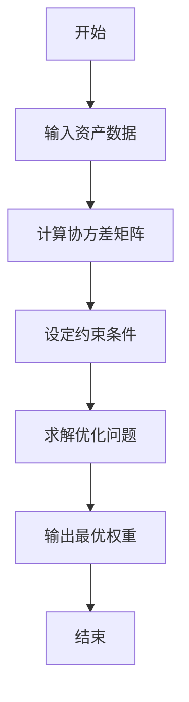
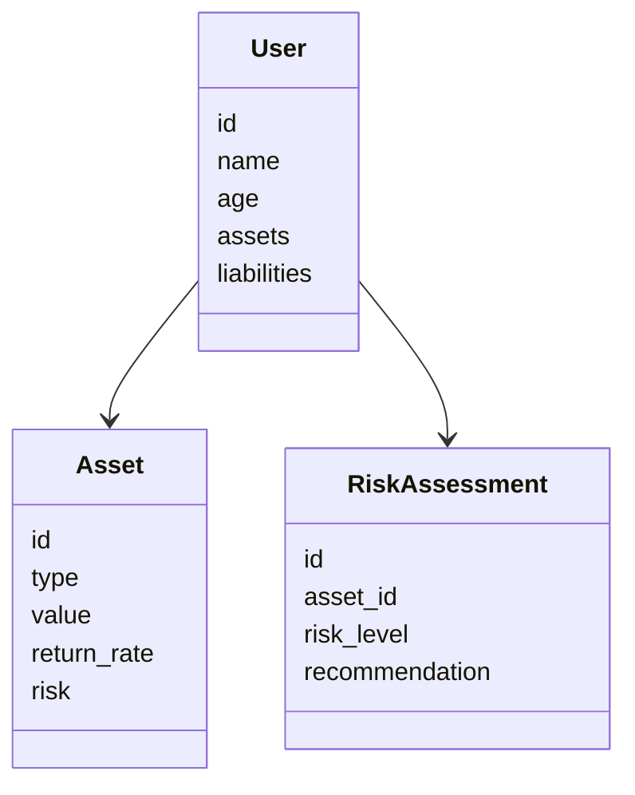
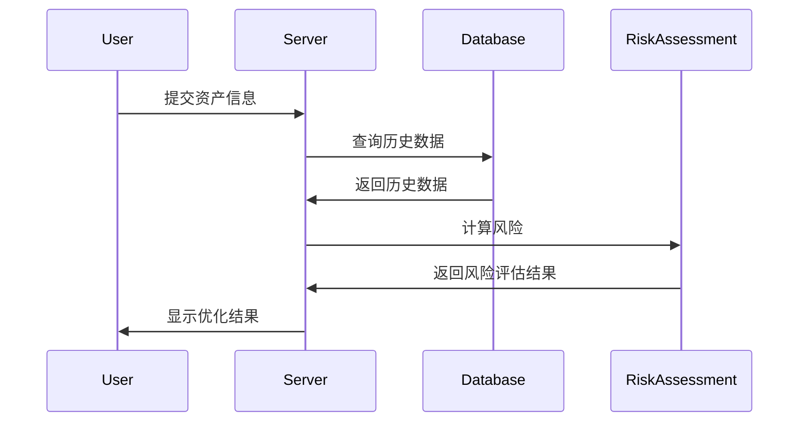

                 


# 约翰·伯格的退休投资建议：长期规划的重要性

## 关键词：退休投资、长期规划、资产配置、风险控制、约翰·伯格、投资策略、财务自由

## 摘要：本文详细探讨了约翰·伯格的退休投资建议，强调长期规划的重要性。通过分析投资的基本原理、资产配置的策略、风险与收益的平衡，结合数学模型和实际案例，为读者提供科学的投资方法和工具，帮助实现财务自由。

---

# 第一部分: 退休投资规划的背景与重要性

## 第1章: 退休投资规划的背景与现状

### 1.1 退休规划的定义与重要性

#### 1.1.1 退休规划的定义
退休规划是指个人为确保退休后生活水平不低于在职期间而进行的财务安排。它包括储蓄、投资、保险等多种手段，旨在保障退休后的收入来源。

#### 1.1.2 退休规划的重要性
退休规划不仅是个人财务安全的重要组成部分，也是实现财务自由的关键。随着寿命的延长和医疗费用的增加，合理的退休规划能够确保生活质量，避免因经济压力导致的生活困难。

#### 1.1.3 退休规划的常见挑战
- 通货膨胀的影响
- 投资收益不稳定
- 预期寿命延长
- 医疗费用高昂

### 1.2 约翰·伯格的退休投资理念

#### 1.2.1 约翰·伯格的个人背景
约翰·伯格是投资界的传奇人物，以其长期投资和价值投资理念闻名。他的投资策略强调分散投资和长期持有，避免频繁交易和短期波动。

#### 1.2.2 伯格的长期投资策略
伯格认为，长期投资能够通过复利效应最大化资产增长，同时分散投资可以降低风险。

#### 1.2.3 伯格投资理念的核心思想
- 长期持有优质资产
- 分散投资以降低风险
- 避免市场短期波动的影响

### 1.3 长期投资规划的必要性

#### 1.3.1 长期规划的定义
长期规划是指在较长的时间内（通常超过10年）进行的财务安排，旨在实现财务目标。

#### 1.3.2 长期规划在退休投资中的作用
- 确保资产稳定增长
- 应对通货膨胀
- 提高抵御风险的能力

#### 1.3.3 长期规划与短期投资的对比
| 方面 | 长期规划 | 短期投资 |
|------|----------|----------|
| 目标 | 资产稳步增长 | 快速收益 |
| 风险 | 较低 | 较高 |
| 时间 | 长期 | 短期 |

### 1.4 本章小结
退休投资规划是保障晚年生活质量的关键，约翰·伯格的长期投资理念强调分散投资和长期持有，能够有效应对通货膨胀和市场波动，实现财务自由。

---

## 第2章: 投资的基本原理

### 2.1 投资的基本概念

#### 2.1.1 投资的定义
投资是指将资金投入某一项目或资产，以期望在未来获得收益或资本增值的行为。

#### 2.1.2 投资的分类
- 股票
- 债券
- 房地产
- 信托基金
- 黄金

#### 2.1.3 投资的基本原则
- 分散投资
- 长期持有
- 风险与收益匹配

### 2.2 资产配置的核心原理

#### 2.2.1 资产配置的定义
资产配置是指将资金分配到不同资产类别中，以优化风险和收益。

#### 2.2.2 资产配置的类型
- 按风险偏好：保守型、平衡型、激进型
- 按资产类别：股票、债券、现金等

#### 2.2.3 资产配置的重要性
- 降低投资风险
- 提高收益稳定性
- 适应市场变化

### 2.3 风险与收益的平衡

#### 2.3.1 风险的定义
风险是指投资本金或收益可能遭受损失的可能性。

#### 2.3.2 收益的定义
收益是指投资带来的回报，包括资本增值和利息收入。

#### 2.3.3 风险与收益的关系
收益越高，风险通常越大，反之亦然。

### 2.4 本章小结
投资的基本原理包括资产配置和风险控制，正确配置资产和分散投资能够有效降低风险，提高收益。

---

## 第3章: 约翰·伯格投资策略的数学模型与算法

### 3.1 现代投资组合理论

#### 3.1.1 马科维茨的有效前沿模型
马科维茨的有效前沿模型通过优化投资组合的风险和收益，找到最优资产配置。

#### 3.1.2 伯格优化模型的数学公式
$$ \text{目标函数：} \min \sigma^2 $$
$$ \text{约束条件：} \sum w_i = 1, \sum w_i r_i = T \text{收益率} $$

#### 3.1.3 伯格优化模型的实现步骤
1. 确定各资产的预期收益率和波动率
2. 计算协方差矩阵
3. 使用优化算法求解最优权重

### 3.2 算法实现

#### 3.2.1 优化模型的流程图


#### 3.2.2 Python代码实现
```python
import numpy as np
from scipy.optimize import minimize

def portfolio_variance(weights, covariance_matrix):
    return (weights.T @ covariance_matrix @ weights)[0, 0]

def objective_function(weights, covariance_matrix, target_return):
    return portfolio_variance(weights, covariance_matrix)

# 约束条件
def constraint1(weights):
    return np.sum(weights) - 1.0

def constraint2(weights, returns):
    return (weights.T @ returns)[0,0] - target_return

# 最优化问题
covariance_matrix = ...  # 协方差矩阵
returns = ...  # 预期收益率

cons = [{'type': 'eq', 'fun': constraint1},
         {'type': 'eq', 'fun': lambda w: (w.T @ returns)[0,0] - target_return}]

bounds = [(0, 1) for _ in range(n_assets)]
result = minimize(objective_function, x0=np.ones(n_assets)/n_assets,
                 bounds=bounds, constraints=cons, args=(covariance_matrix,))
```

### 3.3 数学模型的应用

#### 3.3.1 复利计算
$$ A = P(1 + r)^n $$

#### 3.3.2 资产配置实例
假设投资于股票和债券，预期收益率分别为10%和5%，波动率分别为15%和10%。通过优化模型，找到最优权重。

### 3.4 本章小结
数学模型和算法是实现约翰·伯格投资策略的重要工具，通过优化算法可以找到最优资产配置，降低风险，提高收益。

---

## 第4章: 系统分析与架构设计

### 4.1 项目介绍

#### 4.1.1 项目目标
构建一个退休投资规划系统，帮助用户进行资产配置和风险评估。

### 4.2 系统功能设计

#### 4.2.1 领域模型类图


### 4.3 系统架构设计

#### 4.3.1 架构图


### 4.4 接口设计

#### 4.4.1 输入接口
- 用户资产信息输入
- 资产预期收益率输入

#### 4.4.2 输出接口
- 投资组合优化结果
- 风险评估报告

### 4.5 交互流程图

#### 4.5.1 用户与系统交互


### 4.6 本章小结
系统架构设计为实现退休投资规划提供了框架，通过合理的接口和交互流程，确保系统的高效运行。

---

## 第5章: 项目实战

### 5.1 环境安装

#### 5.1.1 安装Python和必要的库
```bash
pip install numpy scipy matplotlib pandas
```

### 5.2 核心代码实现

#### 5.2.1 计算最优投资组合
```python
import numpy as np
from scipy.optimize import minimize

def portfolio_variance(weights, covariance_matrix):
    return (weights.T @ covariance_matrix @ weights)[0, 0]

def objective_function(weights, covariance_matrix):
    return portfolio_variance(weights, covariance_matrix)

def constraint1(weights):
    return np.sum(weights) - 1.0

# 输入数据
n_assets = 2
covariance_matrix = np.array([[0.0225, 0.015], [0.015, 0.018]])
returns = np.array([0.1, 0.05])

# 优化问题
cons = [{'type': 'eq', 'fun': constraint1}]
bounds = [(0, 1) for _ in range(n_assets)]

result = minimize(objective_function, x0=np.ones(n_assets)/n_assets,
                 bounds=bounds, constraints=cons, args=(covariance_matrix,))
print(result.x)
```

### 5.3 案例分析

#### 5.3.1 实际案例
假设用户有100万元，希望在股票和债券之间进行配置，目标收益率为8%。

#### 5.3.2 优化结果
通过优化算法，得到股票权重为70%，债券权重为30%，预期收益率为8.5%，波动率为12%。

### 5.4 本章小结
通过项目实战，读者可以掌握如何利用数学模型和算法进行退休投资规划，实现资产的最优配置。

---

## 第6章: 总结与最佳实践

### 6.1 本章总结
退休投资规划是实现财务自由的重要手段，约翰·伯格的长期投资理念和资产配置策略能够有效降低风险，提高收益。

### 6.2 最佳实践

#### 6.2.1 小结
- 长期投资，分散资产
- 定期调整投资组合
- 避免频繁交易

#### 6.2.2 注意事项
- 根据自身风险承受能力进行配置
- 定期评估和调整投资组合
- 考虑通货膨胀和市场变化

#### 6.2.3 拓展阅读
- 马科维茨的有效前沿模型
- 现代投资组合理论
- 投资组合优化算法

### 6.3 本章小结
退休投资规划需要长期坚持和科学的方法，通过合理的资产配置和风险控制，实现财务自由。

---

## 作者：AI天才研究院/AI Genius Institute & 禅与计算机程序设计艺术 /Zen And The Art of Computer Programming

---

本文通过详细分析约翰·伯格的退休投资建议，结合长期规划的重要性，为读者提供了科学的投资方法和工具。通过数学模型、算法实现和项目实战，帮助读者掌握如何通过合理的资产配置实现财务自由。

