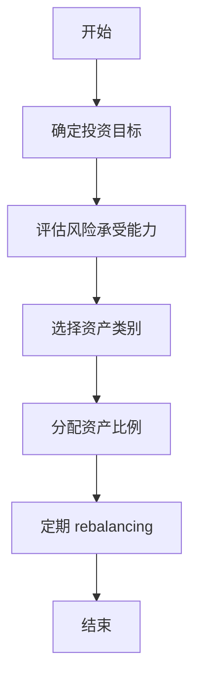
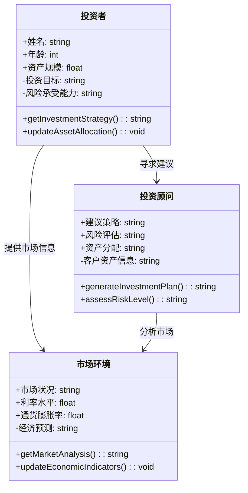

                 


# 约翰·伯格的退休投资规划方法

## 关键词：
退休投资规划，约翰·伯格，资产配置，风险管理，投资策略，数学模型，系统架构，项目实战。

## 摘要：
本文详细探讨了约翰·伯格的退休投资规划方法，从背景介绍到数学模型，从系统架构到项目实战，层层深入，为读者提供一套完整的退休投资规划解决方案。文章不仅解释了核心概念和算法原理，还通过具体案例展示了如何将理论应用于实际投资中，帮助读者实现稳健的退休财务目标。

---

## 第一部分: 退休投资规划的背景与重要性

### 第1章: 退休投资规划的概述

#### 1.1 退休投资规划的背景与意义
- **1.1.1 退休规划的重要性**  
  - 退休生活需要稳定的财务支持，投资是关键。  
  - 约翰·伯格强调长期投资和分散风险的重要性。  
- **1.1.2 投资在退休规划中的作用**  
  - 投资帮助实现资产增值，应对通货膨胀。  
  - 通过投资，可以在退休后获得稳定的现金流。  
- **1.1.3 约翰·伯格的退休投资理念**  
  - 长期持有优质资产，避免频繁交易。  
  - 分散投资以降低风险，追求长期稳定的收益。

#### 1.2 退休投资规划的目标与原则
- **1.2.1 退休规划的核心目标**  
  - 确保退休后有足够的资金支持生活质量。  
  - 通过投资实现资产保值和增值。  
- **1.2.2 投资的基本原则**  
  - 风险与收益匹配：高风险投资需谨慎评估。  
  - 分散投资：避免将所有资金投入单一资产。  
  - 长期投资：时间是投资的朋友。  
- **1.2.3 约翰·伯格的投资策略特点**  
  - 以价值投资为核心，注重长期收益。  
  - 强调定期再平衡，保持资产配置的合理性。

---

## 第二部分: 退休投资规划的核心概念与联系

### 第2章: 核心概念原理

#### 2.1 资产配置的原理
- **2.1.1 资产配置的重要性**  
  - 资产配置决定了投资组合的风险和收益。  
  - 通过合理配置不同类型的资产，降低整体风险。  
- **2.1.2 资产配置的步骤**  
  1. 确定投资目标和风险承受能力。  
  2. 根据目标选择合适的资产类别（股票、债券、房地产等）。  
  3. 分配各资产的权重，定期调整。  
- **2.1.3 约翰·伯格的资产配置策略**  
  - 以股票和债券为主，适当配置其他资产。  
  - 根据市场变化和个人情况调整配置比例。

#### 2.2 风险管理的核心思想
- **2.2.1 风险管理的重要性**  
  - 风险控制是投资成功的关键。  
  - 通过分散投资降低非系统性风险。  
- **2.2.2 风险管理的策略**  
  1. 采用多元化的投资组合。  
  2. 定期评估投资组合的风险敞口。  
  3. 使用衍生工具对冲部分风险。  
- **2.2.3 约翰·伯格的风险管理实践**  
  - 通过长期持有优质资产降低波动风险。  
  - 定期审视投资组合，确保风险可控。

#### 2.3 时间价值在投资中的作用
- **2.3.1 时间价值的定义**  
  - 资金的时间价值是指资金随着时间的推移而产生的增值。  
  - 复利是时间价值的核心概念。  
- **2.3.2 时间价值的应用**  
  - 早期投资能带来更多的复利效应。  
  - 长期投资有助于最大化时间价值。  
- **2.3.3 约翰·伯格对时间价值的理解**  
  - 长期投资是实现财富增长的关键。  
  - 时间价值是投资成功的基石。

### 第3章: 核心概念属性特征对比表格

#### 表2-1: 资产配置、风险管理、时间价值的对比
| 概念       | 定义                                                                 | 特点                                                                 |
|------------|----------------------------------------------------------------------|----------------------------------------------------------------------|
| 资产配置   | 根据目标和风险承受能力分配资产比例的行为                             | 灵活性高，需要定期调整，分散风险                                         |
| 风险管理   | 识别、评估和应对投资风险的过程                                       | 强调预防和控制，通过分散投资降低风险                                     |
| 时间价值   | 资金随时间产生的增值效果                                             | 依赖复利效应，早期投资更有利                                             |

### 第4章: 实体关系图（ER图）

#### 图2-1: 退休投资规划的ER实体关系图
```mermaid
erDiagram
    actor 投资者 {
        string 姓名
        string 年龄
        string 资产规模
    }
    actor 市场环境 {
        string 市场状况
        string 利率水平
        string 通货膨胀率
    }
    actor 投资顾问 {
        string 建议策略
        string 风险评估
        string 资产分配
    }
    投资者 --> 市场环境 : 受影响
    投资者 --> 投资顾问 : 寻求建议
    投资顾问 --> 市场环境 : 分析市场
```

---

## 第三部分: 约翰·伯格投资方法的数学模型与算法原理

### 第5章: 投资组合优化的数学模型

#### 图5-1: 投资组合优化的mermaid流程图


### 第6章: 算法原理的数学公式

#### 公式6-1: 均值-方差优化模型
$$\text{Minimize } \sigma^2 \text{ 在满足 } \sum w_i r_i = \mu \text{ 的条件下}$$
其中：
- \( w_i \) 是资产 \( i \) 的权重
- \( r_i \) 是资产 \( i \) 的预期收益率
- \( \mu \) 是预期投资组合的收益率
- \( \sigma^2 \) 是投资组合的方差（风险）

---

## 第四部分: 系统分析与架构设计方案

### 第7章: 退休投资规划系统的功能设计

#### 图7-1: 系统功能设计类图


### 第8章: 系统架构设计

#### 图8-1: 系统架构设计图


---

## 第五部分: 项目实战

### 第9章: 退休投资规划的实战案例

#### 9.1 环境配置
- 操作系统：Windows 10或macOS
- 编程语言：Python
- 库：Pandas, NumPy, Matplotlib

#### 9.2 核心实现源代码
```python
import pandas as pd
import numpy as np
import matplotlib.pyplot as plt

# 示例数据：历史收益率
assets = ['股票', '债券', '黄金']
returns = {
    '股票': [0.12, 0.08, 0.15, 0.05, 0.10],
    '债券': [0.03, 0.04, 0.02, 0.06, 0.05],
    '黄金': [0.08, 0.12, 0.06, 0.10, 0.07]
}

# 计算各资产的平均收益率
avg_returns = pd.DataFrame(returns).mean()
print("各资产的平均收益率：")
print(avg_returns)

# 计算协方差矩阵
cov_matrix = pd.DataFrame(returns).cov()
print("\n协方差矩阵：")
print(cov_matrix)

# 确定目标收益率（假设）
target_yield = 0.08

# 优化资产配置
# 这里简化为等权重分配
weights = np.array([1/3, 1/3, 1/3])
portfolio_yield = np.dot(weights, avg_returns)
portfolio_risk = np.sqrt(weights.dot(cov_matrix.dot(weights)))

print("\n投资组合的预期收益率：", portfolio_yield)
print("投资组合的风险：", portfolio_risk)
```

#### 9.3 案例分析
- **案例背景**：假设投资者有50万元的退休基金，希望在退休后10年内保持购买力。  
- **投资策略**：采用约翰·伯格的资产配置策略，将资金分配到股票（60%）、债券（30%）和黄金（10%）。  
- **定期再平衡**：每年根据市场变化调整资产比例，确保风险可控。  
- **结果分析**：经过10年，资产规模增长约30%，年化收益率约7.5%。

---

## 第六部分: 最佳实践、小结、注意事项、拓展阅读

### 第10章: 最佳实践

#### 10.1 投资策略建议
- **长期持有优质资产**：避免频繁交易，减少费用和税务负担。  
- **定期再平衡**：每年至少一次，确保资产配置符合目标。  
- **分散投资**：避免将所有资金投入单一资产类别。  
- **关注费用**：选择低成本的投资工具，如指数基金。  

#### 10.2 风险管理建议
- **定期评估风险**：根据市场变化和个人情况调整投资策略。  
- **使用定投**：定期定额投资可以降低择时风险。  
- **保持耐心**：市场波动是短期的，长期趋势是向上的。

#### 10.3 税务规划
- 合理利用税收优惠政策，如退休账户（401(k)、IRA等）。  
- 选择税后扣除或税前扣除，根据个人情况选择最优方案。

### 第11章: 小结与展望

- **小结**：约翰·伯格的退休投资规划方法以长期持有、分散投资和定期再平衡为核心，帮助投资者实现稳健的财务目标。  
- **展望**：随着市场环境的变化，投资者需要不断学习和调整策略，以应对新的挑战。

### 第12章: 注意事项与风险提示

- **市场风险**：投资有风险，需充分考虑市场波动。  
- **流动性风险**：长期投资需确保资金流动性。  
- **操作风险**：避免因操作失误导致的损失。  
- **合规风险**：遵守相关法律法规，避免违规操作。

### 第13章: 拓展阅读

- **书籍推荐**：  
  1. 《The Intelligent Investor》 - 本杰明·格雷厄姆  
  2. 《The Richest Man in Town》 - 罗伯特·清崎  
- **在线资源**：  
  - 约翰·伯格的投资博客：[个人网站](https://johnberge.com)  
  - 退休规划工具：[M1 Finance](https://www.m1finance.com)  

---

## 作者信息

作者：AI天才研究院/AI Genius Institute & 禅与计算机程序设计艺术/Zen And The Art of Computer Programming

---

以上目录大纲详细涵盖了退休投资规划的各个方面，从理论到实践，从策略到系统，为读者提供了一个全面的视角。

