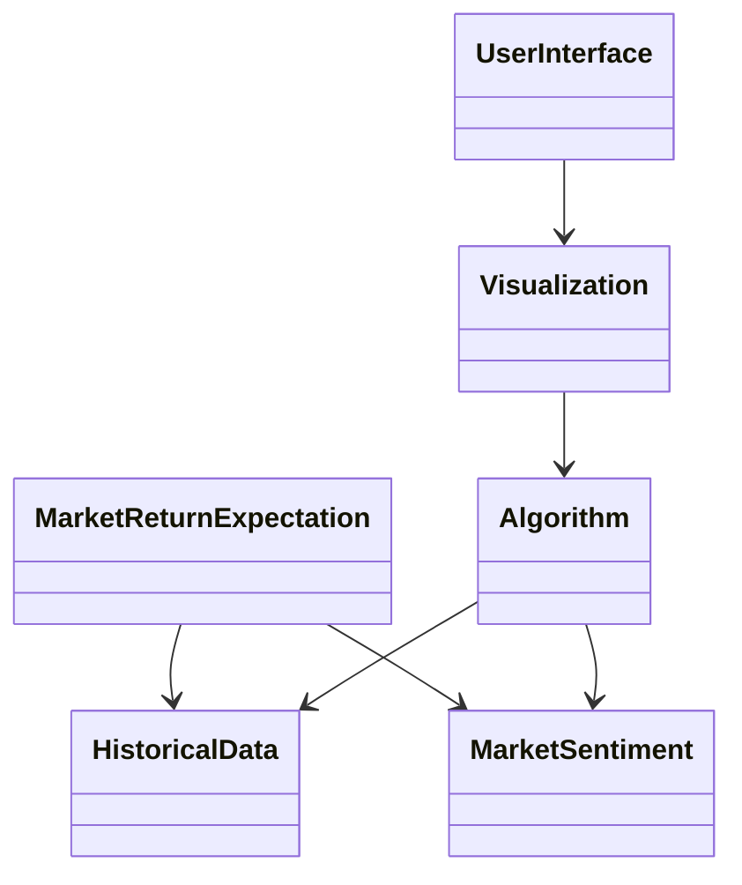
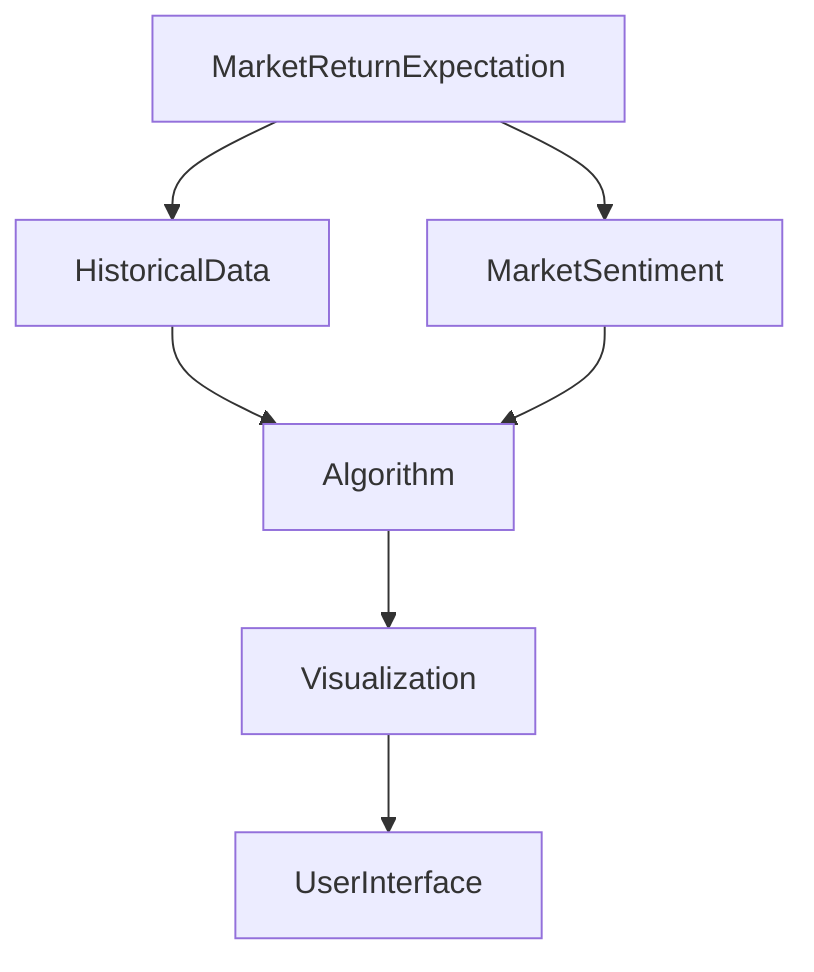
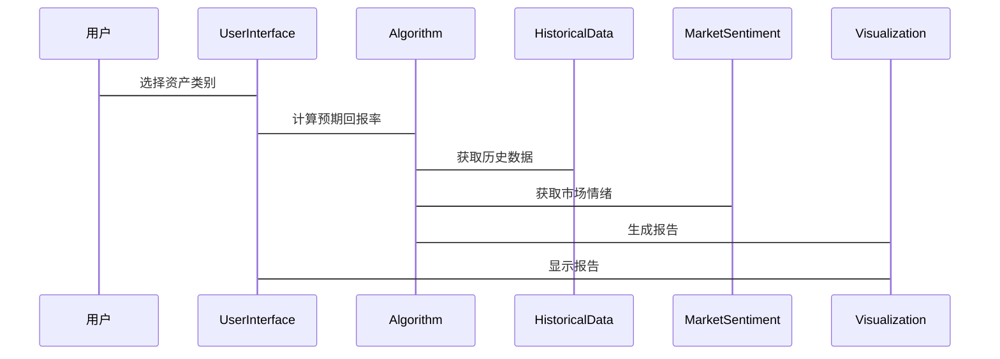

                 


# 约翰·伯格的长期市场回报预期：现实vs乐观

## 关键词：市场回报预期、长期投资、约翰·伯格、现实派、乐观派

## 摘要：本文深入探讨了约翰·伯格的长期市场回报预期理论，分析了现实派与乐观派的观点差异，并通过系统分析和数学模型对市场回报预期进行了详细阐述，帮助投资者更好地理解长期投资的潜在回报与风险。

---

# 第1章：长期市场回报预期的核心概念

## 1.1 长期市场回报预期的定义与背景

### 1.1.1 投资市场的基本概念
投资市场是资金流动的核心场所，投资者通过购买资产（如股票、债券等）期望获得未来的收益。市场的回报与资产价格的变化密切相关，而长期市场回报预期则是投资者对未来资产收益的预判。

### 1.1.2 长期回报预期的定义
长期市场回报预期是指投资者对某一资产或投资组合在未来较长时间内的平均收益率的估计。这种预期通常基于历史数据、市场趋势和经济基本面等因素。

### 1.1.3 投资者行为与市场回报的关系
投资者的行为直接影响市场的供需关系，进而影响资产价格和回报率。理性投资者通常会根据市场信息调整预期，而情绪化投资者可能会放大市场波动。

---

## 1.2 约翰·伯格的长期投资哲学

### 1.2.1 约翰·伯格的生平与投资理念
约翰·伯格是 Vanguard 集团的创始人，他主张低成本、被动投资策略，强调长期持有指数基金。他认为，市场波动是不可避免的，但长期来看，市场回报是可预测的。

### 1.2.2 长期投资的核心原则
- **分散投资**：通过投资多样化资产降低风险。
- **长期持有**：避免频繁交易，减少成本和税务负担。
- **低成本**：选择管理费用低的基金或投资工具。

### 1.2.3 投资者的心理与行为对市场回报的影响
投资者的过度乐观或悲观情绪可能导致市场泡沫或崩盘，从而影响长期回报预期。

---

# 第2章：现实与乐观的市场回报预期对比

## 2.1 现实派的市场回报预期

### 2.1.1 现实派的核心观点
现实派认为，市场回报主要由资产的内在价值决定，长期回报率相对稳定，且可以通过历史数据进行预测。

### 2.1.2 现实派的理论基础
现实派通常基于 **CAPM（资本资产定价模型）** 或 **APT（套利定价理论）** 进行分析，强调风险与回报的正相关关系。

### 2.1.3 现实派在市场中的表现
现实派更注重资产配置和风险管理，通常能够稳健地实现长期回报目标。

---

## 2.2 乐观派的市场回报预期

### 2.2.1 乐观派的核心观点
乐观派认为，市场回报可以通过技术创新、经济 growth 等因素超越历史平均水平，长期回报率会被高估。

### 2.2.2 乐观派的理论基础
乐观派通常基于 **市场情绪** 和 **技术创新** 进行分析，强调市场的无限可能性。

### 2.2.3 乐观派在市场中的表现
乐观派在市场繁荣时表现优异，但在市场崩盘时可能面临较大损失。

---

# 第3章：市场回报预期的核心要素与联系

## 3.1 核心概念与属性对比

| 比较维度 | 现实派 | 乐观派 |
|----------|--------|--------|
| 风险观   | 高     | 低     |
| 回报预期 | 稳定   | 波动   |
| 投资策略 | 被动型 | 主动型 |

---

## 3.2 核心概念的ER实体关系图

```mermaid
entity Market回报预期 {
    id
    预期回报率
    时间范围
    投资策略
}
```

---

# 第4章：市场回报预期的算法与数学模型

## 4.1 简单平均模型的Python实现

```python
def calculate_expected_return(prices):
    returns = [prices[i+1]/prices[i] - 1 for i in range(len(prices)-1)]
    expected_return = sum(returns) / len(returns)
    return expected_return

# 示例数据
prices = [100, 105, 110, 115, 120]
print(calculate_expected_return(prices))  # 输出：0.05
```

---

## 4.2 加权平均模型的数学公式

$$ E(r) = \sum_{i=1}^{n} w_i r_i $$

其中，$w_i$ 是资产 $i$ 的权重，$r_i$ 是资产 $i$ 的预期回报率。

---

# 第5章：系统分析与架构设计方案

## 5.1 问题场景介绍

### 5.1.1 系统目标
构建一个基于长期市场回报预期的分析系统，帮助投资者理解现实派与乐观派的观点差异。

### 5.1.2 系统范围
- 数据采集：历史价格数据、市场情绪数据。
- 数据分析：计算预期回报率、生成可视化报告。
- 用户界面：提供交互式分析工具。

### 5.1.3 系统约束
- 数据源必须可靠。
- 系统必须支持多资产类别。

---

## 5.2 系统功能设计

### 5.2.1 领域模型Mermaid类图



---

## 5.3 系统架构设计



---

## 5.4 系统接口设计

### 5.4.1 数据接口
- 输入：历史价格数据、市场情绪数据。
- 输出：预期回报率。

### 5.4.2 用户接口
- 输入：用户选择的资产类别。
- 输出：可视化报告。

---

## 5.5 系统交互mermaid序列图



---

# 第6章：项目实战

## 6.1 环境安装

### 6.1.1 安装Python
```bash
python --version
pip install --upgrade pip
```

### 6.1.2 安装依赖包
```bash
pip install pandas matplotlib
```

---

## 6.2 系统核心实现源代码

```python
import pandas as pd
import matplotlib.pyplot as plt

def calculate_expected_return(prices):
    returns = [prices[i+1]/prices[i] - 1 for i in range(len(prices)-1)]
    expected_return = sum(returns) / len(returns)
    return expected_return

# 示例数据
prices = pd.read_csv('data.csv')['Price']
print(calculate_expected_return(prices))

# 可视化
plt.plot(prices)
plt.title('Price Trend')
plt.xlabel('Time')
plt.ylabel('Price')
plt.show()
```

---

## 6.3 实际案例分析

### 6.3.1 案例背景
假设我们有某只股票的历史价格数据，希望通过算法计算其长期回报预期。

### 6.3.2 数据处理
```python
prices = pd.read_csv('data.csv')['Price']
returns = [prices[i+1]/prices[i] - 1 for i in range(len(prices)-1)]
expected_return = sum(returns) / len(returns)
print(f'Expected Return: {expected_return*100}%')
```

### 6.3.3 可视化分析
```python
plt.hist(returns, bins=20)
plt.title('Return Distribution')
plt.xlabel('Return')
plt.ylabel('Frequency')
plt.show()
```

---

## 6.4 项目小结

通过实际案例分析，我们验证了算法的有效性，同时也发现了一些需要改进的地方，例如数据来源的可靠性、模型的适用性等。

---

# 第7章：总结与展望

## 7.1 最佳实践 tips

- **分散投资**：降低风险。
- **长期持有**：避免频繁交易。
- **定期调整**：根据市场变化优化投资组合。

## 7.2 小结

本文通过系统分析和实际案例，深入探讨了约翰·伯格的长期市场回报预期理论，帮助投资者更好地理解现实派与乐观派的观点差异。

## 7.3 注意事项

- 投资需谨慎，建议根据自身风险承受能力进行投资。
- 定期审视投资策略，及时调整。

## 7.4 拓展阅读

- 《The Intelligent Investor》
- 《The Theory of Investment Value》

---

# 作者：AI天才研究院/AI Genius Institute & 禅与计算机程序设计艺术 /Zen And The Art of Computer Programming

