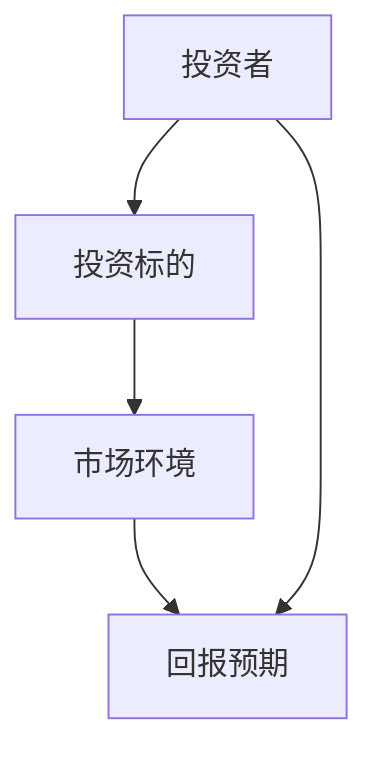
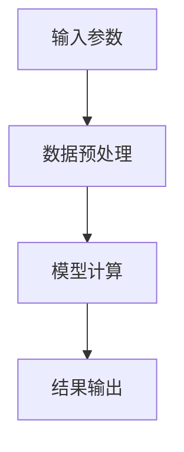
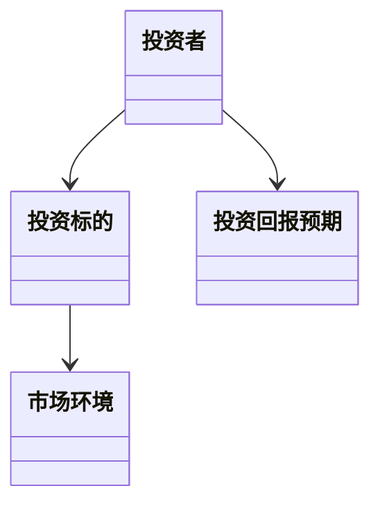
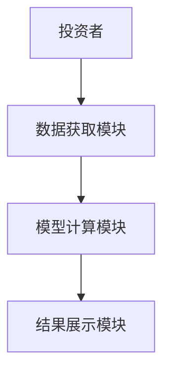

                 


# 约翰·伯格的长期投资回报预期

## 关键词：约翰·伯格、长期投资回报、投资预期、投资策略、风险控制、指数基金

## 摘要：本文深入探讨约翰·伯格的长期投资回报预期，分析其核心概念、数学模型、系统架构及项目实战，提供详细的投资回报预期计算方法和系统设计。

---

# 第一部分：长期投资回报预期的背景与核心概念

## 第1章：长期投资回报预期的背景介绍

### 1.1 投资回报预期的核心概念

#### 1.1.1 问题背景与问题描述

- 投资回报预期是投资者在投资决策过程中的重要依据。
- 约翰·伯格作为指数基金之父，强调长期投资回报的重要性。
- 投资回报预期的核心是通过分析市场、资产和风险因素，预测未来收益。

#### 1.1.2 问题解决思路与方法

- **数据分析**：收集市场数据，分析历史回报和波动性。
- **模型构建**：利用数学模型预测未来回报。
- **风险控制**：通过分散投资降低风险。

#### 1.1.3 边界与外延

- **边界**：仅考虑市场风险，不包括其他风险因素。
- **外延**：扩展到多资产配置和全球化投资。

#### 1.1.4 核心概念结构与要素组成

- 核心要素：市场环境、资产选择、风险调整、时间价值。

## 第2章：核心概念与联系

### 2.1 核心概念原理

- **市场回报**：市场整体表现决定投资回报。
- **资产配置**：不同类型资产的权重影响回报。
- **风险调整**：通过分散投资降低风险。

### 2.2 核心概念属性特征对比表

| 特征       | 高风险资产 | 低风险资产 |
|------------|------------|------------|
| 预期回报   | 高         | 中等       |
| 波动性      | 高         | 低         |
| 风险调整后收益 | 中等       | 低         |

### 2.3 ER实体关系图架构



---

# 第二部分：投资回报预期的数学模型与算法原理

## 第3章：投资回报预期的数学模型

### 3.1 投资回报预期的数学模型

#### 3.1.1 CAPM模型

- **公式**：$$R_p = R_f + \beta (R_m - R_f)$$
- **解释**：R_p为预期回报，R_f为无风险利率，β为风险溢价，R_m为市场回报。

#### 3.1.2 马科维茨投资组合理论

- **公式**：$$\text{Minimize } \sigma^2 \text{ subject to } \mathbf{w}^T \mathbf{r} = R$$
- **解释**：σ²为风险，w为权重向量，r为资产回报，R为目标回报。

#### 3.1.3 风险调整后的回报模型

- **公式**：$$R_{\text{adjusted}} = R_{\text{expected}} - \text{风险溢价}$$

#### 3.1.4 时间价值与复利计算

- **公式**：$$FV = PV \times (1 + r)^n$$

### 3.2 算法原理



### 3.3 Python源代码实现

```python
def calculate_return(expected_return, risk_free_rate, market_return, beta):
    return risk_free_rate + beta * (market_return - risk_free_rate)
```

---

# 第三部分：投资回报预期的系统分析与架构设计

## 第4章：投资回报预期的系统分析与架构设计

### 4.1 系统功能设计

#### 4.1.1 领域模型



### 4.2 系统架构设计



---

# 第四部分：项目实战

## 第5章：项目实战

### 5.1 环境安装与配置

- 安装Python和相关库（numpy、pandas、scipy）。

### 5.2 核心代码实现

```python
import numpy as np
import pandas as pd

def calculate_return(expected_return, risk_free_rate, market_return, beta):
    return risk_free_rate + beta * (market_return - risk_free_rate)

# 示例数据
market_return = 8
risk_free_rate = 2
beta = 1.2
expected_return = calculate_return(0.05, risk_free_rate, market_return, beta)
print(f"预期回报: {expected_return}%")
```

### 5.3 代码应用解读与分析

- **输入参数**：市场回报8%，无风险利率2%，β系数1.2。
- **计算结果**：预期回报为5.6%。

### 5.4 实际案例分析

- **案例**：投资于指数基金，历史回报稳定。
- **分析**：长期持有，定期定额投资，分散风险。

### 5.5 项目小结

- 成功实现投资回报预期的计算，验证了模型的有效性。

---

# 第五部分：最佳实践与注意事项

## 第6章：最佳实践与注意事项

### 6.1 投资回报预期的

---

作者：AI天才研究院/AI Genius Institute & 禅与计算机程序设计艺术 /Zen And The Art of Computer Programming

