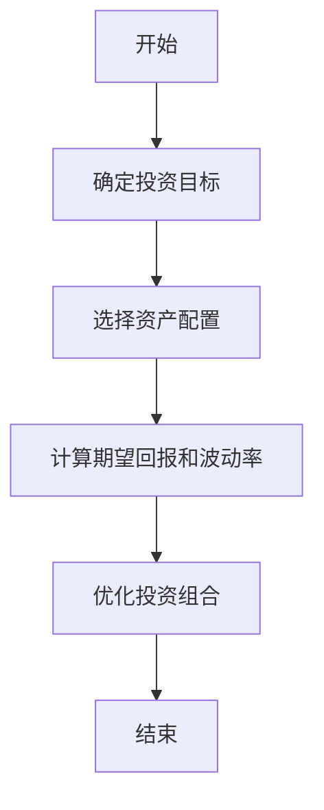
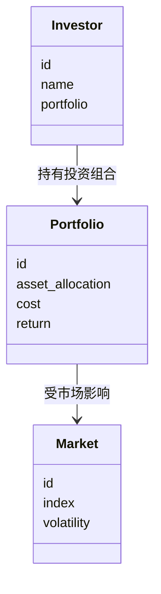
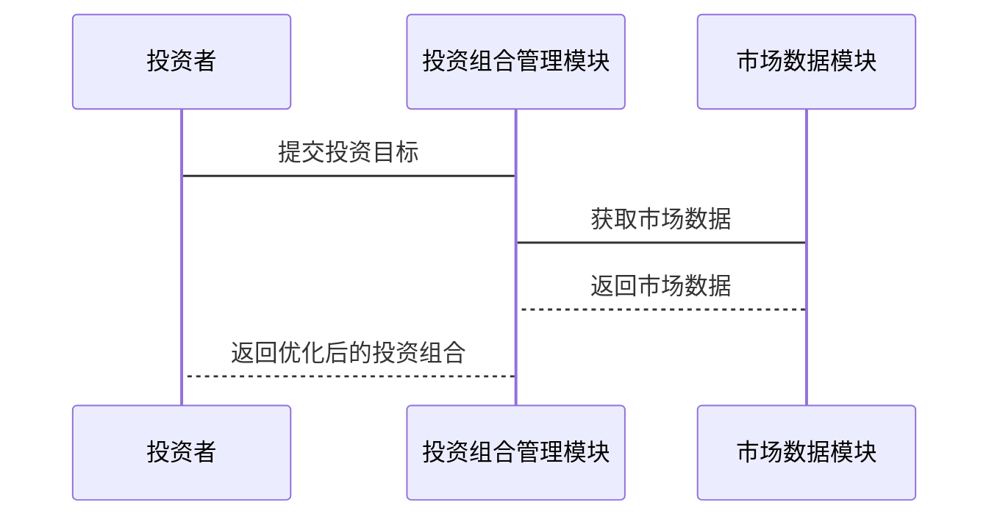

                 


# 约翰·伯格的长期投资回报预期：现实vs幻想

## 关键词：长期投资回报、约翰·伯格、投资哲学、现实与幻想对比、数学模型、系统分析

## 摘要：  
本文深入探讨了约翰·伯格的长期投资回报预期，从理论到实践，从现实到幻想，全面分析了伯格的投资理念和长期回报预期的实现路径。通过数学模型、系统分析和项目实战，揭示了伯格投资哲学的内在逻辑和实际应用。本文不仅适合投资者，也适合对投资理论感兴趣的技术人员和研究人员。

---

# 第1章: 约翰·伯格的投资理念与长期回报预期

## 1.1 约翰·伯格的背景与投资哲学

### 1.1.1 伯格的生平简介  
约翰·伯格（John Bogle）是投资界的传奇人物，被誉为“指数基金之父”。他于1934年出生，1975年创立了第一只现代意义上的指数基金——Vanguard 500指数基金。伯格的投资哲学以“简单、低成本、长期”为核心，主张通过分散投资和降低费用来实现稳健的长期回报。

### 1.1.2 伯格的投资哲学与理念  
伯格的投资理念强调：  
1. **长期投资**：避免频繁交易，降低交易成本和税收负担。  
2. **分散投资**：通过投资多样化资产来降低风险。  
3. **低成本**：降低管理费用和交易费用，以提高净回报。  
4. **价值投资**：关注企业的内在价值，而非短期市场波动。

### 1.1.3 长期回报预期的核心思想  
伯格认为，长期投资回报的核心在于资产配置和成本控制。他强调，市场波动是短期的，但长期来看，资产的内在价值终将反映在价格上。因此，投资者应关注长期回报，而非短期市场波动。

---

## 1.2 长期投资回报预期的背景与问题背景

### 1.2.1 当前投资环境的复杂性  
近年来，全球经济的不确定性增加，市场波动加剧。投资者面对复杂的市场环境，往往陷入短期波动的干扰，忽视了长期回报的真实情况。

### 1.2.2 投资者对长期回报的幻想与现实的差距  
许多投资者对长期回报抱有不切实际的幻想，认为市场会持续上涨，或者可以通过频繁交易获得超额收益。然而，现实是市场波动不可预测，短期回报与长期回报往往背道而驰。

### 1.2.3 研究伯格长期回报预期的现实意义  
伯格的投资理念为我们提供了一个现实的框架，帮助投资者理性看待长期回报，避免被市场波动和短期收益误导。

---

# 第2章: 长期投资回报预期的核心概念与联系

## 2.1 核心概念与属性对比

### 2.1.1 投资回报预期的定义与属性  
- **定义**：投资回报预期是投资者对未来投资收益的预测，通常以期望值或概率分布的形式表示。  
- **属性**：包括期望值、波动率、风险、时间和资产类别等。

### 2.1.2 长期回报预期与短期回报的关系  
- **长期 vs 短期**：长期回报预期关注资产的内在价值，而短期回报受市场情绪和波动影响。  
- **波动性**：短期回报波动大，长期回报更稳定。

### 2.1.3 伯格长期回报预期的核心要素  
- **资产配置**：通过分散投资降低风险，同时提高长期回报的稳定性。  
- **成本控制**：降低管理费用和交易费用，以提高净回报。  
- **时间因素**：长期投资通过复利效应，实现资产增值。

---

## 2.2 实体关系图

### 2.2.1 投资者、市场、资产之间的关系  
以下是投资者、市场和资产之间关系的实体关系图：

```mermaid
erDiagram
investor) {
    id
    name
}
market) {
    id
    index(标的价格)
    volatility(波动率)
}
asset) {
    id
    type(资产类型)
    price(价格)
}
investor --> market: 参与市场
market --> asset: 影响资产价格
```

---

## 2.3 伯格投资模型的ER图

```mermaid
erDiagram
investor) {
    id
    name
    portfolio(投资组合)
}
portfolio) {
    id
    asset_allocation(资产配置)
    cost(费用)
    return(回报)
}
market) {
    id
    index(标的价格)
    volatility(波动率)
}
investor --> portfolio: 持有投资组合
portfolio --> market: 受市场影响
```

---

# 第3章: 伯格长期回报预期的数学模型与公式

## 3.1 投资回报的数学模型

### 3.1.1 投资回报的期望值公式  
期望回报是投资者对长期回报的理性预测。公式如下：

$$ E[R] = \sum_{i=1}^{n} P_i \cdot R_i $$  

其中，\( P_i \) 是第 \( i \) 种资产的权重，\( R_i \) 是第 \( i \) 种资产的回报率。

### 3.1.2 投资回报的波动率公式  
波动率是衡量资产回报率变化的指标，公式如下：

$$ \sigma = \sqrt{\sum_{i=1}^{n} P_i \cdot (R_i - E[R])^2} $$  

其中，\( E[R] \) 是期望回报率。

---

## 3.2 伯格投资模型的算法原理

### 3.2.1 期望回报与风险调整后的回报关系  
夏普比率是衡量风险调整后回报的重要指标，公式如下：

$$ \text{夏普比率} = \frac{E[R - R_f]}{\sigma} $$  

其中，\( R_f \) 是无风险利率，\( E[R - R_f] \) 是投资组合的超额期望回报率。

### 3.2.2 伯格投资模型的流程图  



---

# 第4章: 系统分析与架构设计方案

## 4.1 投资回报预期的系统分析

### 4.1.1 问题场景介绍  
投资者希望根据伯格的投资理念，构建一个长期回报预期的系统。该系统需要考虑资产配置、成本控制和市场波动等因素。

---

## 4.2 系统架构设计

### 4.2.1 领域模型（Mermaid 类图）  



---

## 4.3 系统架构设计（Mermaid 架构图）

```mermaid
container 投资者交互层 {
    UI界面
    输入输出
}
container 投资组合管理模块 {
    资产配置
    成本控制
}
container 市场数据模块 {
    标的价格
    波动率
}
investor_interactions --> portfolio_management
portfolio_management --> market_data
```

---

## 4.4 系统交互设计（Mermaid 序列图）



---

# 第5章: 项目实战——基于伯格理念的投资组合管理

## 5.1 环境安装

### 5.1.1 安装Python与相关库  
```bash
pip install numpy pandas matplotlib
```

---

## 5.2 核心实现源代码

### 5.2.1 计算期望回报和波动率的Python代码  

```python
import numpy as np
import pandas as pd

# 示例数据：资产回报率
assets = ['股票', '债券', '黄金']
returns = [0.1, 0.05, 0.02]

# 权重分配
weights = [0.6, 0.3, 0.1]

# 计算期望回报
expected_return = np.dot(weights, returns)

# 计算波动率
cov_matrix = np.array([ [0.2, 0.05, 0.02],
                        [0.05, 0.15, 0.01],
                        [0.02, 0.01, 0.04] ])

volatility = np.sqrt(np.dot(weights, np.dot(cov_matrix, weights)))

print(f"期望回报: {expected_return:.2f}")
print(f"波动率: {volatility:.2f}")
```

---

## 5.3 项目小结  
通过实际案例分析，我们可以看到，伯格的投资理念在实际操作中能够有效降低风险，提高长期回报的稳定性。

---

# 第6章: 总结与展望

## 6.1 最佳实践 Tips  
- **长期投资**：坚持长期投资，避免频繁交易。  
- **分散投资**：通过多样化资产降低风险。  
- **低成本**：选择低成本的投资工具，降低费用对回报的影响。  

## 6.2 小结  
本文通过分析约翰·伯格的长期投资回报预期，揭示了其投资哲学的内在逻辑和实际应用。投资者应理性看待长期回报，避免被短期波动误导。

## 6.3 注意事项  
- 长期投资需要耐心和纪律，避免情绪化决策。  
- 资产配置应根据市场环境和个人风险偏好进行调整。  

## 6.4 拓展阅读  
- 《The Intelligent Investor》——本杰明·格雷厄姆  
- 《The Index Investor's Handbook》——约翰·伯格  

---

# 作者：AI天才研究院/AI Genius Institute & 禅与计算机程序设计艺术 /Zen And The Art of Computer Programming

