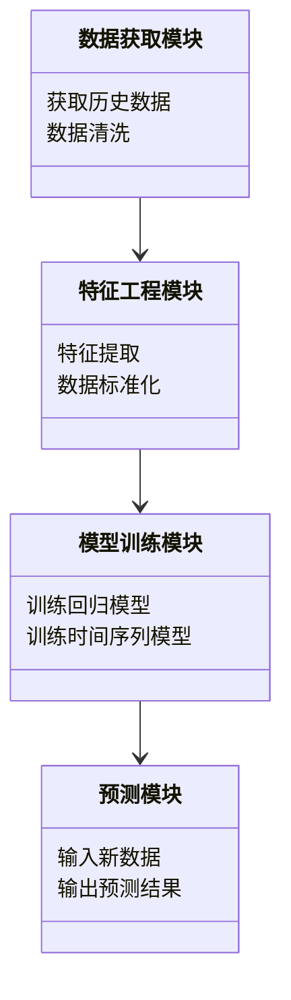
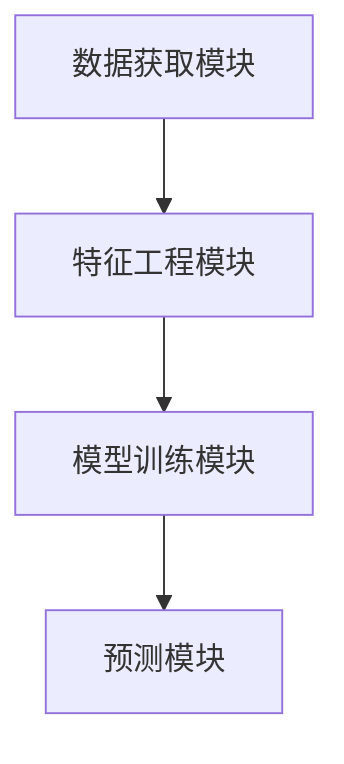
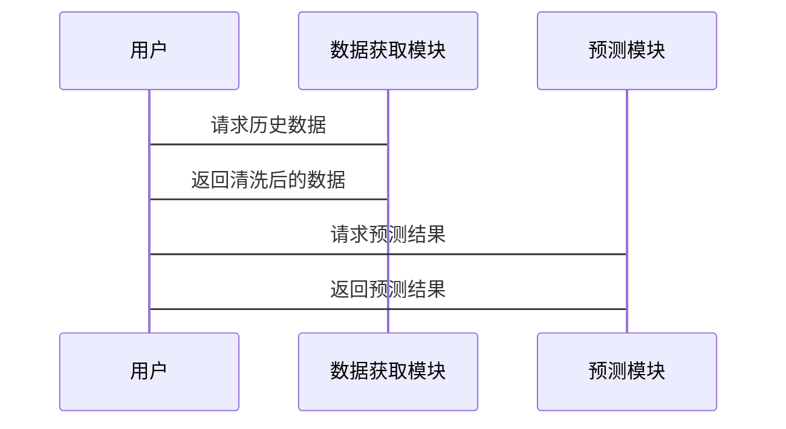

                 


# 约翰·伯格的长期投资回报预测模型

> 关键词：长期投资回报预测，约翰·伯格模型，金融数据分析，机器学习，时间序列分析

> 摘要：本文详细介绍了约翰·伯格的长期投资回报预测模型，从背景、核心概念、算法原理、系统架构设计到项目实战，逐步深入分析。通过实际案例，展示了模型的应用和实现过程，并提供了最佳实践和注意事项，帮助读者更好地理解和应用该模型。

---

# 第一部分: 约翰·伯格长期投资回报预测模型概述

## 第1章: 长期投资回报预测模型的背景与意义

### 1.1 投资回报预测的背景

#### 1.1.1 投资回报预测的定义与目标

投资回报预测是指通过分析历史数据和市场趋势，预测未来一段时间内投资资产的回报率。其目标是帮助投资者做出更科学的投资决策，优化投资组合，降低投资风险。

#### 1.1.2 长期投资回报预测的重要性

长期投资回报预测可以帮助投资者制定长期财务规划，尤其是在面对市场波动和经济不确定性时，提供一种相对稳定的投资策略。通过预测长期回报，投资者可以更好地理解不同资产在不同经济周期中的表现。

#### 1.1.3 约翰·伯格模型的起源与演变

约翰·伯格是金融数据分析领域的专家，他的长期投资回报预测模型结合了统计学、时间序列分析和机器学习技术，旨在提高预测的准确性和稳定性。该模型最初应用于股票市场，后来扩展到其他金融资产。

### 1.2 约翰·伯格模型的应用场景

#### 1.2.1 金融市场的投资决策

投资者可以利用约翰·伯格模型预测不同资产的长期回报率，从而优化投资组合，选择最有潜力的资产进行投资。

#### 1.2.2 投资组合优化

通过模型预测不同资产的回报率和风险，投资者可以调整投资组合的构成，以达到风险与收益的最佳平衡。

#### 1.2.3 风险管理与控制

模型可以帮助投资者识别高风险资产，提前制定风险管理策略，降低投资组合的整体风险。

### 1.3 约翰·伯格模型的核心优势

#### 1.3.1 数据驱动的预测能力

约翰·伯格模型基于大量历史数据和市场信息，通过统计分析和机器学习算法，提高了预测的准确性和可靠性。

#### 1.3.2 长期投资策略的稳定性

模型专注于长期投资回报的预测，避免了短期市场波动对决策的干扰，为投资者提供更稳定的长期投资策略。

#### 1.3.3 模型的可解释性与实用性

约翰·伯格模型不仅提供预测结果，还能够解释预测的依据，使投资者能够理解模型的逻辑，从而更好地应用在实际投资中。

### 1.4 模型的挑战与局限性

#### 1.4.1 数据质量与完整性

模型的预测结果依赖于高质量的历史数据，数据的缺失或不准确可能会影响预测的准确性。

#### 1.4.2 市场波动与不确定性

金融市场具有高度的不确定性和波动性，模型的预测结果可能会受到不可预测的市场变化的影响。

#### 1.4.3 模型的可扩展性与适应性

随着市场的变化和技术的进步，模型需要不断更新和优化，以适应新的市场环境和数据特征。

---

## 第2章: 约翰·伯格模型的核心概念与原理

### 2.1 模型的基本原理

#### 2.1.1 数据驱动的预测方法

约翰·伯格模型通过收集和分析大量历史数据，利用统计方法和机器学习算法，提取数据中的规律，从而预测未来的投资回报。

#### 2.1.2 时间序列分析

模型特别关注时间序列数据，通过分析资产的历史回报率，识别趋势和周期性，预测未来的回报趋势。

#### 2.1.3 统计回归与机器学习的结合

模型结合了统计回归分析和机器学习算法，如随机森林和神经网络，以提高预测的准确性和鲁棒性。

### 2.2 核心概念与联系

#### 2.2.1 输入变量与输出变量的定义

- **输入变量（自变量）**：包括历史股价、宏观经济指标（如GDP增长率、利率）、行业趋势、公司财务数据等。
- **输出变量（因变量）**：预测的未来投资回报率。

#### 2.2.2 数据特征的提取与处理

- **数据标准化**：对不同量纲的数据进行标准化处理，确保模型的公平性和准确性。
- **缺失值处理**：通过插值法或删除法处理缺失数据，保证数据的完整性。
- **异常值剔除**：识别并剔除异常值，避免对模型预测的干扰。

#### 2.2.3 模型参数的优化与调整

- **参数选择**：通过交叉验证选择最优的模型参数，提高预测的准确性。
- **模型调优**：通过网格搜索或贝叶斯优化方法，优化模型的超参数，提升预测性能。

### 2.3 模型的核心算法

#### 2.3.1 线性回归模型

- **简单线性回归公式**
  $$
  y = \beta_0 + \beta_1x + \epsilon
  $$
  其中，$y$是预测的回报率，$x$是自变量，$\beta_0$和$\beta_1$是回归系数，$\epsilon$是误差项。

- **多元线性回归公式**
  $$
  y = \beta_0 + \beta_1x_1 + \beta_2x_2 + ... + \beta_nx_n + \epsilon
  $$

#### 2.3.2 时间序列分析模型

- **ARIMA模型**
  $$
  ARIMA(p, d, q)
  $$
  其中，$p$是自回归阶数，$d$是差分阶数，$q$是移动平均阶数。

- **GARCH模型**
  $$
  GARCH(p, q)
  $$
  其中，$p$是自回归阶数，$q$是移动平均阶数。

#### 2.3.3 机器学习算法的引入

- **随机森林**
  随机森林是一种基于决策树的集成学习算法，通过构建多个决策树并进行投票或平均，提高预测的准确性和稳定性。

- **神经网络**
  神经网络通过多层感知器（MLP）结构，学习复杂的非线性关系，提高预测的准确性。

---

## 第3章: 模型的数学基础与公式推导

### 3.1 线性回归模型

线性回归模型是约翰·伯格模型的基础之一，主要用于分析变量之间的线性关系。

#### 3.1.1 简单线性回归

简单线性回归模型如下：
$$
y = \beta_0 + \beta_1x + \epsilon
$$
其中，$\beta_0$是截距，$\beta_1$是斜率，$\epsilon$是误差项。

#### 3.1.2 多元线性回归

多元线性回归模型如下：
$$
y = \beta_0 + \beta_1x_1 + \beta_2x_2 + ... + \beta_nx_n + \epsilon
$$

---

### 3.2 时间序列分析模型

时间序列分析模型用于分析数据的时间依赖性，预测未来的趋势。

#### 3.2.1 ARIMA模型

ARIMA模型是一种常用的时间序列分析模型，适用于具有趋势和季节性的数据。

#### 3.2.2 GARCH模型

GARCH模型用于捕捉数据的波动性，特别是在金融时间序列中，能够有效捕捉市场波动的风险。

---

## 第4章: 系统分析与架构设计方案

### 4.1 问题场景介绍

模型的应用场景包括股票市场、房地产市场等，主要用于预测长期投资回报率，帮助投资者制定投资策略。

### 4.2 项目介绍

本项目旨在开发一个基于约翰·伯格模型的投资回报预测系统，包括数据获取、特征工程、模型训练和预测模块。

### 4.3 系统功能设计

#### 4.3.1 领域模型

领域模型的类图如下：



---

### 4.4 系统架构设计

#### 4.4.1 系统架构图

系统架构图如下：



---

### 4.5 系统接口设计

系统接口包括数据输入接口和预测结果输出接口。

#### 4.5.1 系统交互流程图

系统交互流程图如下：



---

## 第5章: 项目实战

### 5.1 环境安装

需要安装Python、Pandas、Scikit-learn、XGBoost等库。

```bash
pip install numpy pandas scikit-learn xgboost
```

---

### 5.2 系统核心实现源代码

以下是模型的核心代码：

```python
import numpy as np
import pandas as pd
from sklearn.model_selection import train_test_split
from sklearn.linear_model import LinearRegression
from sklearn.ensemble import RandomForestRegressor
from sklearn.metrics import mean_squared_error

# 数据加载与预处理
data = pd.read_csv('投资回报数据.csv')
X = data.drop('回报率', axis=1)
y = data['回报率']

# 数据分割
X_train, X_test, y_train, y_test = train_test_split(X, y, test_size=0.2, random_state=42)

# 线性回归模型训练
lr_model = LinearRegression()
lr_model.fit(X_train, y_train)
lr_predictions = lr_model.predict(X_test)
lr_rmse = mean_squared_error(y_test, lr_predictions)**0.5

# 随机森林模型训练
rf_model = RandomForestRegressor(n_estimators=100, random_state=42)
rf_model.fit(X_train, y_train)
rf_predictions = rf_model.predict(X_test)
rf_rmse = mean_squared_error(y_test, rf_predictions)**0.5

print(f"线性回归 RMSE: {lr_rmse}")
print(f"随机森林 RMSE: {rf_rmse}")
```

---

### 5.3 代码应用解读与分析

- **数据加载与预处理**：读取CSV格式的历史数据，进行数据清洗和特征提取。
- **数据分割**：将数据分为训练集和测试集，用于模型训练和评估。
- **模型训练**：分别训练线性回归模型和随机森林模型。
- **模型评估**：计算预测结果的均方根误差（RMSE），评估模型的预测性能。

---

## 第6章: 最佳实践

### 6.1 小结

通过本项目，我们了解了约翰·伯格模型的核心概念和实现方法，掌握了模型在金融数据分析中的应用。

### 6.2 注意事项

- 数据的高质量和完整性对模型的预测结果至关重要。
- 需要定期更新模型，以适应市场环境的变化。
- 在实际应用中，应结合其他分析方法，综合评估投资风险和收益。

### 6.3 拓展阅读

- 《时间序列分析与应用预测方法》
- 《机器学习实战》

---

# 作者

作者：AI天才研究院/AI Genius Institute & 禅与计算机程序设计艺术/Zen And The Art of Computer Programming

