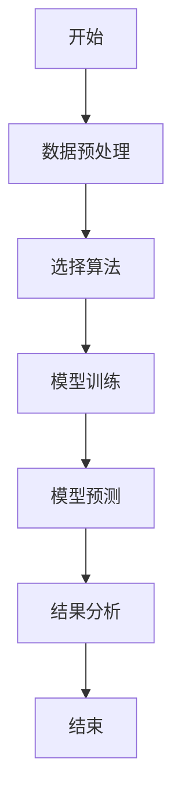
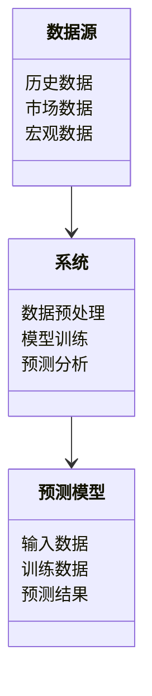
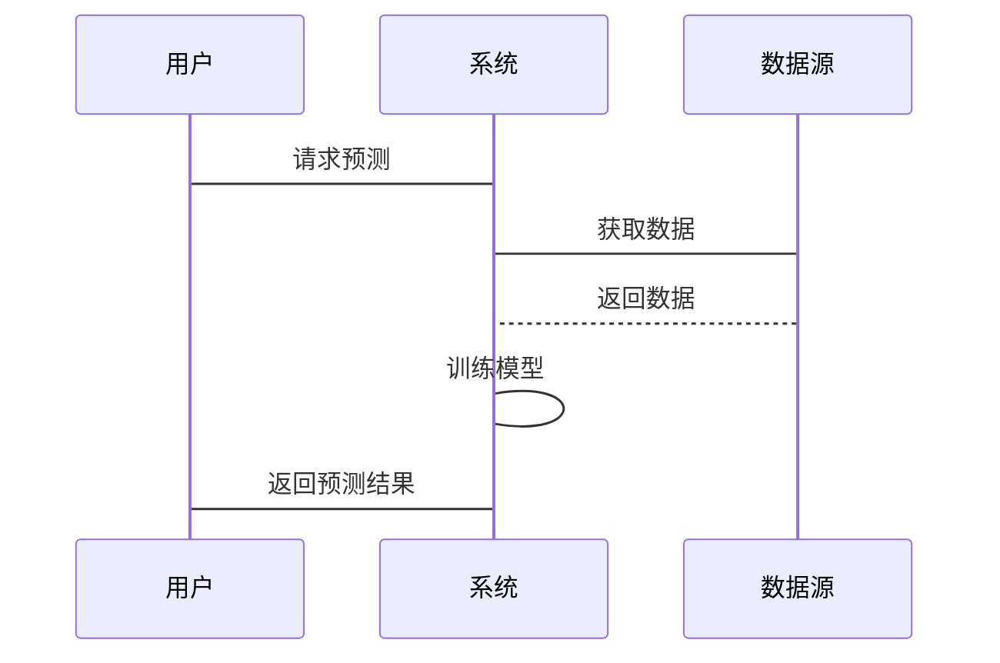

                 


# 《约翰·伯格的长期投资回报预测模型》

> 关键词：投资回报预测、约翰·伯格、长期投资、预测模型、金融分析、机器学习

> 摘要：本文深入探讨了约翰·伯格的长期投资回报预测模型，分析了其核心概念、算法原理、系统架构，并通过实战案例展示了模型的应用。文章内容涵盖背景介绍、模型构建、系统实现、项目实战等多个方面，旨在帮助读者全面理解和应用该模型。

---

## 第一部分：引言

### 1.1 投资回报预测的背景与意义

#### 1.1.1 投资回报预测的重要性

投资回报预测是金融领域的重要课题，它帮助投资者在长期投资中做出科学决策。通过预测未来回报，投资者可以优化资产配置，降低风险，提高收益。

#### 1.1.2 约翰·伯格的贡献与研究背景

约翰·伯格是投资领域的权威，他的长期投资回报预测模型结合了统计学和金融学，为投资者提供了可靠的预测工具。本文将详细分析该模型的构建过程和应用方法。

#### 1.1.3 长期投资回报预测的边界与外延

本文将探讨模型的应用范围、局限性以及扩展方向，确保读者对模型的理解全面而深入。

---

## 第二部分：约翰·伯格模型的核心概念

### 2.1 长期投资回报预测的基本原理

#### 2.1.1 投资回报预测的定义与分类

投资回报预测是对未来投资收益的估计，通常分为短期和长期预测。本文专注于长期预测，分析其独特性和挑战。

#### 2.1.2 模型的核心要素

- **输入数据**：历史回报数据、市场指标、宏观经济指标。
- **算法选择**：时间序列分析、回归模型。
- **输出结果**：预测回报率、风险评估、投资建议。

#### 2.1.3 模型的输入与输出

通过详细描述输入和输出，明确模型的运作机制。

### 2.2 核心概念的属性对比表

| **属性**       | **描述**                                                                 |
|----------------|--------------------------------------------------------------------------|
| 输入数据类型    | 财务数据、市场指标、宏观经济指标等                                         |
| 模型类型        | 时间序列预测模型、回归模型                                               |
| 输出结果        | 预测的回报率、风险评估、投资建议                                         |
| 应用场景        | 长期资产配置、投资组合管理、风险管理                                       |

### 2.3 模型的ER实体关系图

```mermaid
er
  entity 投资回报预测模型 {
    <属性>
    - 财务数据
    - 市场指标
    - 宏观经济指标
  }
  entity 预测结果 {
    <属性>
    - 预测回报率
    - 风险评估
    - 投资建议
  }
  entity 数据源 {
    <属性>
    - 历史数据
    - 市场数据
    - 宏观数据
  }
```

---

## 第三部分：算法原理讲解

### 3.1 时间序列分析

#### 3.1.1 时间序列预测的基本原理

时间序列分析通过分析历史数据的规律，预测未来的趋势。常用方法包括ARIMA、GARCH等。

#### 3.1.2 约翰·伯格模型中的时间序列模型

模型采用ARIMA模型进行时间序列预测，通过历史回报数据训练模型参数。

#### 3.1.3 模型的数学公式

ARIMA模型的公式如下：

$$ ARIMA(p, d, q) = y_t - \phi_1 y_{t-1} - \phi_2 y_{t-2} - \dots - \phi_p y_{t-p} = \theta_1 \epsilon_{t-1} + \theta_2 \epsilon_{t-2} + \dots + \theta_q \epsilon_{t-q} + \epsilon_t $$

其中，$y_t$ 是观测值，$\epsilon_t$ 是白噪声。

### 3.2 回归分析

#### 3.2.1 回归模型的构建

回归模型用于分析变量之间的关系，帮助预测投资回报。

#### 3.2.2 线性回归模型的公式

线性回归模型的公式如下：

$$ y = \beta_0 + \beta_1 x_1 + \beta_2 x_2 + \dots + \beta_n x_n + \epsilon $$

其中，$y$ 是预测目标，$x_i$ 是自变量，$\beta_i$ 是系数，$\epsilon$ 是误差项。

### 3.3 算法流程图



---

## 第四部分：系统架构设计

### 4.1 问题场景介绍

#### 4.1.1 系统的应用场景

系统用于长期投资回报预测，帮助投资者做出科学决策。

### 4.2 系统功能设计

#### 4.2.1 领域模型类图



### 4.3 系统架构设计

#### 4.3.1 系统架构图


### 4.4 系统接口设计

#### 4.4.1 接口描述

- 数据输入接口：接收历史数据、市场数据、宏观经济数据。
- 模型训练接口：训练预测模型，输出模型参数。
- 预测接口：根据输入数据，返回预测结果。

### 4.5 系统交互序列图



---

## 第五部分：项目实战

### 5.1 环境安装与配置

#### 5.1.1 安装Python环境

安装Python 3.x，建议使用Anaconda或virtualenv管理环境。

#### 5.1.2 安装依赖库

安装pandas、numpy、statsmodels等库。

### 5.2 核心代码实现

#### 5.2.1 数据预处理

```python
import pandas as pd
import numpy as np

# 读取数据
data = pd.read_csv('data.csv')
# 数据清洗
data.dropna(inplace=True)
```

#### 5.2.2 模型训练

```python
from statsmodels.tsa.arima.model import ARIMA

# 训练ARIMA模型
model = ARIMA(data, order=(5, 1, 0))
model_fit = model.fit()
```

#### 5.2.3 模型预测

```python
# 预测未来回报
forecast = model_fit.forecast(steps=30)
print(forecast)
```

### 5.3 案例分析

#### 5.3.1 数据来源

使用历史股票数据进行训练，预测未来30天的回报率。

#### 5.3.2 模型评估

通过均方误差（MSE）和R²系数评估模型性能。

### 5.4 代码解读与分析

详细解读代码功能，分析模型的训练和预测过程。

---

## 第六部分：结论与展望

### 6.1 模型的优势与不足

#### 6.1.1 模型的优势

- 数据驱动，结果可靠。
- 适用于长期投资决策。

#### 6.1.2 模型的不足

- 依赖历史数据，假设未来与过去相似。
- 忽略了某些不可预测的市场变化。

### 6.2 应用中的注意事项

- 定期更新模型。
- 结合市场专家意见。

### 6.3 未来展望

- 引入更多数据源，如新闻、社交媒体情绪分析。
- 结合强化学习优化预测模型。

---

## 第七部分：最佳实践与小结

### 7.1 最佳实践 tips

- 数据预处理是关键。
- 定期验证模型性能。
- 结合多种模型提高准确性。

### 7.2 项目小结

本文详细介绍了约翰·伯格的长期投资回报预测模型，从理论到实践，帮助读者掌握模型的应用方法。

---

## 作者信息

作者：AI天才研究院/AI Genius Institute & 禅与计算机程序设计艺术 /Zen And The Art of Computer Programming

