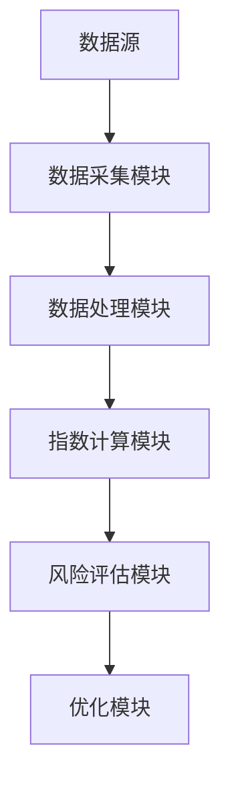

                 


# 约翰·伯格：指数基金之父的投资智慧

## 关键词：
指数基金，约翰·伯格，被动投资，投资哲学，数学模型

## 摘要：
本文深入探讨了指数基金之父约翰·伯格的投资智慧，从指数基金的起源与发展、数学模型与算法、系统架构设计、实战应用等多个维度进行了详细分析。通过本文，读者可以全面了解指数基金的核心理念、实现方法及其在实际投资中的应用。

## 第一部分：引言

### 第1章：约翰·伯格与指数基金概述

#### 1.1 指数基金的起源与发展
##### 1.1.1 约翰·伯格的生平简介
约翰·伯格（John C. Bogle）被誉为指数基金之父，他是 Vanguard 集团的创始人。他于1940年出生在美国宾夕法尼亚州，毕业于宾夕法尼亚大学。约翰·伯格在投资领域有着深远的影响力，他提出的指数投资理念改变了全球投资者的资产配置方式。

##### 1.1.2 指数基金的定义与特点
指数基金是一种以特定市场指数为基准，跟踪该指数表现的基金。其特点是分散投资、费用低廉、风险较低。指数基金的投资策略是被动管理，即不主动寻求跑赢市场，而是通过跟踪指数来实现与市场的同步增长。

##### 1.1.3 指数基金的历史演变
指数基金的概念可以追溯到20世纪初，但真正的发展始于20世纪70年代。随着金融理论的不断完善和计算技术的进步，指数基金逐渐成为一种重要的投资工具。

#### 1.2 指数基金的核心理念
##### 1.2.1 被动投资与主动投资的对比
被动投资是指通过跟踪指数来实现投资收益，而主动投资则是通过精选个股或主动管理投资组合来寻求超额收益。被动投资的优势在于费用低、风险分散，而主动投资则有可能获得更高的收益，但同时也伴随着更高的风险和费用。

##### 1.2.2 指数基金的优势与劣势
指数基金的优势在于分散风险、费用低、操作简单。劣势在于其收益受到市场整体表现的限制，无法超越市场。

##### 1.2.3 约翰·伯格的投资哲学
约翰·伯格主张长期投资，强调分散投资和费用控制。他认为，长期来看，市场波动是暂时的，而投资的最终目标是实现财富的稳步增长。

### 第2章：指数基金的数学模型与算法

#### 2.1 指数基金的数学基础
##### 2.1.1 投资组合的预期收益计算
投资组合的预期收益可以通过对各资产的预期收益进行加权平均来计算。假设投资组合中包含多种资产，每种资产的权重为w_i，预期收益为r_i，则投资组合的预期收益r_p为：
$$
r_p = \sum_{i=1}^{n} w_i r_i
$$

##### 2.1.2 投资组合的风险评估
投资组合的风险可以用方差或标准差来衡量。投资组合的方差为：
$$
\sigma_p^2 = \sum_{i=1}^{n} \sum_{j=1}^{n} w_i w_j \sigma_{ij}
$$
其中，σ_ij是资产i和资产j的协方差。

##### 2.1.3 资本资产定价模型（CAPM）
CAPM模型用于计算资产的预期收益：
$$
r_i = r_f + \beta_i (r_m - r_f)
$$
其中，r_f是无风险利率，β_i是资产i的贝塔系数，r_m是市场预期收益。

#### 2.2 指数基金的构建算法
##### 2.2.1 市场指数的选择与构造
选择一个合适的市场指数是构建指数基金的第一步。常用的指数包括标普500指数、道琼斯指数等。指数的构造需要考虑成分股的数量、权重分配等因素。

##### 2.2.2 权重分配的数学模型
指数基金的权重分配通常是根据指数的成分股权重来确定的。例如，标普500指数中每个成分股的权重是根据其市值占指数总市值的比例来确定的。

##### 2.2.3 跟踪误差的计算与优化
跟踪误差是指数基金的实际收益与目标指数收益之间的差异。跟踪误差越小，指数基金的表现越接近目标指数。可以通过优化权重分配来最小化跟踪误差。

### 第3章：指数基金的系统架构设计

#### 3.1 系统功能模块划分
##### 3.1.1 数据采集与处理模块
数据采集模块负责从数据源获取市场数据，包括股票价格、指数成分股等。数据处理模块对获取的数据进行清洗、转换和存储。

##### 3.1.2 指数计算与跟踪模块
指数计算模块根据指数的构造方法计算出指数的值。跟踪模块实时监控指数基金的收益与目标指数收益的差异，及时调整投资组合。

##### 3.1.3 风险评估与优化模块
风险评估模块对指数基金的风险进行评估，包括计算方差、标准差等指标。优化模块通过调整权重分配来最小化跟踪误差和风险。

#### 3.2 系统架构图


#### 3.3 系统接口设计
##### 3.3.1 数据接口
数据接口用于与外部数据源进行交互，获取市场数据和指数信息。

##### 3.3.2 计算接口
计算接口用于调用指数计算和风险评估模块的函数，进行数据处理和计算。

##### 3.3.3 输出接口
输出接口用于将计算结果返回给用户或调用方，包括指数值、风险评估结果等。

### 第4章：指数基金的实战应用

#### 4.1 环境安装与配置
##### 4.1.1 数据源的选择
选择合适的数据源，例如Yahoo Finance、Quandl等。

##### 4.1.2 开发工具的安装
安装Python编程环境，包括Jupyter Notebook、PyCharm等。

##### 4.1.3 数据库的搭建
选择合适的数据库，例如MySQL、MongoDB等，用于存储市场数据和计算结果。

#### 4.2 核心代码实现
##### 4.2.1 数据采集与处理
```python
import pandas as pd
data = pd.read_csv('stock_data.csv')
```

##### 4.2.2 指数计算与跟踪
```python
def calculate_index_return(data):
    return data['index_return'].mean()
```

##### 4.2.3 风险评估与优化
```python
import numpy as np
cov_matrix = np.cov(data[['return1', 'return2', ...]])
```

#### 4.3 实际案例分析
##### 4.3.1 案例背景介绍
以标普500指数为例，构建一个指数基金的投资组合。

##### 4.3.2 数据分析与处理
使用历史数据计算指数基金的预期收益和风险。

##### 4.3.3 投资组合优化与结果展示
通过优化权重分配，最小化跟踪误差和风险，展示优化后的投资组合表现。

### 第5章：总结与展望

#### 5.1 本书内容回顾
总结本书的主要内容，包括指数基金的起源与发展、数学模型与算法、系统架构设计、实战应用等。

#### 5.2 未来展望
随着金融技术的进步，指数基金的投资策略和系统架构将不断完善。未来，指数基金将更加智能化、自动化，为投资者提供更加高效便捷的投资方式。

## 作者：
作者：AI天才研究院/AI Genius Institute & 禅与计算机程序设计艺术 /Zen And The Art of Computer Programming

