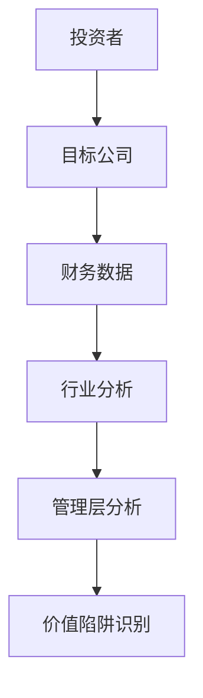
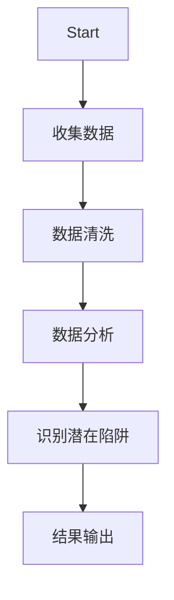
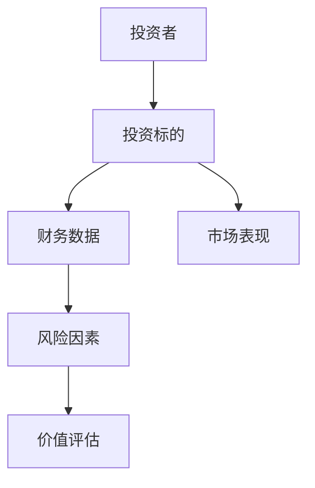
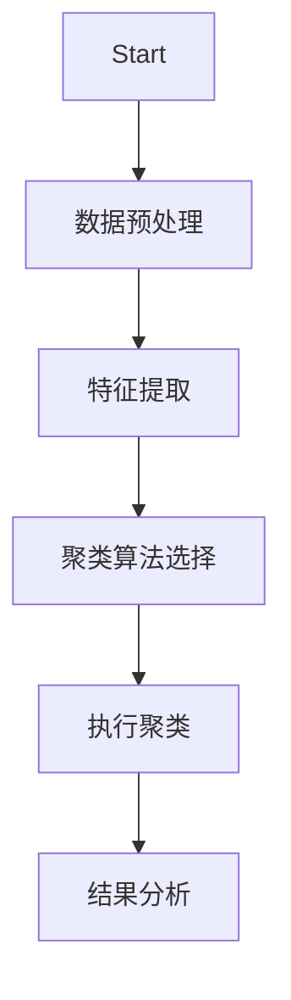
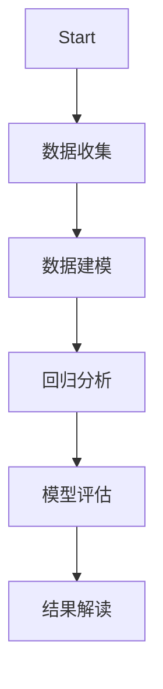
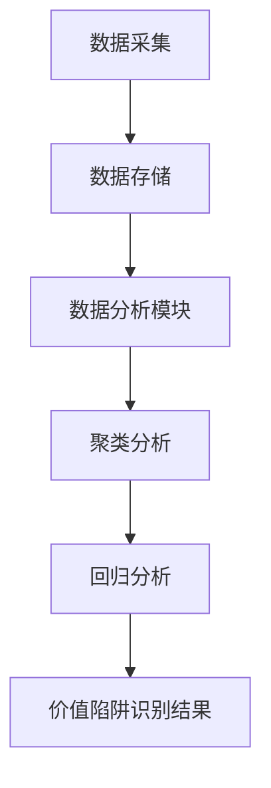

                 


# 约翰·内夫的价值陷阱识别技巧

> 关键词：价值陷阱，投资决策，数据分析，算法识别，风险管理

> 摘要：价值陷阱是指在投资过程中，某些资产或公司看似具有较高的内在价值，但实际上存在隐藏的风险或问题，可能导致投资者的重大损失。本文详细探讨了如何识别这些价值陷阱，通过数据分析、算法和系统架构的设计，帮助投资者避免潜在的损失，提升投资决策的准确性。

---

# 第1章: 价值陷阱的基本概念

## 1.1 价值陷阱的定义与背景

### 1.1.1 价值陷阱的定义
价值陷阱是指那些看似具有较高内在价值但实际上存在隐藏问题或风险的资产或公司。投资者可能会被表面的低估值所吸引，但忽略了潜在的风险因素，导致投资损失。

### 1.1.2 问题背景
在金融市场中，价值陷阱通常出现在以下几种情况下：
- **财务造假**：公司通过虚假的财务报告掩盖亏损或夸大利润。
- **行业周期**：某些行业可能处于衰退期，但公司仍表现出较高的估值。
- **管理层问题**：公司管理层存在腐败、欺诈或管理不善的情况。
- **竞争加剧**：行业内竞争加剧，导致公司盈利能力下降。

### 1.1.3 识别的重要性
识别价值陷阱可以帮助投资者避免重大损失，提高投资决策的准确性。通过分析公司的财务数据、行业地位和管理层质量，投资者可以更好地评估潜在风险。

---

## 1.2 价值陷阱的核心概念

### 1.2.1 核心概念的构成要素
价值陷阱的核心要素包括：
- **低估值**：公司市值低于其账面价值。
- **隐藏风险**：公司存在未公开的财务问题或行业风险。
- **管理层问题**：管理层的道德风险或管理不善。

### 1.2.2 价值陷阱与其他陷阱的对比
以下是价值陷阱与其他常见陷阱的对比：

| 比较维度       | 价值陷阱                   | 其他陷阱（如成长陷阱）           |
|----------------|-----------------------------|----------------------------------|
| 核心特征       | 低估值但高风险             | 高成长性但估值过高              |
| 识别标准       | 财务数据异常、管理层问题    | 成长性不足、市场地位下降         |
| 解决方法       | 避免投资、加强风险管理      | 调整估值模型、关注成长性         |

### 1.2.3 模型框架
价值陷阱识别模型的框架如下：



---

# 第2章: 价值陷阱识别的核心概念与联系

## 2.1 核心概念的原理分析

### 2.1.1 识别的理论基础
价值陷阱识别的理论基础主要包括：
- **财务分析**：通过分析公司的财务报表，识别潜在的财务问题。
- **行业分析**：了解行业发展趋势和竞争状况，评估公司的行业地位。
- **管理层分析**：评估公司管理层的诚信和能力。

### 2.1.2 核心概念的属性特征
价值陷阱的属性特征包括：
- **低市盈率**：市盈率低于行业平均水平。
- **高负债率**：公司负债过高，财务风险较大。
- **管理层变更**：近期管理层频繁变动，可能表明内部问题。

### 2.1.3 识别流程
价值陷阱的识别流程如下：



---

## 2.2 ER实体关系图

### 2.2.1 数据实体关系
以下是价值陷阱识别系统中的ER实体关系图：



---

# 第3章: 价值陷阱识别的算法原理

## 3.1 数据分析与特征提取

### 3.1.1 数据预处理
数据预处理步骤包括：
1. **数据清洗**：删除无效数据，处理缺失值。
2. **数据标准化**：将数据标准化到统一范围。
3. **特征选择**：选择对识别价值陷阱影响最大的特征。

### 3.1.2 特征选择
特征选择时，通常会考虑以下指标：
- 市盈率（P/E）
- 市净率（P/B）
- 负债率
- 净利润增长率

---

## 3.2 聚类分析算法

### 3.2.1 聚类分析流程
聚类分析用于将公司分为不同的类别，识别出可能的价值陷阱。



### 3.2.2 Python代码实现
以下是使用K-means算法进行聚类的Python代码示例：

```python
from sklearn.cluster import KMeans
import pandas as pd

# 假设data是包含特征的DataFrame
data = pd.DataFrame({
    'PE': [10, 20, 30, 15, 5],
    'PB': [2, 3, 4, 2, 1],
    'DebtRatio': [0.5, 0.6, 0.4, 0.7, 0.3],
    'NetProfitGrowth': [5, 10, -5, 3, -2]
})

# 模型训练
kmeans = KMeans(n_clusters=2, random_state=0)
kmeans.fit(data)

# 获取聚类结果
clusters = kmeans.labels_
print(clusters)
```

---

## 3.3 回归分析算法

### 3.3.1 回归分析流程
回归分析用于预测公司是否为价值陷阱。



### 3.3.2 Python代码实现
以下是使用线性回归分析的Python代码示例：

```python
import statsmodels.api as sm

# 假设data是包含自变量和因变量的DataFrame
data = pd.DataFrame({
    'PE': [10, 20, 30, 15, 5],
    'PB': [2, 3, 4, 2, 1],
    'DebtRatio': [0.5, 0.6, 0.4, 0.7, 0.3],
    'ValueTrap': [1, 0, 0, 1, 0]  # 1表示是价值陷阱，0表示不是
})

# 添加常数项
data['intercept'] = 1

# 模型训练
model = sm.OLS(data['ValueTrap'], data[['PE', 'PB', 'DebtRatio', 'intercept']])
result = model.fit()

# 获取模型系数
print(result.params)
```

---

# 第4章: 数学模型与公式

## 4.1 价值陷阱识别的数学模型

### 4.1.1 评分系统
价值陷阱识别的评分系统如下：

$$ \text{评分} = 0.3 \times \text{PE} + 0.3 \times \text{PB} + 0.2 \times \text{DebtRatio} + 0.2 \times \text{NetProfitGrowth} $$

其中：
- PE：市盈率
- PB：市净率
- DebtRatio：负债率
- NetProfitGrowth：净利润增长率

### 4.1.2 加权平均公式
加权平均公式如下：

$$ \text{加权评分} = \sum (\text{权重} \times \text{特征值}) $$

---

# 第5章: 系统分析与架构设计

## 5.1 项目背景
本项目旨在通过数据分析和算法识别价值陷阱，帮助投资者做出更明智的投资决策。

## 5.2 系统功能设计

### 5.2.1 数据采集模块
数据采集模块负责从数据库或互联网获取公司财务数据和市场数据。

### 5.2.2 数据分析模块
数据分析模块包括数据预处理、特征提取和模型训练。

### 5.2.3 价值陷阱识别模块
价值陷阱识别模块通过聚类分析和回归分析，识别出潜在的价值陷阱。

## 5.3 系统架构图
以下是系统架构图：



---

# 第6章: 项目实战

## 6.1 环境安装
需要安装以下Python库：
- pandas
- numpy
- scikit-learn
- statsmodels

## 6.2 核心代码实现
以下是核心代码实现：

```python
import pandas as pd
from sklearn.cluster import KMeans
from sklearn.linear_model import LinearRegression

# 数据加载
data = pd.read_csv('value_trap.csv')

# 聚类分析
kmeans = KMeans(n_clusters=2, random_state=0)
clusters = kmeans.fit_predict(data[['PE', 'PB', 'DebtRatio', 'NetProfitGrowth']])

# 回归分析
model = LinearRegression()
model.fit(data[['PE', 'PB', 'DebtRatio', 'NetProfitGrowth']], data['ValueTrap'])

# 结果输出
print("聚类结果:", clusters)
print("回归系数:", model.coef_)
```

## 6.3 案例分析
以某公司为例，分析其是否为价值陷阱：

1. **数据收集**：收集该公司的PE、PB、DebtRatio和NetProfitGrowth。
2. **模型预测**：使用聚类分析和回归分析预测该公司是否为价值陷阱。
3. **结果解读**：如果模型预测为价值陷阱，建议投资者避免投资。

---

# 第7章: 最佳实践、小结与注意事项

## 7.1 最佳实践
- 定期更新模型，以适应市场变化。
- 结合多种指标进行综合分析，避免单一指标的误导。
- 在实际投资中，结合行业分析和市场趋势，进一步验证模型结果。

## 7.2 小结
通过本文的分析，我们可以看到，识别价值陷阱需要结合数据分析、算法模型和系统架构设计。投资者可以通过这些方法避免潜在的风险，提高投资决策的准确性。

## 7.3 注意事项
- 模型的准确性依赖于数据质量和特征选择。
- 在实际应用中，需要考虑市场的波动性和不可预测性。
- 定期回顾和优化模型，以确保其有效性。

---

# 附录

## 附录A: 术语表
- 价值陷阱：具有低估值但存在高风险的资产或公司。
- 聚类分析：一种无监督学习方法，用于将数据分为不同的类别。
- 回归分析：一种监督学习方法，用于预测目标变量。

## 附录B: 参考文献
1. 约翰·内夫, 《价值投资的艺术》
2. 《机器学习实战》, 周志华著
3. 《数据分析与挖掘实用技术》, 张志飞著

---

# 作者

作者：AI天才研究院/AI Genius Institute & 禅与计算机程序设计艺术 /Zen And The Art of Computer Programming

---

通过以上结构化的内容，您可以撰写一篇详细且符合要求的技术博客文章，帮助读者深入理解价值陷阱识别的技巧和方法。

