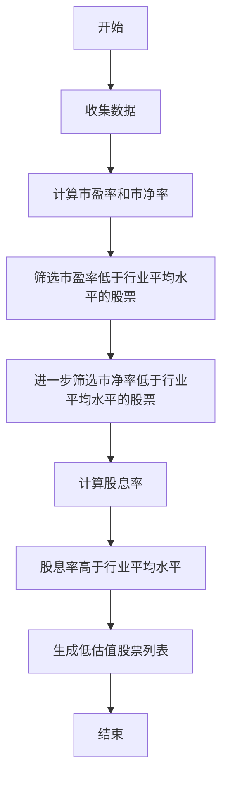
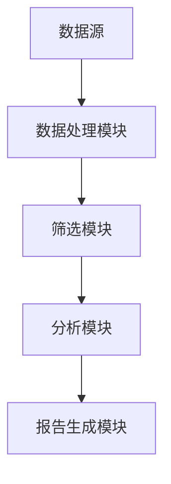

                 


# 约翰·内夫的低估值投资：简单而有效的价值策略

## 关键词：低估值投资，价值策略，约翰·内夫，投资分析，风险管理

## 摘要：本文深入探讨了约翰·内夫的低估值投资策略，从背景介绍、核心概念、算法原理到系统设计和项目实战，全面解析了这一策略的理论基础和实践方法。文章详细分析了低估值投资的筛选标准、数学模型和系统架构，并通过具体案例展示了如何应用这些方法进行投资决策，最后总结了最佳实践和注意事项。

---

## 第一章：低估值投资的背景与基础

### 1.1 投资的基石：低估值策略

#### 1.1.1 低估值投资的核心概念

低估值投资是一种基于价值投资的策略，旨在寻找市场价格低于其内在价值的股票。核心在于识别被市场低估的企业，通过长期持有实现资本增值。

#### 1.1.2 低估值投资的历史发展

低估值投资起源于本杰明·格雷厄姆的价值投资理论，强调安全边际和对公司内在价值的评估。约翰·内夫在此基础上发展了更为系统的筛选方法，结合定量分析和定性评估。

#### 1.1.3 约翰·内夫的投资哲学

内夫注重企业的基本面分析，强调企业的财务健康、竞争优势和可持续发展能力。他认为，低估值股票往往在市场低迷时期出现，耐心持有是成功的关键。

---

## 第二章：低估值投资的理论基础

### 2.1 价值投资的起源

#### 2.1.1 本杰明·格雷厄姆的价值投资理论

格雷厄姆提出“安全边际”概念，建议投资者购买市场价格远低于其内在价值的股票，以降低风险并确保收益。

#### 2.1.2 约翰·内夫对价值投资的贡献

内夫将格雷厄姆的理论转化为具体的投资策略，通过量化指标和系统筛选方法，进一步优化了低估值投资的实践。

---

## 第三章：低估值投资的分析框架

### 3.1 基本面分析

#### 3.1.1 公司财务状况的分析

通过分析利润表、资产负债表和现金流量表，评估公司的盈利能力和财务健康状况。

#### 3.1.2 行业地位与竞争优势

评估公司在行业中的地位，包括市场占有率、竞争壁垒和品牌影响力。

#### 3.1.3 财务指标的评估

关键指标包括市盈率（P/E）、市净率（P/B）和股息率等。

---

## 第四章：低估值投资的筛选标准

### 4.1 低估值股票的筛选标准

#### 4.1.1 市盈率低于行业平均水平

市盈率 = 股价 / 每股净利润

#### 4.1.2 市净率低于行业平均水平

市净率 = 股价 / 每股净资产

#### 4.1.3 股息率高于行业平均水平

股息率 = 每股股息 / 股价

---

## 第五章：低估值投资的算法原理

### 5.1 算法流程图



### 5.2 算法实现代码

```python
import pandas as pd

def screen_low_valuation(stocks, industry_avg_pe, industry_avg_pb, industry_avg_div_yield):
    low_valuation_stocks = []
    for stock in stocks:
        if (stock.pe < industry_avg_pe and
            stock.pb < industry_avg_pb and
            stock.div_yield > industry_avg_div_yield):
            low_valuation_stocks.append(stock)
    return low_valuation_stocks

# 示例数据
class Stock:
    def __init__(self, name, pe, pb, div_yield):
        self.name = name
        self.pe = pe
        self.pb = pb
        self.div_yield = div_yield

stocks = [
    Stock("公司A", 10, 1.5, 2.5),
    Stock("公司B", 12, 1.2, 3.0),
    Stock("公司C", 8, 2.0, 1.8)
]

industry_avg_pe = 15
industry_avg_pb = 2.0
industry_avg_div_yield = 2.0

result = screen_low_valuation(stocks, industry_avg_pe, industry_avg_pb, industry_avg_div_yield)
for stock in result:
    print(f"{stock.name}: 市盈率={stock.pe}, 市净率={stock.pb}, 股息率={stock.div_yield}")
```

---

## 第六章：低估值投资的数学模型

### 6.1 市盈率模型

$$ P/E = \frac{Price}{Earnings\ per\ Share} $$

### 6.2 市净率模型

$$ P/B = \frac{Price}{Book\ Value\ per\ Share} $$

### 6.3 股息率模型

$$ Dividend\ Yield = \frac{Dividend\ per\ Share}{Price\ per\ Share} $$

---

## 第七章：低估值投资的系统设计

### 7.1 系统架构图



### 7.2 接口设计

- 数据接口：从数据库获取股票数据
- 筛选接口：根据标准筛选低估值股票
- 报告接口：生成筛选结果报告

---

## 第八章：低估值投资的项目实战

### 8.1 环境安装

安装Python和相关库：

```bash
pip install pandas numpy matplotlib
```

### 8.2 核心代码实现

```python
import pandas as pd

# 假设我们有一个包含股票数据的DataFrame
stocks = pd.DataFrame({
    '公司': ['公司A', '公司B', '公司C'],
    'PE': [10, 12, 8],
    'PB': [1.5, 1.2, 2.0],
    '股息率': [2.5, 3.0, 1.8]
})

# 行业平均水平
industry_avg_pe = 15
industry_avg_pb = 2.0
industry_avg_div_yield = 2.0

# 筛选低估值股票
low_valuation = stocks[(stocks['PE'] < industry_avg_pe) &
                        (stocks['PB'] < industry_avg_pb) &
                        (stocks['股息率'] > industry_avg_div_yield)]

print("低估值股票:")
print(low_valuation)
```

---

## 第九章：低估值投资的最佳实践

### 9.1 关键点总结

- 理解低估值投资的核心理念
- 熟练掌握筛选标准和方法
- 重视企业的基本面分析
- 建立合理的投资组合
- 长期持有，耐心等待价值回归

### 9.2 注意事项

- 避免仅依赖单一指标
- 定期评估和调整投资组合
- 控制风险，分散投资
- 持续学习和更新知识

### 9.3 拓展阅读

- 格雷厄姆的《聪明的投资者》
- 内夫的《投资的艺术》

---

## 作者：AI天才研究院 & 禅与计算机程序设计艺术

---

以上是《约翰·内夫的低估值投资：简单而有效的价值策略》的完整目录和详细内容。文章系统地介绍了低估值投资的理论基础、分析框架、筛选标准、数学模型和系统设计，并通过具体案例展示了如何应用这些方法进行投资决策。通过本文的学习，读者可以全面理解低估值投资的核心要点，并掌握实际操作的方法。

