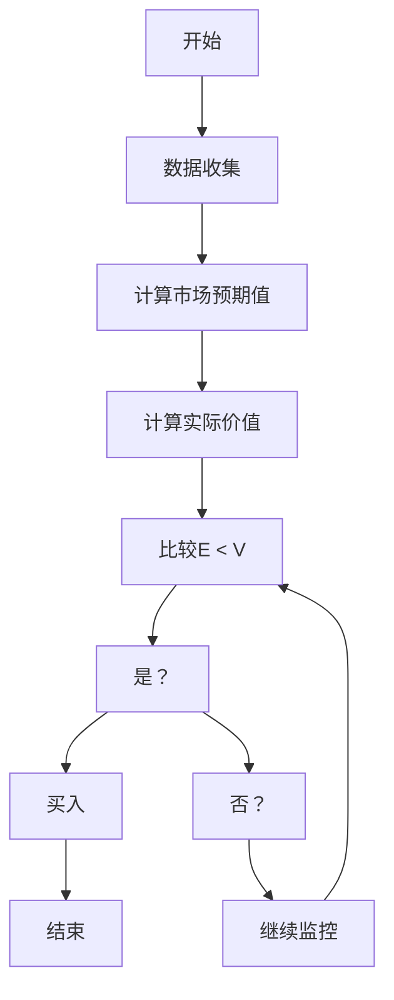
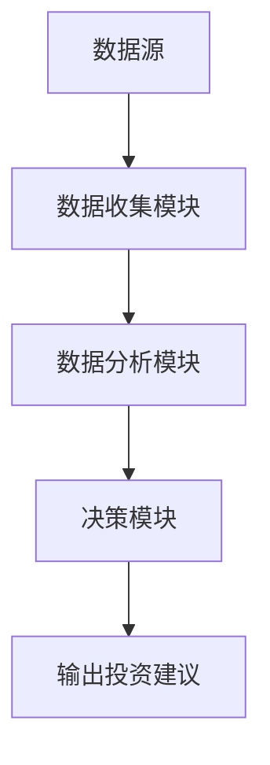
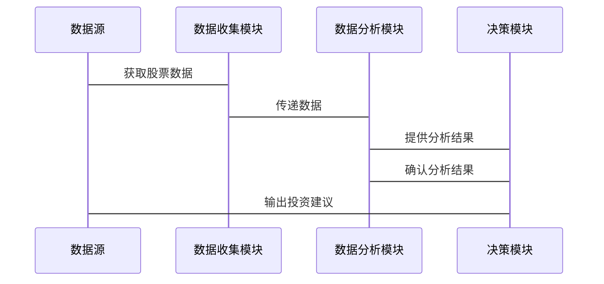

                 


# 约翰·内夫的低预期投资策略

> 关键词：低预期投资策略, 约翰·内夫, 价值投资, 投资策略, 股票投资

> 摘要：本文深入分析了约翰·内夫的低预期投资策略，探讨其核心概念、数学模型、系统设计与实际应用。通过详细阐述策略的背景、原理、实施步骤及案例分析，为投资者提供全面的指导。

---

# 第一部分: 约翰·内夫的低预期投资策略背景与基础

## 第1章: 低预期投资策略的定义与背景

### 1.1 低预期投资策略的定义

#### 1.1.1 投资策略的基本概念
投资策略是投资者在金融市场中为实现特定目标而采取的系统化方法。低预期投资策略是一种基于市场参与者对资产未来价值预期低于其实际价值的投资方法。

#### 1.1.2 低预期的定义与特征
低预期是指市场参与者对某资产的未来价值预测低于该资产的真实内在价值。其核心特征包括：
1. **低估性**：资产的价格低于其真实价值。
2. **可持续性**：低估状态在较长时间内存在。
3. **可验证性**：可以通过基本面分析验证低估的存在。

#### 1.1.3 低预期投资策略的核心目标
通过识别被市场低估的资产，以低于其内在价值的价格买入，并在价值回归时卖出，从而实现超额收益。

---

### 1.2 低预期投资策略与其他投资策略的对比

#### 1.2.1 市场有效性的假设
低预期策略基于市场无效性的假设，认为市场并非总是正确定价资产。

#### 1.2.2 价值投资与成长投资的差异
- **价值投资**：寻找市场价格低于内在价值的资产。
- **成长投资**：投资于具有高增长潜力的公司，关注未来收益而非当前价格。
- **低预期策略**：结合价值投资和成长投资，关注市场价格低于未来价值的资产。

#### 1.2.3 低预期策略的独特性
低预期策略强调买入时的价格低于未来价值，而非仅关注当前价格与内在价值的差异。

---

### 1.3 约翰·内夫的投资理念

#### 1.3.1 内夫的投资哲学
内夫认为，市场波动和投资者情绪会导致资产价格偏离其内在价值，长期来看，价格终将回归价值。

#### 1.3.2 内夫的投资方法
内夫专注于寻找那些市场价格低于未来价值的公司，并长期持有这些股票，直到价值被市场发现。

#### 1.3.3 内夫投资策略的演变
内夫的投资策略从早期的纯价值投资逐步演变为低预期投资，更加注重对公司未来价值的评估。

---

## 第2章: 低预期投资策略的核心概念

### 2.1 低预期的数学模型

#### 2.1.1 市场预期的形成过程
市场预期是投资者对资产未来价值的预测，受市场情绪、信息不对称等因素影响。

#### 2.1.2 市场预期与实际价值的偏差
低预期策略的核心在于发现市场预期低于实际价值的资产。

#### 2.1.3 低预期策略的数学表达式
$$ E = \text{市场预期值} $$
$$ V = \text{实际价值} $$
$$ \text{低预期条件} = E < V $$

---

### 2.2 核心概念对比表格

| 概念       | 定义                                                                 |
|------------|----------------------------------------------------------------------|
| 市场预期值   | 投资者对资产未来价值的预测值。                                       |
| 实际价值    | 资产的真实内在价值，通常通过基本面分析确定。                        |
| 低预期条件  | 市场预期值低于实际价值的条件，即 $$ E < V $$。                      |

---

### 2.3 核心概念的ER实体关系图

```mermaid
erd
  图表标题: 低预期投资策略的核心概念

  实体: 市场预期值
  实体: 实际价值
  实体: 低预期条件

  关系: 市场预期值 <--- 关联关系 --> 实际价值
  关系: 实际价值 <--- 关联关系 --> 低预期条件
```

---

## 第3章: 低预期投资策略的算法原理

### 3.1 低预期策略的算法流程

#### 3.1.1 算法流程图



---

### 3.2 算法实现的Python代码

```python
import pandas as pd

# 数据收集
def collect_data(tickers):
    # 假设tickers为股票代码列表
    # 返回数据框
    return pd.DataFrame()

# 计算市场预期值
def compute_market_expectation(df):
    # 简单假设：市场预期值为当前股价的1.2倍
    df['E'] = df['收盘价'] * 1.2
    return df

# 计算实际价值
def compute_intrinsic_value(df):
    # 简单假设：实际价值为市盈率乘以净利润
    df['V'] = df['市盈率'] * df['净利润']
    return df

# 比较E和V
def is_low_expectation(df):
    df['低预期'] = df['E'] < df['V']
    return df

# 主函数
def main():
    tickers = ['AAPL', 'GOOGL', 'MSFT']
    df = collect_data(tickers)
    df = compute_market_expectation(df)
    df = compute_intrinsic_value(df)
    df = is_low_expectation(df)
    print("低预期股票：", df[df['低预期']].index)

if __name__ == "__main__":
    main()
```

---

### 3.3 算法原理的数学模型

#### 3.3.1 市场预期值计算
$$ E = P \times (1 + r) $$
其中，\( P \) 是当前价格，\( r \) 是预期收益率。

#### 3.3.2 实际价值计算
$$ V = \frac{Earnings}{Discount Rate} $$
其中，\( Earnings \) 是净利润，\( Discount Rate \) 是折现率。

---

## 第4章: 低预期投资策略的系统架构设计

### 4.1 系统功能设计

#### 4.1.1 数据收集模块
- 从股票数据库中获取历史数据。
- 包括股价、市盈率、净利润等指标。

#### 4.1.2 数据分析模块
- 计算市场预期值。
- 计算实际价值。
- 比较市场预期值与实际价值。

#### 4.1.3 决策模块
- 确定是否满足低预期条件。
- 输出投资建议。

---

### 4.2 系统架构图



---

### 4.3 系统交互图



---

## 第5章: 低预期投资策略的项目实战

### 5.1 环境安装

#### 5.1.1 安装必要的库
```bash
pip install pandas numpy matplotlib
```

### 5.2 核心实现代码

#### 5.2.1 数据收集模块

```python
import pandas as pd
import requests
from bs4 import BeautifulSoup

def collect_stock_data(tickers):
    data = []
    for ticker in tickers:
        url = f"https://finance.yahoo.com/quote/{ticker}"
        response = requests.get(url)
        soup = BeautifulSoup(response.text, 'html.parser')
        # 提取数据
        price = soup.find('div', {'class': 'price'}).get_text()
        pe_ratio = soup.find('div', {'data-testid': 'peRatio'}).get_text()
        net_income = soup.find('div', {'data-testid': 'netIncome'}).get_text()
        data.append({
            'Ticker': ticker,
            'Price': float(price),
            'PE Ratio': float(pe_ratio),
            'Net Income': float(net_income)
        })
    return pd.DataFrame(data)
```

#### 5.2.2 数据分析模块

```python
def compute_market_expectation(df):
    df['E'] = df['Price'] * 1.2
    return df

def compute_intrinsic_value(df):
    df['V'] = df['PE Ratio'] * df['Net Income']
    return df

def is_low_expectation(df):
    df['低预期'] = df['E'] < df['V']
    return df
```

#### 5.2.3 决策模块

```python
def make_investment_decision(df):
    recommendations = []
    for _, row in df.iterrows():
        if row['低预期']:
            recommendations.append(row['Ticker'])
    return recommendations
```

---

### 5.3 案例分析

#### 5.3.1 数据收集与预处理
```python
tickers = ['AAPL', 'GOOGL', 'MSFT']
df = collect_stock_data(tickers)
print(df)
```

#### 5.3.2 分析结果
```python
df = compute_market_expectation(df)
df = compute_intrinsic_value(df)
df = is_low_expectation(df)
print("低预期股票：", df[df['低预期']].Ticker.values)
```

---

## 第6章: 低预期投资策略的最佳实践与小结

### 6.1 最佳实践

1. **长期视角**：低预期策略强调长期持有，避免频繁交易。
2. **基本面分析**：准确评估公司未来价值是策略的核心。
3. **分散投资**：通过分散投资降低风险。
4. **持续监控**：定期评估投资组合，及时调整。

### 6.2 小结

约翰·内夫的低预期投资策略通过识别市场价格低于未来价值的资产，为投资者提供了一种有效的投资方法。该策略结合了价值投资和成长投资的理念，强调长期持有和价值回归。

---

# 作者

作者：AI天才研究院 & 禅与计算机程序设计艺术

---

通过以上内容，我们可以看到，低预期投资策略不仅是一种有效的投资方法，还涉及到丰富的数学模型和系统设计。希望本文能为投资者提供有价值的指导和启示。

