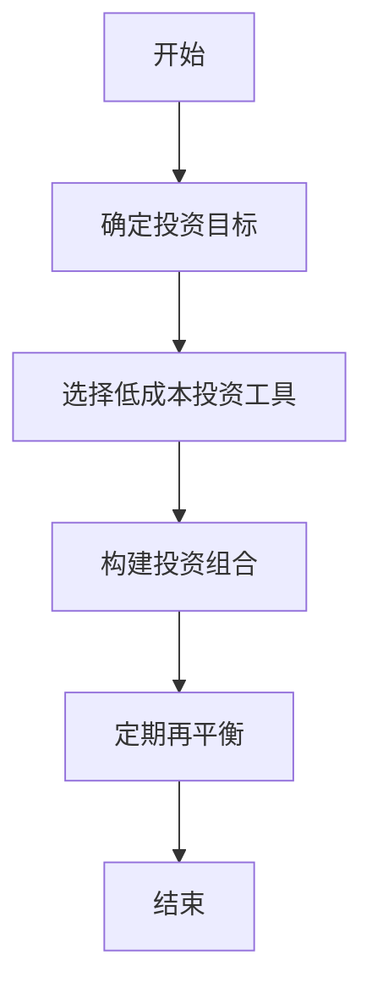
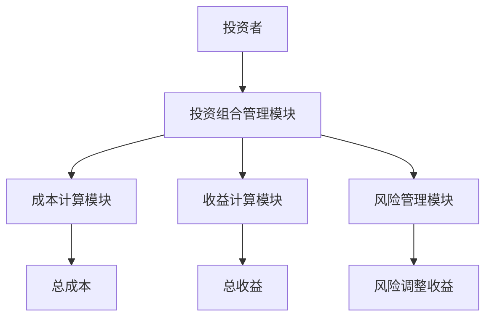

                 


# 约翰·博格尔的成本敏感型投资策略

## 关键词：
- 成本敏感型投资
- 约翰·博格尔
- 投资策略
- 投资成本
- 风险管理

## 摘要：
本文深入探讨了约翰·博格尔的成本敏感型投资策略，从理论到实践，全面分析了成本在投资决策中的重要性。通过背景介绍、核心概念、算法原理、系统分析和项目实战，本文为读者提供了全面的理解和实践指南。文章结构清晰，内容详实，适合投资专业人士和对低成本投资感兴趣的读者阅读。

---

## 第一部分: 成本敏感型投资策略的背景与核心概念

### 第1章: 成本敏感型投资策略的背景介绍

#### 1.1 成本敏感型投资的定义与特点
##### 1.1.1 成本敏感型投资的定义
成本敏感型投资是一种强调降低投资成本以最大化长期收益的投资策略。它关注于通过减少交易费用、管理费和其他相关成本，来优化投资组合的表现。

##### 1.1.2 成本敏感型投资的核心特点
- **低成本导向**：优先选择费用较低的投资工具，如指数基金。
- **长期视角**：注重长期收益，而非短期市场波动。
- **被动管理**：通过被动投资减少管理成本和交易频率。

##### 1.1.3 成本敏感型投资与传统投资的区别
| 方面       | 成本敏感型投资                  | 传统主动型投资                  |
|------------|--------------------------------|----------------------------------|
| 管理方式   | 被动跟踪指数                   | 主动选股和市场时机选择           |
| 成本结构   | 低管理费、低交易费             | 高管理费、高交易费               |
| 风险控制   | 通过分散投资降低风险           | 依赖管理者的选股能力             |

#### 1.2 投资成本的影响因素
##### 1.2.1 交易成本的定义与分类
交易成本包括佣金、买卖价差等，通常在高频交易或频繁换手时显著增加。

##### 1.2.2 管理费用对投资回报的影响
管理费用（如基金的管理费）会直接从基金资产中扣除，长期来看会显著影响最终收益。

##### 1.2.3 市场流动性对成本的影响
流动性差的市场可能导致较高的买卖价差，增加交易成本。

#### 1.3 约翰·博格尔的成本敏感型投资理念
##### 1.3.1 约翰·博格尔的生平与投资哲学
博格尔是低成本投资的倡导者，强调长期投资和分散投资的重要性。

##### 1.3.2 成本敏感型投资的核心思想
- **低成本优先**：选择费用最低的投资工具。
- **长期持有**：避免频繁交易以降低成本。
- **分散投资**：通过指数基金实现广泛分散。

##### 1.3.3 成本敏感型投资的实践意义
通过降低投资成本，投资者可以实现更高的净收益，尤其是在长期投资中。

---

## 第2章: 成本敏感型投资的核心概念与联系

### 2.1 成本、收益与风险的三元关系
#### 2.1.1 成本对收益的影响
低成本策略通过减少费用，使更多资金用于投资标的资产，从而提高收益。

#### 2.1.2 风险对投资决策的影响
风险与收益成正比，但通过分散投资可以降低非系统性风险。

#### 2.1.3 成本敏感型投资中的权衡与优化
在成本敏感型投资中，投资者需要在成本、收益和风险之间找到最佳平衡点。

### 2.2 核心概念原理
#### 2.2.1 投资成本的数学模型
投资组合的总成本可以表示为：
$$ \text{总成本} = \sum_{i=1}^{n} (c_i \times w_i) $$
其中，\( c_i \) 是第i项投资工具的费用率，\( w_i \) 是其权重。

#### 2.2.2 投资收益的预期与实际
投资收益可以通过以下公式计算：
$$ \text{收益} = \sum_{i=1}^{n} (r_i \times w_i) $$
其中，\( r_i \) 是第i项投资工具的预期收益率。

#### 2.2.3 风险的度量与管理
使用夏普比率衡量投资组合的风险调整后收益：
$$ \text{夏普比率} = \frac{(\text{收益} - \text{无风险利率})}{\text{波动率}} $$

### 2.3 概念属性特征对比表格
| 特性         | 成本敏感型投资                 | 主动型投资                   |
|--------------|-------------------------------|-----------------------------|
| 管理方式     | 被动跟踪指数                   | 主动选股和时机选择            |
| 成本结构     | 低费用                         | 高费用                       |
| 风险控制     | 分散化投资                     | 集中化投资                   |

### 2.4 ER实体关系图架构
```mermaid
er
    投资者 ----> 投资组合: 持有
    投资组合 ----> 资产: 包含
    资产 ----> 成本: 关联
    成本 ----> 风险: 影响
```

---

## 第3章: 成本敏感型投资的算法原理

### 3.1 算法原理概述
#### 3.1.1 成本敏感型投资的优化目标
最大化长期净收益，同时最小化投资成本。

#### 3.1.2 算法的核心思想
通过优化投资组合的构造，降低总成本并最大化收益。

#### 3.1.3 算法的输入与输出
- 输入：市场数据、费用结构、投资目标。
- 输出：优化后的投资组合。

### 3.2 算法流程图


### 3.3 算法的数学模型与公式
#### 3.3.1 投资成本的计算公式
$$ \text{总成本} = \sum_{i=1}^{n} (c_i \times w_i) $$

#### 3.3.2 投资收益的计算公式
$$ \text{收益} = \sum_{i=1}^{n} (r_i \times w_i) $$

#### 3.3.3 风险的度量公式
$$ \text{波动率} = \sqrt{\sum_{i=1}^{n} w_i^2 \sigma_i^2} $$

---

## 第4章: 成本敏感型投资的系统分析与架构设计

### 4.1 问题场景介绍
#### 4.1.1 投资者的需求分析
- 需要降低投资成本。
- 需要实现长期稳健的收益。

#### 4.1.2 市场环境的分析
- 高成本投资工具的广泛存在。
- 低成本投资工具的崛起。

#### 4.1.3 竞争对手的分析
- 主动管理型基金面临低成本指数基金的挑战。

### 4.2 系统功能设计
#### 4.2.1 投资成本的计算模块
- 输入：投资组合的费用结构。
- 输出：总成本。

#### 4.2.2 投资收益的计算模块
- 输入：投资组合的预期收益率。
- 输出：总收益。

#### 4.2.3 风险管理模块
- 输入：投资组合的波动率。
- 输出：风险调整后的收益。

### 4.3 系统架构设计


---

## 第5章: 成本敏感型投资的项目实战

### 5.1 环境安装
- 安装必要的投资分析工具，如Python、Pandas、Matplotlib。

### 5.2 核心实现
```python
import pandas as pd

# 假设data为投资组合的数据
data = {'资产': ['股票', '债券', '现金'], '权重': [0.6, 0.3, 0.1], '费用率': [0.01, 0.005, 0]}
df = pd.DataFrame(data)

# 计算总成本
total_cost = sum(df['权重'] * df['费用率'])
print(f"总成本：{total_cost}")
```

### 5.3 案例分析
分析一个典型的投资组合，计算其总成本和预期收益。

### 5.4 项目小结
通过实际案例，验证低成本投资策略的有效性。

---

## 第6章: 成本敏感型投资的总结与展望

### 6.1 总结
- 成本敏感型投资是一种有效的长期投资策略。
- 关注低成本工具和长期持有是关键。

### 6.2 展望
- 低成本投资工具的进一步发展。
- 更多投资者采用低成本策略。

---

## 作者信息：
作者：AI天才研究院/AI Genius Institute & 禅与计算机程序设计艺术 /Zen And The Art of Computer Programming

---

通过以上结构，本文全面分析了约翰·博格尔的成本敏感型投资策略，从理论到实践，为投资者提供了详细的指导和实践方案。

