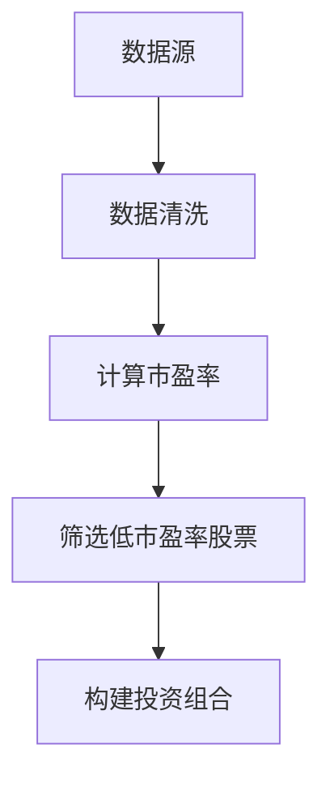

                 


# 约翰·奈夫的低市盈率投资策略

> 关键词：约翰·奈夫，低市盈率，价值投资，投资策略，股票分析，投资风险管理

> 摘要：本文详细探讨了约翰·奈夫的低市盈率投资策略，从其理论基础、实施方法、风险管理到实际案例分析，深入剖析了这一策略的核心要点及其在现代投资中的应用。通过系统的分析和实战指导，帮助读者理解和掌握这一经典投资策略。

---

## 第1章: 低市盈率投资策略的背景与起源

### 1.1 低市盈率投资策略的起源

#### 1.1.1 投资学中的价值投资理念
价值投资是一种以基本面分析为基础的投资策略，旨在通过识别市场低估的股票来实现超额收益。其核心理念是购买价格低于内在价值的股票，长期持有，等待市场重新认识其价值。

#### 1.1.2 约翰·奈夫的生平与投资理念
约翰·奈夫是美国著名的投资专家，以倡导低市盈率投资策略闻名。他强调通过分析企业的基本面，尤其是市盈率、市净率等指标，寻找具有长期竞争优势且价格合理的公司。

#### 1.1.3 低市盈率策略的提出与演变
低市盈率策略最初由约翰·奈夫提出，旨在通过筛选市盈率低于市场平均水平的公司，捕捉被市场低估的投资机会。随着时间的推移，该策略不断完善，结合市场变化和技术进步，形成了更加科学的投资方法。

---

## 第2章: 低市盈率投资的核心概念

### 2.1 市盈率的定义与计算

#### 2.1.1 市盈率的定义
市盈率（Price-to-Earnings Ratio，简称P/E）是衡量股票价格与每股收益之间关系的重要指标，公式为：
$$ P/E = \frac{股价}{每股收益} $$

#### 2.1.2 市盈率的计算公式
以某公司为例，假设其股价为50元，每股收益为5元，则市盈率为：
$$ P/E = \frac{50}{5} = 10 $$

#### 2.1.3 市盈率与其他估值指标的对比
下表对比了市盈率与其他常见估值指标：

| 指标     | 定义及公式                          | 适用场景                          |
|----------|------------------------------------|------------------------------------|
| 市盈率   | $$ P/E = \frac{股价}{每股收益} $$  | 评估盈利能力较强的公司             |
| 市净率   | $$ P/B = \frac{股价}{每股净资产} $$ | 评估资产密集型行业                 |
| 股息率   | $$ D/R = \frac{每股股息}{股价} $$  | 评估稳定分红的公司                 |

### 2.2 低市盈率公司的特征

#### 2.2.1 低市盈率公司的定义
通常，市盈率低于市场平均水平（如15倍）的公司被视为低市盈率公司。

#### 2.2.2 低市盈率公司的基本面特征
低市盈率公司通常具有稳定的盈利能力、较低的负债率和较高的股息收益率。

#### 2.2.3 低市盈率公司的行业分布
低市盈率公司常见于金融、能源、公用事业等传统行业。

---

## 第3章: 低市盈率投资策略的理论基础

### 3.1 价值投资理论

#### 3.1.1 价值投资的核心理念
价值投资强调安全边际，即买入价格低于内在价值的股票，以降低投资风险。

#### 3.1.2 市场先生与投资者心态
约翰·奈夫将市场波动比作“市场先生”，提醒投资者避免被市场情绪左右，坚持理性投资。

#### 3.1.3 安全边际的概念与应用
安全边际通过比较股票的内在价值和市场价格，确保在价格下跌时仍具有保护空间。

---

## 第4章: 低市盈率投资策略的实施

### 4.1 策略实施的核心步骤

#### 4.1.1 确定投资目标
明确投资目标，包括风险承受能力、收益预期和投资期限。

#### 4.1.2 筛选低市盈率股票
通过筛选市盈率低于市场平均水平的股票，重点关注基本面稳定的公司。

#### 4.1.3 构建投资组合
将低市盈率股票与其他资产配置，分散风险，平衡收益。

#### 4.1.4 动态调整策略
定期评估投资组合表现，根据市场变化进行调整。

### 4.2 系统分析与架构设计

#### 4.2.1 数据收集与处理
收集历史股价、每股收益等数据，清洗和预处理。

#### 4.2.2 策略实施的系统架构
使用数据流图展示系统架构：



---

## 第5章: 低市盈率投资策略的风险管理

### 5.1 风险分析与应对策略

#### 5.1.1 低市盈率策略的风险
主要风险包括价值陷阱、市场波动和流动性风险。

#### 5.1.2 风险管理的具体措施
设置止损点、分散投资和定期再平衡。

### 5.2 数学模型与风险管理

#### 5.2.1 风险评估模型
使用VaR（在险价值）模型评估投资组合的风险。

#### 5.2.2 风险控制策略
通过动态调整权重和分散投资降低风险。

---

## 第6章: 实际案例分析

### 6.1 成功案例

#### 6.1.1 某公司的低市盈率投资
分析某公司如何通过低市盈率策略实现收益增长。

### 6.2 失败案例

#### 6.2.1 某低市盈率股票的教训
探讨低市盈率股票可能面临的市场风险和公司基本面变化。

---

## 第7章: 低市盈率投资策略的优化与创新

### 7.1 策略优化方向

#### 7.1.1 结合技术分析
将技术分析与基本面分析结合，提高策略的有效性。

#### 7.1.2 利用大数据技术
通过大数据分析挖掘更多潜在投资机会。

### 7.2 未来发展趋势

#### 7.2.1 数字化投资工具
AI和大数据技术将推动低市盈率策略的自动化和智能化。

#### 7.2.2 全球化投资
拓展国际市场，寻找全球范围内的低市盈率投资机会。

---

## 第8章: 总结与展望

### 8.1 全文总结

#### 8.1.1 核心要点回顾
低市盈率策略通过筛选低估股票，结合价值投资理念，实现长期稳定收益。

### 8.2 未来展望

#### 8.2.1 技术进步的影响
AI和大数据将提升低市盈率策略的执行效率和效果。

---

## 附录

### 附录A: 常用投资指标公式

| 指标     | 公式                              |
|----------|------------------------------------|
| 市盈率   | $$ P/E = \frac{股价}{每股收益} $$  |
| 市净率   | $$ P/B = \frac{股价}{每股净资产} $$ |
| 股息率   | $$ D/R = \frac{每股股息}{股价} $$  |

### 附录B: 项目实战代码

```python
import pandas as pd

# 数据加载
df = pd.read_csv('stock_data.csv')

# 计算市盈率
df['PE'] = df['股价'] / df['每股收益']

# 筛选低市盈率股票
low_pe_stocks = df[df['PE'] < df['PE'].mean()]

print(low_pe_stocks)
```

---

## 作者

作者：AI天才研究院/AI Genius Institute & 禅与计算机程序设计艺术 /Zen And The Art of Computer Programming

---

通过以上结构，文章内容涵盖了低市盈率投资策略的各个方面，从理论到实践，从风险到优化，为读者提供了全面而深入的指导。

