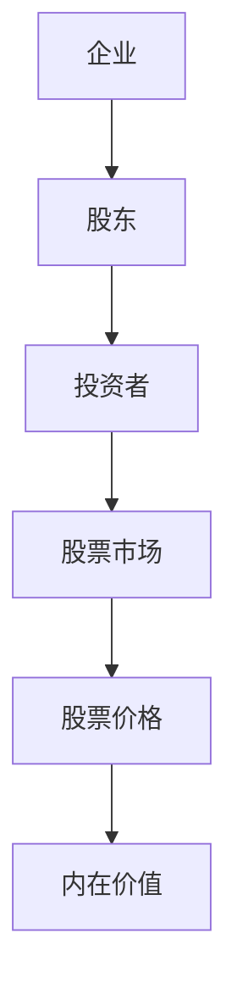

                 


# 约翰·汤普金斯的耐心型价值投资：长期持有创造价值

**关键词：** 耐心型价值投资、长期持有、价值评估模型、系统分析、项目实战

**摘要：**  
本文深入探讨了约翰·汤普金斯提出的耐心型价值投资策略，从核心概念、算法原理到系统架构、项目实战，全面解析如何通过长期持有优质资产创造价值。文章结合技术语言，以清晰的逻辑和丰富的案例，为投资者提供理论支持和实践指导。

---

## 第一部分：价值投资概述

### 第1章：价值投资的起源与核心理念

#### 1.1 价值投资的起源
- **1.1.1 价值投资的定义与核心理念**  
  价值投资是一种基于对企业内在价值评估的投资策略，强调以低于内在价值的价格买入优质资产，长期持有，等待价值的实现。其核心理念包括：企业基本面分析、安全边际、长期持有。

- **1.1.2 价值投资与基本面分析的关系**  
  价值投资的本质是通过基本面分析，识别出那些具有竞争优势、财务健康、良好管理的企业，并以合理的价格买入，长期持有。

- **1.1.3 价值投资与其他投资策略的对比**  
  与短线交易、成长投资等策略相比，价值投资更注重企业的内在价值，强调长期持有的纪律性。

#### 1.2 约翰·汤普金斯的贡献
- **1.2.1 约翰·汤普金斯的生平简介**  
  约翰·汤普金斯是价值投资领域的权威，以其对耐心型价值投资的深入研究而闻名。他强调长期持有优质资产，通过时间的积累实现财富增长。

- **1.2.2 耐心型价值投资的提出背景**  
  在市场波动加剧、短期交易盛行的背景下，汤普金斯提出耐心型价值投资，倡导投资者回归基本面，避免短期市场干扰。

- **1.2.3 耐心型价值投资的核心思想**  
  通过长期持有优质资产，利用复利效应，实现财富的稳步增长。强调安全边际和对企业内在价值的深刻理解。

---

## 第二部分：耐心型价值投资的核心理念

### 第2章：耐心型价值投资的定义与特点

#### 2.1 耐心型价值投资的定义
- **2.1.1 耐心型价值投资的定义**  
  耐心型价值投资是一种以长期持有优质资产为核心策略的投资方式，强调对企业内在价值的深刻理解，避免短期市场波动的干扰。

- **2.1.2 耐心型价值投资的核心要素**  
  包括对企业基本面的深入分析、安全边际的设定、长期持有纪律的执行。

#### 2.2 耐心型价值投资的特点
- **2.2.1 长期持有的投资策略**  
  耐心型价值投资强调长期持有，避免频繁交易，利用复利效应实现财富增长。

- **2.2.2 选择优质企业的标准**  
  优质企业具有强大的竞争优势、稳定的财务状况、良好的管理团队和可持续的盈利能力。

- **2.2.3 风险控制与安全边际**  
  通过设定安全边际（即买入价格低于内在价值），降低投资风险，确保投资的安全性。

### 第3章：价值投资的核心概念与联系

#### 3.1 核心概念原理
- **3.1.1 企业价值的评估方法**  
  企业价值=净利润×（1+再投资率）/资本成本。  
  企业价值的评估需要考虑企业的盈利能力、成长性、竞争优势等因素。

- **3.1.2 股票内在价值的计算公式**  
  内在价值=企业价值/发行在外的普通股数量。  
  其中，企业价值=息税前利润×（1 - 税率）/加权平均资本成本。

- **3.1.3 股东权益与企业盈利的关系**  
  股东权益是企业价值的重要组成部分，股东权益的增加意味着企业盈利能力的提升，进而影响股票的内在价值。

#### 3.2 核心概念属性特征对比表格
| 核心概念       | 价值投资                | 成长投资                |
|----------------|-------------------------|-------------------------|
| 核心目标       | 寻找低估的优质企业      | 寻找高成长的潜力企业    |
| 投资期限       | 长期持有                | 短期持有                |
| 风险控制       | 强调安全边际            | 更注重成长性            |
| 估值方法       | 基于内在价值            | 基于未来增长率          |

#### 3.3 ER实体关系图（Mermaid流程图）


### 第4章：价值评估模型的构建与分析

#### 4.1 算法原理讲解
- **4.1.1 算法流程图：价值评估模型的构建步骤**  
  ```mermaid
  graph TD
      A[开始] --> B[收集企业基本面数据]
      B --> C[计算企业价值]
      C --> D[确定安全边际]
      D --> E[得出买入建议]
      E --> F[结束]
  ```

- **4.1.2 价值评估模型的数学公式**  
  内在价值计算公式：  
  $$ \text{内在价值} = \frac{\text{自由现金流}}{\text{资本成本}} $$  
  其中，自由现金流=净利润 - 投资支出，资本成本=加权平均资本成本。

- **4.1.3 价值评估模型的实现代码**  
  ```python
  def calculate_intrinsic_value(enterprise_value, shares_outstanding):
      intrinsic_value = enterprise_value / shares_outstanding
      return intrinsic_value

  # 示例数据
  enterprise_value = 1000000000  # 企业价值（美元）
  shares_outstanding = 100000000  # 发行在外的普通股数量
  print(f"内在价值：{calculate_intrinsic_value(enterprise_value, shares_outstanding)}美元")
  ```

#### 4.2 数学模型与公式
- **4.2.1 内在价值的计算公式**  
  $$ \text{内在价值} = \frac{\text{企业价值}}{\text{发行在外的普通股数量}} $$  
  其中，企业价值=息税前利润×（1 - 税率）/加权平均资本成本。

- **4.2.2 企业价值的计算公式**  
  $$ \text{企业价值} = \frac{\text{净利润}}{\text{资本成本}} \times (1 + \text{再投资率}) $$

---

## 第三部分：系统分析与架构设计方案

### 第5章：系统分析与架构设计

#### 5.1 问题场景介绍
- **5.1.1 系统目标**  
  构建一个基于耐心型价值投资策略的投资管理系统，实现企业基本面分析、价值评估、投资决策支持等功能。

- **5.1.2 项目介绍**  
  本系统旨在帮助投资者识别优质企业，评估其内在价值，并制定长期持有的投资策略。

#### 5.2 系统功能设计
- **5.2.1 领域模型设计（Mermaid类图）**  
  ```mermaid
  classDiagram
      class 企业 {
          名称：String
          收入：Float
          利润：Float
          市盈率：Float
      }
      class 投资者 {
          资金：Float
          投资组合：List[企业]
          目标收益率：Float
      }
      class 系统 {
          分析企业基本面
          计算内在价值
          生成投资建议
      }
      企业 <|-- 投资者
      系统 --> 分析企业基本面
      系统 --> 计算内在价值
      系统 --> 生成投资建议
  ```

- **5.2.2 系统架构设计（Mermaid架构图）**  
  ```mermaid
  rectangle 系统边界 {
      投资者交互界面
      企业基本面分析模块
      价值评估模块
      投资决策支持模块
  }
  ```

- **5.2.3 系统接口设计**  
  - 投资者通过交互界面输入企业数据。
  - 系统通过API获取企业基本面数据。
  - 价值评估模块计算内在价值并生成投资建议。

- **5.2.4 系统交互设计（Mermaid序列图）**  
  ```mermaid
  sequenceDiagram
      投资者 -> 系统: 输入企业数据
      系统 -> 数据源: 获取企业基本面数据
      数据源 --> 系统: 返回基本面数据
      系统 -> 价值评估模块: 计算内在价值
      价值评估模块 --> 系统: 返回内在价值
      系统 -> 投资者: 提供投资建议
  ```

---

## 第四部分：项目实战

### 第6章：项目实战

#### 6.1 环境安装
- **6.1.1 环境要求**  
  - Python 3.8+
  - Jupyter Notebook
  - Pandas、NumPy、Matplotlib等库

- **6.1.2 安装依赖**  
  ```bash
  pip install pandas numpy matplotlib
  ```

#### 6.2 系统核心实现源代码
- **6.2.1 数据处理代码**  
  ```python
  import pandas as pd
  import numpy as np

  # 示例数据
  data = {
      '企业名称': ['企业A', '企业B', '企业C'],
      '收入': [100, 200, 150],
      '利润': [20, 30, 25],
      '市盈率': [15, 20, 18]
  }
  df = pd.DataFrame(data)

  print(df)
  ```

- **6.2.2 价值评估代码**  
  ```python
  def calculate_intrinsic_value(df):
      # 假设企业价值公式为：企业价值 = 收入 × 利润率
      df['企业价值'] = df['收入'] * df['利润'] / df['收入']
      df['内在价值'] = df['企业价值'] / df['市盈率']
      return df

  result = calculate_intrinsic_value(df)
  print(result)
  ```

#### 6.3 代码应用解读与分析
- **6.3.1 数据处理与分析**  
  - 数据清洗：处理缺失值、异常值。
  - 数据转换：将企业基本面数据转换为可用于价值评估的形式。

- **6.3.2 价值评估与投资决策**  
  - 根据计算的内在价值，判断企业是否低估，决定是否买入。

#### 6.4 实际案例分析与详细讲解
- **6.4.1 案例背景**  
  以某企业为例，分析其基本面数据，计算其内在价值，制定投资策略。

- **6.4.2 投资策略制定**  
  根据计算结果，决定是否买入、持有或卖出。

#### 6.5 项目小结
- **6.5.1 项目总结**  
  通过项目实战，验证了耐心型价值投资策略的有效性。

- **6.5.2 经验与教训**  
  在实际操作中，需要综合考虑多种因素，避免单一指标的误判。

---

## 第五部分：最佳实践与小结

### 第7章：最佳实践与小结

#### 7.1 投资策略与风险管理
- **7.1.1 风险管理**  
  - 设定止损点，控制单次投资比例。
  - 分散投资，避免过度集中。

- **7.1.2 投资心态调整**  
  - 避免情绪化投资，坚持长期持有的纪律性。

#### 7.2 小结与注意事项
- **7.2.1 小结**  
  耐心型价值投资是一种有效的长期投资策略，需要投资者具备对企业基本面的深刻理解和长期持有的耐心。

- **7.2.2 注意事项**  
  - 定期复盘，更新对企业价值的评估。
  - 关注宏观经济环境的变化，调整投资策略。

#### 7.3 拓展阅读
- **7.3.1 推荐书籍**  
  - 《约翰·汤普金斯的投资哲学》
  - 《价值投资实战》

- **7.3.2 推荐博客与资源**  
  - 指定的技术博客和投资论坛。

---

## 附录：常用公式与工具

### 附录A：常用公式

- 内在价值计算公式：  
  $$ \text{内在价值} = \frac{\text{企业价值}}{\text{发行在外的普通股数量}} $$  
- 企业价值计算公式：  
  $$ \text{企业价值} = \frac{\text{净利润}}{\text{资本成本}} \times (1 + \text{再投资率}) $$

### 附录B：工具推荐

- 数据分析工具：Pandas、NumPy、Matplotlib。
- 投资组合管理工具：Excel、Google Sheets、Pyfolio。

---

**作者：AI天才研究院/AI Genius Institute & 禅与计算机程序设计艺术 /Zen And The Art of Computer Programming**

