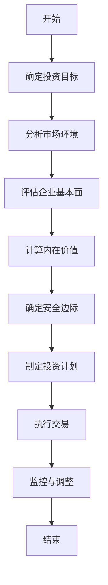
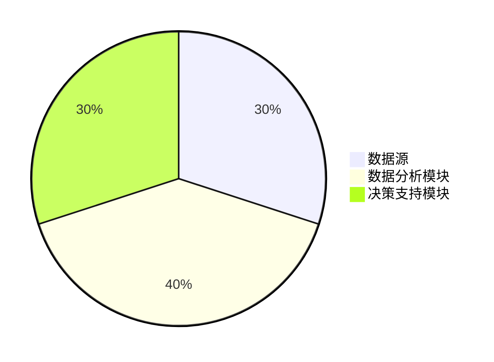
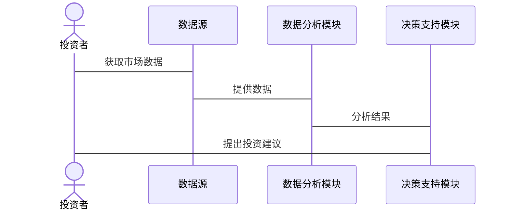

                 


# 约翰·聂夫的价值投资者心理建设

## 关键词：
- 价值投资
- 约翰·聂夫
- 投资心理
- 投资策略
- 风险控制

## 摘要：
本文从约翰·聂夫的价值投资理念出发，深入分析其心理建设的核心要素，包括投资哲学、决策逻辑、风险管理等。通过系统性地阐述其投资策略，结合实际案例，为读者提供一套科学的价值投资心理建设方法。

---

# 第一部分: 价值投资的背景与核心理念

## 第1章: 价值投资的起源与发展

### 1.1 价值投资的定义与核心理念
#### 1.1.1 价值投资的定义
价值投资是一种以企业内在价值为核心的投资理念，强调通过基本面分析寻找被市场低估的投资标的。其核心在于“买便宜的”，而非“追涨杀跌”。

#### 1.1.2 价值投资的核心理念
- **安全边际**：买入价格低于内在价值，确保投资的安全性。
- **长期视角**：关注企业的长期盈利能力，而非短期市场波动。
- **逆向思维**：在市场恐慌时寻找机会，在市场狂热时保持冷静。

#### 1.1.3 价值投资与其它投资理念的区别
| 投资理念 | 核心观点 | 适用场景 |
|----------|----------|----------|
| 技术分析 | 通过价格和成交量预测市场趋势 | 适用于短期交易者 |
| 市场中性策略 | 通过多空平衡降低市场风险 | 适用于机构投资者 |
| 价值投资 | 寻找市场低估的优质企业 | 适用于长期投资者 |

### 1.2 约翰·聂夫的投资哲学
#### 1.2.1 约翰·聂夫的生平简介
约翰·聂夫（John Neff）是美国著名的价值投资者，曾担任Neidermyer, Schmeck, Neff & Brown证券公司的董事长。他以低市盈率投资策略闻名，强调通过深入研究找到被市场忽视的优质企业。

#### 1.2.2 约翰·聂夫的投资风格
- **低市盈率偏好**：聂夫倾向于投资市盈率低于市场平均水平的企业，认为这类企业更容易被市场低估。
- **注重企业质量**：他不仅关注价格，还关注企业的盈利能力、财务健康状况和管理团队。
- **长期持有**：聂夫倾向于长期持有优质股票，避免频繁交易。

#### 1.2.3 约翰·聂夫的成功案例
- **华盛顿邮报公司**：聂夫长期持有华盛顿邮报公司股票，该公司在他的投资期间表现优异。
- **IBM投资**：聂夫在IBM股价低迷时买入，长期持有，最终获得丰厚回报。

---

## 第2章: 价值投资的核心概念与原理

### 2.1 价值投资的核心概念
#### 2.1.1 市场先生理论
市场先生是本杰明·格雷厄姆提出的概念，指市场情绪的波动性。投资者应以理性应对市场的非理性波动，寻找市场先生的错误定价。

#### 2.1.2 安全边际
安全边际是指买入价格与内在价值之间的差距，确保即使市场出现波动，投资者仍能获得正收益。

#### 2.1.3 内在价值的计算
内在价值是企业未来现金流的现值，计算公式如下：
$$ V = \frac{CF}{r - g} $$
其中，$CF$为现金流，$r$为折现率，$g$为增长率。

### 2.2 价值投资的数学模型与公式
#### 2.2.1 内在价值的计算公式
$$ V = \frac{CF}{r - g} $$

#### 2.2.2 股票估值的多因子模型
多因子模型通过多个因子（如市盈率、市净率、股息率等）综合评估股票的价值。

#### 2.2.3 安全边际的计算方法
$$ \text{安全边际} = \text{内在价值} - \text{市场价格} $$

### 2.3 价值投资的系统性分析与架构
#### 2.3.1 投资决策的系统性分析
- **目标设定**：明确投资目标和风险承受能力。
- **市场分析**：通过宏观经济分析判断市场环境。
- **企业基本面分析**：包括财务报表分析、行业地位评估等。

#### 2.3.2 投资决策的流程图


---

## 第3章: 价值投资的系统架构设计

### 3.1 投资决策的系统架构
#### 3.1.1 数据接口设计
- 数据来源：包括财务报表、市场数据等。
- 数据清洗：对数据进行预处理，确保数据的准确性和完整性。

#### 3.1.2 系统功能设计
- **数据采集**：从多种数据源获取企业信息。
- **数据分析**：通过算法计算内在价值和安全边际。
- **决策支持**：基于分析结果生成投资建议。

#### 3.1.3 系统架构图


#### 3.1.4 系统交互序列图


---

## 第4章: 约翰·聂夫的投资策略与心理建设

### 4.1 约翰·聂夫的投资策略
#### 4.1.1 低市盈率投资法
- **定义**：选择市盈率低于市场平均水平的企业进行投资。
- **优势**：降低投资风险，提高安全边际。

#### 4.1.2 高质量企业的筛选标准
- **财务健康**：关注企业的盈利能力、资产负债率等指标。
- **行业地位**：选择行业龙头或具有竞争优势的企业。

#### 4.1.3 风险控制策略
- **分散投资**：避免过度集中，降低风险。
- **止损机制**：设定止损点，控制潜在亏损。

### 4.2 约翰·聂夫的心理建设
#### 4.2.1 保持耐心
- **长期视角**：不被短期波动干扰，坚持长期投资。
- **心态调整**：面对市场波动保持冷静，避免情绪化决策。

#### 4.2.2 避免情绪化决策
- **理性分析**：基于数据和事实做出决策，而非感性判断。
- **自我反思**：定期回顾投资决策，总结经验教训。

#### 4.2.3 持续学习
- **知识更新**：不断学习新的投资理念和方法。
- **案例分析**：通过经典案例分析提升投资能力。

---

## 第5章: 价值投资的实战与案例分析

### 5.1 项目实战
#### 5.1.1 环境安装
- **工具选择**：使用Excel或Python进行数据分析。
- **数据获取**：通过API获取企业财务数据和市场数据。

#### 5.1.2 核心实现
```python
import pandas as pd

def calculate_intrinsic_value(cash_flow, discount_rate, growth_rate):
    return cash_flow / (discount_rate - growth_rate)

# 示例数据
cash_flow = 100
discount_rate = 0.1
growth_rate = 0.05

intrinsic_value = calculate_intrinsic_value(cash_flow, discount_rate, growth_rate)
print(f"内在价值为：{intrinsic_value}")
```

#### 5.1.3 实际案例分析
- **案例**：某企业财务数据分析，计算其内在价值和安全边际，判断是否符合投资条件。

---

## 第6章: 总结与展望

### 6.1 总结
- 价值投资的核心在于寻找市场低估的企业，注重安全边际和长期盈利能力。
- 约翰·聂夫的成功证明了低市盈率投资策略的有效性。

### 6.2 展望
- 价值投资在未来仍具有重要地位，尤其是在市场波动加剧的情况下。
- 投资者应不断优化投资策略，提升心理建设，以应对复杂多变的市场环境。

---

## 附录: 参考资料与进一步阅读

- 格雷厄姆《证券投资分析》
- �聂夫《低市盈率投资》
- 巴菲特股东大会演讲

---

## 作者：AI天才研究院 & 禅与计算机程序设计艺术

---

通过本文的系统性分析，读者可以深入了解约翰·聂夫的价值投资理念和心理建设方法，并将其应用于实际投资中。希望本文能为价值投资者提供有价值的参考和启发。

