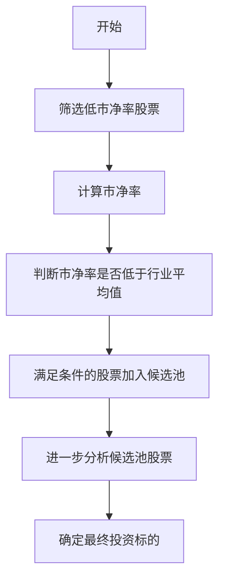
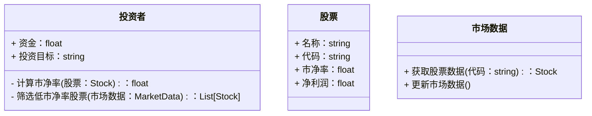
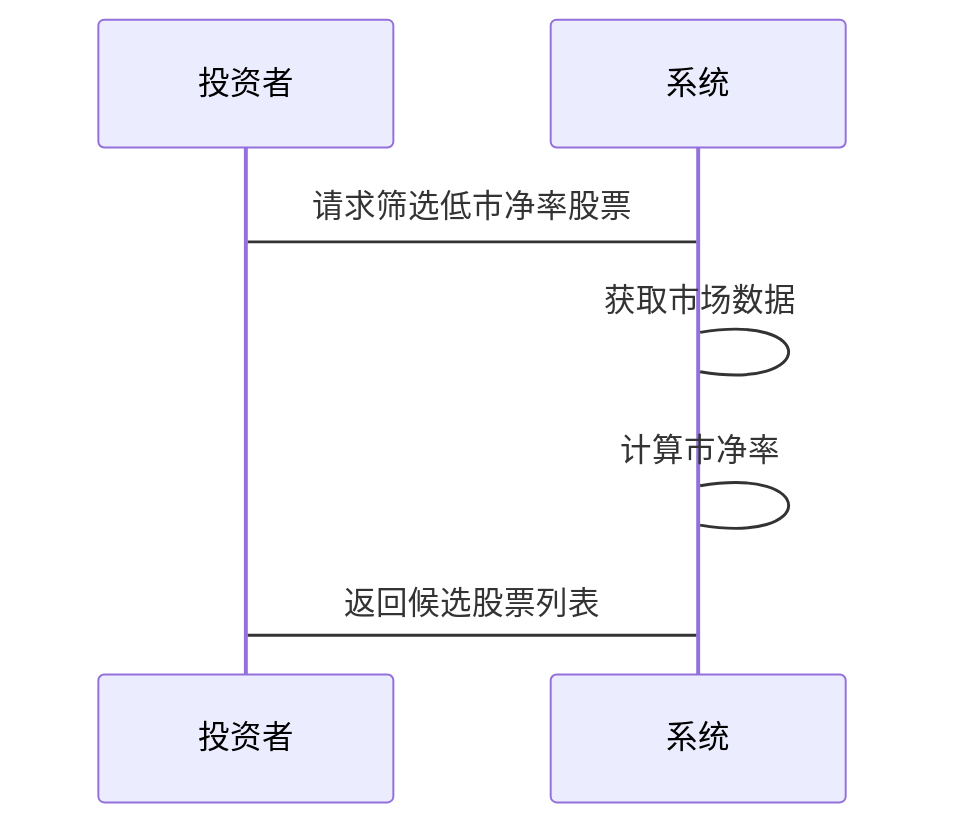

                 


# 《约翰·聂夫的低市净率投资：简单有效的价值筛选》

---

## 关键词：
低市净率投资、约翰·聂夫、价值投资、市净率、股票筛选、投资策略

---

## 摘要：
低市净率投资是一种简单而有效的价值投资策略，由投资大师约翰·聂夫提出。本文将深入分析低市净率投资的核心概念、筛选模型、算法原理、系统架构，并通过实际案例展示其应用。我们还将探讨低市净率投资的优势、风险及最佳实践，帮助投资者更好地理解和应用这一策略。

---

## 目录大纲：

---

### # 第一部分：低市净率投资的背景与核心概念

#### ## 第1章：低市净率投资的起源与理论基础

##### ### 1.1 低市净率投资的起源  
- 1.1.1 价值投资的起源与发展  
- 1.1.2 约翰·聂夫与低市净率投资的结合  
- 1.1.3 低市净率投资的基本原理  

##### ### 1.2 约翰·聂夫的投资哲学  
- 1.2.1 约翰·聂夫的投资风格与成功案例  
- 1.2.2 低市净率投资的适用场景与限制  
- 1.2.3 如何理解低市净率的潜在价值  

##### ### 1.3 低市净率投资的核心概念与优势  
- 1.3.1 市净率的定义与计算公式  
- 1.3.2 低市净率投资的优势与风险  
- 1.3.3 低市净率与企业内在价值的关系  

---

### # 第二部分：低市净率投资的核心概念与联系

#### ## 第2章：市净率与低市净率的深入分析

##### ### 2.1 市净率的定义与计算公式  
- 2.1.1 市净率（P/B）的公式推导  
- 2.1.2 市净率的行业差异与适用性  

##### ### 2.2 低市净率的标准与筛选指标  
- 2.2.1 低市净率的量化标准  
- 2.2.2 筛选低市净率股票的关键指标  
- 2.2.3 低市净率与市盈率、股息率等指标的对比  

##### ### 2.3 影响市净率的主要因素  
- 2.3.1 行业特性对市净率的影响  
- 2.3.2 公司财务状况与市净率的关系  
- 2.3.3 市场情绪对低市净率股票的影响  

---

### # 第三部分：低市净率投资的筛选模型与算法原理

#### ## 第3章：低市净率筛选模型的构建

##### ### 3.1 筛选模型的原理与步骤  
- 3.1.1 筛选模型的输入与输出  
- 3.1.2 筛选过程的逻辑框架  

##### ### 3.2 算法原理与流程图  
- 3.2.1 算法流程图（使用 Mermaid）  


##### ### 3.3 筛选模型的数学模型与公式  
- 3.3.1 市净率计算公式：  
$$ P/B = \frac{股票价格}{每股净资产} $$
- 3.3.2 调整后的市净率计算：  
$$ 调整后P/B = \frac{股票价格}{每股净资产 \times 调整因子} $$  
- 3.3.3 内在价值评估公式：  
$$ 内在价值 = \frac{净利润 \times 市盈率目标}{市净率目标} $$

##### ### 3.4 筛选模型的优化与改进  
- 3.4.1 参数调整与优化策略  
- 3.4.2 算法的鲁棒性与可扩展性  

---

### # 第四部分：低市净率投资的系统架构与实现

#### ## 第4章：低市净率投资系统的架构设计

##### ### 4.1 问题场景介绍  
- 4.1.1 投资者面临的挑战与需求  
- 4.1.2 低市净率投资系统的目标与功能  

##### ### 4.2 系统功能设计  
- 4.2.1 领域模型（使用 Mermaid 类图）  


##### ### 4.3 系统架构设计  
- 4.3.1 系统架构图（使用 Mermaid 架构图）  
```mermaid
container 低市净率投资系统 {
    投资者 <-->> 界面层
    界面层 --> 业务逻辑层
    业务逻辑层 --> 数据访问层
    数据访问层 --> 数据存储层
}
```

##### ### 4.4 系统接口设计  
- 4.4.1 系统接口的定义与实现  
- 4.4.2 接口的交互流程与逻辑  

##### ### 4.5 系统交互设计  
- 4.5.1 交互流程图（使用 Mermaid 序列图）  


---

### # 第五部分：低市净率投资的项目实战

#### ## 第5章：低市净率投资的实战案例

##### ### 5.1 环境安装与数据准备  
- 5.1.1 环境搭建：安装Python、Pandas、NumPy等工具  
- 5.1.2 数据来源：获取股票数据（如Yahoo Finance、本地数据库）  

##### ### 5.2 核心代码实现  
- 5.2.1 筛选模型的Python代码实现  
```python
import pandas as pd

def calculate_p_b(stock_price, book_value_per_share):
    return stock_price / book_value_per_share

def screen_low_p_b(stocks_data, threshold=1.5):
    low_p_b_stocks = []
    for stock in stocks_data:
        p_b = calculate_p_b(stock['price'], stock['book_value'])
        if p_b < threshold:
            low_p_b_stocks.append(stock['name'])
    return low_p_b_stocks
```

##### ### 5.3 数据分析与结果解读  
- 5.3.1 数据分析过程与结果展示  
- 5.3.2 筛选出的低市净率股票列表与解读  

##### ### 5.4 案例分析与小结  
- 5.4.1 案例分析：某行业低市净率股票的筛选与分析  
- 5.4.2 小结：项目实现的关键点与注意事项  

---

### # 第六部分：低市净率投资的最佳实践与总结

#### ## 第6章：最佳实践与注意事项

##### ### 6.1 低市净率投资的关键点  
- 6.1.1 长期投资与价值发现  
- 6.1.2 避免短期波动与市场情绪影响  
- 6.1.3 关注管理层质量与公司治理  

##### ### 6.2 投资中的小结与注意事项  
- 6.2.1 风险提示与投资组合管理  
- 6.2.2 定期复盘与策略调整  
- 6.2.3 持续学习与市场研究  

##### ### 6.3 拓展阅读与进一步思考  
- 6.3.1 推荐书籍与资源  
- 6.3.2 低市净率投资的未来发展趋势  

---

## 作者：AI天才研究院/AI Genius Institute & 禅与计算机程序设计艺术/Zen And The Art of Computer Programming

