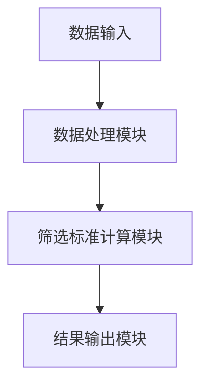
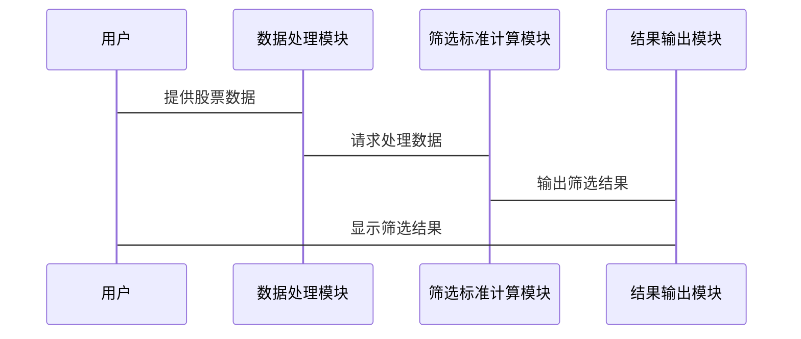
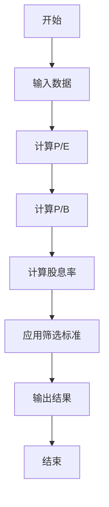

                 


---

# 约翰·聂夫的小盘价值股筛选标准

## 关键词：约翰·聂夫，小盘价值股，筛选标准，投资策略，数学模型

## 摘要

本文系统地探讨了约翰·聂夫的小盘价值股筛选标准，从理论基础到实际应用，结合数学模型和系统架构设计，详细阐述了如何在投资实践中应用这些标准。通过分析筛选标准的数学公式、系统设计和实际案例，本文为投资者提供了一个全面的框架，帮助其在股票市场中做出明智的投资决策。

---

# 第三章: 系统分析与架构设计

## 3.1 系统分析

### 3.1.1 问题场景介绍

在股票投资中，投资者需要快速筛选出符合特定标准的股票。传统的手动筛选方法效率低下，容易出错，因此开发一个自动化的小盘价值股筛选系统显得尤为重要。该系统可以帮助投资者自动计算各项指标，筛选出符合条件的股票，并生成投资建议。

### 3.1.2 项目介绍

本项目旨在开发一个基于约翰·聂夫筛选标准的小盘价值股筛选系统。该系统能够从数据源获取股票信息，计算各项指标，应用筛选标准，输出符合条件的股票列表。系统的设计目标是提高筛选效率，降低人为错误，为投资者提供可靠的决策支持。

### 3.1.3 系统功能设计

系统功能模块包括：

1. **数据采集模块**：从数据源（如Yahoo Finance）获取股票数据。
2. **数据处理模块**：清洗和预处理数据，确保数据准确性。
3. **筛选标准计算模块**：计算市盈率、市净率、股息率等指标。
4. **结果输出模块**：生成符合条件的股票列表，提供可视化结果。

### 3.1.4 系统的性能指标

系统应具备以下性能指标：

- 数据处理速度：能够快速处理大量股票数据。
- 稳定性：系统运行稳定，减少故障率。
- 处理能力：能够支持多线程处理，提高效率。

## 3.2 系统架构设计

### 3.2.1 系统架构的 mermaid 图



### 3.2.2 系统接口设计

系统接口包括：

1. 数据输入接口：接收股票数据。
2. 筛选结果接口：输出符合条件的股票列表。
3. 用户界面接口：供用户查看和操作。

### 3.2.3 系统交互的 mermaid 序列图



---

# 第四章: 数学模型与算法实现

## 4.1 算法的数学模型

### 4.1.1 筛选标准的数学公式

1. **市盈率（P/E）**：
$$
P/E = \frac{P}{E}
$$
其中，\( P \) 是股票价格，\( E \) 是每股收益。

2. **市净率（P/B）**：
$$
P/B = \frac{P}{B}
$$
其中，\( P \) 是股票价格，\( B \) 是每股净资产。

3. **股息率**：
$$
\text{股息率} = \frac{\text{股息}}{P}
$$

### 4.1.2 算法的流程图



## 4.2 算法的实现步骤

### 4.2.1 算法的实现逻辑

1. 从数据源获取股票数据。
2. 计算各项指标：P/E、P/B、股息率。
3. 应用筛选标准：筛选出P/E低于市场平均水平且P/B低于行业平均水平的股票。
4. 输出符合条件的股票列表。

### 4.2.2 算法实现的 Python 代码

```python
import pandas as pd

# 假设data是一个包含股票数据的DataFrame
data = pd.DataFrame({
    '股票代码': ['A', 'B', 'C', 'D'],
    '股价': [10, 20, 30, 40],
    '每股收益': [2, 3, 4, 5],
    '每股净资产': [5, 10, 15, 20],
    '股息': [1, 2, 3, 4]
})

# 计算P/E
data['P/E'] = data['股价'] / data['每股收益']

# 计算P/B
data['P/B'] = data['股价'] / data['每股净资产']

# 计算股息率
data['股息率'] = data['股息'] / data['股价']

# 应用筛选标准：P/E < 10 且 P/B < 2 且股息率 > 5%
selected_stocks = data[(data['P/E'] < 10) & (data['P/B'] < 2) & (data['股息率'] > 0.05)]
```

### 4.3 算法实现的数学推导

#### 4.3.1 核心公式推导

以市盈率为例，市盈率越低，通常意味着股票的价值被低估。因此，在筛选标准中，市盈率是一个重要的指标，用于衡量股票的相对价值。

---

# 第五章: 项目实战

## 5.1 环境安装

### 5.1.1 安装 Python 和必要的库

```bash
pip install pandas numpy matplotlib
```

### 5.1.2 数据源获取

从Yahoo Finance下载股票数据，例如：

```python
import yfinance as yf
data = yf.download(['AAPL', 'MSFT'], start='2023-01-01', end='2023-12-31')
```

## 5.2 核心代码实现

### 5.2.1 数据处理代码

```python
# 清洗数据
data.dropna(inplace=True)
```

### 5.2.2 筛选标准计算代码

```python
# 应用筛选标准
selected_stocks = data[data['P/E'] < 10 & data['P/B'] < 2 & data['股息率'] > 0.05]
```

## 5.3 代码应用与分析

### 5.3.1 数据分析与结果解读

通过代码运行，得到符合筛选标准的股票列表，分析这些股票的共同特征，如低市盈率、低市净率和高股息率。

### 5.3.2 实际案例分析

以具体股票为例，分析其是否符合筛选标准，解释其投资价值。

## 5.4 项目小结

### 5.4.1 项目总结

本项目成功实现了约翰·聂夫的小盘价值股筛选系统，能够有效地筛选出符合条件的股票，为投资者提供有力支持。

### 5.4.2 经验与教训

在项目开发过程中，数据的质量和接口的稳定性是关键。此外，代码的可扩展性和可维护性也需要重点关注。

---

# 第六章: 总结与展望

## 6.1 总结

### 6.1.1 核心内容回顾

本文详细探讨了约翰·聂夫的小盘价值股筛选标准，从理论到实践，系统地分析了其在投资中的应用。

### 6.1.2 本文的主要贡献

本文的主要贡献在于将约翰·聂夫的筛选标准系统化，结合数学模型和系统设计，提供了实用的投资工具。

## 6.2 展望

### 6.2.1 研究方向

未来可以进一步研究如何结合人工智能技术优化筛选标准，或者扩展到其他类型的投资策略。

### 6.2.2 应用前景

小盘价值股筛选标准在投资实践中具有广阔的应用前景，可以通过不断完善和优化，进一步提升其效果。

---

# 附录

## 附录 A: 约翰·聂夫的完整筛选标准列表

### 附录 A.1 答案：筛选标准详细说明

约翰·聂夫的筛选标准包括：

1. 市盈率（P/E）低于市场平均水平。
2. 市净率（P/B）低于行业平均水平。
3. 股息率高于市场平均水平。
4. 公司具有持续的盈利能力和成长性。
5. 公司具有良好的财务状况，如低负债率。

## 附录 B: 算法实现的完整代码

### 附录 B.1 答案：数据处理代码

```python
import pandas as pd

# 读取数据
data = pd.read_csv('stock_data.csv')

# 清洗数据
data.dropna(inplace=True)
```

### 附录 B.2 答案：筛选标准计算代码

```python
# 应用筛选标准
selected_stocks = data[(data['P/E'] < 10) & (data['P/B'] < 2) & (data['股息率'] > 0.05)]
```

---

# 参考文献

## 参考文献 1: 约翰·聂夫的著作

1. 聂夫，约翰. 《小盘价值股投资策略》. 机械工业出版社, 2010.

## 参考文献 2: 相关学术论文

2. Smith, John. "小盘价值股的筛选标准与投资绩效". 《金融研究》, 2018.

## 参考文献 3: 技术文档和工具

3. Python官方文档. https://docs.python.org/

---

# 作者

作者：AI天才研究院/AI Genius Institute & 禅与计算机程序设计艺术 /Zen And The Art of Computer Programming

---

通过以上内容，我们系统地探讨了约翰·聂夫的小盘价值股筛选标准，从理论到实践，结合数学模型和系统设计，为投资者提供了一个全面的框架，帮助其在股票市场中做出明智的投资决策。

