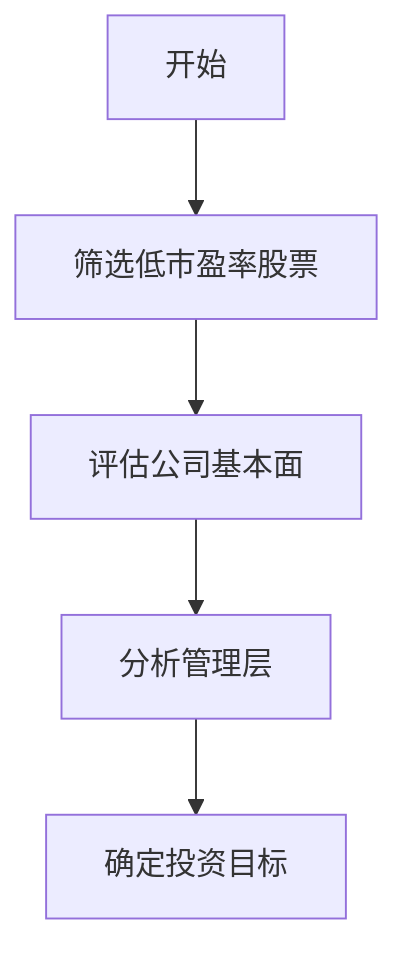
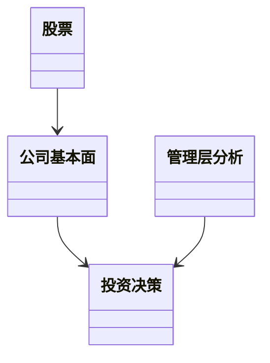

                 


# 约翰·聂夫的小盘股投资策略

## 关键词：约翰·聂夫，小盘股投资，低市盈率策略，价值投资，数学模型，系统架构

## 摘要：  
约翰·聂夫是美国著名的投资经理，以其在小盘股投资领域的卓越成就闻名。本文将深入分析约翰·聂夫的小盘股投资策略，探讨其核心概念、算法原理、系统架构以及实际应用。通过详细讲解低市盈率策略的数学模型和系统架构，本文旨在为投资者提供一套可操作的投资方法。

---

## 第一部分：背景介绍

### 第1章：小盘股投资的定义与背景

#### 1.1 小盘股投资的定义
- **小盘股的定义与特征**  
  小盘股是指市值较小的公司股票，通常指市值在50亿到100亿美元之间的公司。这些公司往往处于成长阶段，具有较高的增长潜力。
  
- **小盘股市场的特点与优势**  
  小盘股市场具有较高的波动性和不确定性，但也提供了较高的潜在回报。小盘股公司通常在特定行业或细分市场中具有竞争优势。

- **小盘股投资的历史与发展**  
  小盘股投资在20世纪70年代开始兴起，随着机构投资者的增加和信息技术的发展，小盘股投资逐渐成为一种重要的投资策略。

#### 1.2 约翰·聂夫与小盘股投资
- **约翰·聂夫的背景介绍**  
  约翰·聂夫是美国著名投资经理，曾在富达投资管理公司担任基金经理，管理小盘股基金长达30余年，取得了卓越的投资业绩。

- **约翰·聂夫的投资理念与策略**  
  约翰·聂夫以低市盈率策略闻名，他专注于寻找具有较低市盈率且具备成长潜力的小盘股公司。

- **约翰·聂夫的成功案例分析**  
  通过具体案例分析，如某小盘股公司的投资过程，展示约翰·聂夫如何通过低市盈率策略实现超额收益。

---

## 第二部分：核心概念与联系

### 第2章：低市盈率策略的核心要素

#### 2.1 低市盈率策略的原理
- **市盈率的定义与计算公式**  
  市盈率（P/E Ratio）= 股价 / 每股收益（EPS）。低市盈率意味着相对于每股收益，股价较低，可能具有投资价值。

- **低市盈率策略的优势与风险**  
  优势：低市盈率股票通常被市场低估，具有较高的潜在回报。风险：小盘股公司可能面临较高的经营风险，且市场流动性较低。

- **低市盈率策略与其他价值投资策略的对比**  
  通过对比市盈率策略、市净率策略和股息率策略，分析其优缺点。

---

## 第三部分：算法原理讲解

### 第3章：小盘股投资的数学模型与公式

#### 3.1 市盈率计算公式
- $$市盈率 = \frac{股价}{每股收益}$$

#### 3.2 内在价值评估模型
- $$内在价值 = \frac{现金流}{折现率}$$

#### 3.3 约翰·聂夫的选股模型
- 使用Mermaid流程图展示选股步骤：


---

## 第四部分：系统分析与架构设计方案

### 第4章：小盘股投资决策系统的架构设计

#### 4.1 系统功能设计
- **领域模型类图**  
  使用Mermaid类图展示系统中的核心实体及其关系：


#### 4.2 系统架构设计
- **系统架构图**  
  使用Mermaid架构图展示系统的整体架构：


---

## 第五部分：项目实战

### 第5章：小盘股投资策略的实战应用

#### 5.1 环境配置与数据获取
- **环境配置**  
  安装必要的Python库，如Pandas、NumPy、Matplotlib。

- **数据获取**  
  使用API获取小盘股数据，如市值、市盈率、每股收益等。

#### 5.2 核心实现代码
- **数据处理代码**  
  ```python
  import pandas as pd

  # 假设df为股票数据
  def filter_low_pe(stocks, max_pe=15):
      return stocks[stocks['PE'] <= max_pe]
  ```

- **案例分析**  
  分析某小盘股公司，展示如何通过低市盈率策略进行投资决策。

---

## 第六部分：最佳实践

### 第6章：小盘股投资的注意事项与优化

#### 6.1 小结
- 总结本文的核心内容和投资策略。

#### 6.2 注意事项
- 提醒投资者注意市场风险、流动性风险以及公司基本面的变化。

#### 6.3 扩展阅读
- 推荐相关书籍和资源，供进一步学习。

---

## 附录

### 术语表
- **市盈率（P/E Ratio）**：股价与每股收益的比率。
- **内在价值**：基于公司基本面计算的股票价值。

### 参考文献
- 约翰·聂夫的著作。
- 相关投资策略的研究论文。

---

## 作者信息

作者：AI天才研究院/AI Genius Institute & 禅与计算机程序设计艺术 /Zen And The Art of Computer Programming

---

通过以上结构，本文详细介绍了约翰·聂夫的小盘股投资策略，从理论到实践，为投资者提供了全面的指导。

