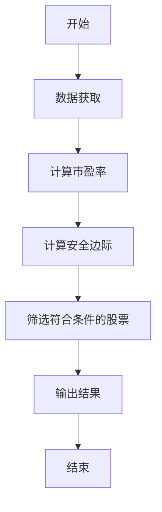
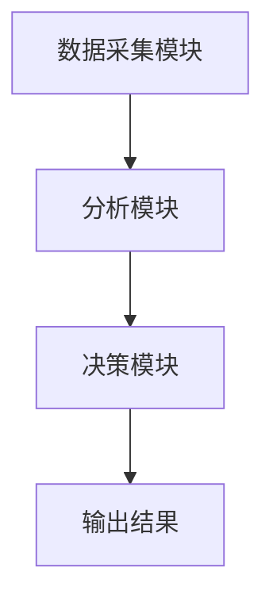

                 


# 约翰·聂夫的小盘股研究方法创新

> 关键词：小盘股投资，约翰·聂夫，基本面分析，安全边际，投资策略，价值发现

> 摘要：本文深入探讨了约翰·聂夫的小盘股研究方法，从理论基础到实际应用，结合算法原理、数学模型和系统架构，全面解析了如何通过创新的研究方法在小盘股市场中发现投资机会。

---

## 目录大纲

1. **第1章: 小盘股投资的背景与基础**  
   1.1 小盘股的定义与分类  
   1.2 约翰·聂夫的投资理念  
   1.3 小盘股研究方法的背景  

2. **第2章: 小盘股研究的核心概念与联系**  
   2.1 核心概念原理  
   2.2 核心概念对比表格  
   2.3 ER实体关系图  

3. **第3章: 小盘股研究的算法原理**  
   3.1 算法原理概述  
   3.2 算法流程图  
   3.3 算法实现代码  

4. **第4章: 小盘股研究的数学模型与公式**  
   4.1 核心公式  
   4.2 数学模型推导  
   4.3 公式应用案例  

5. **第5章: 小盘股研究的系统架构设计**  
   5.1 系统功能设计  
   5.2 系统架构图  
   5.3 系统接口与交互  

6. **第6章: 小盘股研究的项目实战**  
   6.1 环境配置与数据获取  
   6.2 分析代码实现  
   6.3 案例分析与结果解读  

7. **第7章: 小盘股研究的最佳实践与总结**  
   7.1 最佳实践总结  
   7.2 投资注意事项  
   7.3 拓展阅读建议  

---

## 正文内容

### 第1章: 小盘股投资的背景与基础

#### 1.1 小盘股的定义与分类

小盘股是指市值较小的公司股票，通常定义为市值在一定范围内的股票，具体标准因市场而异。与大盘股相比，小盘股具有更高的增长潜力和灵活性，但也伴随着更高的风险。

- **小盘股的定义**：市值通常在50亿至200亿美元之间的公司股票。
- **分类标准**：根据市值、流动性、行业等因素进行分类。
- **与大盘股的对比**：小盘股通常更具成长性，但波动性更大。

#### 1.2 约翰·聂夫的投资理念

约翰·聂夫是小盘股投资的倡导者，其核心理念是通过基本面分析，寻找具有成长潜力且估值合理的公司。

- **聂夫的生平简介**：作为投资领域的权威，聂夫以小盘股投资闻名。
- **投资策略**：注重安全边际，寻找估值低于内在价值的公司。
- **核心思想**：价值与成长的结合，注重长期投资。

#### 1.3 小盘股研究方法的背景

小盘股市场具有不确定性高、信息不透明的特点，因此需要创新的研究方法。

- **研究方法的必要性**：传统方法难以适应小盘股市场的特点。
- **方法的演变**：从简单筛选到综合分析的转变。
- **与传统方法的区别**：更注重动态分析和风险控制。

---

### 第2章: 小盘股研究的核心概念与联系

#### 2.1 核心概念原理

小盘股研究涉及多个核心概念，如安全边际、成长性、估值等。

- **安全边际**：股票价格低于其内在价值的部分，是投资的安全垫。
- **成长性**：公司未来增长的潜力。
- **估值**：通过市盈率、市净率等指标评估股票的价值。

#### 2.2 核心概念对比表格

下表对比了小盘股与大盘股的核心要素：

| **属性**       | **小盘股**           | **大盘股**           |
|-----------------|----------------------|----------------------|
| 市值范围        | 50亿至200亿美元     | 200亿美元以上       |
| 波动性          | 高                   | 低                   |
| 成长潜力        | 高                   | 较低                 |
| 风险            | 高                   | 较低                 |
| 信息透明度      | 低                   | 高                   |

#### 2.3 ER实体关系图

以下是一个简单的ER图，展示小盘股研究的核心实体及其关系：

```mermaid
erDiagram
    company[公司] {
        id : int
        name : string
        marketCap : float
        industry : string
    }
    stock[股票] {
        id : int
        ticker : string
        price : float
        volume : float
    }
    analysis[分析结果] {
        id : int
        score : float
        recommendation : string
    }
    company -- stock : 拥有
    stock -- analysis : 对应
```

---

### 第3章: 小盘股研究的算法原理

#### 3.1 算法原理概述

小盘股研究的算法通常包括数据获取、筛选、分析和评估四个步骤。

- **数据获取**：从数据库获取公司基本面数据。
- **筛选**：根据市值、市盈率等指标筛选出符合条件的股票。
- **分析**：通过财务指标和竞争优势分析评估股票。
- **评估**：计算安全边际，确定投资价值。

#### 3.2 算法流程图

以下是一个小盘股筛选流程的mermaid图：



#### 3.3 算法实现代码

以下是一个Python代码示例，用于筛选小盘股：

```python
import pandas as pd

# 数据获取
df = pd.read_csv('stocks.csv')

# 筛选小盘股（市值在50亿至200亿美元之间）
mask = (df['marketCap'] >= 50) & (df['marketCap'] <= 200)

# 计算市盈率
df['pe_ratio'] = df['price'] / df['eps']

# 筛选市盈率低于行业平均的股票
industry_avg_pe = df.groupby('industry')['pe_ratio'].mean().reset_index()
filtered_df = df[mask].merge(industry_avg_pe, on='industry')
filtered_df = filtered_df[filtered_df['pe_ratio'] < filtered_df['pe_ratio_y']]

print(filtered_df)
```

---

### 第4章: 小盘股研究的数学模型与公式

#### 4.1 核心公式

以下是一个计算安全边际的公式：

$$ \text{安全边际} = \text{内在价值} - \text{市场价格} $$

其中，内在价值可以通过以下公式计算：

$$ \text{内在价值} = \frac{\text{净利润} \times (1 + g)}{r} $$

其中，\( g \) 是增长率，\( r \) 是贴现率。

#### 4.2 数学模型推导

通过以上公式，我们可以推导出一个评估模型，用于筛选具有安全边际的小盘股。

#### 4.3 公式应用案例

假设某公司净利润为1000万美元，增长率 \( g \) 为10%，贴现率 \( r \) 为12%。则：

$$ \text{内在价值} = \frac{1000 \times (1 + 0.1)}{0.12} = 9166.67 \text{万美元} $$

如果市场价格为8000万美元，则：

$$ \text{安全边际} = 9166.67 - 8000 = 166.67 \text{万美元} $$

---

### 第5章: 小盘股研究的系统架构设计

#### 5.1 系统功能设计

小盘股研究系统包括数据采集、分析、决策三个模块。

- **数据采集模块**：从数据库获取股票数据。
- **分析模块**：计算各项指标，筛选股票。
- **决策模块**：根据模型输出投资建议。

#### 5.2 系统架构图

以下是一个简单的系统架构图：



#### 5.3 系统接口与交互

系统接口设计包括数据接口、分析接口和结果输出接口。

---

### 第6章: 小盘股研究的项目实战

#### 6.1 环境配置与数据获取

安装Python环境，安装必要的库，如pandas、numpy。

#### 6.2 分析代码实现

编写代码，实现数据清洗、指标计算、筛选和结果输出。

#### 6.3 案例分析与结果解读

通过具体案例，分析筛选结果，解释如何根据结果做出投资决策。

---

### 第7章: 小盘股研究的最佳实践与总结

#### 7.1 最佳实践总结

- 定期更新数据，保持模型的有效性。
- 结合市场环境调整筛选策略。
- 多关注行业动态和公司新闻。

#### 7.2 投资注意事项

- 风险控制：分散投资，避免过度集中。
- 耐心持有：小盘股的成长需要时间。
- 保持学习：不断更新知识和技能。

#### 7.3 拓展阅读建议

- 推荐阅读约翰·聂夫的著作。
- 学习其他投资方法，如价值投资、趋势投资。

---

**作者：AI天才研究院/AI Genius Institute & 禅与计算机程序设计艺术/Zen And The Art of Computer Programming**

---

以上是《约翰·聂夫的小盘股研究方法创新》的技术博客文章的完整目录大纲及部分正文内容。

