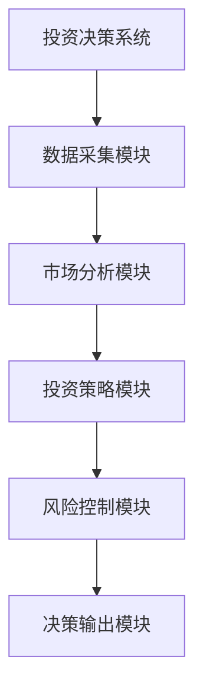
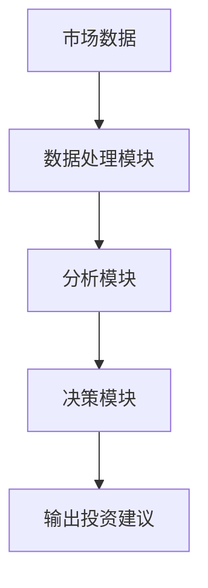

                 


# 约翰·邓普顿的危机投资策略：在恐慌中寻找机会

## 关键词：约翰·邓普顿，危机投资，恐慌市场，价值投资，风险管理，投资策略

## 摘要：本文深入分析了约翰·邓普顿的危机投资策略，探讨了他在市场恐慌时期如何寻找投资机会。文章结合其投资理念、数学模型和实际案例，详细阐述了如何在危机中运用价值投资和逆向思维，同时提供了风险管理的策略和实际操作建议。

---

## 第六章: 数学模型与分析

### 6.1 投资价值评估的数学模型

#### 6.1.1 市盈率计算公式
市盈率（P/E）是衡量股票价值的重要指标，计算公式如下：
$$ P/E = \frac{\text{股价}}{\text{每股收益}} $$

#### 6.1.2 内在价值计算
邓普顿使用内在价值模型，计算公式如下：
$$ \text{内在价值} = \frac{\text{预期收益}}{\text{折现率}} $$

#### 6.1.3 安全边际计算
安全边际是邓普顿强调的关键因素，公式为：
$$ \text{安全边际} = \text{内在价值} - \text{市场价格} $$

---

## 第七章: 系统分析与架构设计方案

### 7.1 投资决策系统设计

#### 7.1.1 系统架构图
使用mermaid绘制的系统架构图如下：


#### 7.1.2 数据流图
使用mermaid绘制的数据流图如下：


---

## 第八章: 项目实战

### 8.1 2008年金融危机案例分析

#### 8.1.1 数据处理代码
以下是用于分析2008年金融危机的Python代码示例：
```python
import pandas as pd
import numpy as np

# 数据加载
df = pd.read_csv('financial_crisis_data.csv')

# 计算市盈率
df['P/E'] = df['股价'] / df['每股收益']

# 筛选内在价值高于市场价格的股票
mask = df['内在价值'] > df['市场价格']
selected_stocks = df[mask]

print(selected_stocks)
```

#### 8.1.2 分析结果解读
代码输出结果展示了内在价值高于市场价格的股票，这些股票被视为潜在的投资机会。通过邓普顿的策略，投资者可以在危机中寻找这些被低估的资产。

---

## 第九章: 最佳实践、小结与注意事项

### 9.1 最佳实践

#### 9.1.1 保持长期视角
投资应着眼于长期价值，避免短期波动的干扰。

#### 9.1.2 理解市场心理
了解投资者心理，识别市场恐慌中的机会。

#### 9.1.3 严格风险控制
设定止损点和安全边际，保护投资本金。

### 9.2 小结

约翰·邓普顿的危机投资策略强调在市场恐慌中寻找价值低估的资产，通过长期视角和严格的风险管理实现超额收益。他的方法结合了数学模型和实际操作，为投资者提供了宝贵的指导。

### 9.3 注意事项

#### 9.3.1 市场变化风险
市场环境不断变化，需及时调整投资策略。

#### 9.3.2 数据准确性
确保数据来源可靠，避免因数据错误导致决策失误。

#### 9.3.3 持续学习
投资领域知识更新快，需持续学习和适应市场变化。

---

## 作者：AI天才研究院 & 禅与计算机程序设计艺术

---

**摘要**：本文通过详细分析约翰·邓普顿的危机投资策略，结合数学模型和实际案例，为投资者提供了在恐慌市场中寻找机会的实用指导。文章强调了价值投资、风险管理的重要性，并通过系统架构和代码示例，展示了如何将理论应用于实践。

