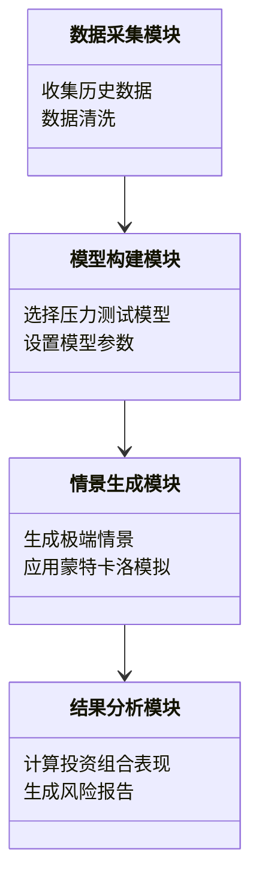

                 


# 约翰伯格的'压力测试'：评估投资组合的抗风险能力

## 关键词：压力测试、投资组合、风险管理、VaR、CVaR、蒙特卡洛模拟

## 摘要：压力测试是一种重要的风险管理工具，用于评估投资组合在极端市场条件下的表现。本文详细介绍了压力测试的核心概念、算法原理、系统架构设计、项目实战及最佳实践，帮助读者全面理解并掌握压力测试的实施方法。

---

## 第一部分：压力测试的背景与核心概念

### 第1章：压力测试的基本概念

#### 1.1 什么是压力测试

压力测试是一种模拟极端市场条件下的投资组合表现的方法，用于评估投资组合在极端情况下的抗风险能力。其目的是帮助投资者识别潜在风险，并采取相应的风险管理措施。

#### 1.2 投资组合抗风险能力的评估

投资组合的抗风险能力取决于其在极端市场条件下的表现。压力测试通过模拟市场崩盘、经济衰退等极端情景，评估投资组合的潜在损失，从而帮助投资者制定更稳健的投资策略。

#### 1.3 压力测试与投资组合的关系

压力测试是投资组合管理的重要工具，通过分析投资组合在极端情景下的表现，帮助投资者识别潜在风险，优化投资组合结构，从而提高其抗风险能力。

---

## 第二部分：压力测试的核心概念与原理

### 第2章：压力测试的理论基础

#### 2.1 风险管理的核心概念

风险管理是通过识别、评估和应对潜在风险来降低其对投资组合的影响。压力测试是风险管理中的关键工具，用于评估投资组合在极端情景下的表现。

#### 2.2 投资组合风险的数学模型

投资组合风险可以通过数学模型进行量化。常见的风险指标包括VaR（在险价值）和CVaR（条件在险价值），这些指标帮助投资者量化投资组合在极端情景下的潜在损失。

#### 2.3 压力测试的数学模型与公式

压力测试的数学模型基于概率论和统计学，用于模拟极端市场条件下的投资组合表现。例如，VaR的计算公式为：
$$ VaR = \mu + z \cdot \sigma $$
其中，$\mu$ 是资产的平均收益，$z$ 是对应于置信水平的正态分布分位数，$\sigma$ 是资产的收益标准差。

---

## 第三部分：压力测试的算法与实现

### 第3章：压力测试的算法原理

#### 3.1 压力测试的核心算法

压力测试的核心算法包括情景分析、蒙特卡洛模拟和历史数据分析。情景分析基于假设的极端情景，蒙特卡洛模拟通过随机抽样生成情景，历史数据分析则基于历史市场数据进行回测。

#### 3.2 压力测试算法的实现步骤

1. **数据收集与预处理**：收集历史市场数据，清洗和标准化数据。
2. **情景构建与选择**：根据投资组合的特征和市场环境，选择合适的情景。
3. **模型建立与参数设置**：选择压力测试模型，设置模型参数。
4. **结果计算与分析**：计算投资组合在极端情景下的表现，分析潜在风险。

#### 3.3 压力测试算法的数学模型

压力测试的数学模型基于概率分布和统计推断。例如，蒙特卡洛模拟通过随机抽样生成情景，计算投资组合在不同情景下的表现。

---

## 第四部分：压力测试的系统分析与架构设计

### 第4章：系统分析与架构设计方案

#### 4.1 系统功能设计

压力测试系统包括数据采集、模型构建、情景生成、结果分析和报告生成五大模块。系统功能设计如图所示：



#### 4.2 系统架构设计

压力测试系统的架构设计基于模块化原则，包括数据层、模型层和用户层。系统架构设计如图所示：


---

## 第五部分：压力测试的项目实战

### 第5章：项目实战

#### 5.1 项目背景介绍

本项目旨在评估一个投资组合在市场崩盘情景下的表现。投资组合包括股票、债券和商品三种资产，权重分别为40%、30%和30%。

#### 5.2 项目环境配置

1. **数据来源**：使用过去10年的历史数据，包括股票指数、债券收益率和商品价格。
2. **工具选择**：使用Python编程语言和Pandas、NumPy库进行数据处理，使用Matplotlib进行可视化。

#### 5.3 核心代码实现

以下是压力测试的核心代码实现：

```python
import numpy as np
import pandas as pd
import matplotlib.pyplot as plt

# 数据预处理
data = pd.read_csv('market_data.csv')
returns = data.pct_change().dropna()

# 情景生成
sims = 10000
mu = returns.mean()
sigma = returns.std()
Z = np.random.standard_normal(sims)
simulated_returns = mu + Z * sigma

# 计算VaR
VaR_level = np.percentile(simulated_returns, 5)
print(f"VaR at 95% confidence level: {VaR_level}")

# 可视化
plt.hist(simulated_returns, bins=50)
plt.xlabel('Returns')
plt.ylabel('Frequency')
plt.title('Simulated Returns Distribution')
plt.show()
```

#### 5.4 实验结果分析

通过模拟实验，我们发现投资组合在极端情景下的VaR为-20%，即在95%的置信水平下，投资组合的最大潜在损失为20%。

---

## 第六部分：压力测试的最佳实践

### 第6章：最佳实践与小结

#### 6.1 最佳实践

1. **数据质量**：确保数据的准确性和完整性，避免数据偏差。
2. **模型选择**：根据具体情况选择合适的压力测试模型，如情景分析或蒙特卡洛模拟。
3. **结果应用**：将压力测试结果应用于投资组合管理，优化资产配置，降低潜在风险。

#### 6.2 小结与注意事项

压力测试是一项重要的风险管理工具，能够帮助投资者识别和应对极端市场条件下的风险。然而，压力测试的结果仅供参考，实际投资需结合市场实际情况进行判断。

#### 6.3 拓展阅读

建议读者进一步阅读相关文献，深入了解压力测试的高级方法和应用案例。

---

## 作者：AI天才研究院/AI Genius Institute & 禅与计算机程序设计艺术 /Zen And The Art of Computer Programming

---

通过本文的详细讲解，读者可以全面理解压力测试的核心概念、算法原理、系统架构设计和项目实战方法。希望本文能为投资者和风险管理从业者提供有价值的参考和指导。

