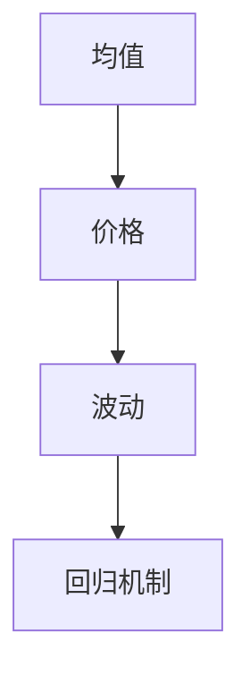
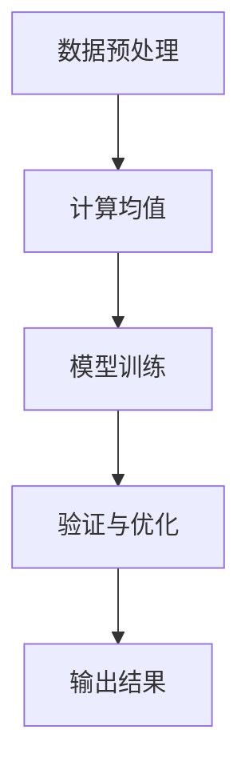
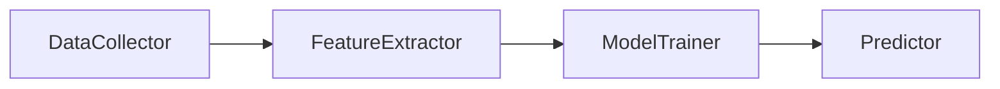
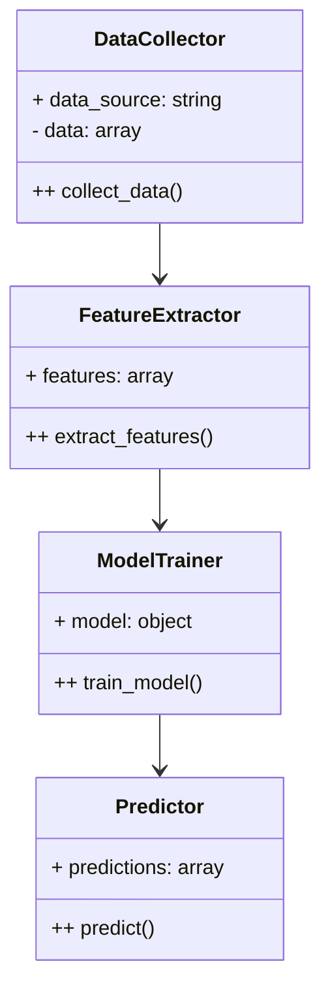

                 


# 约翰伯格的"回归均值"理论：市场长期的自我修正

## 关键词：回归均值理论、市场修正、约翰伯格、统计学、系统架构、回归分析

## 摘要：  
回归均值理论是统计学和市场分析中的一个重要概念，它描述了市场在长期中会趋向于均值的自我修正机制。本文将从回归均值理论的背景、核心概念、算法原理、系统架构到项目实战，全面解析这一理论，并通过具体的案例分析，帮助读者深入理解其在实际应用中的价值和意义。

---

## 第一部分：回归均值理论的背景与核心概念

### 第1章：回归均值理论的背景与起源

#### 1.1 什么是回归均值理论
回归均值理论（Mean Reversion Theory）是一种统计学和经济学中的理论，认为价格、指数或其他指标会围绕一个长期的均值水平波动，并在偏离该均值后逐渐回归。这一理论的核心假设是市场存在自我修正的机制，当价格偏离均值时，市场力量会推动其回归到均值水平。

#### 1.2 约翰伯格与回归均值理论的提出
约翰伯格（John Bogle）是回归均值理论的重要倡导者之一，他强调市场波动性和长期均值回归的趋势。他认为，短期市场波动难以预测，但长期来看，市场会趋向于其内在价值。

#### 1.3 理论的基本假设与应用领域
回归均值理论的核心假设包括：
- 市场存在一个长期的均衡点（均值）。
- 价格波动是随机的，并且围绕均值对称分布。
- 市场参与者的行为会推动价格回归均值。

该理论广泛应用于金融投资、风险管理、资产配置等领域。

---

### 第2章：回归均值理论的核心概念与联系

#### 2.1 理论的核心要素与属性
回归均值理论的核心要素包括：
- **均值**：长期价格的平均值。
- **波动性**：价格围绕均值的波动程度。
- **回归机制**：价格偏离均值后趋向于回归的行为。

#### 2.2 回归均值理论的ER实体关系图
以下是回归均值理论的核心实体关系图：



---

## 第二部分：回归均值理论的算法原理

### 第3章：回归均值理论的算法实现

#### 3.1 算法的基本原理
回归均值模型的基本步骤包括：
1. 数据预处理：计算价格的均值。
2. 模型训练：分析价格波动是否符合回归均值的假设。
3. 模型验证：通过历史数据验证模型的准确性。

#### 3.2 算法的实现流程
以下是回归均值模型的实现流程图：



#### 3.3 算法的数学模型与公式
回归均值模型的数学表达式为：
$$ y_t = \mu + \epsilon_t $$
其中，$\mu$ 是均值，$\epsilon_t$ 是随机误差项。

---

### 第4章：回归均值理论的系统架构

#### 4.1 系统的总体架构
回归均值理论的系统架构包括以下几个模块：
1. 数据采集模块。
2. 特征提取模块。
3. 模型训练模块。
4. 模型预测模块。

系统架构图如下：



#### 4.2 系统的功能设计
以下是系统功能模块的类图：



---

## 第三部分：回归均值理论的项目实战

### 第5章：回归均值理论的项目实战

#### 5.1 项目环境的安装与配置
需要安装的环境和依赖包括：
- Python 3.8+
- NumPy
- Pandas
- Matplotlib
- Scikit-learn

安装命令：
```bash
pip install numpy pandas matplotlib scikit-learn
```

#### 5.2 项目核心代码的实现

以下是回归均值模型的实现代码：

```python
import numpy as np
import pandas as pd
from sklearn.linear_model import LinearRegression
import matplotlib.pyplot as plt

# 示例数据：价格序列
data = {'price': [100, 110, 95, 105, 102, 98, 108, 103]}
df = pd.DataFrame(data)

# 计算均值
mean_price = df['price'].mean()

# 数据可视化
plt.figure(figsize=(10, 6))
plt.plot(df['price'], label='Price')
plt.axhline(y=mean_price, color='r', linestyle='--', label='Mean')
plt.title('Mean Reversion Example')
plt.xlabel('Time')
plt.ylabel('Price')
plt.legend()
plt.show()

# 回归分析
model = LinearRegression()
X = np.arange(len(df)).reshape(-1, 1)
y = df['price'].values
model.fit(X, y)
y_pred = model.predict(X)

plt.figure(figsize=(10, 6))
plt.scatter(X, y, color='b', label='Data points')
plt.plot(X, y_pred, color='r', label='Regression Line')
plt.title('Linear Regression of Price')
plt.xlabel('Time')
plt.ylabel('Price')
plt.legend()
plt.show()
```

---

## 第四部分：小结与拓展

### 6.1 小结
回归均值理论通过分析价格波动，帮助我们理解市场的自我修正机制。本文从理论背景、算法实现到系统架构，全面解析了这一理论，并通过实战项目展示了其应用价值。

### 6.2 最佳实践 Tips
- 在实际应用中，回归均值理论可以结合其他模型（如ARIMA）进行优化。
- 数据的样本选择和时间窗口对结果影响较大，需谨慎选择。
- 市场波动性较高的情况下，回归均值的效果可能不显著。

### 6.3 拓展阅读
- 《The New Finance: The Case for Stakeholder Capitalism》
- 《Statistical Models and Financial Data》

---

## 作者：AI天才研究院 & 禅与计算机程序设计艺术

