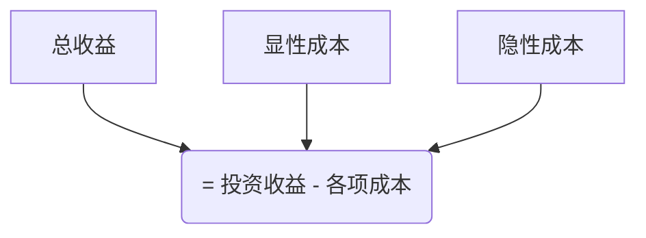
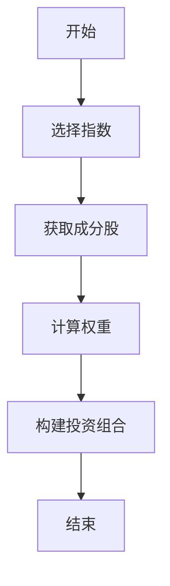
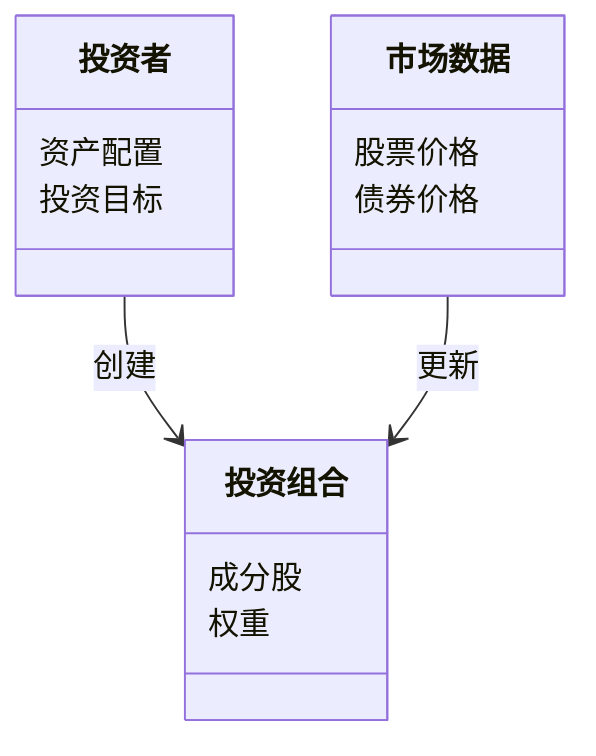
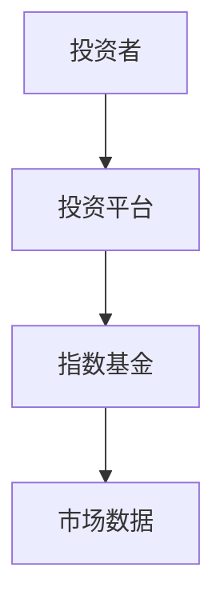

                 


# 约翰伯格的低成本投资策略

> 关键词：低成本投资、约翰·伯格、指数基金、长期投资、投资策略

> 摘要：本文深入分析了约翰·伯格的低成本投资策略，从背景介绍到核心概念，再到算法原理和系统设计，结合实际案例和数学模型，全面解读低成本投资的理论与实践。

---

## 第一部分：低成本投资策略的背景与核心理念

### 第1章：低成本投资的背景与现状

#### 1.1 投资领域的现状与问题背景

在当今的金融市场上，投资者面临着诸多挑战。传统投资模式往往伴随着高昂的成本，这不仅包括显性成本（如交易费用和管理费），还包括隐性成本（如机会成本和心理成本）。这些问题使得许多投资者难以实现长期稳健的收益。

#### 1.2 约翰·伯格的低成本投资理念

约翰·伯格作为Vanguard集团的创始人，以其低成本指数投资策略闻名。他的投资哲学强调长期投资和分散投资，主张通过降低成本来最大化投资回报。这种方法不仅降低了投资门槛，还使普通投资者能够享受到机构级别的投资收益。

#### 1.3 低成本投资的边界与外延

低成本投资不仅是一种策略，更是一种投资理念。它适用于各种市场环境，但在极端市场波动或短期投机中可能表现不佳。因此，投资者需要在长期与短期、成本与收益之间找到平衡点。

---

## 第二部分：低成本投资的核心概念与联系

### 第2章：低成本投资的核心概念与原理

#### 2.1 成本在投资中的核心地位

成本是影响投资回报的关键因素。通过数学模型可以看出，总收益等于投资收益减去各项成本。使用对比表和Mermaid图可以清晰地展示成本对投资回报的影响。



#### 2.2 长期投资的核心优势

长期投资通过复利效应实现财富增长，数学模型为：$$A = P(1 + r)^n$$。长期投资不仅能平滑市场波动，还能降低交易成本和税收负担。

#### 2.3 成本与收益的平衡点

通过对比表可以看出，低成本投资在收益上更具优势，尤其是在长期持有中。

| 成本类型 | 高成本 | 中成本 | 低成本 |
|----------|--------|--------|--------|
| 收益     | 低     | 中     | 高     |

---

## 第三部分：低成本投资的算法原理与数学模型

### 第3章：低成本投资的算法原理

虽然投资策略并非传统意义上的算法，但指数基金的构建过程可以被视为一种自动化投资策略。以下是指数基金的构建流程图：



#### 3.2 数学模型与公式

复利公式是投资中的核心数学模型：

$$
A = P(1 + r)^n
$$

其中：
- \( A \)：最终金额
- \( P \)：本金
- \( r \)：年化收益率
- \( n \)：投资年数

---

## 第四部分：系统分析与架构设计

### 第4章：低成本投资系统的架构设计

#### 4.1 系统功能设计

以下是投资平台的领域模型：



#### 4.2 系统架构设计

以下是系统的架构图：



---

## 第五部分：项目实战与应用

### 第5章：低成本投资的实战应用

#### 5.1 环境安装与配置

安装Python和必要的库：

```bash
pip install pandas numpy matplotlib
```

#### 5.2 核心代码实现

指数基金模拟代码：

```python
import pandas as pd
import numpy as np

# 假设指数收益率
returns = np.random.normal(0.07, 0.15, 100)
cumulative = np.cumsum(returns)

plt.plot(cumulative)
plt.title('指数基金累计收益')
plt.show()
```

#### 5.3 案例分析与解读

通过模拟案例，分析低成本投资在不同市场环境下的表现。

---

## 第六部分：总结与注意事项

### 第6章：最佳实践与注意事项

- **小结**：低成本投资通过降低交易成本和管理费用，实现长期稳健的收益。
- **注意事项**：投资者需结合自身风险承受能力和投资目标，合理配置资产。
- **拓展阅读**：推荐阅读约翰·伯格的《投资zen与艺术》。

---

## 作者

作者：AI天才研究院 & 禅与计算机程序设计艺术

---

以上是《约翰伯格的低成本投资策略》的技术博客文章，详细涵盖了低成本投资的核心理念、算法原理、系统设计和实战应用，结合数学模型和图表，帮助读者深入理解并应用低成本投资策略。

