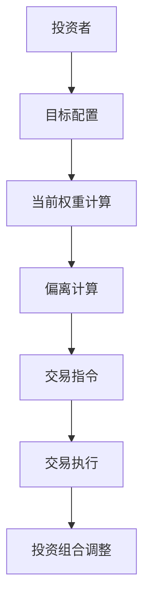

                 


# 《约翰伯格的再平衡策略：维持投资组合的健康》

## 关键词：投资组合再平衡，风险管理，投资策略，约翰伯格，资产配置

## 摘要：  
投资组合的健康与否直接影响投资者的收益与风险承受能力。再平衡策略作为一种重要的投资管理方法，能够帮助投资者在动态变化的市场环境中维持投资组合的稳定性。本文通过详细分析再平衡策略的核心概念、算法原理、系统架构及实际应用，为投资者提供科学的指导。文章从背景介绍、核心概念、算法原理、系统架构设计、项目实战、最佳实践等方面展开，结合数学模型、流程图和实际案例，全面阐述再平衡策略的理论与实践。

---

# 第一部分: 投资组合再平衡策略的背景与基础

## 第1章: 投资组合再平衡策略概述

### 1.1 投资组合再平衡的基本概念  
- **1.1.1 投资组合的概念与重要性**  
  投资组合是指将资金分配到不同资产（如股票、债券、基金等）上的策略。其重要性在于分散风险，追求收益最大化。  
- **1.1.2 再平衡策略的定义**  
  再平衡策略是指定期调整投资组合的资产配置，使其恢复到预定的目标比例，以应对市场波动和投资者风险偏好的变化。  
- **1.1.3 再平衡策略的目的与作用**  
  再平衡策略旨在降低投资组合的波动性，优化风险与收益的匹配，确保长期投资目标的实现。  

### 1.2 投资组合再平衡的背景与问题背景  
- **1.2.1 投资市场的动态变化**  
  市场波动、经济周期变化等因素会导致投资组合偏离目标配置。  
- **1.2.2 投资组合偏离目标的风险**  
  过大的偏离可能导致投资组合的风险超出预期，影响整体收益。  
- **1.2.3 再平衡策略的必要性**  
  通过定期再平衡，可以及时调整资产配置，降低市场波动对投资组合的影响。  

### 1.3 再平衡策略的核心问题描述  
- **1.3.1 投资组合偏离的原因**  
  市场波动、资产表现差异等导致资产权重偏离目标配置。  
- **1.3.2 市场波动对投资组合的影响**  
  不同资产的波动性差异会导致投资组合的风险变化。  
- **1.3.3 再平衡策略的目标与边界**  
  再平衡的目标是在控制成本的前提下，将投资组合调整回目标配置，同时考虑再平衡的频率和成本。  

### 1.4 再平衡策略的外延与核心要素  
- **1.4.1 再平衡的适用范围**  
  适用于各类投资组合，包括个人投资者和机构投资者。  
- **1.4.2 再平衡的周期性与频率**  
  再平衡可以是定期（如季度）或动态调整。  
- **1.4.3 再平衡的成本与收益**  
  再平衡需要考虑交易成本和时间成本，但能够降低风险，提高收益。  

### 1.5 本章小结  
本章从背景和基础出发，详细阐述了再平衡策略的核心概念、必要性以及其实现的关键要素。

---

## 第2章: 投资组合管理与风险控制  

### 2.1 投资组合管理的原理  
- **2.1.1 投资组合管理的基本原理**  
  通过优化资产配置，实现风险与收益的最优平衡。  
- **2.1.2 投资组合管理的目标函数**  
  最大化收益，最小化风险。  
- **2.1.3 投资组合管理的约束条件**  
  资金限制、流动性要求等。  

### 2.2 投资组合风险与收益的平衡  
- **2.2.1 投资组合的风险类型**  
  市场风险、流动性风险、信用风险等。  
- **2.2.2 投资组合的收益来源**  
  利息、股息、资本增值等。  
- **2.2.3 风险与收益的平衡机制**  
  通过资产配置和再平衡策略实现风险与收益的动态平衡。  

### 2.3 再平衡策略的核心概念  
- **2.3.1 再平衡的数学模型**  
  通过优化算法调整资产权重，使投资组合恢复目标配置。  
- **2.3.2 再平衡的决策变量**  
  资产权重、交易成本、市场预期等。  
- **2.3.3 再平衡的优化目标**  
  最小化偏离目标配置的误差，同时考虑交易成本。  

### 2.4 核心概念的联系与对比  
- **2.4.1 投资组合管理与再平衡策略的对比**  
  投资组合管理是整体策略，再平衡是其中的重要环节。  
- **2.4.2 再平衡策略与风险管理的联系**  
  再平衡是风险管理的一种手段，通过调整资产配置降低风险。  
- **2.4.3 再平衡策略与其他投资策略的对比**  
  与分散投资、主动投资等策略相比，再平衡更注重动态调整。  

### 2.5 本章小结  
本章详细探讨了投资组合管理与再平衡策略的关系，分析了风险与收益的平衡机制，并总结了再平衡策略的核心概念。

---

## 第3章: 投资组合再平衡的算法原理  

### 3.1 投资组合优化的数学模型  
- **3.1.1 优化目标函数**  
  最小化投资组合的波动性，或最大化收益。  
  $$ \text{目标函数：} \min \sigma^2 \text{ 或 } \max \mu $$  
- **3.1.2 约束条件**  
  资产权重之和为1，投资比例符合目标配置。  
  $$ \sum_{i=1}^{n} w_i = 1 $$  

### 3.2 再平衡策略的核心算法  
- **3.2.1 确定目标配置**  
  根据投资者的风险偏好确定各资产的目标权重。  
- **3.2.2 计算当前投资组合的偏离**  
  比较当前权重与目标权重，确定需要调整的资产。  
- **3.2.3 执行再平衡交易**  
  通过买卖资产调整权重，恢复目标配置。  

### 3.3 再平衡算法的实现步骤  
1. **确定目标配置**：根据投资者的风险偏好设定各资产的目标权重。  
2. **计算当前权重**：根据市场表现计算当前投资组合的权重。  
3. **计算偏离**：对比当前权重与目标权重，确定需要调整的资产。  
4. **执行交易**：通过买卖资产调整权重，恢复目标配置。  

### 3.4 算法优化与改进  
- **3.4.1 动态再平衡**  
  根据市场变化动态调整再平衡频率。  
- **3.4.2 成本优化**  
  通过批量交易降低成本。  

### 3.5 本章小结  
本章详细介绍了再平衡策略的数学模型和实现算法，探讨了优化方法，为实际应用提供了理论基础。

---

## 第4章: 投资组合再平衡的系统架构设计  

### 4.1 系统功能设计  
- **用户界面**：投资者输入目标配置，查看当前投资组合状态。  
- **数据处理**：计算当前权重，生成再平衡指令。  
- **交易执行**：根据指令执行买卖交易。  

### 4.2 系统架构设计（Mermaid）  


### 4.3 接口设计与交互流程  
- **输入接口**：目标配置参数。  
- **输出接口**：交易指令和调整报告。  
- **交互流程**：投资者输入目标配置，系统计算当前权重，生成调整指令并执行交易。  

### 4.4 本章小结  
本章通过系统架构设计，展示了再平衡策略的实际应用，明确了各模块的功能与交互流程。

---

## 第5章: 投资组合再平衡的项目实战  

### 5.1 项目背景与目标  
- 项目目标：开发一个基于再平衡策略的投资组合管理系统。  
- 项目范围：实现目标配置、当前权重计算、偏离分析和交易执行功能。  

### 5.2 项目实现（Python代码）  
```python
def rebalance_portfolio(target_weights, current_weights):
    # 计算偏离
    deviations = {asset: target - current for asset, target, current in zip(target_weights.keys(), target_weights.values(), current_weights.values())}
    # 生成交易指令
    buy = {asset: max(deviation, 0) for asset, deviation in deviations.items()}
    sell = {asset: max(-deviation, 0) for asset, deviation in deviations.items()}
    return buy, sell

# 示例使用
target_weights = {'股票': 0.6, '债券': 0.3, '现金': 0.1}
current_weights = {'股票': 0.7, '债券': 0.2, '现金': 0.1}
buy, sell = rebalance_portfolio(target_weights, current_weights)
print("买入:", buy)
print("卖出:", sell)
```

### 5.3 实际案例分析  
- 案例背景：假设目标配置为股票60%，债券30%，现金10%。当前权重为股票70%，债券20%，现金10%。  
- 调整结果：卖出股票10%，买入债券10%。  

### 5.4 本章小结  
本章通过项目实战，展示了再平衡策略的实际应用，提供了代码实现和案例分析。

---

## 第6章: 最佳实践与小结  

### 6.1 最佳实践  
- 定期进行再平衡，但避免过于频繁。  
- 考虑交易成本，优化调整频率。  
- 结合市场环境，动态调整目标配置。  

### 6.2 小结  
本文从理论到实践，全面分析了再平衡策略的核心概念、算法原理和系统架构，为投资者提供了科学的指导。

---

## 作者：AI天才研究院/AI Genius Institute & 禅与计算机程序设计艺术 /Zen And The Art of Computer Programming  

---

### 总结  
通过以上目录，文章从背景、概念、算法、系统架构到项目实战，全面阐述了再平衡策略的理论与实践，为投资者提供了详实的指导和参考。

