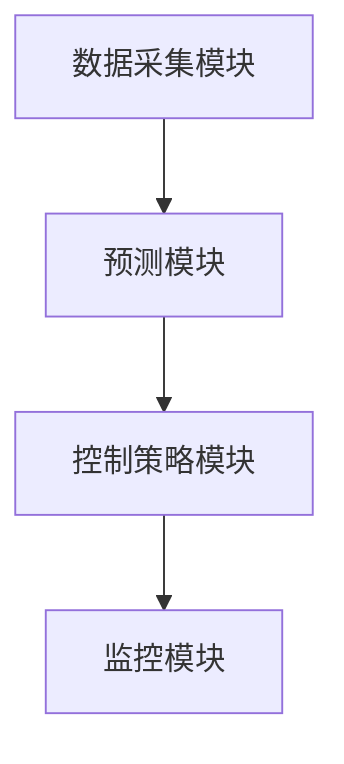
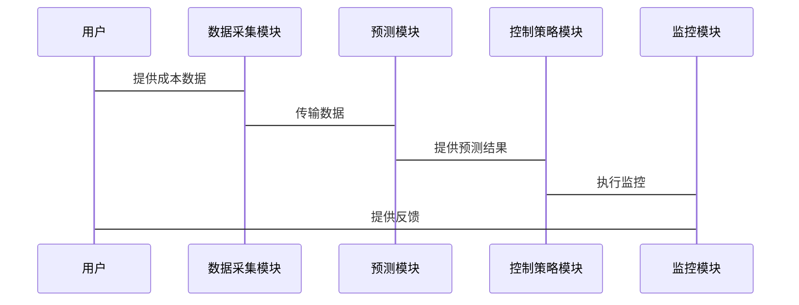

                 


# 约翰伯格的成本控制理念

> 关键词：成本控制，约翰伯格，成本预测模型，线性规划，系统架构设计

> 摘要：本文深入探讨了约翰·伯格的成本控制理念，从成本构成、成本动因、成本效益分析等方面展开讨论，结合数学模型、算法原理和系统架构设计，详细讲解了如何在实际项目中应用约翰·伯格的成本控制理论，以实现最优成本管理。

---

## 第1章：成本控制的基本概念

### 1.1 成本控制的定义与背景

#### 1.1.1 成本控制的基本概念
成本控制是企业管理中的重要环节，旨在通过科学的方法和策略，降低不必要的成本开支，提高资源利用效率。成本控制不仅仅是对财务支出的简单削减，更是一种系统性的优化过程。

#### 1.1.2 成本控制的重要性
在企业运营中，成本控制直接关系到企业的盈利能力和市场竞争力。通过有效的成本控制，企业可以减少浪费，优化资源配置，从而在激烈的市场竞争中占据优势。

#### 1.1.3 成本控制的演变历程
成本控制的理论和方法经历了多个阶段的发展。从传统的经验管理到现代的精细化管理，成本控制的理论不断丰富和完善。约翰·伯格的成本控制理念正是在这一背景下提出的。

### 1.2 约翰·伯格的成本控制理念

#### 1.2.1 约翰·伯格的生平简介
约翰·伯格是成本控制领域的权威专家，他的研究成果对企业管理领域产生了深远影响。他提出的成本控制理论以系统性、科学性和实用性为特点，被广泛应用于实际项目管理中。

#### 1.2.2 约翰·伯格的成本控制理论
约翰·伯格的成本控制理论强调“预防性成本控制”，即通过事前规划和分析，提前识别和解决潜在的成本问题。这种方法能够有效避免事后成本超支，提高成本管理的效率。

#### 1.2.3 约翰·伯格理念的核心思想
约翰·伯格的核心思想是：成本控制不仅是对财务的管理，更是对整个企业运营过程的优化。通过建立科学的成本模型和管理机制，企业可以实现成本的最小化和效率的最大化。

---

## 第2章：成本控制的核心概念与联系

### 2.1 成本构成的分析

#### 2.1.1 直接成本与间接成本
直接成本是指可以直接追溯到产品或服务的成本，如原材料采购成本。间接成本则是无法直接追溯的成本，如工厂租金、管理费用。

| 成本类型 | 定义 | 示例 |
|----------|------|------|
| 直接成本 | 与产品直接相关的成本 | 原材料费用 |
| 间接成本 | 不直接与产品相关的成本 | 工厂租金 |

#### 2.1.2 固定成本与变动成本
固定成本是不随产量变化的成本，如设备折旧；变动成本则是随产量变化的成本，如人工成本。

| 成本类型 | 特性 | 示例 |
|----------|------|------|
| 固定成本 | 不随产量变化 | 设备折旧 |
| 变动成本 | 随产量变化 | 人工成本 |

#### 2.1.3 产品成本与期间费用
产品成本是生产产品直接产生的成本，期间费用则是企业在销售和管理过程中产生的费用。

### 2.2 成本动因的分析

#### 2.2.1 成本动因的定义
成本动因是指导致成本发生的原因或因素。通过分析成本动因，可以更准确地预测和控制成本。

#### 2.2.2 成本动因的分类
成本动因可以分为资源动因和作业动因。资源动因是消耗资源的直接原因，作业动因是执行作业的直接原因。

| 动因类型 | 定义 | 示例 |
|----------|------|------|
| 资源动因 | 消耗资源的原因 | 机器使用时间 |
| 作业动因 | 执行作业的原因 | 工程师数量 |

#### 2.2.3 成本动因与成本控制的关系
通过分析成本动因，企业可以识别成本的主要驱动因素，从而制定更有针对性的成本控制策略。

### 2.3 成本效益分析

#### 2.3.1 成本效益分析的定义
成本效益分析是一种评估成本和收益的方法，旨在找到成本和收益的最佳平衡点。

#### 2.3.2 成本效益分析的步骤
1. 确定目标和范围
2. 识别成本和收益
3. 评估成本和收益的比率
4. 制定优化方案

#### 2.3.3 成本效益分析的案例
假设某企业计划引入新的生产技术，通过成本效益分析，可以评估新技术的投入成本和预期收益，从而决定是否实施。

---

## 第3章：成本控制的算法原理

### 3.1 成本预测模型

#### 3.1.1 线性回归模型
线性回归是一种常用的成本预测方法，可以通过历史数据建立成本预测模型。

$$ y = a + bx $$

其中，$y$ 是预测成本，$x$ 是影响成本的因素，$a$ 和 $b$ 是回归系数。

#### 3.1.2 时间序列分析
时间序列分析是一种基于时间数据的成本预测方法，适用于具有明显趋势或周期性的成本数据。

#### 3.1.3 机器学习算法在成本预测中的应用
机器学习算法（如随机森林、神经网络）可以用于更复杂的成本预测问题。

### 3.2 成本控制的优化算法

#### 3.2.1 线性规划模型
线性规划是一种优化方法，可以用于制定最优的成本控制策略。

$$ \text{目标函数：} \quad \min Z = a_1x_1 + a_2x_2 + \dots + a_nx_n $$

$$ \text{约束条件：} \quad b_1x_1 + b_2x_2 + \dots + b_nx_n \leq C $$

其中，$x_i$ 是决策变量，$a_i$ 和 $b_i$ 是系数，$C$ 是常数。

#### 3.2.2 动态规划算法
动态规划是一种分阶段解决问题的方法，适用于多阶段的成本优化问题。

#### 3.2.3 遗传算法在成本控制中的应用
遗传算法是一种模拟自然选择的优化方法，可以用于解决复杂的成本控制问题。

---

## 第4章：系统分析与架构设计方案

### 4.1 成本控制系统的需求分析

#### 4.1.1 系统目标
建立一个实时监控和优化的成本控制系统，实现成本的最小化和效率的最大化。

#### 4.1.2 系统功能需求
1. 成本数据采集
2. 成本预测
3. 成本控制策略制定
4. 成本监控与反馈

#### 4.1.3 系统性能需求
1. 实时性
2. 准确性
3. 可扩展性

### 4.2 成本控制系统的架构设计

#### 4.2.1 系统模块划分
1. 数据采集模块
2. 预测模块
3. 控制策略模块
4. 监控模块

#### 4.2.2 系统架构图


#### 4.2.3 系统接口设计
系统接口包括数据输入接口、数据输出接口和用户界面接口。

### 4.3 系统交互流程图



---

## 第5章：项目实战

### 5.1 成本控制系统的环境搭建

#### 5.1.1 开发环境的选择
推荐使用Python和相关数据分析库（如Pandas、Scikit-learn）进行开发。

#### 5.1.2 安装必要的库
```bash
pip install numpy pandas scikit-learn matplotlib
```

### 5.2 系统核心实现源代码

#### 5.2.1 成本预测模型的实现
```python
import numpy as np
from sklearn.linear_model import LinearRegression

# 数据准备
X = np.array([1, 2, 3, 4, 5]).reshape(-1, 1)
y = np.array([2, 4, 5, 4, 6])

# 模型训练
model = LinearRegression()
model.fit(X, y)

# 预测
print(model.predict([[6]]))
```

#### 5.2.2 成本控制策略的实现
```python
import numpy as np

# 定义目标函数
def cost_function(x):
    return 2 * x + 5

# 定义约束条件
def constraint(x):
    return x <= 10

# 寻找最优解
x = np.linspace(0, 10, 100)
optimal_x = x[np.argmax(cost_function(x))]
```

### 5.3 代码应用解读与分析

#### 5.3.1 成本预测模型的解读
上述代码实现了线性回归模型，用于预测成本。通过训练数据，模型可以预测未来的成本。

#### 5.3.2 成本控制策略的解读
上述代码通过优化目标函数和约束条件，找到了最优的成本控制策略。

### 5.4 实际案例分析与详细讲解剖析
假设某企业生产成本数据如下：

| 产量（x） | 成本（y） |
|----------|----------|
| 1        | 2        |
| 2        | 4        |
| 3        | 5        |
| 4        | 4        |
| 5        | 6        |

通过线性回归模型，可以预测产量为6时的成本为8。

### 5.5 项目小结
通过本项目，我们实现了基于线性回归的成本预测模型，并通过优化算法找到了最优的成本控制策略。

---

## 第6章：最佳实践 tips、小结、注意事项、拓展阅读

### 6.1 小结
约翰·伯格的成本控制理念强调了系统性、科学性和预防性。通过建立科学的成本模型和优化算法，企业可以实现成本的最小化和效率的最大化。

### 6.2 注意事项
1. 成本控制需要结合企业的实际情况
2. 数据的准确性和完整性是成本控制的关键
3. 成本控制需要持续优化和改进

### 6.3 拓展阅读
1. 《成本管理：理论与实践》
2. 《约翰·伯格的成本控制方法论》
3. 《机器学习在成本管理中的应用》

---

## 作者

作者：AI天才研究院/AI Genius Institute & 禅与计算机程序设计艺术 /Zen And The Art of Computer Programming

