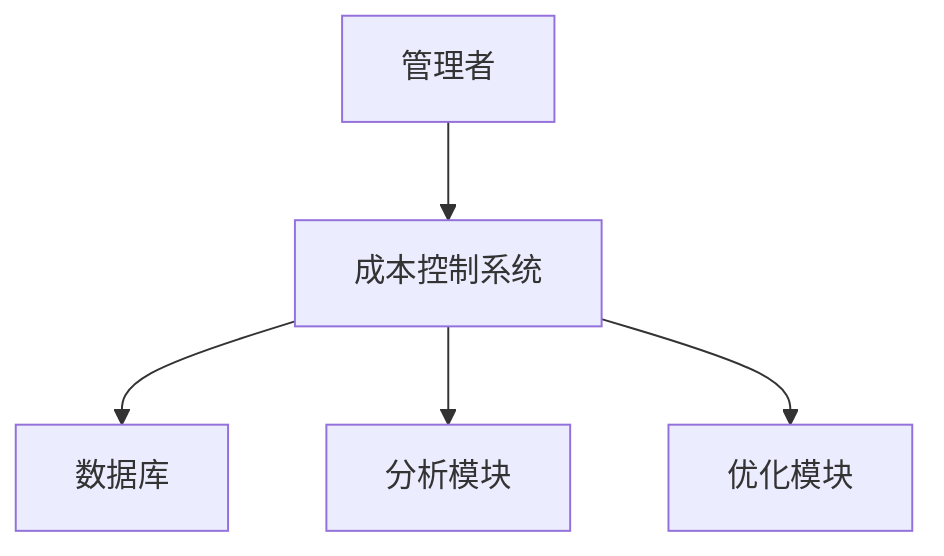
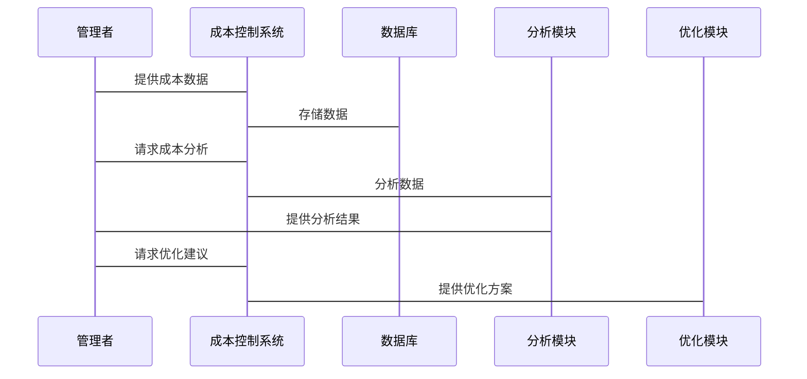

                 


# 约翰伯格的成本控制理念：为什么低成本是制胜关键

## 关键词：成本控制，约翰伯格，低成本，企业利润，竞争优势

## 摘要：
本文深入探讨了约翰伯格的成本控制理念，分析了低成本在企业竞争中的重要性。通过系统的分析和实际案例，展示了如何通过优化资源利用、减少浪费和提高效率来降低生产成本，从而提升企业的盈利能力。文章详细阐述了成本控制的核心概念、算法原理、系统架构设计以及项目实战，为读者提供了一套全面的成本管理方法论。

---

# 第一部分：成本控制与竞争优势

## 第1章：成本控制的重要性与约翰伯格的理念

### 1.1 成本控制的背景与意义

#### 1.1.1 企业竞争中的成本问题
在现代商业环境中，成本控制是企业生存和发展的关键因素之一。企业之间的竞争不仅体现在产品质量和创新上，更体现在成本控制能力上。低成本意味着更高的利润率和更强的市场竞争力。

#### 1.1.2 成本控制的核心概念
成本控制是指通过优化资源配置、减少浪费和提高效率，以降低企业生产成本的过程。它涵盖了从生产到管理的各个环节，是企业全面管理的重要组成部分。

#### 1.1.3 约翰伯格的成本控制理论概述
约翰伯格提出，低成本是企业制胜的关键。他的理念强调通过系统化的成本分析和优化，实现资源的最优配置，从而在竞争中占据优势。

### 1.2 约翰伯格的成本控制理念

#### 1.2.1 成本控制的基本原则
1. **最小化浪费**：通过优化生产流程，减少原材料和资源的浪费。
2. **提高效率**：通过技术革新和流程优化，提高生产效率。
3. **控制固定成本**：合理规划固定成本，避免不必要的开支。

#### 1.2.2 成本控制的三个关键要素
1. **固定成本**：如厂房租金、设备折旧等，这些成本在一定范围内是固定的。
2. **变动成本**：如原材料和直接人工成本，这些成本与生产量直接相关。
3. **混合成本**：既有固定部分，也有变动部分，如某些管理费用。

#### 1.2.3 成本控制与企业利润的关系
通过有效控制成本，企业可以增加利润空间，提升整体盈利能力。成本降低10%，利润通常会相应增加，从而增强企业的市场竞争力。

### 1.3 成本控制的边界与外延

#### 1.3.1 成本控制的范围界定
成本控制不仅限于生产环节，还包括研发、销售、物流等整个价值链的各个环节。只有全面控制成本，才能实现整体优化。

#### 1.3.2 成本控制与其他管理职能的关系
成本控制与财务管理、生产管理、供应链管理密切相关。它是企业全面管理的重要组成部分，需要与其他职能协同合作。

#### 1.3.3 成本控制的局限性与适用场景
成本控制并非在所有情况下都适用。例如，在高端市场，质量可能比成本更重要。因此，成本控制需要结合企业的战略目标和市场定位。

### 1.4 成本控制的核心要素与结构

#### 1.4.1 成本构成的三要素分析
- **固定成本**：厂房、设备等固定支出。
- **变动成本**：原材料、人工等与产量相关的支出。
- **混合成本**：部分固定、部分变动的成本，如某些管理费用。

#### 1.4.2 成本控制的系统模型
成本控制是一个系统工程，涉及目标设定、数据采集、分析优化和持续改进等环节。

#### 1.4.3 成本控制的层次与流程
1. **目标设定**：明确成本控制的目标和范围。
2. **数据采集**：收集生产和管理过程中的成本数据。
3. **分析优化**：通过数据分析，找出成本浪费点，制定优化方案。
4. **持续改进**：实施优化措施，并持续监控和改进。

---

## 第2章：成本控制的核心概念与联系

### 2.1 成本控制的原理与方法

#### 2.1.1 成本控制的基本原理
通过分析成本构成，识别浪费点，并采取措施减少浪费，从而降低总成本。

#### 2.1.2 成本控制的主要方法
1. **预算管理**：制定成本预算，监控实际支出，确保在预算范围内。
2. **ABC成本法**：按活动或项目分配成本，提高成本分配的准确性。
3. **价值分析**：通过分析产品或服务的真正价值，优化成本结构。

#### 2.1.3 成本控制的数学模型
总成本公式：
$$\text{总成本} = \text{固定成本} + (\text{单位变动成本} \times \text{数量})$$

### 2.2 成本控制的核心概念对比

#### 2.2.1 成本、利润与效率的对比分析
- 成本降低，利润增加，前提是效率不变。
- 提高效率，可以在相同成本下生产更多产品，降低成本。

#### 2.2.2 变动成本与固定成本的特征对比
| 成本类型 | 特性             | 示例               |
|----------|------------------|--------------------|
| 固定成本 | 不随产量变化     | 厂房租金           |
| 变动成本 | 随产量变化       | 原材料             |

#### 2.2.3 成本控制与预算管理的对比
- 成本控制注重事前规划和过程控制。
- 预算管理注重预算的制定和执行，但不一定是全过程控制。

### 2.3 成本控制的ER实体关系图

```mermaid
er
  actor: 管理者
  entity: 成本项目
  entity: 预算
  entity: 实际成本
  entity: 利润
  actor --> 监控: 监控成本
  actor --> 分配: 分配预算
  成本项目 --> 预算: 关联
  实际成本 --> 利润: 关联
```

---

## 第3章：成本控制的算法原理与数学模型

### 3.1 成本控制的算法原理

#### 3.1.1 成本预测算法
通过历史数据分析，预测未来的成本趋势，常用方法有线性回归和时间序列分析。

#### 3.1.2 成本优化算法
通过线性规划等优化方法，找到成本最低的生产组合。

### 3.2 成本控制的数学模型

#### 3.2.1 总成本公式
$$\text{总成本} = FC + (VC \times Q)$$
其中，FC为固定成本，VC为单位变动成本，Q为产量。

#### 3.2.2 利润公式
$$\text{利润} = 收入 - \text{总成本}$$

---

## 第4章：系统分析与架构设计

### 4.1 系统功能设计
- 数据采集：收集生产过程中的成本数据。
- 成本计算：根据数据计算总成本和各部分成本。
- 成本分析：通过数据分析找出浪费点。
- 优化建议：基于分析结果提出优化方案。

### 4.2 系统架构设计



### 4.3 接口设计与交互流程



---

## 第5章：项目实战

### 5.1 环境安装
- 安装Python和相关库（如pandas、numpy）。
- 数据库安装和配置。

### 5.2 核心代码实现

```python
import pandas as pd

# 数据读取
cost_data = pd.read_csv('cost.csv')

# 总成本计算
fixed_cost = 10000  # 假设固定成本为10000
variable_cost = 50   # 假设单位变动成本为50
quantity = 100       # 产量

total_cost = fixed_cost + (variable_cost * quantity)
print(f"总成本为：{total_cost}")
```

### 5.3 案例分析
以一家制造企业为例，分析如何通过优化生产流程降低成本。通过实际数据计算，展示成本控制带来的利润提升。

---

## 第6章：总结与展望

### 6.1 本章总结
约翰伯格的成本控制理念强调低成本的重要性，通过系统化的分析和优化，企业可以在竞争中占据优势。

### 6.2 未来展望
随着人工智能和大数据技术的发展，成本控制将更加智能化和精准化。未来，企业可以通过预测分析和实时监控进一步优化成本管理。

### 6.3 最佳实践 tips
1. 定期进行成本分析，找出浪费点。
2. 引入先进的技术工具，提高成本控制效率。
3. 建立成本控制的反馈机制，持续改进。

---

## 作者：AI天才研究院/AI Genius Institute & 禅与计算机程序设计艺术 /Zen And The Art of Computer Programming

---

通过以上结构，我们可以全面理解约翰伯格的成本控制理念，并将其应用于实际的企业管理中，帮助企业在竞争激烈的市场中占据优势。

