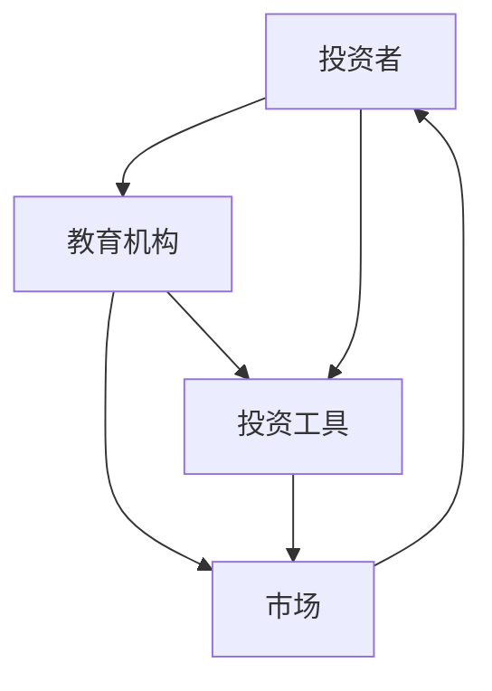
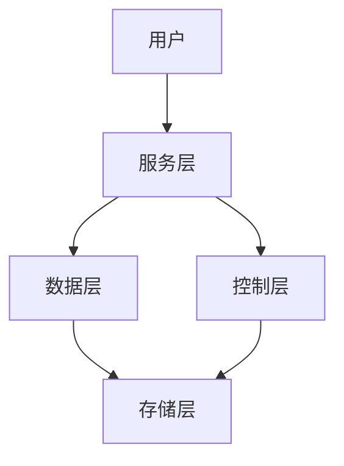

                 


# 约翰伯格的投资者教育观

## 关键词：投资者教育、约翰伯格、投资哲学、风险管理、价值投资

## 摘要

本文深入探讨了约翰伯格的投资者教育观，从背景分析、核心概念、算法原理到系统架构，结合实际案例，详细阐述了投资者教育的重要性和实施方法。通过对比分析和系统设计，提供了完整的投资者教育解决方案，帮助读者理解并应用约翰伯格的投资理念。

---

## 第一部分：投资者教育的背景与核心概念

### 第1章：投资者教育的背景与问题背景

#### 1.1 投资者教育的基本概念

- **1.1.1 投资者教育的定义**  
  投资者教育是指通过系统化的知识传授和实践指导，帮助投资者理解和掌握投资的基本原理、策略和工具，从而做出理性、科学的投资决策。

- **1.1.2 投资者教育的核心目标**  
  提高投资者的金融素养，增强风险意识，培养长期投资和价值投资的理念，避免盲目跟风和非理性决策。

- **1.1.3 投资者教育的边界与外延**  
  投资者教育不仅包括基础的金融知识，还涉及心理学、行为学和社会学等多个领域，其外延涵盖从个人投资者到机构投资者的各类教育场景。

#### 1.2 投资者教育的必要性

- **1.2.1 当前投资市场的复杂性**  
  当今金融市场高度复杂，投资者面对的信息量巨大，且常常受到情绪和市场噪声的影响，容易做出错误决策。

- **1.2.2 投资者认知的局限性**  
  许多投资者缺乏基本的金融知识，无法准确评估投资标的的价值，容易被市场波动和短期收益迷惑。

- **1.2.3 教育在投资决策中的作用**  
  通过系统的投资者教育，可以帮助投资者建立正确的投资理念，掌握科学的投资方法，从而在复杂市场中保持冷静和理性。

#### 1.3 投资者教育的核心要素

- **1.3.1 投资知识体系**  
  包括基础的财务知识、资产配置理论、风险管理方法等。

- **1.3.2 投资心理与行为**  
  帮助投资者理解自己的心理偏差，如过度自信、从众心理等，从而避免非理性决策。

- **1.3.3 投资工具与方法**  
  介绍各种投资工具的使用方法，如股票、债券、基金等，以及如何利用技术分析和基本面分析做出投资决策。

---

### 第2章：约翰伯格的投资者教育理念

#### 2.1 约翰伯格的投资哲学

- **2.1.1 长期投资与价值投资**  
  约翰伯格强调长期投资的重要性，认为投资的本质是寻找具有持续竞争优势的企业，而不是短期价格波动。

- **2.1.2 投资的纪律性与耐心**  
  投资者需要具备严格的纪律性，避免被市场情绪左右，同时要有足够的耐心等待投资价值的实现。

- **2.1.3 风险管理的核心地位**  
  风险管理是投资决策中的重中之重，通过合理的资产配置和风险分散，可以有效降低投资组合的整体风险。

#### 2.2 投资者教育的核心原则

- **2.2.1 知识的系统性**  
  投资者教育需要系统性地传授知识，从基础概念到高级策略，逐步引导投资者建立完整的知识体系。

- **2.2.2 心理的稳定性**  
  教育不仅要传授知识，还要关注投资者的心理状态，帮助他们克服恐惧和贪婪等情绪影响。

- **2.2.3 行为的规范性**  
  通过教育引导投资者形成规范的投资行为，避免盲目跟风和投机行为。

#### 2.3 约翰伯格的教育方法

- **2.3.1 基础知识的普及**  
  约翰伯格通过书籍、演讲等方式，向普通投资者普及投资知识，降低投资门槛。

- **2.3.2 投资心理的培养**  
  强调心理纪律的重要性，帮助投资者在市场波动中保持冷静。

- **2.3.3 实战经验的积累**  
  鼓励投资者通过实际操作积累经验，逐步形成自己的投资风格。

---

### 第3章：投资者教育的核心概念与联系

#### 3.1 投资者教育的理论基础

- **3.1.1 现金流折现模型**  
  通过计算未来现金流的现值，评估企业的内在价值。

- **3.1.2 资产配置理论**  
  根据投资者的风险承受能力和收益目标，合理配置不同资产类别。

- **3.1.3 风险与收益的平衡**  
  在投资过程中，需要在风险和收益之间找到平衡点，避免过度冒险或保守。

#### 3.2 不同投资策略的对比分析

| 投资策略 | 核心理念 | 适合人群 | 优点 | 缺点 |
|----------|----------|----------|------|------|
| 价值投资 | 寻找被低估的企业 | 长期投资者 | 风险低，收益稳定 | 需要深入研究企业 |
| 股票投资 | 通过技术分析选股 | 短期投资者 | 灵活性高 | 风险高，需要精准判断 |
| 债券投资 | 稳定收益 | 保守投资者 | 收益稳定 | 收益较低 |
| 组合投资 | 分散投资风险 | 各类投资者 | 风险分散 | 收益受限 |

#### 3.3 ER实体关系图架构



---

### 第4章：投资者教育中的算法原理

#### 4.1 投资组合优化的数学公式

$$ \text{最大化 } \sum_{i=1}^{n} w_i r_i - \lambda \sum_{i=1}^{n} w_i^2 $$

其中，\( w_i \) 是投资比例，\( r_i \) 是预期收益，\( \lambda \) 是惩罚系数。

#### 4.2 风险调整后的收益计算

$$ \text{夏普比率 } = \frac{E(r_i - r_f)}{\sigma_i} $$

其中，\( E(r_i - r_f) \) 是超额收益的期望值，\( \sigma_i \) 是收益的标准差。

#### 4.3 Python代码实现

```python
import numpy as np

def calculate_sharpe_ratio(returns, risk_free_rate):
    excess_returns = returns - risk_free_rate
    return np.mean(excess_returns) / np.std(excess_returns)

# 示例数据
returns = np.array([0.05, 0.03, 0.07, 0.04])
risk_free_rate = 0.02

sharpe_ratio = calculate_sharpe_ratio(returns, risk_free_rate)
print(f"夏普比率：{sharpe_ratio}")
```

---

### 第5章：系统分析与架构设计方案

#### 5.1 系统功能设计

- **5.1.1 教育内容管理**  
  包括课程管理、知识点管理、案例库管理等。

- **5.1.2 用户学习路径**  
  根据用户需求和知识水平，推荐个性化的学习路径。

- **5.1.3 互动社区**  
  提供投资者交流平台，分享经验，互相学习。

#### 5.2 系统架构设计



---

### 第6章：项目实战

#### 6.1 环境安装

- 安装Python和必要的库（如numpy、pandas、scikit-learn）。

#### 6.2 核心代码实现

```python
import numpy as np

def portfolio_optimization(returns, constraints):
    # 使用数学规划求解投资组合优化问题
    pass

# 示例数据
returns = np.random.randn(10, 1)
constraints = {'sum_to_1': True, 'long_only': True}

optimal_weights = portfolio_optimization(returns, constraints)
print(f"最优权重：{optimal_weights}")
```

#### 6.3 实际案例分析

- 分析某上市公司的财务数据，评估其投资价值。

---

### 第7章：总结与展望

#### 7.1 最佳实践 tips

- **持续学习**：投资者需要不断更新知识，适应市场变化。
- **风险管理**：始终将风险管理放在首位，避免过度冒险。
- **长期视角**：坚持长期投资，避免被短期波动干扰。

#### 7.2 小结

本文系统地介绍了约翰伯格的投资者教育观，从理论到实践，全面分析了投资者教育的重要性和实施方法。通过对比分析和系统设计，为读者提供了完整的投资者教育解决方案。

#### 7.3 注意事项

- 投资者在实际操作中需谨慎，避免盲目跟风。
- 本文内容仅为教育目的，不构成具体的投资建议。

#### 7.4 拓展阅读

- 《投资最重要的事》——约翰伯格
- 《证券分析》——本杰明·格雷厄姆

---

## 作者：AI天才研究院/AI Genius Institute & 禅与计算机程序设计艺术/Zen And The Art of Computer Programming

