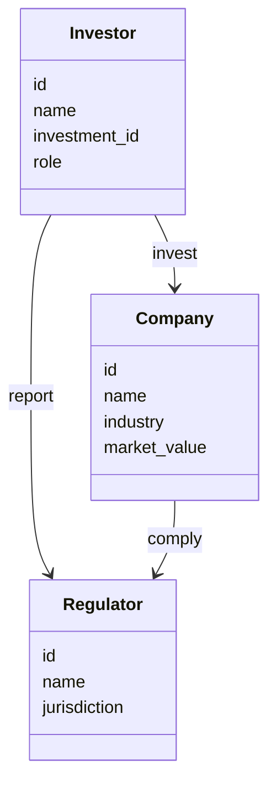
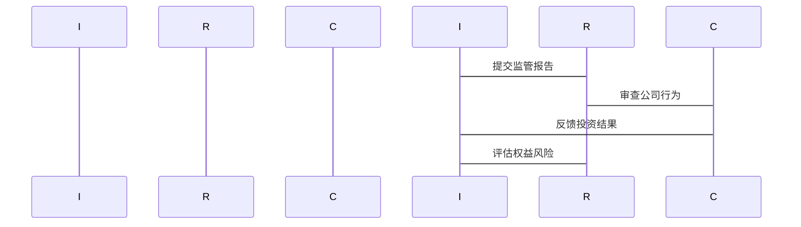

                 


# 约翰伯格的投资者权益保护

> 关键词：投资者权益保护、约翰·伯格、价值投资、风险管理、算法模型

> 摘要：本文探讨了约翰·伯格在投资者权益保护方面的贡献，分析了其核心理念，结合数学模型和系统架构，详细阐述了投资者权益保护的实现方法。

---

## 第一部分: 投资者权益保护的背景与核心概念

### 第1章: 投资者权益保护的背景与重要性

#### 1.1 投资者权益保护的背景
##### 1.1.1 投资者权益保护的定义与内涵
投资者权益保护是指通过法律、制度和管理手段，确保投资者在投资活动中享有知情权、参与权、收益权和监督权。其核心在于维护市场的公平性和透明性，保护投资者免受欺诈和不当行为的影响。

##### 1.1.2 当前投资环境中的问题与挑战
当前投资环境中，信息不对称、市场操纵、虚假信息披露等问题依然存在，这些问题威胁到投资者的合法权益。此外，随着金融创新的增多，投资者面临的风险也更加复杂多样。

##### 1.1.3 投资者权益保护的重要性与必要性
保护投资者权益是维护市场秩序、促进市场健康发展的重要基础。只有在投资者权益得到有效保护的情况下，市场才能吸引更多资金流入，支持实体经济的发展。

#### 1.2 约翰·伯格的投资者保护理念
##### 1.2.1 约翰·伯格的生平与投资成就
约翰·伯格是美国先锋集团的创始人，被誉为“指数基金之父”。他倡导低成本、被动投资策略，强调长期持有，避免频繁交易和市场波动的影响。

##### 1.2.2 伯格的长期投资与价值投资理念
伯格认为，长期投资能够减少市场波动的影响，使投资者能够获得市场的平均收益。他主张通过分散投资降低风险，避免过度依赖个别资产。

##### 1.2.3 伯格对投资者权益保护的贡献
伯格通过推出低成本的指数基金，降低了投资者的管理费用，使普通投资者也能够享受到机构投资者的低费率优势。同时，他积极推动基金行业的透明化，确保投资者能够获得充分的信息。

#### 1.3 投资者权益保护的法律与制度框架
##### 1.3.1 国际投资者保护的法律体系
国际上，投资者权益保护主要通过《证券法》、《公司治理准则》等法律法规来实现。各国根据自身国情，制定了相应的法律体系。

##### 1.3.2 美国、欧盟等主要市场的投资者保护制度
美国通过《证券交易法》和《萨班斯-奥克斯利法案》等，建立了严格的监管体系。欧盟则通过《金融工具市场指令》（MiFID）等，推动投资者权益保护。

##### 1.3.3 中国投资者权益保护的现状与挑战
中国近年来也在不断完善投资者保护的法律体系，但市场环境复杂，投资者教育和监管执行仍面临挑战。

### 第2章: 投资者权益保护的核心概念

#### 2.1 投资者权益保护的核心要素
##### 2.1.1 投资者的知情权
投资者有权了解其所投资的公司或基金的财务状况、业务模式和风险管理措施。充分的信息披露是保护投资者权益的基础。

##### 2.1.2 投资者的参与权
投资者应有机会参与公司治理，如投票选举董事、监事等，确保自身利益在公司决策中得到体现。

##### 2.1.3 投资者的收益权
投资者应获得与其投资风险和贡献相匹配的收益。收益权的实现与市场表现、公司业绩密切相关。

##### 2.1.4 投资者的监督权
投资者有权监督公司和管理机构的行为，确保其行为符合法律法规和市场规则。

#### 2.2 投资者权益保护的核心原理
##### 2.2.1 投资者权益保护的理论基础
基于现代金融理论，投资者权益保护是市场有效运作的前提。只有保护好投资者权益，才能增强市场的信任和流动性。

##### 2.2.2 投资者权益保护的实现机制
通过法律、制度、技术和管理手段，构建多维度的保护机制。例如，通过监管机构的审查、行业协会的自律、信息披露的规范等。

##### 2.2.3 投资者权益保护的边界与外延
投资者权益保护不应过度干预市场自由，应在保护权益和维护市场效率之间找到平衡点。

#### 2.3 投资者权益保护的核心概念对比表
| 权益类型 | 定义 | 保护措施 | 关键点 |
|----------|------|----------|-------|
| 知情权 | 投资者有权了解投资标的的详细信息 | 强制信息披露、监管审查 | 信息透明 |
| 参与权 | 投资者有权参与公司治理 | 股东投票权、董事会参与 | 民主决策 |
| 收益权 | 投资者有权获得投资收益 | 合理分配收益、避免利益输送 | 收益公平 |
| 监督权 | 投资者有权监督管理行为 | 监管机构监督、内部审计 | 监督有效 |

#### 2.4 投资者权益保护的ER实体关系图
```mermaid
erDiagram
investor {
  id int
  name string
  investment_id int
  role string
}
company {
  id int
  name string
  industry string
  market_value money
}
regulator {
  id int
  name string
  jurisdiction string
}
(investor)---(company): "投资于公司"
(investor)---(regulator): "监管报告"
(company)---(regulator): "监管审查"
```

---

## 第二部分: 投资者权益保护的算法原理与数学模型

### 第3章: 投资者权益保护的算法原理

#### 3.1 投资者权益风险评估模型
##### 3.1.1 模型背景与目标
为了量化投资者权益的风险，我们构建一个基于资产配置和市场波动的风险评估模型。

##### 3.1.2 模型算法
使用CAPM模型评估资产的预期收益和风险，公式如下：
$$ E(R_i) = R_f + \beta_i (R_m - R_f) $$
其中，\( E(R_i) \) 是资产 \( i \) 的预期收益，\( R_f \) 是无风险利率，\( \beta_i \) 是资产 \( i \) 的贝塔系数，\( R_m \) 是市场预期收益。

##### 3.1.3 模型实现步骤
1. 收集市场数据，计算各资产的贝塔系数。
2. 确定无风险利率和市场预期收益。
3. 计算各资产的预期收益，评估其风险等级。

#### 3.2 投资者权益保护的算法实现
##### 3.2.1 算法实现步骤
1. 数据预处理：清洗和整理投资者数据。
2. 模型训练：使用机器学习算法（如随机森林）预测权益风险。
3. 模型验证：通过回测验证模型的有效性。

##### 3.2.2 算法实现代码
```python
import pandas as pd
from sklearn.ensemble import RandomForestRegressor
from sklearn.metrics import mean_squared_error

# 数据加载与预处理
data = pd.read_csv('investor_risk.csv')
X = data[['age', 'investment_amount', 'risk_tolerance']]
y = data['risk_score']

# 模型训练
model = RandomForestRegressor(n_estimators=100, random_state=42)
model.fit(X, y)

# 模型验证
y_pred = model.predict(X)
print('均方误差:', mean_squared_error(y, y_pred))
```

---

## 第三部分: 投资者权益保护的系统分析与架构设计

### 第4章: 投资者权益保护系统架构

#### 4.1 系统功能设计
##### 4.1.1 功能模块划分
- 投资者信息管理模块
- 权益监控模块
- 风险评估模块
- 投资者教育模块

##### 4.1.2 领域模型设计


#### 4.2 系统架构设计
##### 4.2.1 系统架构图
```mermaid
containerDiagram
    container Web前端 {
        InvestorInterface
    }
    container 后端服务 {
        InvestorService
        CompanyService
        RegulatorService
    }
    container 数据库 {
        InvestorDB
        CompanyDB
        RegulatorDB
    }
    Web前端 --> InvestorService
    InvestorService --> RegulatorService
    RegulatorService --> CompanyService
```

#### 4.3 系统交互设计
##### 4.3.1 交互流程图


---

## 第四部分: 项目实战与案例分析

### 第5章: 项目实战

#### 5.1 环境安装
##### 5.1.1 安装Python与相关库
```bash
pip install numpy pandas sklearn matplotlib
```

#### 5.2 核心代码实现
##### 5.2.1 风险评估模型代码
```python
import numpy as np
import pandas as pd
from sklearn.model_selection import train_test_split
from sklearn.metrics import accuracy_score

# 数据加载
data = pd.read_csv('risk_factors.csv')
X = data.drop('risk_level', axis=1)
y = data['risk_level']

# 数据分割
X_train, X_test, y_train, y_test = train_test_split(X, y, test_size=0.2)

# 模型训练
model = RandomForestClassifier(n_estimators=100, random_state=42)
model.fit(X_train, y_train)

# 模型预测
y_pred = model.predict(X_test)
print('准确率:', accuracy_score(y_test, y_pred))
```

#### 5.3 案例分析
##### 5.3.1 案例背景
假设我们有一个投资者数据集，包含投资者的年龄、投资金额、风险承受能力和相应的权益风险等级。

##### 5.3.2 数据分析与可视化
```python
import matplotlib.pyplot as plt

data['risk_level'].value_counts().plot(kind='bar')
plt.title('权益风险等级分布')
plt.show()
```

---

## 第五部分: 最佳实践与总结

### 第6章: 最佳实践

#### 6.1 小结
通过本文的分析，我们了解了约翰·伯格的投资者权益保护理念，探讨了相关的算法原理和系统架构设计。投资者权益保护是市场健康发展的基石，需要法律、技术和管理的协同作用。

#### 6.2 注意事项
- 投资者应增强风险意识，合理配置资产。
- 监管机构应加强信息披露，完善监管机制。
- 投资机构应注重合规经营，保护投资者利益。

#### 6.3 拓展阅读
建议进一步阅读《投资最重要的ことは何か》（《最重要的投资是什么呢》）和《institutional Investor》等书籍和期刊，深入了解投资者权益保护的更多细节。

---

## 作者：AI天才研究院/AI Genius Institute & 禅与计算机程序设计艺术 /Zen And The Art of Computer Programming

