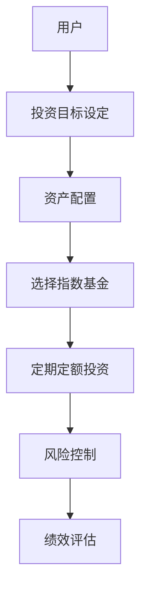

                 


# 约翰·伯格的指数投资理论

## 关键词：
- 指数投资
- 约翰·伯格
- 资产配置
- 有效市场假说
- 投资策略

## 摘要：
本文系统地介绍了约翰·伯格的指数投资理论，从理论基础到实践应用进行了全面分析。通过探讨指数投资的核心概念、数学模型、系统架构以及实战案例，深入剖析了约翰·伯格的投资理念及其在现代投资中的应用价值。文章还结合了定期定额投资策略和指数投资的未来趋势，为读者提供了完整的指数投资解决方案。

---

## 第一部分: 约翰·伯格的指数投资理论概述

### 第1章: 指数投资的起源与背景

#### 1.1 指数投资的定义与特点

##### 1.1.1 什么是指数投资
指数投资是一种被动投资策略，旨在通过跟踪特定市场指数的表现来实现长期资本增值。它不同于主动投资，不需要频繁买卖股票，而是通过持有指数基金来分散风险。

##### 1.1.2 指数投资的核心特点
- **分散化**：通过投资整个市场指数，降低单一资产的风险。
- **低成本**：指数基金的管理费用通常低于主动管理型基金。
- **长期稳健**：历史数据显示，指数投资通常能实现稳定且可观的回报。

##### 1.1.3 指数投资与主动投资的对比
| 特性            | 指数投资             | 主动投资             |
|-----------------|----------------------|----------------------|
| 管理方式         | 被动跟踪指数         | 主动选择个股         |
| 成本             | 低                  | 高                  |
| 风险             | 低                  | 高                  |
| 业绩稳定性       | 稳定                | 波动大               |

#### 1.2 约翰·伯格的贡献

##### 1.2.1 约翰·伯格的生平简介
约翰·伯格（John Bogle）是指数投资的先驱，被誉为“指数基金之父”。他在1975年创立了先锋集团（Vanguard），并推出了第一只现代意义上的指数基金——Vanguard 500 Index Fund。

##### 1.2.2 约翰·伯格对指数投资的贡献
- 创立了先锋集团，推动指数基金的普及。
- 提出了“买入并持有”的投资理念，强调长期投资和分散化。

##### 1.2.3 约翰·伯格的投资理念
伯格认为，长期来看，市场是有效的，普通投资者难以通过主动投资获得超额收益，而指数投资则能以低成本实现市场平均收益。

---

### 第2章: 指数投资的理论基础

#### 2.1 有效市场假说

##### 2.1.1 有效市场假说的定义
有效市场假说（EMH）认为，在一个有效的市场中，所有信息都已经反映在资产价格中，因此投资者无法通过分析信息获得超额收益。

##### 2.1.2 有效市场假说的分类
- **弱有效市场**：价格反映历史信息。
- **半强有效市场**：价格反映所有公开信息。
- **强有效市场**：价格反映所有信息，包括内部信息。

##### 2.1.3 有效市场假说对指数投资的意义
在有效市场假说下，指数投资成为一种合理的选择，因为它能够获得市场的平均收益，而无需承担主动投资的高成本和高风险。

#### 2.2 资产配置理论

##### 2.2.1 资产配置的基本概念
资产配置是指将投资组合分配到不同资产类别（如股票、债券、现金等）中，以实现风险和收益的最优平衡。

##### 2.2.2 资产配置的分类
- **战略资产配置**：根据长期目标确定资产配置比例。
- **战术资产配置**：根据市场环境进行短期调整。

##### 2.2.3 资产配置与指数投资的关系
指数投资通常采用战略资产配置，通过投资不同市场的指数基金来实现分散化。

---

### 第3章: 约翰·伯格的指数投资策略

#### 3.1 指数基金的构建

##### 3.1.1 指数基金的类型
- **股票指数基金**：跟踪股票指数。
- **债券指数基金**：跟踪债券指数。
- **混合指数基金**：同时投资股票和债券。

##### 3.1.2 指数基金的构建方法
1. 确定投资目标和风险承受能力。
2. 选择合适的指数基金，如标普500指数基金。
3. 定期定额投资，分散风险。

##### 3.1.3 约翰·伯格的指数基金选择标准
- 选择低成本的基金，费用率低。
- 长期持有，避免频繁交易。

#### 3.2 指数投资的风险管理

##### 3.2.1 指数投资的风险来源
- 市场波动风险。
- 经济周期风险。
- 政策风险。

##### 3.2.2 约翰·伯格的风险管理策略
- 通过分散化降低风险。
- 长期持有，避免短期波动的影响。

##### 3.2.3 指数投资的风险分散机制
通过投资多个资产类别或地区的指数基金，降低单一资产的风险。

---

### 第4章: 指数投资的数学模型与公式

#### 4.1 指数投资的数学模型

##### 4.1.1 指数基金的收益率计算
指数基金的收益率可以通过跟踪指数的表现来计算。例如，标普500指数的年收益率为10%，则指数基金的预期收益率也为10%。

##### 4.1.2 指数基金的波动率计算
波动率可以通过标准差来衡量，公式为：
$$ \sigma = \sqrt{\frac{1}{n}\sum_{i=1}^{n}(r_i - \bar{r})^2} $$
其中，$\bar{r}$是平均收益率，$r_i$是各期收益率。

##### 4.1.3 指数基金的夏普比率计算
夏普比率衡量基金的风险调整后收益，公式为：
$$ \text{夏普比率} = \frac{E(r - r_f)}{\sigma} $$
其中，$E(r - r_f)$是预期超额收益率，$\sigma$是超额收益率的标准差。

#### 4.2 指数投资的公式推导

##### 4.2.1 指数基金的收益率公式
$$ r_f = r_m - \beta (r_m - r_f) $$
其中，$r_f$是基金收益率，$r_m$是市场收益率，$\beta$是贝塔系数。

##### 4.2.2 指数基金的波动率公式
$$ \sigma = \sqrt{w_1^2 \sigma_1^2 + w_2^2 \sigma_2^2 + 2w_1 w_2 \text{Cov}(r_1, r_2) } $$
其中，$w_1$和$w_2$是资产权重，$\sigma_1$和$\sigma_2$是资产波动率，$\text{Cov}(r_1, r_2)$是资产之间的协方差。

##### 4.2.3 指数基金的夏普比率公式
$$ \text{夏普比率} = \frac{E(r_p) - E(r_f)}{\sigma_p} $$
其中，$E(r_p)$是投资组合的预期收益，$E(r_f)$是无风险利率，$\sigma_p$是投资组合的波动率。

---

### 第5章: 指数投资的系统架构与实现

#### 5.1 指数投资的系统架构

##### 5.1.1 系统架构图


##### 5.1.2 系统功能模块划分
- 用户输入模块：设定投资目标和风险承受能力。
- 资产配置模块：根据目标生成资产配置方案。
- 指数基金选择模块：推荐合适的指数基金。
- 定期定额投资模块：执行投资计划。
- 风险控制模块：监控并调整投资组合。
- 绩效评估模块：定期评估投资成果。

##### 5.1.3 系统接口设计
- 输入接口：用户的投资目标和风险承受能力。
- 输出接口：推荐的指数基金组合和投资计划。

#### 5.2 指数投资的实现代码

##### 5.2.1 环境安装与配置
安装Python和必要的库（如pandas、numpy）。

##### 5.2.2 核心代码实现
```python
import pandas as pd
import numpy as np

def calculate_return(prices):
    returns = prices.pct_change().dropna()
    return returns.mean() * 100

def calculate_volatility(prices):
    returns = prices.pct_change().dropna()
    return returns.std() * np.sqrt(252) * 100

# 示例数据
prices = pd.DataFrame({
    'index1': [100, 105, 102, 108, 110],
    'index2': [90, 95, 93, 98, 100]
})

print("平均收益率：", calculate_return(prices))
print("波动率：", calculate_volatility(prices))
```

##### 5.2.3 代码解读与分析
- `calculate_return`函数计算指数的平均收益率。
- `calculate_volatility`函数计算指数的年化波动率。
- 示例数据展示了两只指数的价格变化。

---

### 第6章: 指数投资的实战案例分析

#### 6.1 案例背景介绍

##### 6.1.1 案例目标
通过指数投资实现稳定的资产增值。

##### 6.1.2 案例数据来源
使用标普500指数和纳斯达克指数的历史数据。

##### 6.1.3 案例分析方法
采用定期定额投资策略，每年投资固定金额到指数基金中。

#### 6.2 案例分析与解读

##### 6.2.1 数据清洗与预处理
- 数据来源：标普500指数和纳斯达克指数的历史收盘价。
- 数据清洗：处理缺失值和异常值。

##### 6.2.2 指数基金的构建与分析
通过分析指数的历史表现，构建一个包含标普500指数基金和纳斯达克指数基金的组合。

##### 6.2.3 投资策略的优化与调整
根据市场环境进行动态调整，例如在市场下跌时增加债券指数基金的配置。

---

### 第7章: 指数投资的进阶与扩展

#### 7.1 定期定额投资策略

##### 7.1.1 定期定额投资的定义
定期定额投资是指在固定的时间间隔内，以固定的金额投资于特定的资产或基金。

##### 7.1.2 定期定额投资的优势
- 分散风险：避免一次性投资的高风险。
- 简单易行：无需频繁监控市场。

##### 7.1.3 定期定额投资的实施方法
1. 确定投资金额和频率。
2. 选择合适的指数基金。
3. 开始定投，并坚持长期持有。

#### 7.2 指数投资的未来趋势

##### 7.2.1 指数投资的全球化趋势
随着全球市场的互联互通，指数投资将更加全球化，投资者可以通过投资全球指数基金实现分散化。

##### 7.2.2 指数投资的技术创新
人工智能和大数据技术的应用将提升指数基金的构建和管理效率。

##### 7.2.3 指数投资的未来发展展望
随着市场的发展和技术的进步，指数投资将继续成为主流的投资方式之一。

---

## 第8章: 总结与最佳实践

### 8.1 本书小结

##### 8.1.1 核心概念回顾
- 指数投资的核心理念：分散化、低成本、长期持有。
- 有效市场假说对指数投资的理论支持。
- 资产配置在指数投资中的重要性。

##### 8.1.2 理论与实践的结合
通过数学模型和实战案例，我们验证了指数投资的可行性和有效性。

##### 8.1.3 未来研究方向
进一步研究指数投资在不同市场环境下的表现，探索新技术在指数投资中的应用。

### 8.2 最佳实践

#### 8.2.1 投资前的准备
- 明确投资目标和风险承受能力。
- 学习相关知识，了解指数投资的基本原理。

#### 8.2.2 投资过程中的注意事项
- 长期持有，避免频繁交易。
- 定期调整投资组合，确保符合长期目标。

#### 8.2.3 投资后的总结
- 定期评估投资成果，分析波动原因。
- 根据市场变化进行适当调整。

---

## 作者：AI天才研究院/AI Genius Institute & 禅与计算机程序设计艺术 /Zen And The Art of Computer Programming

