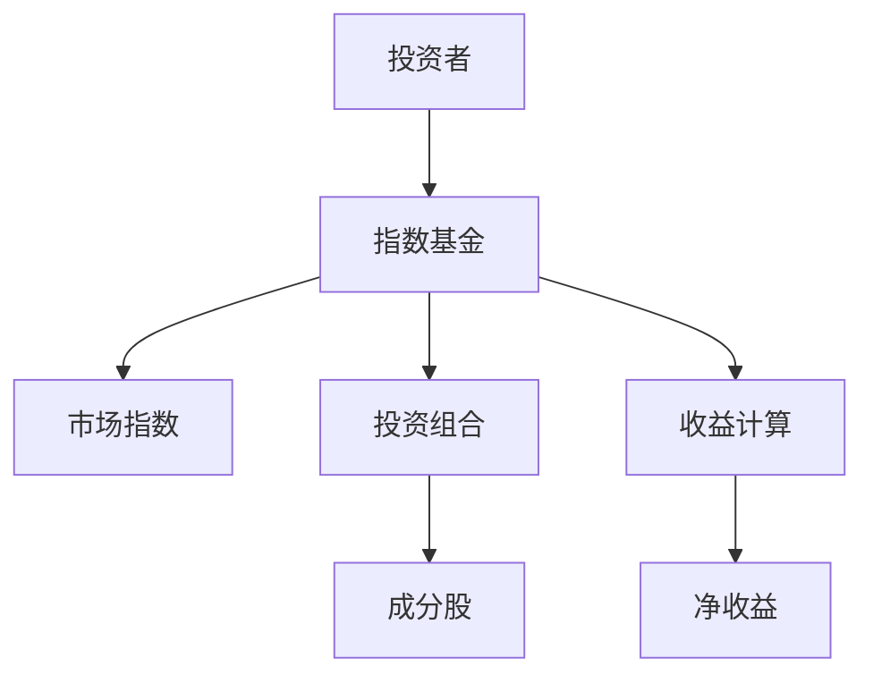

                 


# 约翰伯格的指数投资策略：为什么简单有效

## 关键词：约翰·伯格，指数投资，被动投资，低成本策略，长期投资

## 摘要

约翰·伯格是指数投资领域的先驱，他的简单而有效的指数投资策略改变了全球投资者的思维方式。本文深入分析了指数投资的核心原理、约翰·伯格的贡献以及其策略的数学模型。通过系统分析和实战案例，展示了指数投资在长期中的优势，并提供了实现指数投资的详细步骤和注意事项。

---

## 第一部分：指数投资的背景与基础

### 第1章：指数投资的起源与演变

#### 1.1 指数投资的起源

- **指数投资的定义**  
  指数投资是一种被动投资策略，通过投资指数基金，以复制特定市场指数的表现为目标。

- **指数投资的历史发展**  
  指数投资的概念起源于20世纪30年代，但真正发展起来是在20世纪70年代。随着金融市场的成熟和投资者对低成本、低风险投资的需求增加，指数投资逐渐成为主流策略之一。

- **约翰·伯格的贡献**  
  约翰·伯格是指数投资的先驱，他创立了先锋集团（Vanguard Group），并推出了第一只低成本指数基金——Vanguard S&P 500指数基金。他的工作使得指数投资从理论走向实践，并在全球范围内得到广泛应用。

#### 1.2 约翰·伯格的指数投资理念

- **约翰·伯格的生平简介**  
  约翰·伯格是美国著名的金融学家，被誉为“指数基金之父”。他在1950年代加入富达投资，后来离职并创立了先锋集团，专注于低成本指数基金的开发。

- **约翰·伯格的指数投资思想**  
  伯格认为，大多数投资者无法长期跑赢市场指数，而指数基金通过分散投资和低成本运作，能够为投资者提供稳定且可观的回报。

- **约翰·伯格与先锋集团**  
  先锋集团通过创新的公司结构（非营利性组织）降低了运营成本，使得指数基金的管理费用极低，从而为投资者提供了更高的净收益。

---

### 第2章：指数投资的基本原理

#### 2.1 指数投资的核心概念

- **指数基金的定义**  
  指数基金是一种跟踪特定市场指数的基金，其投资组合的构成与该指数的成分股一致。

- **指数基金的运作机制**  
  指数基金通过复制指数成分股的权重，实现对市场的被动跟踪。这种机制避免了主动管理中的高额费用和人为操作风险。

- **指数基金的优势与劣势**  
  - **优势**：低成本、低风险、长期稳定回报。
  - **劣势**：无法跑赢市场指数（除非市场上涨）。

#### 2.2 约翰·伯格的简单有效策略

- **长期投资的重要性**  
  约翰·伯格强调，长期投资能够摊薄投资成本，平滑市场波动，从而实现稳定增长。

- **分散投资的风险控制**  
  通过投资指数基金，投资者可以分散投资于多个资产类别，降低特定资产的风险。

- **低成本投资的优势**  
  低成本指数基金通过降低管理费用，最大化了投资者的净收益。

---

## 第二部分：指数投资的核心概念与联系

### 第3章：指数投资的核心原理

#### 3.1 指数投资的数学模型

- **指数基金的收益计算**  
  指数基金的收益可以通过以下公式计算：  
  $$ R_f = \sum_{i=1}^{n} w_i \times R_i $$  
  其中，\( R_f \) 是指数基金的收益，\( w_i \) 是第 \( i \) 只股票的权重，\( R_i \) 是第 \( i \) 只股票的收益。

- **指数基金的费用结构**  
  指数基金的管理费用（expense ratio）通常以年化百分比表示，例如0.05%。费用会从基金的总收益中扣除。

- **指数基金的风险评估**  
  指数基金的风险主要体现在市场波动上，但通过分散投资，其系统性风险（beta）与市场一致。

#### 3.2 指数投资与传统投资的对比

- **传统主动投资的优缺点**  
  - **优点**：可能跑赢市场。
  - **缺点**：高费用、高风险、难以长期稳定。

- **指数投资与主动投资的对比分析**  
  表格对比：

| 指标             | 指数投资          | 主动投资          |
|------------------|-------------------|-------------------|
| 成本              | 低                | 高                |
| 风险              | 低（分散）        | 高（集中）        |
| 长期回报          | 稳定              | 不稳定            |
| 管理方式          | 被动跟踪指数       | 主动选股和择时     |

- **约翰·伯格对主动投资的批评**  
  伯格指出，大多数主动管理基金无法长期跑赢指数，且高额费用严重侵蚀了投资者的收益。

---

## 第三部分：指数投资的系统分析与架构设计

### 第4章：指数投资的系统架构

#### 4.1 指数投资的系统架构图



#### 4.2 指数投资的实现过程

- **指数选择与基金筛选**  
  投资者需要选择适合自己的市场指数（如标普500、沪深300）并选择对应的低成本指数基金。

- **投资组合的构建与调整**  
  通过定期定额投资的方式，逐步构建投资组合，并根据市场变化进行小幅调整。

- **投资表现的监控与评估**  
  定期检查投资组合的收益和风险，确保其与投资目标一致。

---

## 第四部分：指数投资的项目实战

### 第5章：指数投资的实战指导

#### 5.1 环境安装与工具准备

- **投资分析工具的选择**  
  可以使用Excel、Python（pandas库）或专业的投资分析软件（如Morningstar）。

- **数据获取与处理工具**  
  通过金融数据API（如Yahoo Finance API）获取指数数据和基金费用。

#### 5.2 核心实现源代码

- **指数基金收益计算的Python代码**

```python
import pandas as pd
import numpy as np

# 示例：计算指数基金的年化收益
def calculate_annualized_return(prices, periods=252):
    returns = np.log(prices / prices.shift(1))
    return np.exp(returns.mean() * periods) - 1

# 示例：计算夏普比率
def calculate_sharpe_ratio(returns, risk_free_rate=0.02):
    excess_returns = returns - risk_free_rate
    return np.mean(excess_returns) / np.std(excess_returns)
```

- **投资组合优化的代码示例**

```python
import pandas as pd
import numpy as np
from scipy.optimize import minimize

# 示例：最优化投资组合（均值-方差优化）
def optimize_portfolio(returns):
    n = returns.shape[1]
    returns covariance = returns.cov().values
    def objective(weights):
        return np.dot(weights.T, np.dot(covariance, weights)) * 0.5
    constraints = [{'type': 'eq', 'fun': lambda w: np.sum(w) - 1}]
    bounds = [(0, 1) for _ in range(n)]
    result = minimize(objective, np.ones(n)/n, bounds=bounds, constraints=constraints)
    return result.x

# 示例：计算投资组合的夏普比率
def portfolio_sharpe(returns):
    weights = optimize_portfolio(returns)
    portfolio_return = np.mean(returns.mean() * weights)
    portfolio_std = np.sqrt(weights.T.dot(returns.cov().dot(weights)))
    return (portfolio_return - 0.02) / portfolio_std
```

#### 5.3 实际案例分析与详细解读

- **案例分析：投资标普500指数基金**

  假设投资者投资于标普500指数基金，年化收益为8%，管理费为0.05%。通过长期持有，投资者可以实现稳定的复利增长。

- **代码应用解读与分析**  
  通过上述代码，投资者可以计算指数基金的年化收益和夏普比率，评估其风险调整后收益。

---

## 第五部分：指数投资的最佳实践

### 第6章：指数投资的注意事项与拓展阅读

#### 6.1 小结

指数投资以其简单、低成本和稳定的特点，成为个人投资者的首选策略。约翰·伯格的贡献证明了长期投资的力量。

#### 6.2 注意事项

- **选择合适的指数基金**  
  根据自身的风险承受能力和投资目标选择合适的指数基金。

- **定期定额投资**  
  通过定投分散投资成本，降低市场波动的影响。

- **避免频繁交易**  
  频繁交易会增加交易费用和税务负担，影响长期收益。

#### 6.3 拓展阅读

- 约翰·伯格的《投资常识》（*The Little Book of Common Sense Investing*）
- 巴尔沃·费雷德曼的《证券分析》（*Security Analysis*）

---

## 结语

约翰·伯格的指数投资策略以其简单有效的特点，帮助无数投资者实现了财富增长。通过长期持有低成本指数基金，投资者可以规避市场波动的风险，实现稳健的投资回报。指数投资不仅是投资策略，更是一种投资哲学，它教会我们耐心、纪律和长期思考的重要性。

---

## 作者：AI天才研究院/AI Genius Institute & 禅与计算机程序设计艺术/Zen And The Art of Computer Programming

