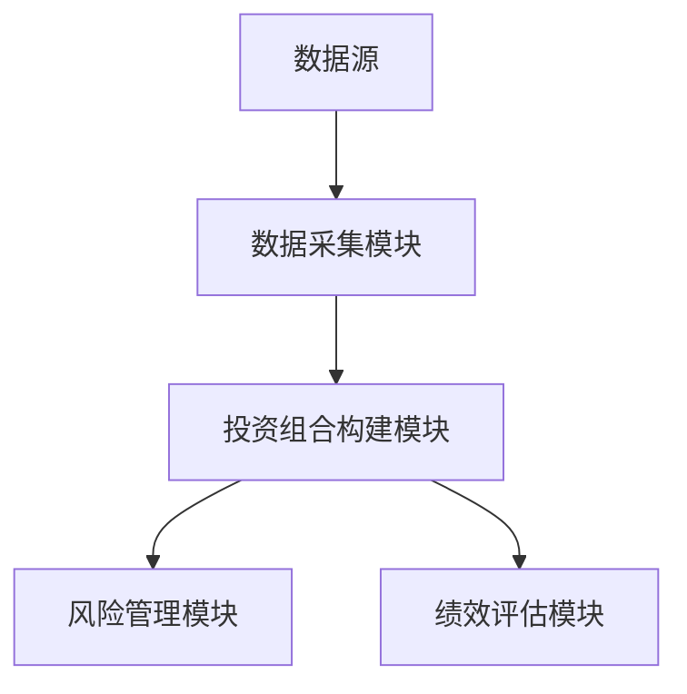
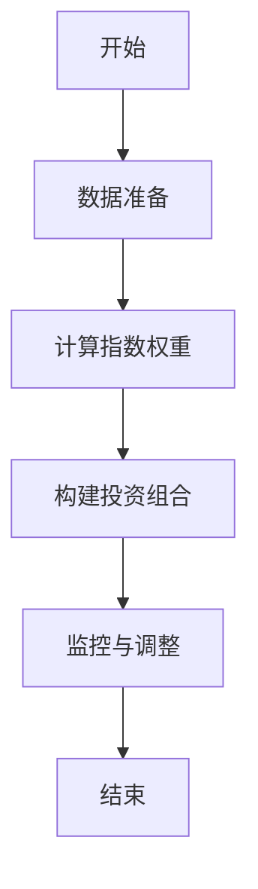

                 


# 约翰伯格的指数投资：挑战主动管理的传统智慧

## 关键词：指数投资、主动管理、约翰·伯格、Vanguard、投资策略

## 摘要：  
指数投资作为一种被动投资策略，近年来在全球范围内获得了广泛关注。本文深入分析了指数投资的核心理念、约翰·伯格的贡献以及其对传统主动管理的挑战。通过理论分析、系统设计和实际案例，揭示了指数投资的优势，包括其低风险、低成本和长期稳定的收益。同时，对比了主动管理的优缺点，探讨了指数投资在现代金融体系中的应用前景。

---

## 第一部分: 引言

### 1.1 指数投资的起源与约翰·伯格的贡献

#### 1.1.1 指数投资的定义与核心理念  
指数投资是一种被动投资策略，旨在通过复制特定市场指数的表现来实现长期收益。其核心理念是市场有效性假设，认为主动管理难以持续跑赢市场平均回报。指数投资强调分散风险和降低交易成本，追求长期稳定的收益。

#### 1.1.2 约翰·伯格与 Vanguard 的历史  
约翰·伯格（John C. Bogle）被誉为指数投资之父，他于1975年创立了Vanguard集团，并推出了第一只零售指数基金——Vanguard 500指数基金。Vanguard以其低成本和透明化的运作方式，迅速成为指数投资领域的领导者。

#### 1.1.3 指数投资与主动管理的对比  
主动管理依赖于选股和择时，而指数投资则通过分散投资于整个市场或特定指数来降低风险。伯格认为，主动管理的高成本和低胜率使其难以长期跑赢指数基金。

---

## 第二部分: 指数投资的理论基础

### 2.1 市场有效性与指数投资的逻辑

#### 2.1.1 市场有效性的假说  
有效市场假说（EMH）认为，市场的价格已经反映了所有可获得的信息，因此主动管理难以获得超额收益。指数投资基于这一假说，通过复制市场指数来获取平均收益。

#### 2.1.2 资本资产定价模型（CAPM）  
CAPM模型指出，资产的预期收益与系统性风险成正比。指数投资通过分散投资于整个市场，降低了非系统性风险，从而更接近CAPM的理论预期。

#### 2.1.3 为什么指数投资有效  
指数投资通过分散化和低成本，最大限度地减少了非系统性风险和管理费用，从而在长期中表现出色。

### 2.2 被动投资的原理

#### 2.2.1 被动投资的定义  
被动投资是指不主动预测市场走势，而是通过跟踪市场指数来实现收益的投资策略。

#### 2.2.2 指数基金的构建方法  
指数基金通过复制特定指数的成分股，按比例投资，确保基金的表现与指数同步。

#### 2.2.3 指数基金的运作机制  
指数基金定期调整投资组合，以跟踪指数的变化，确保基金净值与指数走势一致。

### 2.3 指数基金的成本优势

#### 2.3.1 主动管理的高昂费用  
主动管理基金通常收取较高的管理费和交易费用，这些费用会侵蚀投资收益。

#### 2.3.2 指数基金的低管理费  
指数基金的管理费用远低于主动管理基金，这使得其长期收益更具竞争力。

#### 2.3.3 成本对长期收益的影响  
长期来看，低管理费能够显著提高指数基金的净收益，尤其是在市场波动较大的情况下。

---

## 第三部分: 主动管理的传统智慧与局限性

### 3.1 主动管理的方法论

#### 3.1.1 基本面分析法  
基本面分析依赖于对企业财务状况、行业地位和管理团队的深入研究，试图找到被低估的股票。

#### 3.1.2 技术分析法  
技术分析通过研究历史价格和成交量数据，预测未来的市场走势。

#### 3.1.3 选股策略的多样性  
主动管理可能采用多种选股策略，如成长型、价值型或动量策略，但这些策略的成功往往难以持续。

### 3.2 主动管理的优缺点

#### 3.2.1 优点：捕捉市场机会  
主动管理能够在特定市场环境下捕捉到超额收益，尤其是在市场波动较大时。

#### 3.2.2 缺点：高成本与低胜率  
主动管理的高成本和低胜率使得其长期表现难以优于指数基金。

#### 3.2.3 主动管理的局限性  
大多数主动管理基金难以持续跑赢指数基金，尤其是在市场效率提高的背景下。

### 3.3 主动管理的长期表现

#### 3.3.1 主动管理的胜率统计  
研究显示，大多数主动管理基金在长期中无法跑赢市场指数，尤其是扣除费用后。

#### 3.3.2 为什么主动管理难以胜出  
市场有效性和交易成本的增加使得主动管理的超额收益难以维持。

#### 3.3.3 主动管理的未来趋势  
随着市场效率的提高，主动管理的市场份额可能会逐渐被指数投资所取代。

---

## 第四部分: 指数投资的优势

### 4.1 指数投资的风险分散

#### 4.1.1 分散化投资的原理  
通过投资于多个行业和资产类别，指数投资有效分散了非系统性风险。

#### 4.1.2 风险分散的实际效果  
指数投资的分散化策略显著降低了投资组合的波动性，提高了稳定性。

### 4.2 长期收益的稳定性

#### 4.2.1 长期投资的复利效应  
指数投资通过复利效应，能够在长期中积累稳定的收益。

#### 4.2.2 市场波动中的稳定性  
指数投资在市场波动中表现稳定，适合长期投资者。

### 4.3 系统化投资的优势

#### 4.3.1 系统化投资的定义  
系统化投资基于明确的规则和模型，避免了人为情绪的干扰。

#### 4.3.2 系统化投资的风险控制  
通过严格的规则和模型，系统化投资能够有效控制风险，确保投资组合的稳定性。

---

## 第五部分: 指数投资挑战传统智慧的系统分析

### 5.1 历史表现的对比分析

#### 5.1.1 美国市场指数基金的历史表现  
以标普500指数为例，指数基金在过去几十年中的表现优于大多数主动管理基金。

#### 5.1.2 全球市场指数基金的表现  
指数基金在不同市场和经济周期中均表现出色，证明了其普遍适用性。

### 5.2 指数投资的局限性

#### 5.2.1 指数投资的可预测性  
指数投资依赖于市场平均回报，无法在特定市场环境下获得超额收益。

#### 5.2.2 指数投资的流动性风险  
在极端市场情况下，指数投资可能面临流动性风险。

### 5.3 指数投资的长期优势

#### 5.3.1 长期投资的复利效应  
指数投资的复利效应能够在长期中积累可观的收益。

#### 5.3.2 市场效率提高的背景  
随着市场效率的提高，指数投资的成本优势更加明显，其长期表现更具竞争力。

---

## 第六部分: 指数投资的系统架构与实现

### 6.1 系统设计与功能分析

#### 6.1.1 系统功能模块  
- 数据采集模块：收集市场指数和成分股数据。
- 投资组合构建模块：根据指数成分股构建投资组合。
- 风险管理模块：监控和管理投资组合的风险。
- 绩效评估模块：评估投资组合的表现。

#### 6.1.2 系统架构图  


### 6.2 算法实现与流程图

#### 6.2.1 算法流程图  


#### 6.2.2 核心算法代码  
```python
import pandas as pd
import numpy as np

# 假设data是包含指数成分股数据的DataFrame
def build_index_fund(data):
    # 计算各成分股的权重
    total = data['Weight'].sum()
    weights = data['Weight'] / total
    # 根据权重构建投资组合
    portfolio = pd.Series(weights, index=data.index)
    return portfolio

# 示例数据
data = pd.DataFrame({
    'Component': ['Stock A', 'Stock B', 'Stock C'],
    'Weight': [40, 30, 30]
})

# 构建指数基金
index_portfolio = build_index_fund(data)
print(index_portfolio)
```

### 6.3 实际案例分析

#### 6.3.1 案例背景  
以标普500指数为例，分析指数基金的构建和表现。

#### 6.3.2 投资组合构建  
根据指数成分股的权重，构建投资组合，并定期调整以跟踪指数变化。

#### 6.3.3 性能监控与优化  
通过监控投资组合的表现和市场变化，进行必要的调整，确保基金净值与指数同步。

---

## 第七部分: 结论与展望

### 7.1 结论

#### 7.1.1 指数投资的核心优势  
指数投资通过分散风险、低成本和系统化策略，提供了稳定的长期收益。

#### 7.1.2 对传统主动管理的挑战  
指数投资的崛起挑战了传统主动管理的主导地位，尤其是在市场效率提高的背景下。

### 7.2 未来展望

#### 7.2.1 指数投资的创新方向  
未来，指数投资可能会引入更多创新，如智能Beta策略和因子投资。

#### 7.2.2 投资者的策略调整  
投资者应根据自身需求和市场环境，合理配置指数投资和主动管理的比例。

---

## 作者：AI天才研究院/AI Genius Institute & 禅与计算机程序设计艺术 /Zen And The Art of Computer Programming

---

通过系统的分析和实际案例的展示，本文深入探讨了指数投资的优势及其对传统主动管理的挑战。指数投资凭借其低风险、低成本和长期稳定的收益，正在改变全球的投资格局。

