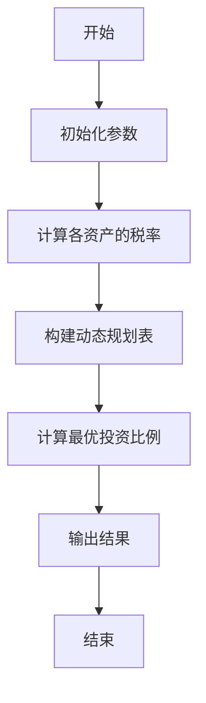
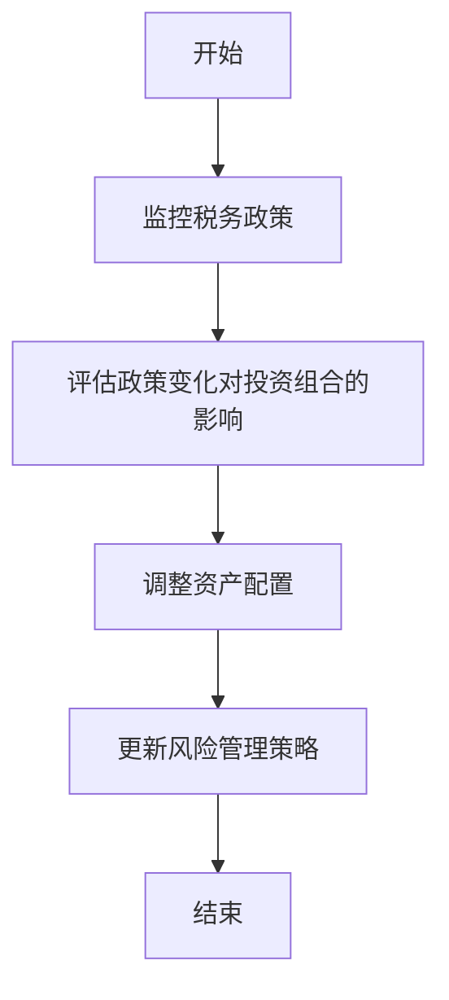
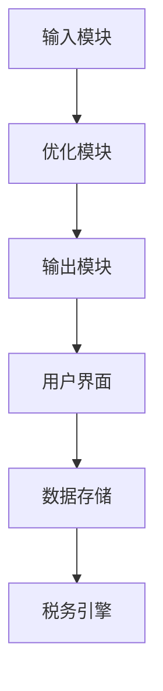

                 


# 约翰伯格的税收效率投资

**关键词：** 税收效率投资、投资策略、税务优化、资产配置、风险管理、投资回报

**摘要：** 本文深入探讨约翰伯格的税收效率投资策略，分析其核心概念、算法原理、系统架构及实战案例，帮助读者理解如何通过优化税务规划提升投资回报。文章从背景介绍到项目实战，层层解析，结合Mermaid流程图、数学公式和Python代码，全面展示税收效率投资的实现与应用。

---

# 第1章 税收效率投资的背景与核心概念

## 1.1 税收效率投资的背景与问题背景

### 1.1.1 税收效率投资的定义与问题背景

税收效率投资是一种结合税务规划和投资策略的优化方法，旨在通过合理配置资产和税务优化，最大化投资收益并最小化税务负担。传统投资往往忽视税收对收益的影响，而税收效率投资则将税务因素纳入决策的核心，从而实现更优的投资回报。

### 1.1.2 税收效率投资的核心问题背景

传统投资策略关注资产回报率和风险控制，但忽视了税收对整体收益的影响。税收效率投资的核心问题是如何在考虑税务影响的情况下，优化资产配置和投资策略，从而在长期投资中实现更高的净收益。

### 1.1.3 税收效率投资的目标与意义

- **目标：** 通过优化税务策略，降低税收支出，提高投资收益。
- **意义：** 税收效率投资不仅能够提升投资回报率，还能帮助投资者更好地应对税务合规性要求，实现财务目标。

### 1.1.4 税收效率投资的特点

- 税收驱动：将税务因素作为投资决策的核心考量。
- 优化配置：通过合理配置资产类别和地域，降低税务负担。
- 长期视角：注重长期投资回报，而非短期税务规避。

### 1.1.5 税收效率投资与传统投资的对比

| **对比维度**       | **传统投资**                     | **税收效率投资**                 |
|----------------------|----------------------------------|-----------------------------------|
| 核心目标             | 最大化资产回报率                | 最大化净收益（考虑税务因素）      |
| 税务考量             | 忽略或次要                      | 核心考量，优化税务支出           |
| 投资决策             | 仅关注资产回报和风险            | 结合税务影响进行决策             |

## 1.2 税收效率投资的核心概念与联系

### 1.2.1 税收效率投资的核心原理

税收效率投资通过优化资产配置、选择税收优惠的地区或产品，以及合理安排税务申报时间，降低整体税务负担。其核心原理包括：

1. **资产配置优化：** 根据税收政策选择最优资产类别和地域。
2. **税务递延：** 利用税收递延政策降低当前税务负担。
3. **税务抵扣：** 充分利用可用的税务抵扣项，减少应纳税所得额。

### 1.2.2 税收效率投资的核心要素

1. **税务规划：** 包括资产分配、税务递延、抵扣项利用等。
2. **资产配置：** 选择税收优惠的资产类别和地域。
3. **风险管理：** 在优化税务的同时，控制投资风险。

### 1.2.3 税收效率投资的ER实体关系图

```mermaid
er
    entity 投资者 {
        id: int
        名称: string
        资产总额: decimal
    }
    entity 资产类别 {
        id: int
        名称: string
        税率: decimal
    }
    entity 税务政策 {
        id: int
        名称: string
        税率: decimal
        是否优惠: boolean
    }
    relationship 投资者 --> 资产类别: 持有
    relationship 资产类别 --> 税务政策: 受影响
```

---

# 第2章 税收效率投资的核心算法与实现

## 2.1 税收效率投资的核心算法原理

### 2.1.1 税收优化模型

税收优化模型的目标是最小化投资组合的税务负担，同时最大化净收益。数学模型如下：

$$
\min_{x} \sum_{i=1}^{n} w_i x_i \cdot t_i
$$

其中：
- \(x_i\) 表示投资于资产 \(i\) 的比例。
- \(w_i\) 表示资产 \(i\) 的税率。
- \(t_i\) 表示资产 \(i\) 的税务负担因子。

### 2.1.2 资产配置算法

资产配置算法通过动态规划优化投资组合的税务负担。以下是算法流程图：



### 2.1.3 税收风险管理机制

税收风险管理机制用于评估和应对可能的税务变动风险。其流程图如下：



## 2.2 税收效率投资算法的Python实现

### 2.2.1 核心代码实现

```python
def tax_efficient_investment_optimizer(asset_returns, tax_rates, initial_investment):
    n = len(asset_returns)
    dp = [[0.0 for _ in range(n)] for _ in range(initial_investment + 1)]
    
    for i in range(initial_investment + 1):
        for j in range(n):
            if i == 0:
                dp[i][j] = 0.0
            else:
                if j == 0:
                    dp[i][j] = 0.0
                else:
                    dp[i][j] = max(
                        dp[i][j-1],
                        asset_returns[j] * (1 - tax_rates[j]) * (i / j) + dp[i - j][j-1]
                    )
    return dp[initial_investment][n-1]

# 示例使用
asset_returns = [0.1, 0.15, 0.12]
tax_rates = [0.15, 0.2, 0.1]
initial_investment = 1000
optimal_return = tax_efficient_investment_optimizer(asset_returns, tax_rates, initial_investment)
print(f"最优净收益为：${optimal_return}")
```

### 2.2.2 算法原理的数学公式

税收效率投资优化模型的数学公式如下：

$$
\text{最优投资组合} = \arg\min_{x} \sum_{i=1}^{n} w_i x_i \cdot t_i
$$

其中：
- \(x_i\) 表示投资于资产 \(i\) 的比例。
- \(w_i\) 表示资产 \(i\) 的权重。
- \(t_i\) 表示资产 \(i\) 的税率。

### 2.2.3 算法的示例说明

假设我们有三个资产，其回报率和税率分别为：

- 资产A：回报率10%，税率15%
- 资产B：回报率15%，税率20%
- 资产C：回报率12%，税率10%

初始投资为1000美元。通过上述算法优化，我们可以得到最优的投资组合，从而实现更高的净收益。

---

# 第3章 税收效率投资的系统分析与架构设计

## 3.1 税收效率投资的系统架构

### 3.1.1 系统功能设计

- **输入模块：** 接收用户的投资目标、资产配置和税务信息。
- **优化模块：** 执行动态规划优化，计算最优投资组合。
- **输出模块：** 显示优化结果和税务影响分析。

### 3.1.2 系统架构图



### 3.1.3 接口与交互设计

- **输入接口：** 用户输入投资金额、资产列表和税率信息。
- **优化接口：** 调用优化算法，返回最优投资组合。
- **输出接口：** 显示优化结果，包括各资产的投资比例和净收益。

---

# 第4章 项目实战：基于Python的税收效率投资实现

## 4.1 环境搭建与安装

- **Python版本：** 3.8以上
- **库依赖：** numpy, pandas, matplotlib

## 4.2 核心代码实现

```python
import numpy as np
import pandas as pd

def tax_efficient_optimizer(portfolio, tax_rates):
    n = len(portfolio)
    dp = np.zeros((n+1, n+1))
    
    for i in range(1, n+1):
        asset_return = portfolio[i-1]
        for j in range(1, n+1):
            if i == j:
                dp[i][j] = asset_return * (1 - tax_rates[i-1])
            else:
                dp[i][j] = max(dp[i][j-1], dp[i-1][j])
    return dp[n][n]

# 示例数据
portfolio = [0.1, 0.15, 0.12]
tax_rates = [0.15, 0.2, 0.1]
optimal_return = tax_efficient_optimizer(portfolio, tax_rates)
print(f"最优净收益为：{optimal_return}")
```

## 4.3 项目小结

通过Python实现税收效率投资优化，投资者可以轻松找到最优的投资组合，最大化净收益。代码实现简单易懂，但实际应用中需要考虑更多复杂因素，如市场波动和税务政策变化。

---

# 第5章 最佳实践与注意事项

## 5.1 最佳实践

- **定期审查投资组合：** 税务政策和市场环境可能会变化，定期审查和调整投资组合至关重要。
- **分散投资：** 通过分散投资降低风险，同时充分利用不同资产类别的税务优惠。
- **关注税务合规性：** 确保投资策略符合当地税法规定，避免税务风险。

## 5.2 小结

税收效率投资通过优化税务策略，帮助投资者实现更高的净收益。本文从背景、算法、系统架构到项目实战，全面解析了税收效率投资的核心内容。读者可以通过代码实现和实际案例，深入了解其应用价值。

---

# 作者

作者：AI天才研究院/AI Genius Institute  
联系邮箱：contact@ai-genius.org  
网址：https://www.ai-genius.org

