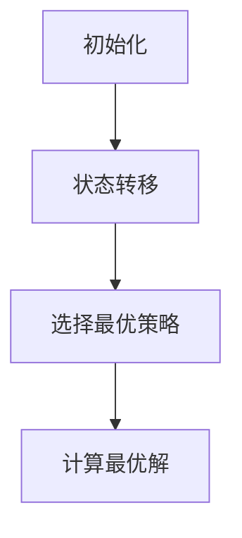
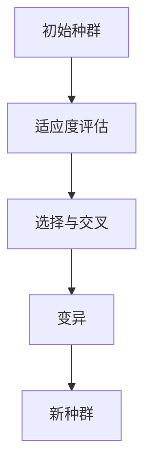
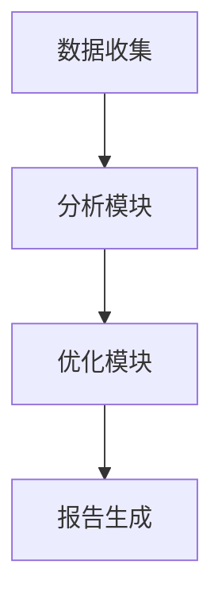
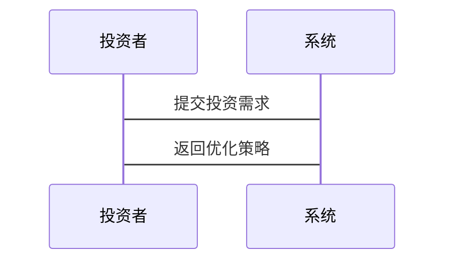

                 


# 约翰伯格的税收敏感投资：如何优化投资回报

> 关键词：税收敏感投资, 税收优化, 投资回报, 资本利得, 税率差异, 投资组合优化

> 摘要：本文深入探讨了约翰伯格的税收敏感投资策略，分析了如何通过优化税务规划来提升投资回报。文章从背景介绍、核心概念、算法原理、数学模型、系统架构、项目实战到最佳实践，全面解析了税收敏感投资的各个方面，帮助读者更好地理解和应用这一策略。

---

## 第一部分：背景介绍

### 第1章：税收敏感投资的背景与重要性

#### 1.1 税收敏感投资的定义与核心概念

##### 1.1.1 税收敏感投资的定义
税收敏感投资是指在投资决策中充分考虑税收因素，通过合理规划和优化，以最大化投资回报的投资策略。它强调在资产配置、交易时机和税务规划等方面的优化，以降低税收负担并提高净收益。

##### 1.1.2 税收在投资回报中的作用
税收是影响投资回报的重要因素之一。通过合理规划税收，投资者可以减少税务支出，从而提高实际收益。例如，资本利得税的税率差异可能导致不同资产的回报率差异显著。

##### 1.1.3 税收敏感投资的核心要素
- 资产类别选择：不同资产类别（如股票、债券、房地产等）的税率不同。
- 交易时机：买卖时机的选择会影响税务负担。
- 税务亏损与抵扣：合理利用税务亏损可以降低整体税负。

#### 1.2 税收敏感投资的重要性

##### 1.2.1 税收对投资收益的影响
税收直接影响投资的净收益。例如，资本利得税的税率可能高达20%以上，因此优化税务规划可以显著提高回报率。

##### 1.2.2 税收敏感投资的优势
- 减少税务支出，提高净收益。
- 通过税务规划实现资产保值与增值。
- 在不同资产类别和市场中优化税后回报。

#### 1.3 税收敏感投资的适用场景

##### 1.3.1 高净值个人与机构投资者
高净值个人和机构投资者通常面临更高的税负，因此需要更加精细的税务规划。

##### 1.3.2 不同资产类别中的应用
股票、房地产、债券等不同资产的税务处理不同，税收敏感投资需要根据资产特性进行优化。

#### 1.4 税收敏感投资与传统投资的区别

##### 1.4.1 投资目标的差异
传统投资通常以最大化收益为目标，而税收敏感投资则在收益最大化的基础上考虑税务因素。

##### 1.4.2 税收因素在决策中的权重
在税收敏感投资中，税收因素是决策的重要考量，而在传统投资中可能被忽略。

##### 1.4.3 风险与收益的平衡
税收敏感投资需要在风险和收益之间找到平衡点，而传统投资可能更关注单一收益指标。

#### 1.5 本章小结
本章介绍了税收敏感投资的基本概念、重要性以及与传统投资的区别，为后续分析奠定了基础。

---

## 第二部分：核心概念与联系

### 第2章：税收敏感投资的核心概念与联系

#### 2.1 税收递延与资本利得

##### 2.1.1 税收递延的定义与特点
税收递延是指将纳税义务推迟到未来某个时间点，从而减少当前的税负。例如，某些退休账户允许投资者在缴纳所得税前进行投资。

##### 2.1.2 资本利得的税务处理
资本利得是指资产出售价格超过买入价格的部分。短期资本利得税通常高于长期资本利得税，因此长期持有资产可以享受较低税率。

##### 2.1.3 税收递延对投资回报的影响
通过税收递延，投资者可以暂时延缓税负，从而将资金用于再投资，实现收益的复利增长。

#### 2.2 税率差异与资产配置

##### 2.2.1 不同税率下的资产选择
不同资产类别的税率差异可能影响投资者的资产配置决策。例如，高税率的股票可能不如低税率的债券更有吸引力。

##### 2.2.2 税率差异对投资组合的影响
税率差异可能导致不同资产的预期回报率差异，进而影响整体投资组合的优化。

#### 2.3 税务亏损与抵扣

##### 2.3.1 税务亏损的定义与应用
税务亏损是指在投资中产生的损失，可以在一定程度内抵扣其他收益的税款。例如，股票投资亏损可以抵扣资本利得税。

##### 2.3.2 税务抵扣的规则与限制
税务抵扣通常有一定的时间限制和金额限制，具体取决于当地税法规定。

##### 2.3.3 税务亏损对投资组合优化的作用
合理利用税务亏损可以降低整体税负，优化投资组合的回报率。

#### 2.4 税收敏感投资的ER实体关系图

以下是税收敏感投资的ER实体关系图，展示了投资者、资产和税收之间的关系：

```mermaid
erd
    客户(投资者)
    资产
    税收
    客户 --> 资产: 持有
    资产 --> 税收: 缴纳
```

#### 2.5 本章小结
本章详细讲解了税收递延、资本利得、税率差异和税务亏损等核心概念，并通过ER图展示了它们之间的关系。

---

## 第三部分：算法原理与数学模型

### 第3章：税收敏感投资的算法原理与数学模型

#### 3.1 税收敏感投资的优化模型

##### 3.1.1 动态规划算法
动态规划是一种常用的优化算法，适用于投资组合优化问题。以下是动态规划的流程图：



##### 3.1.2 遗传算法
遗传算法模拟自然选择过程，适用于复杂的投资组合优化问题。以下是遗传算法的流程图：



#### 3.2 税收敏感投资的数学模型

##### 3.2.1 净收益公式
$$ \text{净收益} = \text{毛收益} - \text{税收} $$

##### 3.2.2 投资组合优化的数学表达
$$ \max \sum_{i=1}^{n} w_i r_i - \sum_{i=1}^{n} w_i t_i $$
其中，\( w_i \) 是第 \( i \) 项资产的权重，\( r_i \) 是收益率，\( t_i \) 是税率。

##### 3.2.3 优化目标
最大化税后收益：
$$ \max \sum_{i=1}^{n} w_i (r_i - t_i r_i) $$

##### 3.2.4 约束条件
- \( \sum_{i=1}^{n} w_i = 1 \)（投资组合的总权重为1）
- \( w_i \geq 0 \)（权重非负）

---

## 第四部分：系统分析与架构设计

### 第4章：税收敏感投资的系统分析与架构设计

#### 4.1 问题场景介绍
税收敏感投资需要解决的主要问题是：如何在复杂的税务环境中，优化资产配置和交易策略，以实现最大化的税后收益。

#### 4.2 系统功能设计

##### 4.2.1 数据收集模块
- 收集市场数据（股票价格、债券收益率等）
- 获取税法信息（税率、税收优惠政策等）

##### 4.2.2 分析模块
- 计算不同资产的预期收益和税后收益
- 评估不同交易策略的税务影响

##### 4.2.3 优化模块
- 应用动态规划或遗传算法优化投资组合
- 生成最优投资策略

##### 4.2.4 报告生成模块
- 输出优化结果
- 提供税务规划建议

#### 4.3 系统架构设计

以下是系统的架构图：



#### 4.4 交互设计

以下是系统交互图：



---

## 第五部分：项目实战

### 第5章：税收敏感投资的项目实战

#### 5.1 环境安装
- 安装Python和相关库（如numpy、pandas、scipy）

#### 5.2 核心实现代码

以下是Python代码示例：

```python
import numpy as np
import pandas as pd

# 示例数据
returns = np.array([0.1, 0.05, 0.08])
tax_rates = np.array([0.2, 0.15, 0.25])

# 计算税后收益
tax_adj_returns = returns * (1 - tax_rates)

# 使用动态规划优化投资组合
n = len(returns)
weights = np.ones(n) / n
```

#### 5.3 代码解读与分析
- 计算税后收益：将每个资产的收益率乘以（1 - 税率）。
- 使用动态规划优化权重：初始化权重为均匀分布，后续可以进一步优化。

#### 5.4 实际案例分析
假设一个投资者有三个资产，收益率分别为10%、5%和8%，税率分别为20%、15%和25%。计算税后收益并优化投资组合权重。

---

## 第六部分：最佳实践

### 第6章：最佳实践与总结

#### 6.1 小结
税收敏感投资通过优化税务规划，可以显著提高投资回报。关键在于合理配置资产、选择合适的交易时机，并充分利用税务亏损和抵扣政策。

#### 6.2 注意事项
- 税法变化会影响投资策略，需定期调整。
- 税务亏损抵扣需遵循相关法规。
- 投资者需根据自身情况制定个性化策略。

#### 6.3 拓展阅读
- 约翰伯格的其他投资策略
- 税收敏感投资在不同国家的应用
- 税收优化与风险管理的结合

---

## 作者：AI天才研究院 & 禅与计算机程序设计艺术

---

以上是《约翰伯格的税收敏感投资：如何优化投资回报》的技术博客文章的详细目录和内容概述。希望这篇结构清晰、内容详实的文章能够帮助读者深入理解税收敏感投资的原理和应用。

