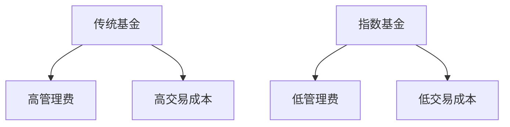
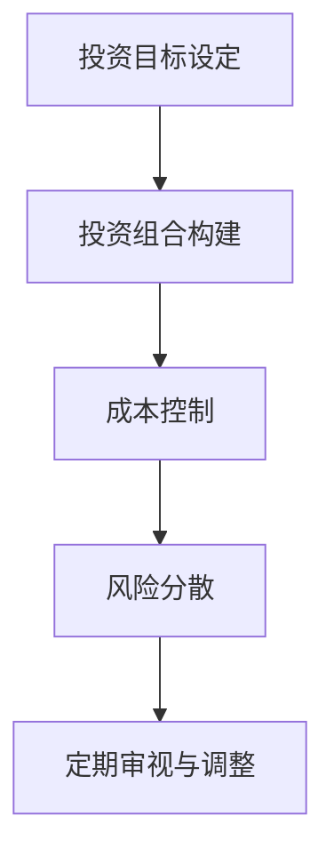
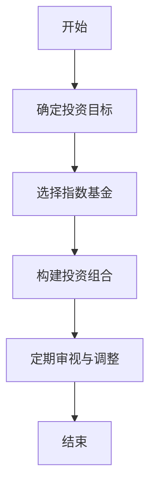

                 


# 约翰伯格的被动投资哲学：战胜市场的不可能任务

## 关键词：被动投资、约翰·伯格、指数基金、投资哲学、战胜市场、长期持有、低成本

## 摘要：  
本文深入探讨了约翰·伯格的被动投资哲学，分析了其核心理念、投资策略及如何通过长期持有低成本指数基金实现战胜市场的目标。文章从被动投资的定义、指数基金的优势、市场有效性假说等多角度展开，结合数学模型和系统架构，详细阐述了被动投资的理论基础与实践方法。通过实际案例分析，本文揭示了约翰·伯格的投资哲学在现代金融中的独特价值，并为读者提供了在复杂市场环境下实现稳健投资的策略建议。

---

# 第1章：被动投资的核心理念

## 1.1 约翰·伯格的被动投资哲学

### 1.1.1 什么是被动投资  
被动投资是一种长期投资策略，强调通过投资于广泛市场的指数基金，以获得市场的平均收益，而不是试图通过频繁交易或选股来超越市场。被动投资的核心在于“不主动干预”，即不试图预测市场走势或选择个股，而是通过分散投资来降低风险。

**被动投资与主动投资的对比表**  

| 对比维度        | 被动投资                     | 主动投资                     |
|-----------------|-----------------------------|-----------------------------|
| 投资目标         | 获得市场平均收益             | 超越市场平均收益             |
| 管理方式         | 以指数基金为主               | 由专业经理人管理             |
| 成本             | 低                          | 高                          |
| 风险             | 分散风险，波动较小           | 集中风险，波动较大           |

### 1.1.2 约翰·伯格的投资哲学  
约翰·伯格是 Vanguard 集团的创始人，他提出的被动投资理念颠覆了传统的主动投资模式。他认为，市场是有效的，即价格反映了所有可获得的信息，因此试图通过主动管理超越市场是不切实际的。他主张通过投资低成本的指数基金，实现长期稳定的收益。

### 1.1.3 指数基金的优势  
指数基金的优势在于其分散性和低成本。通过投资指数基金，投资者可以避免个股波动的风险，并且以较低的成本获得市场平均收益。

**指数基金与传统基金的对比图**  



---

## 1.2 被动投资的理论基础

### 1.2.1 现代投资组合理论  
现代投资组合理论（MPT）由哈里·马科维茨提出，认为通过分散投资可以降低非系统性风险，而指数基金正是这一理论的最佳实践。

### 1.2.2 市场有效性假说  
市场有效性假说认为，在一个有效的市场中，所有资产的价格已经反映了所有可获得的信息，因此主动管理很难获得超额收益。

### 1.2.3 被动投资的数学模型  
被动投资的收益可以通过以下公式计算：

$$
\text{收益} = \text{指数基金的年化收益率} \times \text{投资期限}
$$

指数基金的年化收益率可以通过历史数据计算得出：

$$
\text{年化收益率} = \left( \frac{\text{终值}}{\text{初始值}} \right)^{\frac{1}{n}} - 1
$$

---

# 第2章：约翰·伯格的投资策略解析

## 2.1 约翰·伯格的投资理念

### 2.1.1 长期投资的重要性  
约翰·伯格强调，长期持有是实现被动投资收益的关键。短期市场的波动会被时间熨平，长期趋势才是决定收益的核心因素。

### 2.1.2 低成本投资的优势  
低成本是被动投资的核心优势。指数基金的管理费和交易成本远低于主动管理基金，从而在长期积累中带来更高的净收益。

### 2.1.3 分散投资的风险控制  
通过投资广泛的指数基金，投资者可以分散个股风险，降低整体投资组合的波动性。

---

## 2.2 约翰·伯格的投资策略步骤

### 2.2.1 确定投资目标  
明确投资目标，包括投资期限、风险承受能力和收益预期。

### 2.2.2 构建投资组合  
选择适合的指数基金，构建分散化的投资组合。

### 2.2.3 定期审视与调整  
定期审视投资组合的表现，根据市场变化进行小幅调整。

---

# 第3章：被动投资如何战胜市场

## 3.1 市场的有效性与被动投资

### 3.1.1 市场的有效性假说  
市场有效性假说为被动投资提供了理论支持。在有效市场中，被动投资的成本优势使其成为最优选择。

### 3.1.2 被动投资的长期收益  
长期来看，被动投资的低成本和分散化优势使其能够战胜市场。例如，投资标普500指数基金的历史年化收益率约为7-8%。

---

## 3.2 约翰·伯格的长期收益模型

### 3.2.1 指数基金的收益计算  
通过历史数据分析，指数基金的长期收益可以通过以下公式计算：

$$
\text{总收益} = (1 + r)^n - 1
$$

其中，\( r \) 是年化收益率，\( n \) 是投资期限。

### 3.2.2 被动投资的成本优势  
低成本是被动投资的核心优势。通过长期复利效应，低成本能够显著提升净收益。

---

# 第4章：投资哲学与心理学

## 4.1 投资者心理与决策

### 4.1.1 投资者的常见心理偏差  
投资者常见的心理偏差包括过度自信、从众心理和损失厌恶，这些偏差会影响投资决策。

### 4.1.2 心理因素对投资决策的影响  
心理因素可能导致投资者在市场波动时做出错误决策，而被动投资通过长期持有规避了这一问题。

---

## 4.2 约翰·伯格的投资哲学与心理行为

### 4.2.1 长期投资的心理挑战  
长期投资需要强大的心理素质，尤其是在市场剧烈波动时，投资者需要保持冷静。

### 4.2.2 被动投资的心理优势  
被动投资通过分散化和低成本，帮助投资者降低心理压力，避免情绪化决策。

---

# 第5章：被动投资的实践

## 5.1 投资系统的构建

### 5.1.1 投资目标的设定  
明确投资目标，包括投资期限、风险承受能力和收益预期。

### 5.1.2 投资组合的设计  
选择适合的指数基金，构建分散化的投资组合。

### 5.1.3 投资系统的监控与调整  
定期审视投资组合的表现，根据市场变化进行小幅调整。

---

## 5.2 系统架构与投资策略

### 5.2.1 系统架构图  
以下是被动投资系统的架构图：



### 5.2.2 投资策略的流程图  
以下是投资策略的流程图：



---

## 5.3 项目实战

### 5.3.1 环境安装  
选择合适的指数基金，例如 Vanguard 的 VTI 基金。

### 5.3.2 核心实现  
以下是投资组合的构建代码：

```python
import pandas as pd
import numpy as np

# 假设我们投资于标普500指数基金，年化收益率为7%，投资期限为10年，初始投资为10000美元
initial_investment = 10000
annual_return = 0.07
years = 10

# 计算终值
final_value = initial_investment * (1 + annual_return) ** years
print(f"终值: ${final_value:.2f}")
```

### 5.3.3 实际案例分析  
以投资标普500指数基金为例，假设年化收益率为7%，投资期限为10年，初始投资为10000美元，终值为：

$$
\text{终值} = 10000 \times (1 + 0.07)^{10} = 19671.51
$$

---

## 5.3.4 项目小结  
通过选择低成本的指数基金，投资者可以实现长期稳定的收益。被动投资的系统化方法帮助投资者避免了情绪化决策，降低了投资成本。

---

# 第6章：总结与展望

## 6.1 总结  
约翰·伯格的被动投资哲学为投资者提供了一种简单有效的投资方法。通过长期持有低成本指数基金，投资者可以在复杂多变的市场中实现稳健的收益。

## 6.2 展望  
随着市场的发展，被动投资将越来越受到重视。未来，投资者可以通过更加智能化的系统实现被动投资的优化，例如通过算法自动调整投资组合。

---

# 作者：AI天才研究院/AI Genius Institute & 禅与计算机程序设计艺术 /Zen And The Art of Computer Programming

---

通过本文的详细分析，读者可以深入了解约翰·伯格的被动投资哲学，并将其应用于实际投资中。被动投资不仅是一种投资策略，更是一种生活哲学，它教会我们如何在复杂的世界中保持冷静，追求长期的稳健收益。

