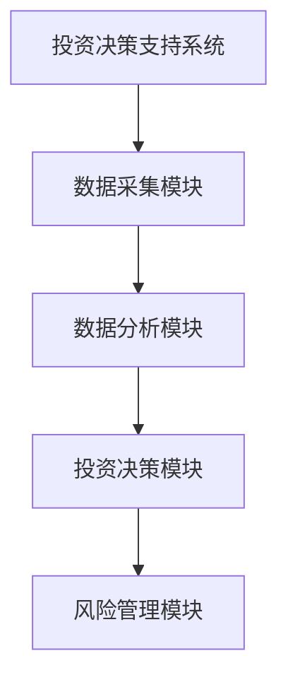

                 


# 约翰伯格的长期投资观

**关键词**：长期投资、约翰·伯格、价值投资、风险管理、投资策略、指数基金

**摘要**：本文系统地介绍了约翰·伯格的长期投资观，从其投资理念的核心要素到实际应用，深入探讨了长期投资的意义、价值投资与成长投资的对比、风险管理的重要性，以及如何构建和优化投资组合。文章通过详细分析约翰·伯格的投资策略和数学模型，结合实际案例，为读者提供了一套完整的长期投资方法论。

---

# 第一部分: 约翰伯格的长期投资观背景与核心理念

## 第1章: 长期投资的背景与意义

### 1.1 投资领域的演变

#### 1.1.1 传统投资与现代投资的对比

传统投资强调短期收益和市场波动，投资者通常通过高频交易和市场预测来获取利润。然而，这种方法的风险较高，且对投资者的市场敏感性和心理素质要求极高。现代投资则更注重长期价值，强调通过深入分析企业的基本面和市场趋势来制定投资策略。长期投资在现代金融中的地位日益重要，尤其是在全球金融市场波动加剧的背景下，长期投资被视为一种更为稳健的选择。

#### 1.1.2 长期投资在现代金融中的地位

长期投资通过分散投资和价值挖掘，降低了市场波动对投资组合的影响。在现代金融中，长期投资被视为一种降低风险、实现资产稳定增长的有效手段。尤其是在机构投资者和个人投资者中，长期投资已经成为一种主流策略。

#### 1.1.3 长期投资与短期投资的优劣势分析

- **长期投资的优势**：
  - 风险分散能力强。
  - 能够避免频繁交易的交易成本。
  - 更容易捕捉企业的长期增长潜力。

- **短期投资的劣势**：
  - 市场波动风险高。
  - 交易成本较高。
  - 需要频繁监控市场动态，对投资者心理素质要求高。

### 1.2 约翰·伯格的生平与投资哲学

#### 1.2.1 约翰·伯格的生平简介

约翰·伯格（John Bogle）是美国著名投资家，被誉为“指数基金之父”。他创立了 Vanguard 集团，并提出了以指数基金为代表的长期投资理念。伯格的投资哲学以价值投资为核心，强调长期持有优质资产，避免频繁交易。

#### 1.2.2 伯格的投资哲学

伯格的投资哲学可以总结为以下几点：
- **价值投资**：寻找被市场低估的优质企业，长期持有，等待其价值回归。
- **分散投资**：通过投资于多个行业和企业，降低特定资产的风险。
- **风险管理**：通过资产配置和投资组合优化，降低投资组合的整体风险。

#### 1.2.3 长期投资的核心理念

长期投资的核心理念在于通过时间的积累，让资产实现稳步增长。伯格认为，市场波动是短期的，而企业的长期价值才是投资的核心。

---

## 第2章: 长期投资的核心概念

### 2.1 价值投资与成长投资的对比

#### 2.1.1 价值投资的定义与特征

价值投资是一种以低于内在价值的价格买入优质资产的投资策略。其核心在于寻找市场价格低于内在价值的企业，长期持有，等待市场重新评估其价值。

#### 2.1.2 成长投资的定义与特征

成长投资则相反，关注的是那些具有高增长潜力的企业。投资者愿意以较高的价格买入这些企业，因为它们的未来增长潜力巨大。

#### 2.1.3 价值投资与成长投资的对比

| 项目                | 价值投资                | 成长投资                |
|---------------------|--------------------------|--------------------------|
| 投资目标            | 寻找被低估的企业        | 寻找高增长潜力的企业    |
| 投资策略            | 长期持有，等待价值回归  | 短期高增长，快速变现    |
| 风险                | 较低，市场波动影响小     | 较高，依赖企业未来增长  |

### 2.2 市场波动与长期投资策略

#### 2.2.1 市场波动的周期性

市场波动具有周期性，通常表现为牛市和熊市交替出现。长期投资者需要理解市场波动的周期性，避免被短期波动影响投资决策。

#### 2.2.2 长期投资如何应对市场波动

- **分散投资**：通过投资于多个行业和资产类别，降低特定资产的风险。
- **长期持有**：避免频繁交易，降低交易成本和税务负担。
- **定期再平衡**：根据市场变化，定期调整投资组合，保持资产配置的合理性。

---

## 第3章: 约翰·伯格的投资策略与实践

### 3.1 伯格的投资策略

#### 3.1.1 长期持有优质资产

伯格强调长期持有优质资产，避免频繁交易。他认为，市场波动是短期的，优质资产的长期价值才是投资的核心。

#### 3.1.2 分散投资的重要性

通过投资于多个行业和资产类别，分散投资可以降低特定资产的风险。伯格认为，分散投资是降低风险的重要手段，尤其是在市场波动加剧的情况下。

#### 3.1.3 风险管理的核心作用

风险管理是长期投资成功的关键。通过合理的资产配置和风险控制，投资者可以降低投资组合的整体风险，实现长期稳健的收益。

---

## 第4章: 长期投资的边界与外延

### 4.1 长期投资的边界

#### 4.1.1 长期投资的适用范围

长期投资适用于那些具有稳定增长潜力的企业和资产类别。投资者需要选择具有长期竞争优势和良好管理的企业。

#### 4.1.2 长期投资的局限性

- 需要较长的时间周期才能实现收益。
- 对投资者的耐心和纪律要求较高。
- 在市场波动剧烈的情况下，可能面临短期亏损。

#### 4.1.3 长期投资与其他投资方式的结合

长期投资可以与其他投资方式结合，例如通过配置部分短期资产来应对短期流动性需求。这种结合可以在保持长期增长的同时，满足投资者的短期资金需求。

---

## 第5章: 约翰·伯格长期投资观的核心要素

### 5.1 核心要素的定义

#### 5.1.1 投资标的的选择标准

- 企业具有长期竞争优势。
- 企业具有良好的财务状况和管理团队。
- 企业价格低于其内在价值。

#### 5.1.2 投资时间的选择策略

- 长期持有优质资产。
- 定期再平衡投资组合。
- 避免频繁交易。

#### 5.1.3 投资组合的构建原则

- 分散投资，降低风险。
- 选择具有长期增长潜力的企业。
- 定期评估和调整投资组合。

---

# 第二部分: 长期投资的核心概念与联系

## 第6章: 价值投资与成长投资的对比

### 6.1 价值投资的核心原理

价值投资的核心在于寻找市场价格低于内在价值的企业。通过长期持有，投资者可以实现资产的稳步增长。

### 6.2 市场波动对长期投资的影响

市场波动对长期投资的影响较小，因为长期投资者关注的是企业的长期价值，而非短期价格波动。

### 6.3 分散投资的重要性

分散投资是降低风险的重要手段。通过投资于多个行业和资产类别，投资者可以降低特定资产的风险。

---

# 第三部分: 长期投资的算法原理

## 第7章: 价值投资的数学模型

### 7.1 CAPM 模型

CAPM 模型用于评估资产的预期收益。公式如下：

$$ E(R_i) = R_f + \beta_i (R_m - R_f) $$

其中：
- \( E(R_i) \) 是资产 \( i \) 的预期收益。
- \( R_f \) 是无风险利率。
- \( \beta_i \) 是资产 \( i \) 的贝塔系数。
- \( R_m \) 是市场预期收益。
- \( R_f \) 是无风险利率。

### 7.2 价值投资的实现步骤

1. 选择具有长期竞争优势的企业。
2. 计算企业的内在价值。
3. 比较市场价格与内在价值，选择被低估的企业。
4. 长期持有，定期再平衡投资组合。

---

# 第四部分: 长期投资的系统架构设计

## 第8章: 投资决策支持系统

### 8.1 系统功能设计

- 数据采集模块：收集企业的财务数据和市场数据。
- 数据分析模块：计算企业的内在价值和风险指标。
- 投资决策模块：根据分析结果，制定投资策略。
- 风险管理模块：监控投资组合的风险，进行定期再平衡。

### 8.2 系统架构设计



---

# 第五部分: 项目实战

## 第9章: 长期投资实战指南

### 9.1 环境配置

- 安装 Python 和相关库（如 pandas、numpy、matplotlib）。
- 数据来源：选择可靠的金融数据源（如 Yahoo Finance 或 Bloomberg）。

### 9.2 核心代码实现

```python
import pandas as pd
import numpy as np

# 示例代码：计算企业的内在价值
def calculate_intrinsic_value(enterprise_value, net_income):
    return enterprise_value / net_income

# 示例代码：价值投资策略
def value_investing_strategy(prices, intrinsic_values):
    return [prices[i] < intrinsic_values[i] for i in range(len(prices))]
```

### 9.3 案例分析

- 选择具有长期竞争优势的企业。
- 计算企业的内在价值。
- 根据价值投资策略，选择被低估的企业进行投资。

### 9.4 总结

通过实际操作，读者可以更好地理解约翰·伯格长期投资观的核心理念，并将其应用到实际投资中。

---

# 第六部分: 最佳实践与小结

## 第10章: 投资的注意事项

### 10.1 投资策略的选择

- 根据自身的风险承受能力和投资目标选择合适的投资策略。
- 定期评估和调整投资组合，以适应市场变化。

### 10.2 风险管理的注意事项

- 分散投资是降低风险的重要手段。
- 定期再平衡投资组合，保持资产配置的合理性。

### 10.3 未来投资趋势

- 长期投资在数字化和智能化的背景下，将更加注重数据驱动和算法优化。
- 人工智能和大数据技术的应用，将为长期投资提供更多的可能性。

---

# 作者：AI天才研究院/AI Genius Institute & 禅与计算机程序设计艺术 /Zen And The Art of Computer Programming

