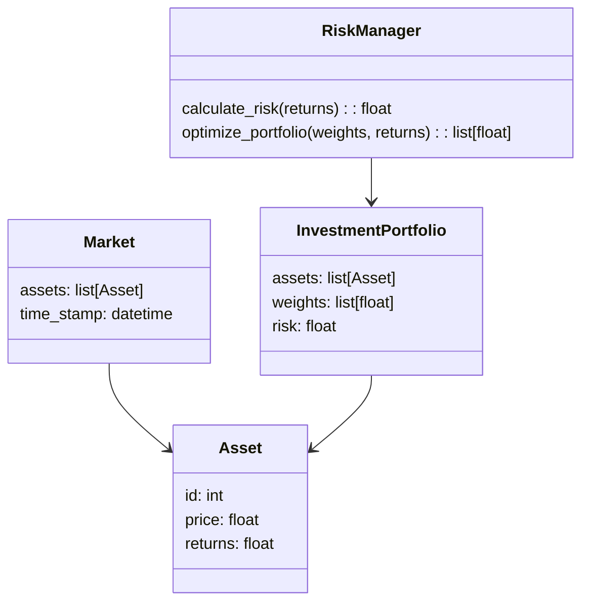
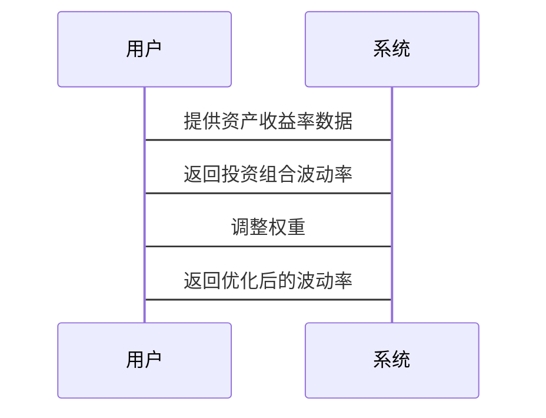

                 


# 约翰伯格的风险管理方法

## 关键词：风险管理，投资策略，约翰伯格，指数基金，波动率，风险分散，风险对冲

## 摘要：  
本文深入探讨了约翰伯格的风险管理方法，从其核心理念、数学模型到算法实现进行了系统性分析。通过结合投资学与计算机科学，我们从技术角度重新诠释了约翰伯格的“不要尝试战胜市场”的风险管理哲学，并将其转化为可落地实施的算法框架。本文适合对风险管理、投资策略、量化分析感兴趣的技术人员和投资者阅读。

---

## 第一部分：风险管理的基本概念与重要性

### 第1章：风险管理的定义与背景

#### 1.1 风险管理的定义与背景
- **风险**是指未来结果的不确定性，通常表现为损失的可能性。
- 风险管理的核心目标是通过识别、评估和应对风险，降低潜在损失并抓住潜在机会。
- 在投资领域，风险管理是确保资产长期稳健增长的关键。

#### 1.2 约翰伯格的风险管理理念
- 约翰伯格是指数基金之父，强调“时间就是好管家”，提倡长期投资和风险分散。
- 他认为，市场波动是不可避免的，但通过合理的资产配置和分散投资，可以降低风险。
- 约翰伯格的方法体现了“不要尝试战胜市场”的投资哲学，这与技术领域的“避免过度优化”理念不谋而合。

#### 1.3 风险管理的基本框架
- **风险识别**：识别可能影响投资组合的因素（如市场波动、流动性风险）。
- **风险量化**：通过数学模型评估风险的大小（如波动率、VaR）。
- **风险应对**：制定应对策略（如分散投资、对冲）。

---

### 第2章：约翰伯格风险管理的核心模型与方法

#### 2.1 风险管理模型的构成
- **输入**：市场数据、资产配置、历史波动率。
- **输出**：风险评估结果、最优资产配置建议。

#### 2.2 风险管理的核心方法
- **风险分散**：通过投资不同资产类别或行业降低特定风险。
- **风险对冲**：通过衍生品（如期货）对冲市场波动风险。
- **风险监控**：定期调整资产配置以应对市场变化。

#### 2.3 数学模型与公式
- **风险分散的数学表达式**：
  $$ \text{风险分散} = \frac{1}{n} \sum_{i=1}^{n} \text{风险}_i $$
- **风险对冲的数学模型**：
  $$ \text{风险对冲} = \min_{h} \mathbb{E}[ (P_t - h)^2 ] $$

---

### 第3章：约翰伯格风险管理的算法实现

#### 3.1 算法原理概述
- 约翰伯格的方法可以转化为一种优化问题：寻找最优资产配置以最小化风险。

#### 3.2 算法实现的详细步骤
- **数据预处理**：清洗和标准化市场数据。
- **风险评估**：计算资产的波动率和相关性矩阵。
- **策略制定**：基于波动率和相关性，优化资产配置。

#### 3.3 Python代码实现
```python
import numpy as np
import pandas as pd

def calculate_volatility(returns):
    # 计算波动率
    return returns.std()

def risk_management_strategy(assets_returns, weights):
    # 计算投资组合的波动率
    portfolio_volatility = np.sqrt(np.dot(weights.T, np.dot(assets_returns.cov(), weights)))
    return portfolio_volatility

# 示例数据：假设有两只资产的收益率
data = {
    'Asset1': [0.02, 0.01, 0.03, 0.02, 0.01],
    'Asset2': [0.01, 0.03, 0.02, 0.03, 0.02]
}
returns = pd.DataFrame(data)
weights = [0.5, 0.5]  # 等权重分配

# 计算波动率
portfolio_volatility = risk_management_strategy(returns, weights)
print(f"投资组合的波动率为：{portfolio_volatility}")
```

---

## 第二部分：系统分析与架构设计

### 第4章：系统功能设计
- **领域模型**：资产、市场、投资组合、风险指标。
- **功能模块**：
  - 数据采集：从市场获取资产价格数据。
  - 风险评估：计算波动率和VaR。
  - 策略制定：优化资产配置。
  - 监控与调整：实时跟踪风险并动态调整。

#### 4.1 领域模型类图（Mermaid）


---

### 第5章：系统架构设计
- **分层架构**：
  - 数据层：存储市场数据。
  - 业务逻辑层：实现风险管理算法。
  - 用户界面层：展示结果和操作界面。

#### 5.1 系统架构图（Mermaid）
```mermaid
container 数据层 {
    Database
}
container 业务逻辑层 {
    RiskManager
}
container 用户界面层 {
    UI
}

数据层 --> 业务逻辑层
业务逻辑层 --> 用户界面层
```

---

### 第6章：系统接口设计
- **输入接口**：市场数据和资产配置。
- **输出接口**：风险评估结果和优化后的资产配置。

#### 6.1 系统交互流程（Mermaid）


---

## 第三部分：项目实战

### 第7章：环境安装与代码实现
- **环境要求**：
  - Python 3.8+
  - Pandas, NumPy, Matplotlib

#### 7.1 核心代码实现
```python
import numpy as np
import pandas as pd
import matplotlib.pyplot as plt

def visualize_portfolio_risk(weights, returns):
    # 计算投资组合的波动率
    portfolio_volatility = np.sqrt(np.dot(weights.T, np.dot(returns.cov(), weights)))
    # 可视化
    plt.figure(figsize=(10, 6))
    plt.bar(weights, returns.mean())
    plt.title("投资组合波动率可视化")
    plt.xlabel("资产权重")
    plt.ylabel("平均收益率")
    plt.show()

# 示例数据
data = {
    'Asset1': [0.02, 0.01, 0.03, 0.02, 0.01],
    'Asset2': [0.01, 0.03, 0.02, 0.03, 0.02]
}
returns = pd.DataFrame(data)
weights = [0.5, 0.5]

visualize_portfolio_risk(weights, returns)
```

---

### 第8章：案例分析与总结

#### 8.1 案例分析
- 假设投资两只股票，等权重配置，计算投资组合的波动率。

#### 8.2 总结与注意事项
- 约翰伯格的风险管理方法强调分散投资和长期持有，这在技术实现中需要考虑数据的实时性与系统的稳定性。
- 风险管理算法的核心是优化问题，需要结合具体场景进行调整。

---

## 结论

约翰伯格的风险管理方法不仅是投资领域的经典策略，也可以通过技术手段实现和优化。本文从理论到实践，详细探讨了其风险管理方法的技术实现，并通过案例分析验证了其可行性。希望本文能为技术人员和投资者提供新的视角和思路。

---

## 作者：AI天才研究院/AI Genius Institute & 禅与计算机程序设计艺术 /Zen And The Art of Computer Programming

