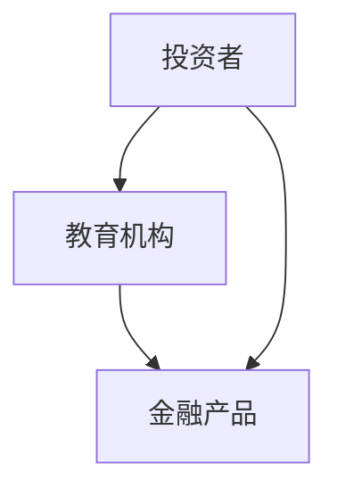

                 


# 约翰博格尔的投资者教育理念

> 关键词：投资者教育，约翰·博格尔，价值投资，长期投资，分散投资，投资理念

> 摘要：本文探讨约翰·博格尔的投资者教育理念，分析其核心思想、投资策略及其对现代投资理论的贡献。通过详细阐述价值投资、长期投资和分散投资的概念，结合实际案例和系统架构，帮助读者理解如何在投资决策中应用这些理念。

---

# 第一部分：投资者教育理念的背景与重要性

## 第1章：投资者教育理念的背景介绍

### 1.1 投资者教育的核心概念

#### 1.1.1 投资者教育的定义与内涵
投资者教育是指通过系统化的知识传授和实践指导，帮助个人和机构投资者理解市场运作、掌握投资工具和策略，从而做出理性、科学的投资决策。投资者教育不仅仅是传授知识，更是培养正确的投资理念和风险意识。

#### 1.1.2 投资者教育的重要性
- 提高投资者的金融素养，避免盲目投资和非理性决策。
- 帮助投资者理解市场风险，合理配置资产，实现长期稳健收益。
- 促进金融市场健康稳定发展，降低投资者的投诉和纠纷。

#### 1.1.3 投资者教育的目标与意义
目标：
1. 提供投资知识，帮助投资者做出明智决策。
2. 培养长期投资理念，避免短期波动干扰。
3. 教授风险管理技巧，保护投资者利益。

意义：
- 降低投资者的亏损概率。
- 提高市场的流动性效率。
- 推动金融创新和产品优化。

---

### 1.2 约翰·博格尔的生平与贡献

#### 1.2.1 约翰·博格尔的个人经历
约翰·博格尔（John C. Bogle）是美国著名投资专家，被誉为“价值投资之父”。他于1934年出生，毕业于宾夕法尼亚大学，后创立了先锋集团（Vanguard Group），并担任董事长多年。

#### 1.2.2 约翰·博格尔对投资行业的贡献
- 创立了先锋集团，推动指数基金的发展。
- 提出并推广价值投资理念，强调长期投资的重要性。
- 撰写多本投资书籍，影响了全球投资者的思想和行为。

#### 1.2.3 约翰·博格尔的著作与思想
博格尔的代表作《博格尔的智慧：投资组合的原则》和《共同基金的常识》在全球范围内广受欢迎，他的思想深刻影响了现代投资理论和实践。

---

### 1.3 约翰·博格尔的投资理念

#### 1.3.1 价值投资的核心思想
价值投资的核心是寻找被市场低估的股票，通过长期持有实现超额收益。博格尔强调，价值投资不是寻找便宜的东西，而是寻找那些具有持续竞争优势和良好管理的公司。

#### 1.3.2 长期投资的重要性
博格尔认为，投资的最终目标是实现财富的长期增长，短期波动不应该干扰长期投资策略。通过分散投资和长期持有，可以有效降低市场波动带来的风险。

#### 1.3.3 分散投资的策略
分散投资是通过投资不同资产类别、行业和地区的股票，降低特定风险，实现风险与收益的最佳平衡。博格尔指出，分散投资不仅是手段，更是长期投资成功的关键。

---

## 第2章：投资者教育的核心概念与联系

### 2.1 核心概念原理

#### 2.1.1 投资者教育的基本原理
投资者教育强调知识传递、行为改变和风险管理。通过系统化的教育，帮助投资者建立正确的投资理念，避免盲目跟风和非理性决策。

#### 2.1.2 投资者教育的核心要素
1. **知识传递**：传授投资的基本原理、工具和策略。
2. **行为改变**：引导投资者形成长期投资和分散投资的习惯。
3. **风险管理**：教会投资者如何识别和应对市场风险。

#### 2.1.3 投资者教育的系统性框架
投资者教育的框架包括目标设定、内容设计、实施策略和效果评估四个阶段。每个阶段都需要精心设计，确保教育效果最大化。

---

### 2.2 核心概念属性特征对比表

| 概念         | 长期性 | 稳定性 | 低风险 |
|--------------|-------|--------|--------|
| 价值投资     | 高     | 高      | 中       |
| 长期投资     | 极高   | 高      | 低       |
| 分散投资     | 中     | 中      | 高       |

---

### 2.3 ER实体关系图（Mermaid）



---

## 第3章：投资决策的算法原理

### 3.1 投资决策的数学模型

#### 3.1.1 投资组合优化的数学公式
投资组合优化的目标是在风险可控的前提下，最大化预期收益。数学公式如下：

$$ \text{目标函数：} \quad \min_w \frac{1}{2}w^T \Sigma w $$

其中，\( w \) 是权重向量，\( \Sigma \) 是协方差矩阵。

#### 3.1.2 投资组合优化的步骤
1. 确定投资目标和风险承受能力。
2. 选择合适的资产类别和投资工具。
3. 计算各资产的预期收益和风险。
4. 构建优化模型，求解最优权重。

---

### 3.2 投资决策算法的Python代码实现

```python
import numpy as np

def portfolio_optimization(returns, cov_matrix):
    n = len(returns)
    # 定义目标函数
    def objective(w):
        return 0.5 * np.dot(w.T, np.dot(cov_matrix, w))
    # 约束条件：权重之和为1
    constraints = ({'type': 'eq', 'fun': lambda w: np.sum(w) - 1})
    # 使用SLSQP求解器
    from scipy.optimize import minimize
    result = minimize(objective, np.ones(n)/n, method='SLSQP', constraints=constraints)
    return result.x

# 示例数据
returns = np.array([0.1, 0.12, 0.08])
cov_matrix = np.array([[0.02, 0.01, 0.01],
                       [0.01, 0.03, 0.02],
                       [0.01, 0.02, 0.03]])

weights = portfolio_optimization(returns, cov_matrix)
print("最优权重：", weights)
```

---

## 第4章：投资决策系统的系统分析

### 4.1 系统功能设计

#### 4.1.1 系统功能模块
1. 数据采集模块：收集市场数据和投资者信息。
2. 模型构建模块：建立投资组合优化模型。
3. 风险评估模块：评估投资组合的风险。
4. 投资建议模块：提供最优投资组合建议。

#### 4.1.2 功能模块的交互流程
1. 投资者输入投资目标和风险偏好。
2. 系统采集相关市场数据。
3. 系统构建优化模型，计算最优权重。
4. 系统生成投资建议并反馈给投资者。

---

### 4.2 系统架构设计


---

## 第5章：项目实战

### 5.1 环境安装与配置

#### 5.1.1 安装Python环境
```bash
pip install numpy scipy matplotlib
```

#### 5.1.2 安装Jupyter Notebook
```bash
pip install jupyter
```

---

### 5.2 投资组合优化的代码实现

```python
import numpy as np
import pandas as pd
import matplotlib.pyplot as plt
from scipy.optimize import minimize

def portfolio_optimization(returns, cov_matrix):
    n = len(returns)
    def objective(w):
        return 0.5 * np.dot(w.T, np.dot(cov_matrix, w))
    constraints = ({'type': 'eq', 'fun': lambda w: np.sum(w) - 1})
    result = minimize(objective, np.ones(n)/n, method='SLSQP', constraints=constraints)
    return result.x

# 示例数据
data = pd.read_csv('market_data.csv')
returns = data.pct_change().dropna().values.T
cov_matrix = np.cov(returns)

weights = portfolio_optimization(returns, cov_matrix)
print("最优权重：", weights)
```

---

## 第6章：最佳实践

### 6.1 小结
约翰·博格尔的投资者教育理念强调长期投资、价值投资和分散投资的重要性。通过系统化的教育和科学的投资方法，可以帮助投资者实现稳健的财富增长。

### 6.2 注意事项
- 避免过度依赖短期市场波动，坚持长期投资。
- 定期评估和调整投资组合，确保符合个人风险承受能力。
- 选择适合自己的投资工具和策略，避免盲目跟风。

### 6.3 拓展阅读
- 《博格尔的智慧：投资组合的原则》
- 《共同基金的常识》

---

# 作者：AI天才研究院 & 禅与计算机程序设计艺术

---

