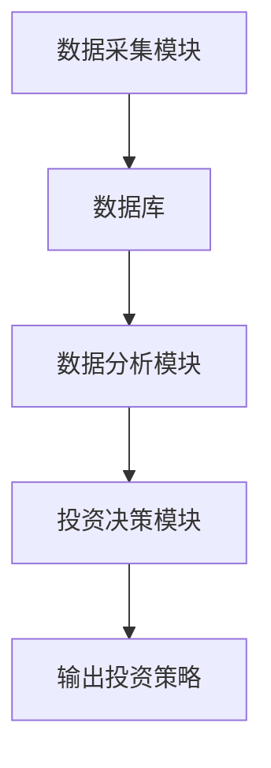

                 

# 约翰·聂夫的价值投资实践经验

> 关键词：约翰·聂夫，价值投资，低市盈率策略，投资组合管理，风险管理

> 摘要：本文深入探讨了约翰·聂夫的价值投资理念和实践经验，特别是其著名的低市盈率策略。通过分析其投资哲学、策略实施、风险管理等方面，揭示了如何在实际操作中应用这些方法。文章还结合了数学模型和案例分析，为读者提供了全面的视角。

---

# 第1章：价值投资的背景与约翰·聂夫的投资理念

## 1.1 价值投资的核心概念

### 1.1.1 价值投资的定义
价值投资是一种以低于内在价值的价格购买优质股票的投资策略。其核心在于寻找市场低估的公司，并长期持有，等待其价值回归。

### 1.1.2 价值投资的核心原则
- **安全边际**：买入价格低于内在价值，以降低风险。
- **长期视角**：关注公司的长期盈利能力，而非短期波动。
- **基本面分析**：通过财务报表评估公司的健康状况。

### 1.1.3 价值投资与成长投资的对比

| 方面       | 价值投资           | 成长投资           |
|------------|--------------------|--------------------|
| 目标       | 以低于价值的价格买入 | 寻找高增长潜力的公司 |
| 风险       | 较低               | 较高               |
| 持股时间   | 长期               | 中期               |

---

## 1.2 约翰·聂夫的生平与投资理念

### 1.2.1 约翰·聂夫的早期经历
- 约翰·聂夫于1931年出生于美国宾夕法尼亚州。
- 他在宾夕法尼亚大学获得金融学学士学位，随后在沃顿商学院深造。
- 曾在多家金融机构工作，积累了丰富的投资经验。

### 1.2.2 约翰·聂夫的投资哲学
- **低市盈率策略**：约翰·聂夫认为，低市盈率的股票具有更大的安全边际，且更容易被市场低估。
- **长期持有**：他倾向于长期持有优质股票，避免频繁交易。
- **分散投资**：通过分散投资降低风险，同时保持对市场的灵活性。

### 1.2.3 温莎基金的成功案例
- 约翰·聂夫管理温莎基金期间，基金的表现优于市场平均水平，年均回报率超过20%。
- 温莎基金以低市盈率策略闻名，成为价值投资的经典案例。

---

# 第2章：低市盈率策略的原理与应用

## 2.1 低市盈率策略的理论基础

### 2.1.1 市盈率的定义与计算
市盈率（P/E Ratio）是股票价格与每股收益（EPS）的比率，公式为：
$$\text{市盈率} = \frac{\text{股票价格}}{\text{每股收益}}$$

### 2.1.2 低市盈率策略的逻辑
- 低市盈率意味着市场对公司的估值较低，可能隐藏着价值。
- 通过筛选低市盈率的股票，投资者可以找到被市场低估的投资标的。

### 2.1.3 低市盈率策略的优势
- **安全边际高**：低市盈率股票的价格通常低于其内在价值。
- **风险较低**：低市盈率股票的波动性较小，风险可控。

---

## 2.2 低市盈率策略的实施步骤

### 2.2.1 确定目标行业
- 选择具有稳定增长潜力的行业，如公用事业、消费品等。
- 避免选择周期性过强的行业，如科技行业。

### 2.2.2 筛选低市盈率股票
- 使用市盈率指标，筛选出市盈率低于市场平均水平的股票。
- 结合其他指标，如市净率（P/B Ratio）和股息率（Dividend Yield），进一步筛选。

### 2.2.3 股票基本面分析
- 评估公司的财务状况，包括利润表、资产负债表和现金流量表。
- 关注公司的盈利能力、成长性和分红能力。

---

## 2.3 低市盈率策略的数学模型

### 2.3.1 市盈率计算公式
$$\text{市盈率} = \frac{\text{股票价格}}{\text{每股收益}}$$

### 2.3.2 低市盈率股票筛选公式
$$\text{市盈率} < \text{市场平均市盈率}$$

---

## 2.4 低市盈率策略的优缺点

### 2.4.1 优点
- **风险低**：低市盈率股票波动性较小，风险可控。
- **价值回归潜力**：低市盈率股票有较大的价值回归潜力。

### 2.4.2 缺点
- **收益有限**：低市盈率股票的收益可能不如高增长股票。
- **市场认知偏差**：某些低市盈率股票可能被市场长期忽视，可能存在未被发现的风险。

### 2.4.3 如何克服缺点
- **分散投资**：通过分散投资降低风险。
- **持续关注**：定期评估投资组合，及时调整。

---

# 第3章：投资组合管理与风险管理

## 3.1 投资组合管理的理论基础

### 3.1.1 现代投资组合理论
现代投资组合理论（MPT）由哈里·马科维茨提出，强调通过分散投资降低风险。

### 3.1.2 投资组合管理的原则
- **分散投资**：通过投资不同资产和行业降低风险。
- **长期持有**：避免频繁交易，降低交易成本。

---

## 3.2 投资组合优化的数学模型

### 3.2.1 最大化收益的优化模型
$$\max \sum_{i=1}^{n} w_i r_i$$
$$\text{约束条件}：\sum_{i=1}^{n} w_i = 1, w_i \geq 0$$

### 3.2.2 最小化风险的优化模型
$$\min \sum_{i=1}^{n} \sum_{j=1}^{n} w_i w_j \sigma_{ij}$$
$$\text{约束条件}：\sum_{i=1}^{n} w_i = 1, w_i \geq 0$$

---

## 3.3 风险管理与控制

### 3.3.1 风险的定义与分类
- **市场风险**：整个市场的波动带来的风险。
- **流动性风险**：资产难以变现的风险。
- **信用风险**：债券发行人违约的风险。

### 3.3.2 风险管理的策略
- **分散投资**：通过投资不同资产降低风险。
- **止损策略**：设定止损点，避免重大损失。
- **定期评估**：定期评估投资组合，及时调整。

---

## 3.4 约翰·聂夫的风险管理实践

### 3.4.1 温莎基金的风险管理策略
- 通过分散投资降低市场风险。
- 定期评估投资组合，及时调整。

### 3.4.2 约翰·聂夫的风险管理技巧
- 严格控制投资比例，避免过度集中。
- 保持对市场的敏感性，及时调整投资策略。

---

# 第4章：价值投资的系统架构与实现

## 4.1 投资系统的整体架构

### 4.1.1 系统功能模块
- 数据采集模块：采集股票数据，包括市盈率、市净率等。
- 数据分析模块：对数据进行分析，筛选出符合条件的股票。
- 投资决策模块：根据分析结果，制定投资策略。

### 4.1.2 系统架构图

---

## 4.2 投资决策的数学模型

### 4.2.1 市盈率筛选模型
$$\text{市盈率} = \frac{\text{股票价格}}{\text{每股收益}}$$
$$\text{筛选条件}：\text{市盈率} < \text{市场平均市盈率}$$

### 4.2.2 组合优化模型
$$\max \sum_{i=1}^{n} w_i r_i$$
$$\text{约束条件}：\sum_{i=1}^{n} w_i = 1, w_i \geq 0$$

---

## 4.3 系统实现与案例分析

### 4.3.1 系统实现
- 数据采集：通过API接口获取股票数据。
- 数据分析：使用Python进行数据分析和筛选。
- 投资决策：根据分析结果，生成投资策略。

### 4.3.2 案例分析
以温莎基金为例，分析其在低市盈率策略下的投资组合。

---

# 第5章：价值投资的实践与总结

## 5.1 投资实践中的常见问题

### 5.1.1 如何选择低市盈率股票
- 关注公司的财务状况。
- 结合行业前景和公司基本面。

### 5.1.2 如何控制风险
- 通过分散投资降低风险。
- 设定止损点，避免重大损失。

---

## 5.2 投资总结与反思

### 5.2.1 约翰·聂夫的成功经验
- 坚持低市盈率策略，长期持有优质股票。
- 严格控制风险，保持投资纪律。

### 5.2.2 对投资者的启示
- 价值投资需要长期坚持，耐心等待价值回归。
- 不断学习和调整，适应市场变化。

---

# 作者：AI天才研究院/AI Genius Institute & 禅与计算机程序设计艺术 /Zen And The Art of Computer Programming

